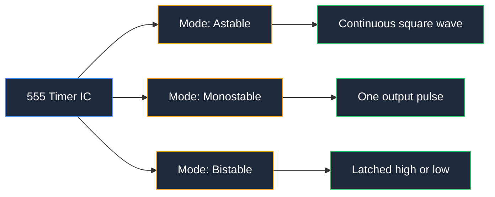
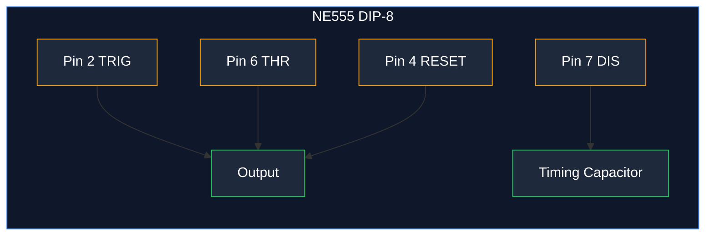
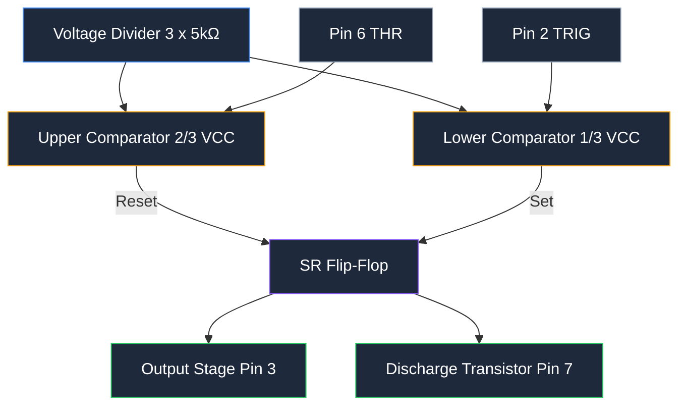
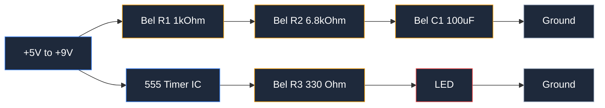
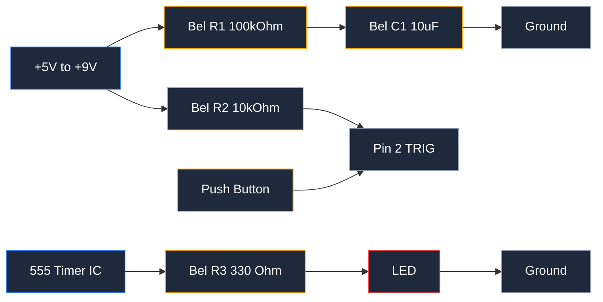
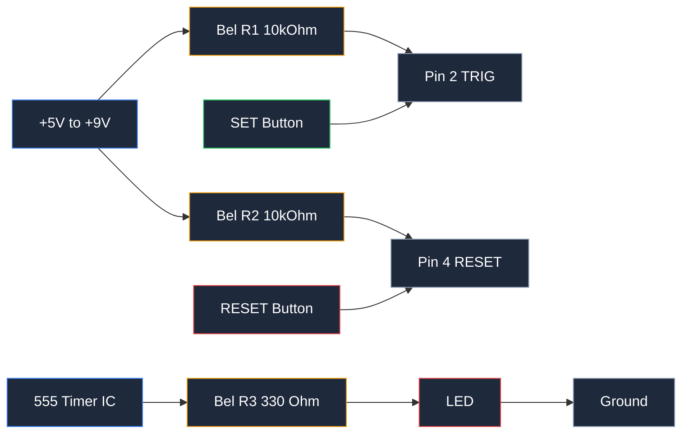
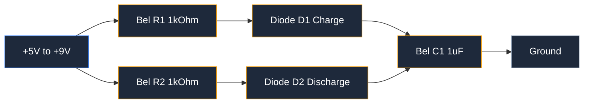
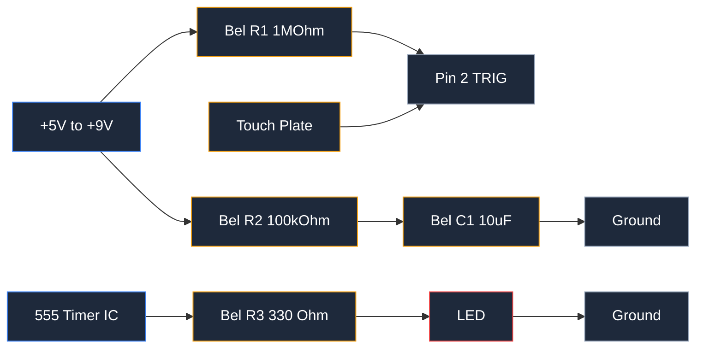

**دارة المؤقت 555 هي دارة توقيت وتذبذب مبنية حول IC المؤقت 555، وهو دائرة متكاملة (IC) من 8 أغراض تولّد تأخيرات دقيقة وإشارات مربعة.** تعمل أي دارة مؤقت 555 في واحد من ثلاثة أوضاع عمل: وضع التذبذب غير المستقر، أو الوضع الأحادي الاستجابة، أو الوضع الثنائي الاستجابة. ينتج الوضع غير المستقر موجة مربعة مستمرة بتردد ونسبة دورة عمل محددة. ينتج الوضع الأحادي نبضة خروج واحدة بعرض نبضة محدد. أما الوضع الثنائي فيُقفِل الخروج مرتفعًا أو منخفضًا ويحتفظ بذلك حتى يتلقى أمرًا جديدًا.

توفّر دارة المؤقت 555 أربعة فوائد رئيسية: تكلفتها بضعة سنتات لكل IC، تعمل بمدى جهد تغذية واسع من 4.5 فولت إلى 16 فولت، تدعم أحمالًا تصل إلى 200 مللي أمبير مباشرة، ولا تحتاج سوى مكونين أو ثلاثة للتوقيت. تتكون مكونات التوقيت من مقاومة توقيت وفاترة توقيت وفاترة تغذية تخطي.

تظهر دوائر المؤقت 555 في مئات المشاريع الإلكترونية. من الاستخدامات الشائعة: وميض LED، مؤقت أحادي لإزالة ارتداد الأزرار، مولّد PWM لتعتيم LEDs والتحكم في سرعة المحركات، ومفتاح لمس بسيط. في هذا الدليل ستبنى كل تلك الدوائر الخمس على لوحة تجربة.

تتكون الأجزاء الرئيسية لدارة المؤقت 555 من IC المؤقت 555 نفسه، ومقارنين، وقلب SR flip-flop، ومقسم جهد مكون من ثلاث مقاومات 5كيلو أوم. تشمل الأجزاء الخارجية مقاومة التوقيت وفاترة التوقيت التي تُعيّن التوقيت، بالإضافة إلى مقاومات الحماية والمنطق. يمكنك رسم المخطط الكامل لأي دارة هنا في ثوانٍ باستخدام [مخطط الدوائر عبر الإنترنت](https://www.circuitdiagrammaker.com/)، ثم بناءها على لوحة تجربة حقيقية.



## مقدمة حول IC المؤقت 555

ظهر IC المؤقت 555 عام 1971، وقد صمّمه هانس كامنزيند في شركة Signetics. أصبح واحدًا من أكثر الدوائر المتكاملة مبيعًا في التاريخ، حيث بيعت أكثر من مليار وحدة سنويًا لعقود. يأتي اسم 555 من ثلاث مقاومات داخلية بقيمة 5كيلو أوم تُشكّل مقسم الجهد.

يحتوي IC المؤقت 555 على ثلاثة أوضاع عمل. يعمل الوضع غير المستقر كمذبذب حر يُنتج موجة مربعة. ينتظر الوضع الأحادي ثم يُنتج نبضة توقيت واحدة. يعمل الوضع الثنائي كجهاز تثبيت (latch) يُعيّن ويُعيد من مدخلين منفصلين. في هذا المقال، تستخدم الأمثلة 1 و4 الوضع غير المستقر، الأمثلة 2 و5 الوضع الأحادي، والمثال 3 الوضع الثنائي.

### مخطط أغراض المؤقت 555

يأتي IC المؤقت 555 القياسي في حزمة مزدوجة خطية (DIP) من 8 أغراض. كل غرض من الـ8 أغراض له وظيفة واحدة.

| الغرض | الاسم | الوظيفة |
|-----|------|----------|
| 1 | GND | أرض (0 فولت) |
| 2 | TRIG | الاست Dos: جهد أقل من 1/3 VCC يبدأ التوقيت ويرفع الخروج |
| 3 | OUT | الخروج: يوفر أو يستقبل التيار لتشغيل الحمل |
| 4 | RESET | إعادة التعيين: مستوى منخفض يجبر الخروج على الانخفاض بغض النظر عن الأغراض الأخرى |
| 5 | CTRL | جهد التحكم: تجاوز اختياري لعتبة 2/3 VCC |
| 6 | THR | العتبة: جهد أعلى من 2/3 VCC ينهي التوقيت ويخفض الخروج |
| 7 | DIS | التفريغ: يسحب فاترة التوقيت إلى الأرض أثناء الفاصل المنخفض |
| 8 | VCC | تغذية إيجابية من 4.5 فولت إلى 16 فولت |



### المخطط الداخلي

داخل IC المؤقت 555 يوجد مقسم جهد، ومقارنان، وقلب SR flip-flop، وترانزيستور تفريغ، ومرحلة خروج.

يقع مقسم الجهد كثلاث مقاومات متساوية بقيمة 5كيلو أوم متراصّة بين VCC والأرض. يثبّت المدخل غير العكسي للمقارن العلوي عند 2/3 VCC والمدخل العكسي للمقارن السفلي عند 1/3 VCC.

قارن المقارن العلوي بين غرض العتبة و2/3 VCC. عندما يرتفع غرض العتبة فوق 2/3 VCC، يُعيد المقارن العلوي تعيين القلب وينخفض الخروج. يقارن المقارن السفلي بين غرض الاست Dos و1/3 VCC. عندما ينخفض غرض الاست Dos تحت 1/3 VCC، يُعيّن المقارن السفلي القلب ويرتفع الخروج.

يفتح ترانزيستور التفريغ غرض التفريغ إلى الأرض عندما يكون الخروج منخفضًا. يقوم ذلك الغرض بتفريغ فاترة التوقيت لإعادة تعيين الدورة. ثم تدعم مرحلة الخروج تصل إلى 200 مللي أمبير، وهو ما يكفي لتشغيل LEDs أو تشغيل مكبر صوت صغير أو تبديل ترانزيستور مباشرة.



## كيفية حساب مكونات التوقيت

تحكم صيغتان كل دارة مؤقت 555: صيغة التردد في الوضع غير المستقر وصيغة عرض النبضة في الوضع الأحادي. كلاهما يعتمد على قيمتي مقاومة التوقيت وفاترة التوقيت.

### صيغة الوضع غير المستقر

في الوضع غير المستقر، يتنبّع الخروج بين المرتفع والمنخفض من تلقاء نفسه. يكون الوقت مرتفعًا `t_high = 0.693 × (R1 + R2) × C`. يكون الوقت منخفضًا `t_low = 0.693 × R2 × C`.

الفترة الإجمالية هي مجموع كليهما:

```
t_high = 0.693 × (R1 + R2) × C
t_low  = 0.693 × R2 × C
T      = 0.693 × (R1 + 2 × R2) × C
```

التردد هو عكس الفترة:

```
f = 1 / T = 1.44 / ((R1 + 2 × R2) × C)
```

نسبة الدورة (Duty cycle) هي الجزء من كل فترة يبقى فيه الخروج مرتفعًا:

```
Duty cycle (%) = (R1 + R2) / (R1 + 2 × R2) × 100
```

R1 هي مقاومة التوقيت الأولى، R2 هي مقاومة التوقيت الثانية، وC هي فاترة التوقيت.

### صيغة الوضع الأحادي

في الوضع الأحادي، يُنتج الخروج نبضة واحدة بعد كل است Dos. يعتمد عرض النبضة فقط على مقاومة واحدة وفاترة التوقيت:

```
pulse width t = 1.1 × R × C
```

R هي مقاومة التوقيت بالأوم، C هي فاترة التوقيت بالفاراد، وt هي عرض النبضة بالثواني. يجب أن يعود مدخل الاست Dos مرتفعًا قبل بدء النبضة التالية.

### مثال عملي: وميض LED بتردد 1 هرتز

ابنِ وميض LED بتردد 1 هرتز باستخدام صيغة الوضع غير المستقر. يُومض الإخراج بتردد 1 هرتز مرة واحدة في الثانية، أي فترة T تساوي ثانية واحدة.

اختر فاترة توقيت مناسبة أولًا. اختر C = 100 مايكروفاراد (0.0001 فاراد) وR1 = 1 كيلو أوم. احسب R2 من صيغة التردد:

```
1 = 1.44 / ((1000 + 2 × R2) × 0.0001)
R2 = 6.8 kΩ (أقرب قيمة قياسية)
```

تحقق من النتيجة بأقرب قيمة قياسية R2 = 6.8 كيلو أوم:

```
f = 1.44 / ((1000 + 13600) × 0.0001) = 0.99 Hz
Duty cycle = (1000 + 6800) / (1000 + 13600) × 100 = 53%
```

يومض الـ LED بتردد قريب جدًا من 1 هرتز بنسبة دورة عمل 53%.

### نصائح لاختيار القيم القياسية

تأتي المقاومات في قيم E24 القياسية، والكابلات أيضًا. اختر أقرب قطعة قياسية وأعد التحقق من الصيغة بالقيمة الفعلية. استخدم مقاومات فيلم معدني بنسبة تحمّل 1% للدقة في التوقيت. لفاترة التوقيت، استخدم أنواع بوليستر أو سيراميك منخفضة التسرب؛ الكابلات الكهربائية تتغير مع درجة الحرارة ونسبة تحمّلها واسعة. اجعل R1 أعلى من 1 كيلو أوم لتقييد تيار التفريغ، واترك الكابل أقل من 1000 مايكروفاراد لتجنب وقت تسوية الشحن الطويل. عندما تحتاج تأخيرًا طويلًا، زِد المقاومة أولًا وأبقِ الكابل صغيرة.

## المثال 1: مذبذب غير مستقر (وميض LED)

مذبذب غير مستقر (Astable Multivibrator) هو دائرة المؤقت 555 الأكثر شيوعًا. يُشعل LED بنمط وميض ثابت دون أي مدخلات منك.

### المخطط وقيم المكونات

| المكون | القيمة | الغرض |
|-----------|-------|---------|
| U1 | NE555 timer IC | مذبذب التوقيت |
| R1 | 1 كيلو أوم | مقاومة التوقيت الأولى |
| R2 | 6.8 كيلو أوم | مقاومة التوقيت الثانية |
| C1 | 100 مايكروفاراد كهربائية | فاترة التوقيت |
| C2 | 0.1 مايكروفاراد سيراميك | تغذية تخطي |
| LED1 | LED 5mm (أي لون) | حمل الخروج |
| R3 | 330 أوم | تقييد تيار LED |
| SV1 | 5 فولت إلى 9 فولت | مدخل الطاقة |



### كيف تعمل الدارة

عند تشغيل الطاقة، تشحن فاترة التوقيت عبر R1 وR2 على التوالي. يبقى الخروج مرتفعًا ويُشعل LED أثناء شحن الكابل. عندما يصل الكابل إلى 2/3 VCC، يُعيد مقارن العتبة تعيين القلب، وينخفض الخروج، ويسحب غرض التفريغ الكابل نحو الأرض عبر R2 فقط. ينطفئ LED. عندما ينخفض الكابل إلى 1/3 VCC، يُعيّن مقارن الاست Dos القلب مرة أخرى وتتكرر الدورة.

النتيجة هي موجة مربعة. يعمل LED لمدة حوالي 540 مللي ثانية وينطفئ لمدة حوالي 470 مللي ثانية، مما يُنتج الومضان المرئي.

### تخطيط لوحة التجربة

ضع IC المؤقت 555 عبر الأخدود المركزي للوحة التجربة مع الغرض 1 على جانب السكة اليسرى. وصّل سكة الأرض بغرض 1 وسكة التغذية بغرض 8. وصّل R1 بين غرض 7 وسكة التغذية. وصّل R2 بين غرض 7 وغرض 6. وصّل غرض 6 وغرض 2 معًا بوصلة، ثم وصّل فاترة التوقيت من تلك النقطة إلى سكة الأرض. وصّل غرض 4 بسكة التغذية حتى لا يعلو مدخل إعادة التعيين. أضف فاترة 0.1 مايكروفاراد بين غرض 8 والأرض بجانب الرقاقة مباشرة. وصّل LED ومقاومته 330 أوم من غرض 3 إلى الأرض، مع وجود السلك الأطول للـ LED على جانب غرض 3.

### تعديل سرعة الوميض

تحكم قيمتا المكونين في سرعة الوميض. ارفع فاترة التوقيت C1 للوميض بشكل أبطأ. اخفض C1 للوميض بشكل أسرع. ارفع R2 لإبطاء تفريغ الوقت المنخفض وبذلك إبطاء الدورة بأكملها. لتغيير وقت تشغيل LED فقط، عدّل R1. مضاعفة C1 من 100 مايكروفاراد إلى 200 مايكروفاراد تخفض التردد إلى حوالي 0.49 هرتز. تقسيمها إلى 47 مايكروفاراد يرفع التردد إلى حوالي 2 هرتز.

## المثال 2: الوضع الأحادي (مؤقت أحادي النبضة)

تُنتج دارة المؤقت 555 بالوضع الأحادي نبضة خروج واحدة في كل مرة تقوم فيها بالتشغيل. يبقى الخروج مرتفعًا لعرض نبضة محدد ثم ينخفض وينتظر الاست Dos التالي.

### المخطط وقيم المكونات

| المكون | القيمة | الغرض |
|-----------|-------|---------|
| U1 | NE555 timer IC | مؤقت أحادي النبضة |
| R1 | 100 كيلو أوم | مقاومة التوقيت |
| C1 | 10 مايكروفاراد كهربائية | فاترة التوقيت |
| R2 | 10 كيلو أوم | مقاومة سحب للاست Dos |
| SW1 | زر ضغط | مدخل الاست Dos |
| LED1 | LED 5mm | حمل الخروج |
| R3 | 330 أوم | تقييد تيار LED |



### سلوك الاست Dos والخروج

يكون غرض الاست Dos مرتفعًا عبر مقاومة السحب 10 كيلو أوم. الضغط على الزر يصل غرض الاست Dos بالأرض. عندما ينخفض جهد الاست Dos تحت 1/3 VCC، يُعيّن المقارن السفلي القلب ويرتفع الخروج. تبدأ فاترة التوقيت بالشحن عبر R1. عندما يصل الكابل إلى 2/3 VCC، يُعيد مقارن العتبة تعيين القلب، وينخفض الخروج، ويُفرغ غرض التفريغ الكابل. ثم يبقى الخروج منخفضًا حتى الضغط التالي.

ينتج الضغط الواحد بالضبط نبضة واحدة. الإبقاء على الزر مضغوطًا لا يُغيّر شيئًا لأن مدخل الاست Dos يعود مرتفعًا قبل أن يصل الكابل إلى 2/3 VCC؛ بدأ التوقيت بالفعل عند الحافة الهابطة الأولى.

### تطبيق: خفض ضوضاء الأزرار أو إنشاء تأخير

تُزيل الدارة الأحادية لـ 555 ضوضاء الأزرار الميكانيكية. قد ترتد أطراف المفتاح لبضع مللي ثواني، مما يُنتج إشارات كاذبة متعددة. مؤقت أحادي بنبضة 20 مللي ثانية يبتلع الارتداد وينقل نبضة واحدة نظيفة. نفس الدارة تُنشئ تأخيرًا: قم بتشغيلها، ثم اقرأ حالة الخروج بعد مرور عرض النبضة. مؤقت تشغيل مروحة بـ 5 فولت يُبقي محرك DC يعمل لمدة محددة بعد تشغيل المستشعر.

### كيفية حساب مدة النبضة

استخدم الصيغة الأحادية: `t = 1.1 × R × C`. مع R1 = 100 كيلو أوم وC1 = 10 مايكروفاراد، يكون عرض النبضة:

```
t = 1.1 × 100,000 × 0.00001 = 1.1 ثانية
```

لتأخير 5 ثواني، اختر C1 = 10 مايكروفاراد واحسب R: R = 5 / (1.1 × 0.00001) = 455 كيلو أوم. استخدم أقرب قيمة قياسية 470 كيلو أوم، التي تعطي 5.2 ثانية.

## المثال 3: الوضع الثنائي (قلب تبديل)

تعمل دارة المؤقت 555 بالوضع الثنائي كقلب تبديل (flip-flop) أو جهاز تثبيت (latch). يُعيّن الخروج مرتفعًا أو منخفضًا من زرين ويحتفظ بذلك حتى يُضغط الزر الآخر. لا تُستخدم فاترة توقيت هنا.

### المخطط وقيم المكونات

| المكون | القيمة | الغرض |
|-----------|-------|---------|
| U1 | NE555 timer IC | مفتاح تثبيت |
| R1 | 10 كيلو أوم | مقاومة سحب للاست Dos |
| R2 | 10 كيلو أوم | مقاومة سحب لإعادة التعيين |
| SW1 | زر SET | يرفع الخروج |
| SW2 | زر RESET | يخفض الخروج |
| LED1 | LED 5mm | مؤشر الخروج |
| R3 | 330 أوم | تقييد تيار LED |



### وظيفة التعيين وإعادة التعيين

المدخلان هما غرض الاست Dos (غرض 2) وغرض إعادة التعيين (غرض 4). كلاهما له مقاومة سحب لتثبيتهما مرتفعين. الضغط على زر SET يسحب غرض 2 إلى الأسفل، ويُعيّن القلب، ويرتفع الخروج. الضغط على زر RESET يسحب غرض 4 إلى الأسفل، ويُعيد تعيين القلب، وينخفض الخروج. بين الضغطات، يُقفِل الخروج حالته الأخيرة. لا تُوصَّل غراضي العتبة والتفريغ في هذا الوضع.

### تطبيق: مفتاح تبديل أو عنصر ذاكرة

تُحل دارة المؤقت 555 الثنائية محل مفتاح تشغيل/إيقاف ميكانيك. استخدمها لتحكم ترانزيستور أو مُيكانيكي يُشغّل مصباحًا أو مضخة أو محركًا. تعمل أيضًا كعنصر ذاكرة بيت واحد: تقرأ الحالة كمنطقي مرتفع أو منخفض، وتستمر طالما بقيت التغذية متصلة. يمنحك الزران لوحة تحكم تعيين/إعادة تعيين كلاسيكية تُعيد حالتها الأخيرة عند تشغيل الطاقة إذا وصّلتهما كأزرار لحظية.

### كيفية استخدامها كمفتاح تشغيل/إيقاف

ابنِ الدارة، ثم قم بتشغيل ترانزيستور من الخروج. يوفر الخروج حتى 200 مللي أمبير بنفسه، مما يشعل LEDs مباشرة. للأحمال الأكبر، أضف مرحلة ترانزيستور: غرض 3 يدعم قاعدة الترانزيستور عبر مقاومة 1 كيلو أوم، والترانزيستور يُبديل ميكانيكيًا أو محركًا على جامعه. اضغط SET لتشغيل الحمل. اضغط RESET لإيقافه.

## المثال 4: مولّد PWM (تنعيم LED)

تُنتج دارة المؤقت 555 تعديل عرض النبضة (PWM) بإضافة ديودين ومتغرات جهد إلى المذبذب غير المستقر. يبقى التردد ثابتًا بينما تتغير نسبة الدورة، مما يُعتّم LED أو يتحكم في سرعة المحرك دون تغيير سرعة الوميض.

### المخطط وقيم المكونات

| المكون | القيمة | الغرض |
|-----------|-------|---------|
| U1 | NE555 timer IC | مذبذب PWM |
| R1 | 1 كيلو أوم | مقاومة الشحن الدنيا |
| R2 | 1 كيلو أوم | مقاومة التفريغ الدنيا |
| VR1 | 10 كيلو أوم متغير جهد | التحكم بنسبة الدورة |
| D1, D2 | 1N4148 diodes | توجيه مسارات الشحن والتفريغ |
| C1 | 1 مايكروفاراد سيراميك | فاترة التوقيت |
| C2 | 0.1 مايكروفاراد سيراميك | تغذية تخطي |
| LED1 | LED 5mm | حمل معتم |
| R3 | 330 أوم | تقييد تيار LED |



### كيفية تغيير نسبة الدورة بالمتغير

يقسم المتغير جهد مقاومة التوقيت إلى ذراعين. يوجّه الديود D1 تيار الشحن عبر ذراع، ويعيد الديود D2 تيار التفريغ عبر الذراع الأخرى. بما أن كل ديويد يُوصَّل في اتجاه واحد فقط، فإن مسار الشحن ومسار التفريغ يستخدمان نصفي المتغير المختلفين. عند تدوير المحور، تنتقل المقاومة من ذراع إلى أخرى، فيزداد وقت الخروج المرتفع ويتناقص الوقت المنخفض. تبقى الفترة الإجمالية كما هي، لذلك لا يتغير التردد أبدًا.

### تطبيق: تنعيم LED أو التحكم في سرعة المحرك

تُعتّم هذه الدارة LED من الإطفاء التام إلى التشغيل الكامل بتدويرة واحدة للمتغير. نفس الخروج يدعم قاعدة ترانزيستور NPN للتحكم في سرعة المحرك. يستفيد محرك DC من متوسط نسبة دورة PWM، فبنسبة دورة 40% يعمل المحرك بسرعة تقارب 40%. تشغيل المحرك بأتمتة PWM أبرد من استخدام مقاومة متسلسلة لأن الترانزيستور يُوصَّل بالكامل وينقطع بالكامل بدلاً من تبديد الطاقة في المنتصف.

### كيفية حساب نطاق التردد ونسبة الدورة

تعمل الذراعان للمتغير كمقاومتي توقيت RA وRB، حيث أن RA + RB يساوي دائمًا القيمة الإجمالية للمتغير. تصبح الصيغ:

```
f = 1.44 / ((RA + RB) × C) = 1.44 / (10,000 × 0.000001) = 144 Hz
Duty cycle = RA / (RA + RB) × 100
```

عند تدوير المتغير تتراوح نسبة الدورة من حوالي 2% إلى 98%. التردد 144 هرتز أعلى من نطاق الوميض المرئي للعين، لذلك يبدو الـ LED ناعمًا في كل إعداد. يصل المتغير إلى أقصى مقاومة، وتحافظ المقاومات المتسلسلة 1 كيلو أوم على التيار في مستويات آمنة في الديودات.

## المثال 5: مؤقت 555 كمفتاح لمس

تتحول دارة المؤقت 555 الأحادية إلى مفتاح لمس بتبديل زر الضغط بلوحة لمس نحاسية عارية. عند لمس اللوحة، يُشحن نبضة توقيت تُشعل LED أو تُصدر صوت تنبيه.

### المخطط وقيم المكونات

| المكون | القيمة | الغرض |
|-----------|-------|---------|
| U1 | NE555 timer IC | مؤقت أحادي تتحكم به اللمس |
| R1 | 1 ميجا أوم | مقاومة سحب واست Dos واستشعر الحساسية |
| R2 | 100 كيلو أوم | مقاومة التوقيت |
| C1 | 10 مايكروفاراد كهربائية | فاترة التوقيت |
| PLATE | لوحة نحاس عارية | مستشعر اللمس |
| LED1 | LED 5mm | مؤشر الخروج |
| R3 | 330 أوم | تقييد تيار LED |



### كيف يعمل مستشعر اللمس

يبقى غرض الاست Dos مرتفعًا عبر مقاومة السحب 1 ميجا أوم. جسمك له مقاومة وكثافة؛ عندما تلمس اللوحة وتُكمل مسارًا نحو الأرض، ينخفض غرض الاست Dos تحت 1/3 VCC. يُعيّن المقارن القلب ويرتفع الخروج لعرض النبضة الكاملة. ثم يعود الخروج منخفضًا وتنتظر الدارة اللمسة التالية.

يعمل مستشعر اللمس بشكل موثوق على تغذية 5 فولت. عند جهود تغذية أعلى، قد لا يسحب التسرب المُسبَّب من الجسم الغرض تحت العتبة، لذلك ابقَ على التغذية بين 5 فولت و9 فولت لهذا البناء.

### تطبيق: LED أو جرس مفعّل باللمس

وصّل الخروج بـ LED لمصباح مفعّل باللمس. استبدل الـ LED بجرس بيزو صغير لتنبيه أو زر لعبة. تستمر نبضة الخروج `1.1 × R2 × C1 = 1.1 ثانية` بالقيم أعلاه، وهو ما يكفي للرؤية أو السماع بوضوح. لـ relay طاقة، قم بتشغيله عبر مرحلة ترانزيستور كما في المثال 3.

### نصائح لضبط الحساسية

ثلاث تغييرات تُعدّل الحساسية. اخفض R1 من 1 ميجا أوم إلى 470 كيلو أوم لتقليل حساسية الاست Dos للضوضاء العشوائية. ارفعها إلى 2.2 ميجا أوم لالتقاط اللمسات الخفيفة. اجعل لوحة اللمس أكبر لزيادة الحساسية. ابقَ سلك الاست Dos قصيرًا وبعيدًا عن الأسلاك الكهربائية، وإلا تُفعّل الدارة بضوضاء التيار الكهربائي. أضف مقاومة 100 كيلو أوم من اللوحة إلى الأرض لتصريف الشحن الساكن ومنع الاست Dos الكاذب.

## نصائح لوحة التجربة والأخطاء الشائعة

خمس عادات تمنع معظم فشل بناء لوحة التجربة.

- أضف فاترة تغذية تخطي 0.1 مايكروفاراد بين VCC (غرض 8) وGND (غرض 1)، ضعها بجانب IC. تمتص هذه الفاترة ضوضاء التغذية التي قد تسبب است Dos كاذبًا وتوقيتًا غير مستقر.
- تحقق من قطبية الكابل الكهربائي. كابلات التوقيت 100 مايكروفاراد لها سلب مُعلَّم. عكس قطبية الكابل الكهربائي يسبب تسريبه وإيقافه في النهاية.
- وصّل كل أرض بسكة أرضية مشتركة. الأرض العائمة تترك المقارنين دون جهد مرجعي، ولا يعمل المؤقت أبدًا.
- تحقق باستخدام مقياس متعدد. قس الجهد بين غرض 8 وغرض 1 أولًا. ثم تأكد من قراءة كل غرض بالجهد المتوقع قبل استكشاف أخطاء التوقيت.
- ادفع كل سلك بقوة إلى لوحة التجربة. الأسلاك التي تقع على بعد ملليمتر عن اللوحة تعطي توصيل متقطع يبدو كخلل في الدارة.

أكثر خمسة أخطاء شيوعًا في دارة المؤقت 555 هي اتصالات أغراض خاطئة، ومقاومة سحب مفقودة على غرض 4 أو غرض 2، وكابل كهربائي مقلوب، وعدم وجود فاترة تغذية تخطي، وفاترة توقيت موصولة بالغلط. بما أن المؤقت 555 لديه فقط 8 أغراض، فإن التحقق من كل اتصال بجدول أغراض أعلاه ي catches كل هذه الأخطاء.

## استكشاف أخطاء دارة المؤقت 555

عندما تتصرف الدارة بشكل غير صحيح، اتبع الفحوصات الخمس هذه بالترتيب.

- لا خروج: قس غرض 8 وتأكد من وجود التغذية، ثم تأكد من توصيل غرض 1 بالأرض المشتركة. تحقق من توصيل غرض 4 بـ VCC، لأن غرض إعادة التعيين العائد يُبقي الخروج منخفضًا.
- توقيت غير صحيح: تحقق من قيمتي مقاومة التوقيت وفاترة التوقيت بالصيغة. استخدام مقاومة 1 كيلو أوم حيث يجب أن تكون 100 كيلو أوم يجعل الدارة تعمل 100 مرة أسرع. تحقق من نسبة تحمّل المقاومة؛ قطع الـ 5% تتغير بما يكفي لإزاحة التردد بشكل ملحوظ.
- خروج عالق مرتفع: يكون غرض الاست Dos منخفضًا جدًا، مما يُبقي القلب مُعيَّنًا. تأكد من بقاء غرض الاست Dos فوق 1/3 VCC عندما لا يُضغط عليه شيء.
- خروج عالق منخفض: يكون غرض العتبة فوق 2/3 VCC، مما يُبقي القلب مُعيَّنًا، أو غرض إعادة التعيين عائد منخفض. تأكد من جهد غرض 6 وتوصيل غرض 4.
- التذبذب لا يعمل: يجب أن تكون فاترة التوقيت موصولة بين نقطة تقاطع غرض 6/غرض 2 والأرض. إذا كانت الفاترة موصولة بغرض 7 فقط، يُفرّغها ترانزيستور التفريغ فورًا ولا تشحن الدارة أبدًا.

استخدم م scopes أو منطق استكشاف ل Debugging. يعرض م scopes الموجة عند غرض 3، والمنحدر عند الكابل، ومقارنة نظيفة لكليهما. يعرض منطق استكشاف ما إذا كان كل غرض يقرأ مرتفعًا أو منخفضًا أو مtoggle، مما يعزل الغرض الميت بسرعة. إذا لم يُنتج IC واحد toggle عند غرض 3، استبدل واحدًا NE555 جديدًا قبل إعادة تخطيط.

## متغيرات المؤقت 555 واختيار الأنسب

ليس كل IC مؤقت 555 متطابقًا. أربعة أنواع تغلب: NE555 وLM555 وTLC555 وإصدارات CMOS مثل TLC555 المذكور أعلاه بالإضافة إلى LMC555. تختلف في جهد التغذية والسرعة وقوة خروج واستهلاك الطاقة.

| النوع | النوع | مدى التغذية | أقصى تردد | قوة الخروج | تيار التغذية |
|---------|------|--------------|---------------|--------------|----------------|
| NE555 | Bipolar | 4.5V – 16V | 500 kHz | ±200 mA | 3 mA – 10 mA |
| LM555 | Bipolar | 4.5V – 16V | 500 kHz | ±200 mA | 3 mA – 10 mA |
| TLC555 | CMOS | 2V – 15V | 2.1 MHz | ±10 mA | 250 µA |
| LMC555 | CMOS | 1.5V – 15V | 3 MHz | ±50 mA | 250 µA |

اختر Bipolar NE555 أو LM555 للمشاريع العامة ذات حملات LEDs والسرعة المتوسطة وتغذية 5 فولت. تتعامل الإصدارات Bipolar مع قوة خروج 200 مللي أمبير التي لا تستطيع قطع CMOS مجارأتها. اختر TLC555 أو LMC555 عندما تعمل المشروع من بطارية عمل 3 فولت أو عند التشغيل بتردد عالي أو عند الحد الأدنى من استنزاف البطارية؛ تستهلك قطع CMOS حوالي 1/40 من تيار التغذية. الحد الأدنى لتغذية قطع CMOS يصل إلى 1.5 فولت، وهو مناسب لأنظمة 3.3 فولت الحديثة.

تؤثر خيارات الحزمة على طريقة بناءك. حزمة 8 أغراض DIP تناسب لوحة التجربة وأسهل للتوصيل اليدوي. حزمة SOIC-8 السطحية تناسب اللوحات الإلكترونية المطبوعة المجمّعة. متغيرات CMOS المصغرة SOT-23 تناسب التصاميم المحدودة في المساحة. لأبحاث لوحة التجربة، اشترِ حزمة DIP.

## الأسئلة الشائعة

**ما الفرق بين الوضع غير المستقر والأحادي والثنائي؟**

يعمل الوضع غير المستقر كمذبذب حر، يُنتج موجة مربعة مستمرة بتردد ونسبة دورة عمل محددة. يُنتج الوضع الأحادي نبضة خروج واحدة لكل است Dos، بعرض نبضة محدد من مقاومة التوقيت وفاترة التوقيت. يُقفِل الوضع الثنائي الخروج مرتفعًا أو منخفضًا من مدخلين ويحتفظ بذلك حتى يتغير المدخل التالي.

**ما هو أقصى جهد تغذية لدارة المؤقت 555؟**

تعمل Bipolar NE555 وLM555 من 4.5 فولت إلى 16 فولت. تعمل CMOS TLC555 وLMC555 من 2 فولت (أو 1.5 فولت لـ LMC555) إلى 15 فولت. ابقَ ضمن النطاق المُقيَّم لنوعك، وأضف فاترة تغذية تخطي 0.1 مايكروفاراد عبر أغراض التغذية.

**كيف أحصل على نسبة دورة 50% في الوضع غير المستقر؟**

صيغة الوضع غير المستقر القياسية تُعطي دائمًا نسبة دورة أعلى من 50% لأنها تُخرج مرتفعًا. للحصول على نسبة دورة 50% بالضبط، أضف ديويدًا واحدًا في مسار الشحن وديويدًا آخر في مسار التفريغ حتى يستخدم كل مسار مقاومته الخاصة؛ يكون وقت الشحن مساويًا لوقت التفريغ عندما تتطابق المقاومتان. زوج الديودات نفسه هو أساس مولّد PWM في المثال 4.

**لماذا لا تُذبذب دارة المؤقت 555؟**

تحقق أولاً من أربعة اتصالات: يجب أن يكون غرض 4 (RESET) موصولًا بـ VCC حتى تبقى الرقاقة مُفعّلة، يجب أن يكون غرض 2 وغرض 6 موصولين معًا عبر شبكة التوقيت، يجب أن تكون فاترة التوقيت موصولة بالأرض مع قطبية كهربائية صحيحة، ويجب أن يصل غرض 8 وغرض 1 إلى التغذية والأرض المشتركة.

**هل يمكن لخروج المؤقت 555 تشغيل ميكانيكي أو محرك مباشرة؟**

يدعم الخروج حتى 200 مللي أمبير، مما يشعل LEDs وأحمال صغيرة مباشرة. تستهلك ملفات الميكانيكيات أو المحركات تيارًا أعلى في معظم الحالات، لذلك أضف مرحلة ترانزيستور NPN مدفوعة من غرض 3 عبر مقاومة متسلسلة، مع ديويد حماية عبر الأحمال الحثية.

<script type="application/ld+json">
{
  "@context": "https://schema.org",
  "@type": "FAQPage",
  "mainEntity": [
    {
      "@type": "Question",
      "name": "ما الفرق بين الوضع غير المستقر والأحادي والثنائي؟",
      "acceptedAnswer": {
        "@type": "Answer",
        "text": "يعمل الوضع غير المستقر كمذبذب حر، يُنتج موجة مربعة مستمرة بتردد ونسبة دورة عمل محددة. يُنتج الوضع الأحادي نبضة خروج واحدة لكل است Dos، بعرض نبضة محدد من مقاومة التوقيت وفاترة التوقيت. يُقفِل الوضع الثنائي الخروج مرتفعًا أو منخفضًا من مدخلين ويحتفظ بذلك حتى يتغير المدخل التالي."
      }
    },
    {
      "@type": "Question",
      "name": "ما هو أقصى جهد تغذية لدارة المؤقت 555؟",
      "acceptedAnswer": {
        "@type": "Answer",
        "text": "تعمل Bipolar NE555 وLM555 من 4.5 فولت إلى 16 فولت. تعمل CMOS TLC555 وLMC555 من 2 فولت أو 1.5 فولت لـ LMC555 إلى 15 فولت. ابقَ ضمن النطاق المُقيَّم لنوعك، وأضف فاترة تغذية تخطي 0.1 مايكروفاراد عبر أغراض التغذية."
      }
    },
    {
      "@type": "Question",
      "name": "كيف أحصل على نسبة دورة 50% في الوضع غير المستقر؟",
      "acceptedAnswer": {
        "@type": "Answer",
        "text": "صيغة الوضع غير المستقر القياسية تُعطي دائمًا نسبة دورة أعلى من 50% لأنها تُخرج مرتفعًا. للحصول على نسبة دورة 50% بالضبط، أضف ديويدًا واحدًا في مسار الشحن وديويدًا آخر في مسار التفريغ حتى يستخدم كل مسار مقاومته الخاصة؛ يكون وقت الشحن مساويًا لوقت التفريغ عندما تتطابق المقاومتان."
      }
    },
    {
      "@type": "Question",
      "name": "لماذا لا تُذبذب دارة المؤقت 555؟",
      "acceptedAnswer": {
        "@type": "Answer",
        "text": "تحقق أولاً من أربعة اتصالات: يجب أن يكون غرض RESET موصولًا بـ VCC حتى تبقى الرقاقة مُفعّلة، يجب أن يكون غرضي TRIG وTHR موصولين معًا عبر شبكة التوقيت، يجب أن تكون فاترة التوقيت موصولة بالأرض مع قطبية كهربائية صحيحة، ويجب أن يصل غرضا التغذية والأرض إلى السكك."
      }
    },
    {
      "@type": "Question",
      "name": "هل يمكن لخروج المؤقت 555 تشغيل ميكانيكي أو محرك مباشرة؟",
      "acceptedAnswer": {
        "@type": "Answer",
        "text": "يدعم الخروج حتى 200 مللي أمبير، مما يشعل LEDs وأحمال صغيرة مباشرة. تستهلك ملفات الميكانيكيات أو المحركات تيارًا أعلى في معظم الحالات، لذلك أضف مرحلة ترانزيستور NPN مدفوعة من غرض 3 عبر مقاومة متسلسلة، مع ديويد حماية عبر الأحمال الحثية."
      }
    }
  ]
}
</script>

## الخلاصة والخطوات التالية

غطّى هذا الدليل خمس دوائر مؤقت 555 تعمل: وميض LED غير مستقر، مؤقت أحادي النبضة، قلب تبديل ثنائي، تنعيم LED بـ PWM، ومفتاح لمس. كل دارة تُعيد استخدام نفس IC من 8 أغراض ونفس صيغتي التوقيت. تعلّم قراءة شريط ألوان المقاومة والتحقق من قيمة الكابل، وستنجح كل صيغة في هذا المقال من المحطة الأولى.

عدّل الدوائر الخمس بقيم مكونات جديدة. ارفع فاترة التوقيت في الوميض لوميض أبطأ. استبدل LED في الوضع الأحادي بميكانيكي. استبدل نطاق المتغير لتناسب المحرك. كل تغيير يُمارّن نفس المهارة الأساسية: اختر مقاومة وكابلًا، وشغّل الصيغة، وتحقق من النتيجة.

لفهم أي مخطط تخطط لإعادة بنائه، ابدأ بدليلنا [كيفية قراءة مخطط الدائرة](/blog/how-to-read-a-circuit-diagram-step-by-step-guide/). عندما تكون مستعدًا لرسم تخطيطاتك الخاصة، ارسم المخطط باستخدام [مخطط الدوائر](https://www.circuitdiagrammaker.com/)، ثم بنِه على لوحة تجربة وتحقق من التوقيت بالصيغ أعلاه.
