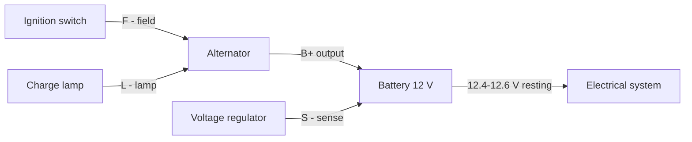
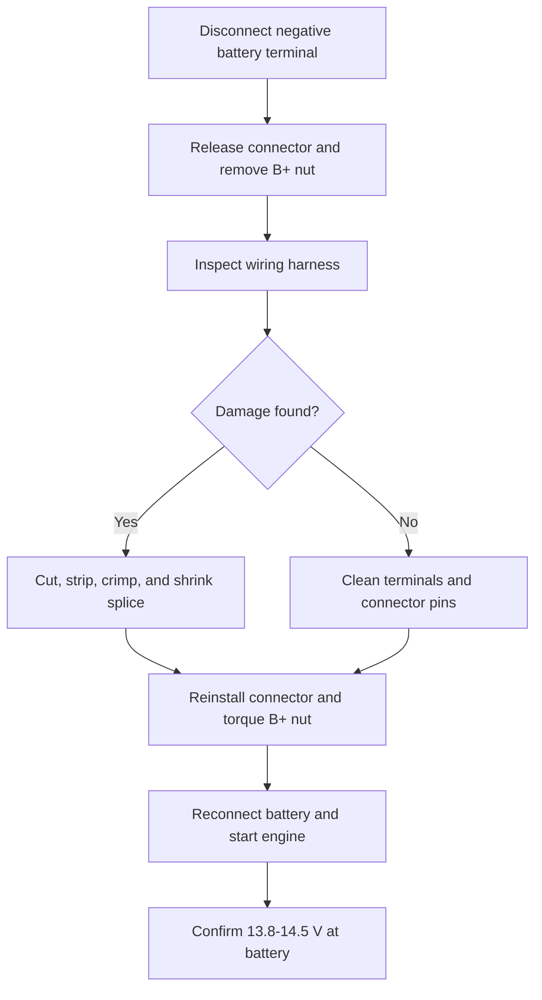
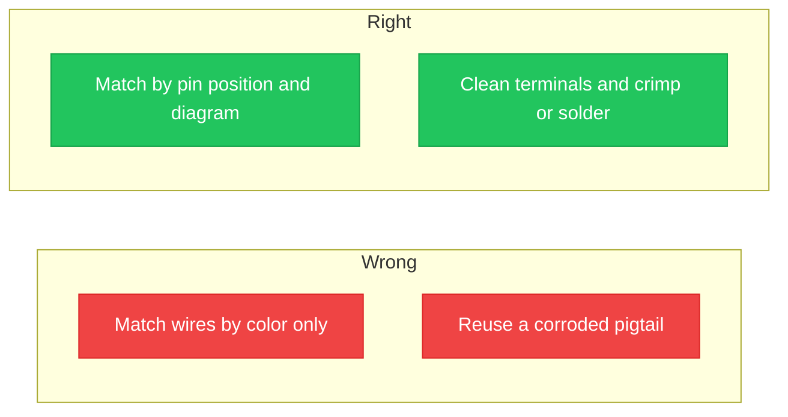

## مقدمة حول مخططات توصيل الدينمو

**<b>مخطط توصيل الدينمو هو الرسم التوضيحي الذي يُوضّح كيفية توصيل الدينمو والبطارية وregulator الجهد وحزمة الأسلاك داخل دائرة الشحن في المركبة.</b> يُظهر الرسم كل طرف، سلك، موصل، ونقطة تأريض ابتداءً من مخرج الدينمو وصولاً إلى البطارية وباقي النظام الكهربائي.

يُحوّل الدينمو الطاقة الميكانيكية التي ينقلها حزام السير إلى طاقة كهربائية. يعمل الدينمو السليم على شحن البطارية وتوفير التيار لنظام الإشعاج والمصابيح والإكسسوارات أثناء عمل المحرك. توفر معظم دينامات السيارات 13.8–14.5 فولت (V) عند 60–180 أمبير (A)، حسب نوع المركبة.

هناك 3 فوائد رئيسية لقراءة مخطط توصيل الدينمو:

1. تشخيص خلل الشحن قبل تغيير الأجزاء
2. إعادة توصيل الدينمو أو الموصل بشكل صحيح بعد الإصلاح
3. تجنب تلف regulator الجهد بسبب عكس التوصيل

لمخططات توصيل الدينمو 4 استخدامات رئيسية: استبدال الدينمو، استكشاف مشاكل نظام الشحن، إصلاح حزمة الأسلاك والموصلات، وقياس الجهد مقارنةً بالمخرج المُقيّم. تتكون دائرة الشحن من 5 أجزاء رئيسية: الدينمو، البطارية، regulator الجهد، دائرة مصباح الشحن، وحزمة الأسلاك التي تربطها معاً.

تشمل مشاكل التوصيل الشائعة في الدينمو ارتخاء وصلات البطارية، تآكل الأطراف، تلف حزمة الأسلاك، عطل regulator الجهد، وانصياد الرابط المقاوم للحرارة.

## فهم مخططات التوصيل

لفهم المخطط، يجب أولاً تعلم الرموز. يظهر الدينمو كدائرة مع مسمار خروج؛ تظهر البطارية كصفحات متراصة؛ يظهر الموصل كبلوك صغير بدبابيس مرقّمة؛ ويظهر التأريض كثلاثة خطوط متناقصة. تمثل الخطوط على المخطط الأسلاك، وتحمل كل خط لوناً يتوافق مع حزمة أسلاك المركبة.

تختلف أكواد الألوان حسب المصنّع. تظهر الألوان الأساسية وفق معيار SAE في معظم المخططات، وتتكون الكود من حرفين: اللون الأساسي أولاً ثم الشريط ثانياً. كود مثل W/R يُقرأ كسلك أبيض بشريط أحمر. يسرد دليل المصنع الأكواد الدقيقة لكل طراز.

يُسجّل المخطط أيضاً وظائف المكونات مثل مدخل إحساس regulator ومخرج تنبيه المصباح. تُرفق أدلّة المصنع لكل تصميم مع تعليمات خطوة بخطوة ونصائح الصيانة لتوصيلات الأسلاك.

تختلف تخطيطات التوصيل حسب عائلة المركبة. ثلاثة تخطيطات شائعة:

| عائلة المركبة | الأطراف على الموصل | ملاحظات |
| :--- | :--- | :--- |
| **GM Delco SI** | BAT, #1, #2 | BAT هو المخرج؛ #1 يُشغّل الحقل عبر المصباح؛ #2 يُشعر بجهد البطارية |
| **Ford** | I, S, A | I يُغذّي الإشعاج؛ S يشعر بجهد البطارية؛ A يقرأ مخرج العضد؛ أنظمة الشحن الذكية تضيف خط بيانات LIN |
| **Toyota and Honda** | B, IG, S, L | B هو المخرج؛ IG يُغذّي الإشعاج؛ S يشعر بالجهد؛ L يُشغّل مصباح التنبيه |

دقة التوصيل مهمة لثلاثة أسباب: يبقي سطر الإحساس المُعكس الدينمو تحت الجهد المستهدف، يمنع المصباح المفتوح تشغيل الحقل عند التشغيل، وتضيف وصلة الخروج المرتخة مقاومة تُسخّن سلك B+. يُنزل كل عطل البطارية عن شحنتها السليمة البالغة 12.4 فولت.

## مشاكل توصيل الدينمو الشائعة

هناك 6 أعراض شائعة لمشاكل توصيل الدينمو:

1. بقاء مصباح تنبيه الشحن مضاءً أثناء القيادة
2. خفت مصابيح الأمام مع مرور المحرك وسطوعها مع زيادة السرعة
3. تفريغ البطارية بين ليلة وضحاها
4. وميض المعدات الكهربائية
5. رائحة احتراق عند مأخذ الدينمو
6. توقف المحرك أو فشل إعادة تشغيله

| العرض | السبب المحتمل | أول فحص |
| :--- | :--- | :--- |
| بقاء المصباح مضاءً | دائرة مصباح مفتوحة أو regulator معطّل | التحقق من السلك L عند الموصل |
| خفت المصابيح مع مرور المحرك | خرج منخفض أو حزام رخو أو B+ بمقاومة عالية | قياس 13.8–14.5 فولت عند البطارية |
| التفريغ بين الليل والنهار | استنزاف البطارية أو diode معطّل | اختبار السحب مع المحرك مطفأ |
| وميض المعدات | وصلات أسلاك مرتخية | شد وتنظيف وصلات البطارية |
| رائحة احتراق عند المأخذ | أطراف موصل متآكلة أو ذائبة | فحص حزمة الأسلاك والموصل |
| توقف المحرك | انخفاض دائرة الشحن تحت الحد الأدنى | فحص حزمة الأسلاك وشريط التأريض |

اتبع عملية استكشاف الأخطاء الخطوة بخطوة التالية:

1. قِس البطارية مع المحرك مطفأ؛ قراءة أقل من 12.4 فولت تعني أن البطارية مفرغة أو معطّلة
2. شغّل المحرك وقِس مرة أخرى؛ يقرأ نظام الشحن السليم 13.8–14.5 فولت
3. إذا ظل الجهد قريباً من القيمة الساكنة، تحقق من شد الحزام وتأكد من دوران بكرة الدينمو
4. أطفئ المحرك وافصل طرف البطارية السالب، وافحص حزمة الأسلاك بحثاً عن بلاستيك ذائب أو تآكل أو أطراف متفحمة
5. تحقق من الرابط المقاوم للحرارة بين مسمار B+ والبطارية
6. اختبر شريط التأريض بين المحرك والهيكل بحثاً عن مقاومة عالية
7. أعد توصيل كل شيء، شغّل المحرك، وتأكد من إطفاء مصباح الشحن

> إذا لم يشحن الدينمو البديل بعد، فإن العطل موجود في حزمة الأسلاك أو التأريض، وليس في الدينمو الجديد. اختبر دوائر الموصل قبل تغيير الأجزاء مرة أخرى.

## دليل إصلاح التوصيل خطوة بخطوة

اجمع 8 أدوات وعناصر سلامة قبل البدء: مقياس متعدد، مفاتيح معزولة، قاطع أسلاك، وصلات سحب، أنابيب حرارية، نظارات سلامة، قفازات عمل، ومخطط التوصيل الأصلي للمركبة.

اتبع عملية الإصلاح التالية خطوة بخطوة:

1. افصل طرف البطارية السالب وثبّت السلك بعيداً عن البطارية
2. أرخِ قفل موصل الدينمو واسحب المأخذ مباشرةً
3. ا拆除 مسمار B+ وارفع طرف الحلقة البعيدة عن المسمار
4. افحص حزمة الأسلاك بحثاً عن تآكل أو ذوبان أو عزل متلف
5. اقطع الجزء المتلف من السلك واقلع 6–8 مم من العزل
6. اسحب الوصلة، وقلّص الأنبوب الحراري فوقها، وأعد تثبيت أو استبدل الموصل حسب الحاجة
7. أعد تثبيت الموصل وشّد مسمار B+ بالمواصفات وأعد توصيل البطارية
8. شغّل المحرك وتأكد من 13.8–14.5 فولت عند البطارية باستخدام المقياس المتعدد

اتبع 3 احتياطات سلامة أثناء الإصلاح: أبقِ السلك السالب المفصول بعيداً عن البطارية، لا تُقرّب أبداً مسمار B+ بالهيكل بمفتاح ربط، وتحقق من المصباح قبل إعادة تشغيل الدائرة. يبقى مسمار B+ مُشغّلاً دائماً عند توصيل البطارية.

## المساعدات البصرية والمخططات

يُظهر مخطط التوصيل في أعلى هذا الدليل مسار B+ عبر الرابط المقاوم للحرارة ودوائر الموصل في الدينمو النموذجي. الصورة أدناه تُوضّح كل طرف وظيفته ولون سلكه الشائع:

يُظهر المخطط 5 أطراف: B+, L, S, F, و GND. يسرد كل بطاقة حرف الطرف، اسم الدائرة، والوظيفة الفعلية للسلك. استخدم الصورة أثناء الإصلاح للتحقق من وظيفة كل سلك قبل إعادة التوصيل.

تظهر أخطاء التوصيل الشائعة إما كعادة خاطئة أو عادة صحيحة. قارن العمودين:

هناك 4 أخطاء توصيل شائعة يجب تجنبها:

1. مطابقة دوائر الموصل بالألوان بدلاً من موضع الدبابيس
2. إعادة استخدام موصل ذائب أو متآكل
3. ترك مسمار B+ مرتخياً أو مشدوداً أكثر من اللازم
4. تجاوز فصل البطارية السالب وحدث قوس كهربائي عند لمس B+ بالهيكل

تهدف المساعدات البصرية إلى 3 أغراض في الإصلاح: تسمية وظيفة الطرف الدقيقة، مقارنة التوصيل الصحيح والخطأ جنباً إلى جنب، وتسريع التشخيص لمعيدي الصيانة الذين يعملون بدون دليل المصنع.

## احتياطات السلامة عند العمل مع الأسلاك

افصل طرف البطارية السالب قبل لمس أي سلك من الدينمو. يحمل مسمار B+ جهد البطارية الكامل في جميع الأوقات، والمفتاح الذي يلمس المسمار والهيكل يُحدث قوساً كهربائياً عنيفاً.

أدوات وتجهيزات السلامة الأساسية: نظارات سلامة، مفاتيح ومقابض معزولة، قفازات عمل، مقياس متعدد، ومطفأة حريق مُصنّفة للحرائق الكهربائية.

المخاطر الشائعة في أعمال التوصيل في المركبات:

- صدمة كهربائية من مسمار B+ المُشغّل
- انفجار البطارية بسبب غاز الهيدrogen والشرر
- حروق من هيكل الدينمو الساخن
- قوس كهربائي عند وصل الأداة بوصلات البطارية

اتبع هذه الممارسات الآمنة الـ 8:

1. افصل طرف البطارية السالب أولاً وأعد توصيله أخيراً
2. استخدم أدوات معزولة حول مسمار B+
3. أزل المجوهرات المعدنية قبل العمل
4. ارتدِ نظارات سلامة وقفازات عمل
5. اعمل على محرك بارد؛ هيكل الدينمو يسخن
6. أبقِ الشرر بعيداً عن البطارية؛ غاز الهيدrogen قابل للاشتعال
7. شّد مسمار B+ حسب المواصفات
8. تحقق مرتين من القطبية قبل إعادة توصيل البطارية

> يُأرّض السلك السالب للبطارية الهيكل بالكامل. إزالته تعزل دائرة الشحن وهي الخطوة الأكثر أهمية قبل أي إصلاح كهربائي.

## الخلاصة والموارد الإضافية

فهم مخطط توصيل الدينمو يُبقي نظام الشحن موثوقاً ويجعل إصلاحات معيدي الصيانة آمنة. يُوضّح الرسم الأجزاء الرئيسية الخمسة، ويُظهر مخرج B+ إلى البطارية، ويتتبع دوائر الموصل الصغيرة إلى مصباح الشحن والإحساس والحقل. قراءة أكواد الألوان قبل لمس أي سلك تمنع عكس التوصيل الذي يُتلف regulator الجهد.

لمخطط خاص بطراز معين، راجع [مخطط توصيل دينمو Kia Sedona 2005](/blog/sedona-alternator-wiring-diagram/). للممارسة على قراءة المخططات، ابدأ مع [الدليل خطوة بخطوة لقراءة مخططات الدوائر](/blog/how-to-read-a-circuit-diagram-step-by-step-guide/).

ارسم واحفظ مخطط نظام الشحن الخاص بك في محرر المتصفح المجاني: [افتح محرر الدوائر](/editor/). يمكنك أيضاً [إنشاء مخطط دائرة عبر الإنترنت](/blog/how-to-make-circuit-diagram-online/) بدون تثبيت أي برنامج.

شارك أسئلتك أو تجاربك الشخصية في توصيل الدينمو في التعليقات. يردّ الفريق على مواضيع نظام الشحن الجديدة في الدليل التالي.
