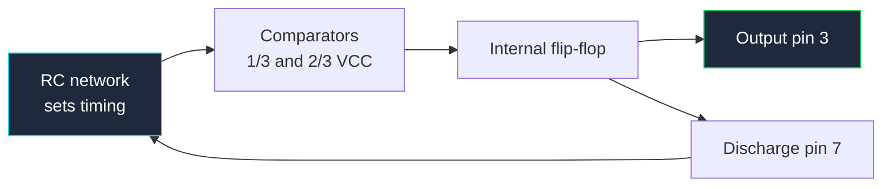

**يُحكم على المخطط التناظمي بشيء واحد: هل يمكن للقارئ أن يرى مسار التغذية الراجعة؟** التكبير وعرض التردد والاستقرار وتذبذب التردد كلها تُحدد بالتغذية الراجعة، والتغذية الراجعة *حلقة* — وهي البنية الوحيدة التي لا يمكن تمثيلها بشكل طبيعي في اتفاقية الرسم من اليسار إلى اليمين. تعلّم رسم الحلقات بحيث تبدو واضحة وليس مربكة هو ما يفصل بين المخطط التناظمي النظيف والفوضى.

يغطي هذا الدليل اتفاقيات الرسم لـ Op-Amp والمقارنات ومذبذبات 555 ودوائر RC التي تحدد سلوكها، ثم يطبقها على دوائر مضخمات الصوت والمذبذبات الحقيقية. وهو جزء من [الدليل الشامل لمخططات الدوائر](/blog/complete-guide-to-circuit-diagrams/)، الذي يغطي قواعد التخطيط الشاملة.

## مثلث Op-Amp

رمز Op-Amp هو مثلث يشير إلى اليمين. تكوينه:

| العنصر | الموقع | القاعدة |
| :--- | :--- | :--- |
| **مدخل عكسي** | الحافة اليسرى، مُعلَّم بـ `−` | في الأعلى تقليدياً |
| **مدخل غير عكسي** | الحافة اليسرى، مُعلَّم بـ `+` | في الأسفل تقليدياً |
| **مخرج** | الرأس، اليمين | مفرد دائماً، عند نقطة المثلث |
| **تغذية إيجابية** | الحافة العلوية | غالباً ما تكون مخفية في أوراق Op-Amp المتعددة |
| **تغذية سالبة** | الحافة السفلية | نفس الشيء |

قانونان يحكمان المثلث، والثاني هو المكان الذي تُدمّر فيه التصاميم.

**يمكنك عكس المدخلات.** وضع `+` في الأعلى و `−` في الأسفل مقبول تماماً عندما يجعل شبكة التغذية الراجعة أكثر وضوحاً، والمصممون المخضرمون يفعلون ذلك باستمرار.

**يجب عليك نقل التسميات عند العكس.** علامات `+` و `−` تُعرّف الأطراف — وليس الهندسة. مثلث مرسوم معكوس لكنه مُسمّى بشكل غير معكوس هو الخطأ الرمزي الأكثر تكلفة في التصميم التناظمي، لأنه يحاكي الدائرة بشكل صحيح من قائمة الشبكة التي *entienda* وتذبذب أو يعلق في الأجهزة. تحقق من كل رمز Op-Amp مقابل أرقام أطرافه قبل التسليم.

**أطراف التغذية.** في ورقة بها Op-Amp واحد أو اثنين، ارسم أطراف التغذية بشكل صريح مع مكثفات فصلها. في ورقة بثمانية، استخدم أطراف طاقة مخفية مربوطة بشبكات مسماة، وضع ملاحظة على الورقة تذكر إلى أي خطوط تتصل بالإضافة إلى كتلة فصل منفصلة. ما يجب ألا تفعله أبداً هو حذف مصادر الطاقة بصمت دون تقديم ملاحظة — القارئ لا يستطيع تحديد ما إذا كانت القطعة تعمل بتغذية أحادية أو ثنائية، وهذا يغير نظام التحيز بالكامل.

## رسم التغذية الراجعة بحيث تكون الحلقة واضحة

الاتفاقية بسيطة وشاملة تقريباً: **مكون التغذية الراجعة يوضع مباشرة فوق جسم المضخم**، مع مرور الحلقة من المخرج → للأعلى → لليسار → للأسفل إلى عقدة المدخل.

هذا يُنتج مستطيلاً مغلقاً فوق المثلث. القارئ يرى المستطيل ويعرف على الفور شيئين: المضخم لديه تغذية رائعة سالبة، والمكون داخل المستطيل يُحدد التكبير. لا حاجة لتتبع.

قواعد تجعل الحلقة مقروءة:

- **التغذية الراجعة في الأعلى، المدخل من اليسار.** عقدة الجمع — حيث يلتقي `Rin` و `Rf` عند المدخل العكسي — يجب أن تكون تقاطعاً نظيفاً مع نقطة مرئية.
- **لا تمرر التغذية الراجعة أسفل المضخم أبداً.** الأسفل هو المكان الذي تكون فيه شبكة الإرجاع إلى الأرض والتحيز. خلطهما يجعل الحلقة غير مقروءة.
- **حلقة واحدة لكل مضخم، مغلقة بصرياً.** إذا كان مسار التغذية الراجعة يتبع مساراً عبر ستة زوايا في الورقة، فانقل المضخم بدلاً من ذلك.
- **شرّح التكبير.** اكتب `Av = −Rf/Rin = −10` بجانب الكتلة. تكلفة بطاقة نصية واحدة تُلغي الحساب للقارئ.

| التكوين | طوبولوجيا | التكبير | توقيع الرسم |
| :--- | :--- | :--- | :--- |
| **عكسي** | المدخل عبر `Rin` إلى `−`، `Rf` من المخرج إلى `−`، `+` إلى الأرض | `−Rf/Rin` | مستطيل التغذية الراجعة في الأعلى، `+` مربوط |
| **غير عكسي** | المدخل مباشرة إلى `+`، مقسم من المخرج إلى `−` | `1 + Rf/Rg` | المقسم متدلي تحت مسار التغذية الراجعة |
| **متابع جهد** | المخرج موصول مباشرة بـ `−`، المدخل إلى `+` | `1` | حلقة سلك عارية، بدون مكونات |
| **مقارن** | مرجع إلى أحد المدخلات، إشارة إلى الآخر | حلقة مفتوحة | *لا* يوجد مستطيل تغذية رائعة على الإطلاق |
| **مضخم فرق** | مقسمان متطابقان | `Rf/Rin` | متماثل — ارسمه بشكل متماثل |

حالة المقارن تستحق التأكيد: *غياب* مستطيل التغذية الراجعة هو نفسه معلومة. عندما يرى القارئ مثلث Op-Amp لا شيء فوقه، يجب أن يستنتج فوراً "حلقة مفتوحة، هذا مقارن." لذا لا تترك مقاومة تغذية رائعة خارج المضخم عن طريق الخطأ — أنت لا تحذف مكون فقط، بل تتواصل بشكل إيجابي بشيء خاطئ.

أضف استبياناً إلى مقارن ويظهر مستطيل تغذية رائعة صغير، لكنه يعود إلى المدخل **غير العكسي** بدلاً من العكسي. هذا التمييز — التغذية الراجعة إلى `+` تعني التغذية الإيجابية تعني الاستبيان أو التذبذب — واضح في الرسم إذا كنت منضبطاً بشأن أي مدخل يجلس أين.

## مذبذب 555: مخطط كتلي أو خريطة أطراف؟

يمكن رسم 555 بطريقتين مختلفتين تماماً، واختيار الصحيح يعتمد على جمهورك.

**كرسمة أطراف.** صندوق عادي بثمانية أطراف مُسماة حسب الوظيفة. هذا ما تستخدمه في أي تصميم حقيقي. إنه مدمج، ويندمج في مخطط مثل أي IC آخر، ويُخبر البنّاء بكل ما يحتاجه.

**كمخطط كتلي داخلي.** مقارنان، مقسم بثلاث مقاومات، مُكمل SR، وترانزستور تفريغ وبافر مخرج. هذا رسم *تعليمي*. ينقل في التوثيق والدروس، أبداً في مخطط تصميم، لأنه يعني أنك يمكنك الوصول إلى عقد لم تُrought إلى الأطراف.

المنظور الداخلي يُفسّر القطعة بالفعل. المقسم هو ثلاث مقاومات متساوية عبر التغذية، تضع العتبات عند ثلث وثلثي VCC. المقارن السفلي يراقب طرف الزراعة مقارنة بـ ⅓ VCC؛ الأعلى يراقب طرف العتبة مقارنة بـ ⅔ VCC. مخرجاهما يُعيّنان ويُعيدان ضبط مُكمل SR، الذي يُ驱动 كل من طرف المخرج وترانزستور التفريغ. كل دائرة 555 هي مجرد شبكة RC مرتبة لتعبر تلك العتبتين.

| الطرف | الاسم | الوظيفة |
| :--- | :--- | :--- |
| 1 | GND | إرجاع إلى الأرض |
| 2 | TRIG | يبدأ دورة التوقيت عندما يُسحب أسفل ⅓ VCC |
| 3 | OUT | مخرج push-pull، يوفر ويستهلك ~200 mA |
| 4 | RESET | نشط منخفض — يُجبر المخرج على الانخفاض. **اربط بـ VCC إذا غير مستخدم** |
| 5 | CTRL | جهد تحكم، يلتقط عقدة ⅔ VCC. تجاوز بـ 10 nF إذا غير مستخدم |
| 6 | THR | ينهي دورة التوقيت عندما يتجاوز ⅔ VCC |
| 7 | DIS | تفريغ — المجمع المفتوح الذي يُفرغ مكثف التوقيت |
| 8 | VCC | تغذية، 4.5 V إلى 15 V للنسخة ثنائية القطب |

اثنان من تلك الأطراف يسببان معظم أعطال 555 في الميدان، وكلاهما عطلان *رسم*:

- **الطرف 4 يُترك عائماً.** إعادة الضبط نشطة منخفضة؛ طرف عائم يلتقط الضوضاء ويعيد ضبط المذبذب عشوائياً. ارسمه مربوطاً بـ VCC بشكل صريح.
- **الطرف 5 يُترك عارياً.** عقدة التحكم عالية المقاومة وتقع داخل مقسم العتبة. ارسم مكثف التجاوز 10 nF إلى الأرض.

كلاهما حالة حيث "المخطط لم يقل لتنفيذها" يصبح "اللوحة لا تعمل."

## رسم دوائر توقيت RC

في دائرة 555 أو مذبذب، شبكة RC هي الجزء الذي يريد القارئ إيجاده أكثر لأنه يُحدد التردد. اجعله قابلاً للعثور:

**اجمع مكونات التوقيت.** `R1` و `R2` و `C1` يجب أن يشكلا عموداً رأسياً مميزاً بصرياً بجانب IC، وليس مبعثرة بين مكثفات الفصل والشد.

**ارسم مسار الشحن من الأعلى إلى الأسفل.** المقاومات تنحدر من VCC، المكثف يجلس في الأسفل متصل بالأرض، وعقدة التوقيت — حيث تتصل العتبة والزراعة — هي الوصلة بينهما. هذا الترتيب العمودي يتطابق مع اتفاقية الجهد ويجعل اتجاه الشحن واضحاً.

**اكتب الصيغة على الورقة.** لتكوين غير مستقر:

```
f = 1.44 / ((R1 + 2·R2) · C1)
duty = (R1 + R2) / (R1 + 2·R2)
```

وللقابل للتفريغ:

```
t = 1.1 · R · C
```

كتابة الصيغة المناسبة بجانب الشبكة تُحوّل مخططك إلى وثيقة يمكن لشخص تعديلها بشكل صحيح. بدونها، الشخص التالي يُغير `R2` لضبط التردد ويتفاجأ عندما يتحرك دورة العمل أيضاً.

**حدد التحمل حيث هو مهم.** مكثف التوقيت يجب أن يكون مُعلَّماً بعتيقه وتحمله. مكثف سيراميك ±20% Y5V في فتحة توقيت يجعل التردد مجرد اقتراح. [دليل دائرة مذبذب 555](/blog/555-timer-circuit/) يمر عبر مجموعة الصيغ الكاملة مع خيارات مكونات عملية.



تلك الحلقة التي تعود من طرف التفريغ إلى شبكة RC هي المذبذب بأكمله. ارسمها كمسار مغلق مرئي وتكوين غير مستقر يُفسّر نفسه.

## مخططات دوائر مضخم الصوت

### LM386: مضخم الصوت البسيط

LM386 هو مضخم إشارات صغيرة قياسي لصوت، ومخططه لديه مجموعة محددة من المكونات يجب أن تظهر جميعها:

| الطرف | الوظيفة | ماذا ترسم |
| :--- | :--- | :--- |
| 1 | ضبط التكبير | اتركه مفتوحاً للتكبير 20 |
| 2 | مدخل عكسي | عادة إلى الأرض عبر شبكة المدخل |
| 3 | مدخل غير عكسي | إشارة داخل، عبر مكثف اقتران وبوت حجم |
| 4 | GND | أرض |
| 5 | مخرج | مكثف اقتران إلى سماعة الرأس، بالإضافة إلى شبكة Zobel |
| 6 | VS | تغذية، مع فصل |
| 7 | تجاوز | 10 µF إلى الأرض |
| 8 | ضبط التكبير | 10 µF من الطرف 1 إلى الطرف 8 يرفع التكبير إلى 200 |

ترتيب ضبط التكبير بين الطرفين 1 و 8 هو بصمة LM386 والشيء الذي يرسمه المبتدئون بشكل خاطئ غالباً. المفتوح يعني تكبير 20. مكثف 10 µF بينهما يعني تكبير 200. مقاومة على التوالي مع ذلك المكثف تُعيّن قيم متوسطة. شرّح أيهما تقصده — `GAIN = 200` بجانب المكثف — لأن المكون نفسه لا يُواصل قرار التصميم.

اثنان آخران يُتركان خارجاً ويجب ألا يكونا:

- **مكثف اقتران المخرج.** بضع مئات من µF بين الطرف 5 وسماعة الرأس. بدونه، التيار المستمر يتدفق عبر ملف الصوت.
- **شبكة Zobel.** حوالي 10 Ω على التوالي مع 50 nF من المخرج إلى الأرض. يُثبّت المضخم ضد حمل السمات السماعية. تبدو كمكونين بلا هدف حتى يذبذب المضخم بدونهما، لذا ارسمهما بجانب طرف المخرج وسمّها `ZOBEL`.

### TDA2030: باس ووبر ومضخم طاقة

للطاقة الحقيقية تنتقل إلى شريحة مثل TDA2030 — حوالي 14 واط في 4 Ω. خمسة أطرافها في حزمة Pentawatt:

| الطرف | الوظيفة |
| :--- | :--- |
| 1 | مدخل غير عكسي |
| 2 | مدخل عكسي |
| 3 | −VS (تغذية سالبة، أو أرض في تصميمات التغذية الأحادية) |
| 4 | مخرج |
| 5 | +VS (تغذية إيجابية) |

ملاحظات رسم خاصة بمضخم طاقة من هذا النوع:

- **التغذية الثنائية تعني أن الاتفاقية العمودية تعمل فعلاً.** `+VS` في أعلى الورقة، الأرض في المنتصف، `−VS` في الأسفل. شبكة تحيز المدخل تُشير إلى الأرض؛ إذا رُسم بشكل صحيح، التماثل واضح.
- **شبكة التغذية الراجعة تزال فوق الجسم**، تماماً مثل Op-Amp لإشارات صغيرة. التكبير يُحدد بنسبة في ذلك المقسم، ولباس ووبر عادة ما تُشغّل تكبير من 20 إلى 30.
- **ارسم فصل التغذية كزوجين**: مكثف إلكتروليتي كتلة ومكثف سيراميك على كل خط، بجانب أطراف التغذية. مضخمات الطاقة تستهلك التيار في نوبات عند تردد الإشارة، وهنا تقول ذلك.
- **أظهر دبابيس الحماية** من كل مخرج إلى كل خط إذا كان التصميم يستخدمها. على حمل سماتي هي ليست اختيارية.
- **شرّح متطلبات المشتت الحراري** كملاحظة نصية. مضخم 14 واط يتبخر في حزمة TO-220 هو تصميم حراري، والمخطط هو المكان الذي يُعلم ذلك.

بالنسبة لباس ووبر تحديداً، المرشح المنخفض التردد أمام المضخم يجب أن يكون على الرسم ككتلة مسماة خاصة به — عادة مرشح Sallen-Key نشط حول Op-Amp مع تردده الحدي مُعلَّم. اجعله منفصلاً بصرياً عن مرحلة الطاقة: المرشح على اليسار، المضخم على اليمين، مسار إشارة نظيف واحد بينهما.

## دوائر المذبذبات

### دوائر مولد موجة جيبية

**مذبذب جسر Wien** هو مصدر موجة جيبية قياسي منخفض التشوه. Op-Amp مع RC متسلسل و RC متوازي في مسار التغذية الراجعة يذبذب عند:

```
f = 1 / (2 · π · R · C)
```

القيد التصميمي الحرج هو أن تكبير المضخم يجب أن يكون *بالضبط* 3 — كافٍ للحفاظ على التذبذب، وليس كافياً للقص. هذا يعني أن مقسم التكبير غير العكسي يحتاج نسبة 2، بالإضافة إلى عنصر لتحسين السعة: دبابيس متتالية، مقاومة حرارية، أو مصباح صغير في النسخة الكلاسيكية.

قواعد رسم مهمة هنا:

- **شبكة تحديد التردد تذهب إلى جانب المدخل**، ترسم كزوج مُعترف به: RC متسلسل في الأعلى، RC متوازي في الأسفل.
- **مقسم ضبط التكبير يذهب في مستطيل التغذية الراجعة** على المدخل الآخر. شبكتان، موقعان، لا غموض بشأن ما يُحدد التردد وما يُحدد التكبير.
- **شرّح عنصر تحسين السعة** بملاحظة تشرح غرضه، لأن مصباحاً أو زوج دبابيس في مسار تغذية رائعة يبدو خطأ لأي شخص لم ير الطوبولوجيا.

**مذبذب تحويل طور** يأخذ المسار البديل: ثلاثة أقسام RC متتالية كل منها تساهم بـ 60° من تحويل الطور، ملفوفة حول مضخم عكسي. ارسم أقسام RC الثلاثة كثلاث مراحل متطابقة بصرياً في صف — التكرار *هو* التفسير، وأي عدم تناظر في رسمك سيُقرأ كdetail تصميمي بدلاً من حادثة رسم.

### مذبذب متعدد وحيد الاستخدام بـ Op-Amp

مذبذب وحيد يُنتج نبضة مخرج واحدة طولها ثابت لكل زراعة. مبني من Op-Amp، وهو مقارن مع تغذية رائعة إيجابية تُعيّن العتبة وشبكة RC تُعيّن المدة.

بما أن التغذية الراجعة هنا *إيجابية*، الرسم يجب أن يجعل ذلك لا لبس فيه: مستطيل التغذية الراجعة يعود إلى المدخل **غير العكسي**، وشبكة توقيت RC تتصل بالمدخل **العكسي**. شبكتان، مدخلان، وتسميات المدخل هي ما يُميّز مذبذباً وحيداً عن مضخم خطي. أضف ملاحظة — `POSITIVE FEEDBACK — SCHMITT ACTION` — بجانب مقاومة التغذية الراجعة. إنه أحد الحالات القليلة التي تمنع ملاحظة نصية سوء قراءة حقيقي لرسم صحيح.

### عدّاد 555 ودوائر مؤقت رد الفعل

ادمج مذبذب 555 غير مستقر مع عدّاد وتحصل على مجموعة مشاريع عملية.

**عدّاد 555 سباعي** هو ثلاث كتل على ورقة واحدة: مذبذب 555 غير مستقر يُولد نبضات الساعة على اليسار، وعدّاد عشري مع مُفكك سباعي مدمج مثل 4026 أو 4033 في المنتصف، والعرض على اليمين. ارسم مخارج السبعة كناقل بدل سلكين متوازيين، وسمّ أطراف العرض بحرف القطع، لا برقم الطرف.

**مؤقت رد فعل 555** يُضيف بوابة: الساعة تعمل إلى العدّاد فقط عندما تكون إشارة البداية نشطة، وزر اللاعب يتوقف. منطق البوابة هو بوابة AND واحدة أو طرف ساعة العدّاد نفسه، والرسم يجب أن يضع أطراف التحكم الموجهة للإنسان — زر البداية، زر الإيقاع، إعادة الضبط — مجتمعة على حافة الورقة مع تسميات واضحة. سلاسل العدّاد وعدّاد 4017 الذي غالباً يحل محل المُفكك مغطاة في [دليل مخططات بوابات المنطق](/blog/logic-gate-circuit-diagrams/).

## قائمة مراجعة للمخطط التناظمي

1. تحقق من تسميات `+` و `−` لكل Op-Amp مقابل أطرافه، خاصة حيث يتم عكس الرمز.
2. رسم شبكة التغذية الراجعة فوق جسم المضخم، مشكّلة مستطيلاً مغلقاً مرئياً.
3. شرّح التكبير كصيغة ورقم.
4. المقارنات بوضوح في حلقة مفتوحة، أو تغذية رائعة استبيان بوضوح تذهب إلى المدخل غير العكسي.
5. أطراف التغذية إما مرسومة مع الفصل أو مغطاة بملاحظة ورقة صريحة.
6. طرف 555 الـ 4 مربوط بـ VCC، الـ 5 متجاوز — مرسوم، لا مفترض.
7. مكونات التوقيت مجمّعة في عمود واحد مع صيغة التردد مكتوبة بجانبها.
8. تحديد عتيق وتحمل مكثف التوقيت.
9. مكثفات اقتران على كل مدخل ومخرج متصل تيارياً، مع القيم.
10. شبكات Zobel أو snubber مرسومة بجانب طرف المخرج الذي تُثبّته، ومسماة.
11. شبكة التحيز مُشارة إلى الخط الصحيح، مع مرجع منتصف التغذية مسمى صراحةً في تصميمات التغذية الأحادية.
12. ملاحظات المشتت الحراري والتبخر على أي جهاز فوق حوالي 1 واط.

**[ابدأ رسم مخططك الآن.](/editor/)** مثلثات Op-Amp، المقارنات، كتل 555، المكثفات القطبية والمكونات السلبية التي تحتاجها لدوائر RC كلها في المكتبة، وملمس الشبكة يُبقي مستطيلات التغذية الراجعة مربعة. عندما يحتاج مذبذبك إلى التحقق على المختبر، [دليل دوائر القياس والاختبار](/blog/measurement-test-circuit-diagrams/) يغطي كيفية رسم نقاط الاختبار وحِمل المسبار التي ستحتاجها.
