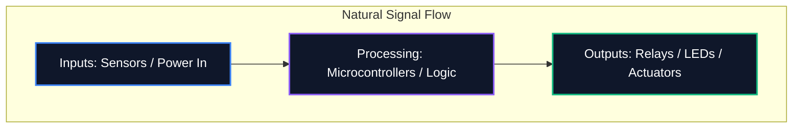

سواء كنت تشارك مخططًا في أحد المنتديات أو ترسله لتصنيع ثنائي الفينيل متعدد الكلور بشكل احترافي، فإن سهولة قراءة المخطط الخاص بك لا تقل أهمية عن صحته المنطقية. يؤدي التخطيط الفوضوي إلى أخطاء في التوجيه، ومكونات يساء فهمها، وإهدار الوقت.

يوضح هذا الدليل أفضل الممارسات الأساسية التي يستخدمها مهندسو الإلكترونيات المحترفون لإنشاء مخططات دوائر نظيفة وقابلة للصيانة وقابلة للقراءة بشكل كبير.

## 1. تدفق المخطط: من اليسار إلى اليمين، ومن الأعلى إلى الأسفل

المخطط هو مستند تقني، ومثل أي مستند، يجب قراءته بشكل طبيعي. في تصميم الإلكترونيات، تقضي الاتفاقية القياسية بأن تتدفق المدخلات من اليسار، وتخرج المخرجات من اليمين.

وبالمثل، يجب وضع الفولتية الأعلى بشكل واضح في الجزء العلوي من المخطط، والجهد المنخفض أو الأرض في الأسفل.



## 2. رموز القوة والأرض

لا ترسم أبدًا أسلاكًا طويلة متعرجة تربط كل دبوس أرضي ببعضه البعض. إنه يخلق شبكة عنكبوتية يستحيل قراءتها. بدلاً من ذلك، استخدم رموز الطاقة والأرض المحلية في المكون.

| ممارسة سيئة | أفضل الممارسات | لماذا يهم |
| :--- | :--- | :--- |
| ربط جميع الارضيات بسلك واحد متواصل | استخدام رموز `GND` المحلية في كل مكون | يقلل من الفوضى البصرية. يحدد بشكل صريح مسارات الإرجاع دون تتبع معقد |
| وضع خطوط VCC متقاطعة فوق آثار الإشارة | استخدام الرموز `VCC` / `+5V` المحلية التي تشير إلى الأعلى | يمنع خطوط الإشارة من الخلط بصريًا مع توصيل الطاقة |
| تسمية الأسباب المختلفة بنفس الرمز | التمييز بين الأرض التناظرية (AGND) والأرضية الرقمية (DGND) | ضروري لتجنب الحلقات الأرضية وانتشار الضوضاء في تصميمات الإشارات المختلطة |

## 3. نقاط التقاطع مقابل المعابر

من أخطر الأخطاء في التصميم التخطيطي هو الغموض في أماكن تقاطع الأسلاك.

```mermaid
graph TD
    A[Is it a connection?]
    A --> B{Is there a junction dot?}
    B -- Yes --> C[Wires are electrically connected (Node)]
    B -- No --> D[Wires are crossing without connecting]
    
    style A fill:#1e293b,stroke:#f59e0b
    style C fill:#1e293b,stroke:#10b981
    style D fill:#1e293b,stroke:#ef4444
```

> **نصيحة احترافية:** لا تستخدم مطلقًا تقاطعات "أربعة اتجاهات" (شكل صليب مثل "+"). إذا كانت هناك حاجة لأربعة أسلاك للالتقاء، فقم بإزاحتها إلى تقاطعين ثلاثيي الاتجاه على شكل حرف "T". وهذا يزيل الغموض تماما. إذا اختفت نقطة الوصل عند الطباعة أو القياس، فإن الشكل "T" لا يزال يشير بشكل لا لبس فيه إلى وجود اتصال، في حين أن الصليب العاري لا يفعل ذلك.

## 4. تجميع المكونات المنطقية

عند التعامل مع مخططات كبيرة تحتوي على وحدات تحكم دقيقة تحتوي على أكثر من 64 طرفًا، فإن محاولة سحب كل سلك فعليًا إلى المكون يعد تمرينًا لا جدوى منه. وبدلاً من ذلك، تستخدم الأدوات الاحترافية **Net Labels**.

قم بتجميع الكتل الوظيفية لدائرتك في مناطق مرئية. على سبيل المثال، ضع مصدر الطاقة في إحدى الزوايا، ووحدة MCU في المنتصف، ومحركات المحركات في زاوية أخرى. قم بتوصيلها فقط باستخدام تسميات Net الوصفية (على سبيل المثال، `SPI_MOSI`، `UART_TX`، `MOTOR_PWM`).

## 5. المسميات والقيم المرجعية

رمز المقاوم العاري لا يخبر المشاهد بأي شيء. يجب أن يكون لكل مكون محدد مرجعي فريد وقيمة صريحة.

| فئة المكون | البادئة القياسية | مثال |
| :--- | :--- | :--- |
| **المقاومات** | `ص` | `R1 (10 كيلو أوم)` |
| **المكثفات** | `ج` | `C4 (100nF)` |
| **الدوائر المتكاملة** | `U` أو `IC` | `U2 (LM358)` |
| ** الثنائيات / المصابيح ** | `د` | `D1 (1N4148)` |
| **الترانزستورات / الدوائر المتكاملة منخفضة المقاومة** | `س` | `س1 (2N2222)` |
| ** المحاثات ** | `ل` | `L1 (4.7μH)` |
| **الموصلات/الرؤوس** | `J` أو `P` | `J1 (مقبس الطاقة)` |

إن الالتزام بهذه الاتفاقيات يضمن أن مخططك سيتم فهمه على الفور من قبل أي مهندس، في أي مكان في العالم. ابدأ بتطبيق هذه القواعد اليوم في [محرر مخطط الدائرة](/editor/).