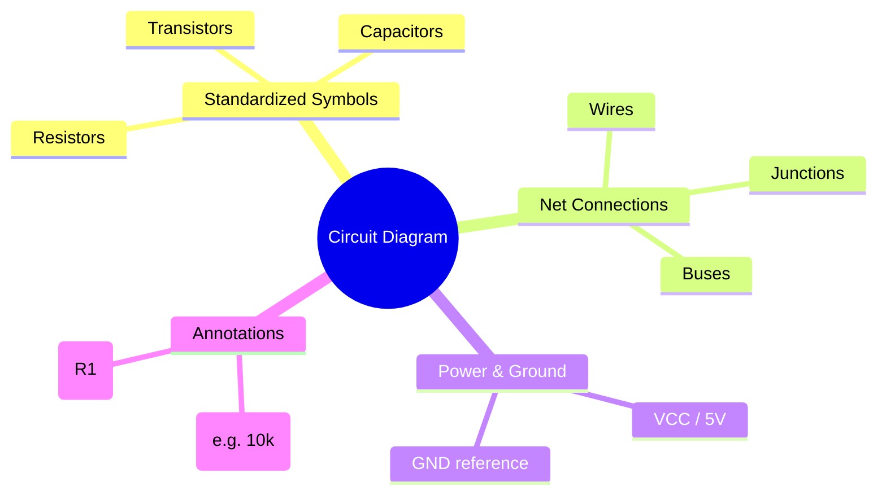
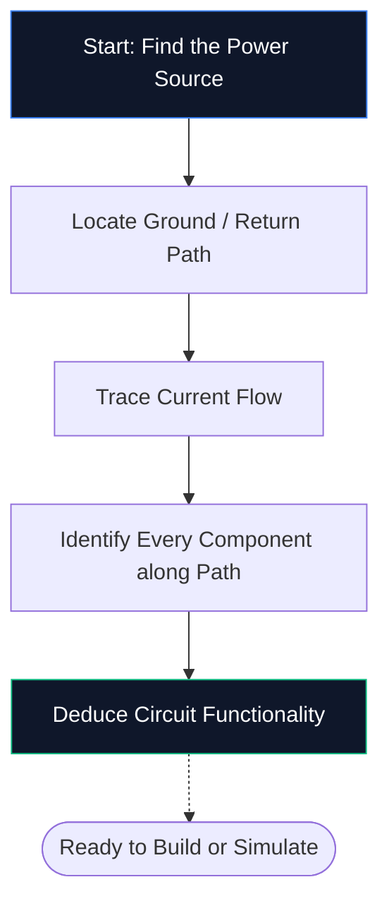

إذا لم تقم بفتح محرر تخطيطي من قبل، فهذا هو الدليل الوحيد الذي تحتاجه. سنتعرف على الأساسيات - ما هو مخطط الدائرة، وكيفية فك تشفير الرموز، وكيفية رسم أول مخطط لك داخل **Circuit Diagram Maker** - كل ذلك بدون تثبيت برنامج واحد.

## ما هو مخطط الدائرة بالضبط؟

مخطط الدائرة هو خريطة للكهرباء. مثلما توضح خريطة مترو الأنفاق كيفية اتصال المحطات دون تصوير الأنفاق على نطاق واسع، يوضح مخطط الدائرة كيفية توصيل المكونات الإلكترونية دون القلق بشأن الحجم الفعلي أو موضع اللوحة.

بدلاً من الرسومات الواقعية، تستخدم المخططات **رموزًا موحدة**. يظهر المقاوم كخط متعرج، والمكثف كصفيحتين متوازيتين، والصمام الثنائي كمثلث يلتقي بقضيب. يحافظ هذا الاختصار العالمي على الرسوم البيانية نظيفة وقابلة للطباعة وقابلة للقراءة في كل بلد ولغة.

> **سبب أهمية التجريد:** المقاومة الفيزيائية عبارة عن أسطوانة صغيرة ذات أشرطة ملونة، ولكن في مخطط مكون من 50 مكونًا، ستؤدي هذه التفاصيل إلى خلق فوضى بصرية. تعمل الرموز على ضغط الصورة حتى يتمكن عقلك من التركيز على *كيفية ربط الأشياء* بدلاً من *كيف تبدو*.

## الرموز العشرة التي يجب على كل مبتدئ معرفتها

قبل أن تتمكن من قراءة مخطط واحد أو رسمه، تحتاج إلى التعرف على وحدات البناء الأساسية. احفظ الجدول أدناه وستكون قادرًا على فك تشفير معظم دوائر الهواة التي تراها.

| شكل الرمز | مكون | الوظيفة الأساسية | المسمى |
| :--- | :--- | :--- | :--- |
| **خط متعرج** | المقاوم | حدود التدفق الحالي | `ص` |
| **خطان متوازيان** | مكثف | مخازن تهمة، مرشحات الضوضاء | `ج` |
| **سلسلة الحلقات** | مغو | يخزن الطاقة في مجال مغناطيسي | `ل` |
| **مثلث + شريط** | ديود | يسمح بالتيار في اتجاه واحد | `د` |
| **مثلث + شريط + أسهم** | الصمام | ينبعث الضوء عندما يكون متحيزًا للأمام | `D` / `LED` |
| **خطوط متوازية طويلة/قصيرة** | البطارية | يوفر جهد التيار المستمر | `بي تي` |
| **ثلاثة أسطر مكدسة** | ارضي | النقطة المرجعية عند 0 فولت | `GND` |
| **شكل المثلث** | المرجع أمبير | يضخم فرق الجهد | `U` / `IC` |
| **مستطيل بالدبابيس** | الدوائر المتكاملة | يؤدي وظائف معقدة | `U` / `IC` |
| **خطوط مستقيمة** | أسلاك | حمل التيار بين المكونات | *(لا يوجد)* |

## كيفية قراءة المخطط في خمس خطوات

قراءة مخطط الدائرة يتبع نفس العملية العقلية في كل مرة. تدرب على هذه الخطوات الخمس على أي مخطط وسيصبح النمط طبيعة ثانية.

1. **ابحث عن مصدر الطاقة** — ابحث عن رمز البطارية أو ملصقات مثل VCC أو 5 فولت أو 3.3 فولت. هذا هو المكان الذي تدخل فيه الطاقة الكهربائية إلى الدائرة.
2. **تحديد موقع الأرض** — ابحث عن رمز الأرض المكون من ثلاثة أسطر أو علامة GND. يجب أن يكون لكل دائرة مسار عودة.
3. **تتبع تدفق التيار** — اتبع الأسلاك من الطرف الموجب، عبر كل مكون، ثم العودة إلى الأرض. يتدفق التيار التقليدي من الموجب إلى السالب.
4. **حدد كل مكون** — قم بمطابقة كل رمز بالجدول أعلاه، ثم اقرأ الملصق المجاور له للحصول على القيم الدقيقة (على سبيل المثال، 10 كيلو أوم تعني 10000 أوم).
5. **افهم الغرض** — اسأل نفسك عما تفعله الدائرة. إن LED بالإضافة إلى المقاوم هو ضوء مؤشر بسيط. إن المضخم التشغيلي المزود بمقاومات ردود الفعل هو مضخم إشارة.

## مخططك الأول: دائرة LED

هنا يبدأ كل مبتدئ في مجال الإلكترونيات - مصباح LED يتم تشغيله من خلال مقاوم يحد من التيار. افتح [محرر صانع مخططات الدائرة](/editor/) وتابع.

**خط أنابيب هندسة الدائرة:**

** تعليمات خطوة بخطوة: **

1. اسحب رمز **البطارية** من الشريط الجانبي إلى اللوحة القماشية.
2. ضع **المقاوم** على يمين البطارية.
3. ضع **LED** على يمين المقاوم.
4. اضغط على **W** لتنشيط وضع السلك.
5. انقر فوق الطرف الموجب للبطارية، ثم انقر فوق الدبوس الأيسر للمقاوم لسحب سلك.
6. قم بتوصيل دبوس المقاوم الأيمن إلى القطب الموجب LED.
7. قم بتوصيل كاثود LED مرة أخرى إلى الطرف السالب للبطارية.
8. انقر نقرًا مزدوجًا فوق المقاوم واكتب **330 أوم**.
9. انقر **تصدير → SVG** لحفظ ملف بجودة النشر.

## خمسة أخطاء شائعة (وكيفية تجنبها)

| خطأ | ما الخطأ الذي يحدث | حل سريع |
| :--- | :--- | :--- |
| **مسار أرضي مفقود** | تبدو الدائرة مفتوحة؛ التيار لا يمكن أن يتدفق | قم دائمًا بتوصيل مسار العودة إلى الأرض |
| **معابر سلكية بدون نقاط** | يبدو السلكان المتقاطعان متصلين عندما لا يكونا | قم بإضافة نقطة تقاطع فقط حيث تنضم الأسلاك فعليًا |
| **لا توجد قيم للمكونات** | لا يمكن للمراجعين التحقق من تصميمك | قم بتسمية كل مقاوم ومكثف وIC |
| **أسلاك فوضوية** | الأسلاك القطرية أو المتداخلة تقلل من سهولة القراءة | استخدم توجيه مانهاتن (الأفقي والعمودي فقط) |
| ** لا يوجد محددات مرجعية ** | قائمة الأجزاء تصبح مستحيلة الإنشاء | قم بتسمية كل جزء R1 وC1 وU1 وD1 وما إلى ذلك |

## إلى أين تذهب بعد ذلك

بمجرد أن تعتاد على رسم المخططات الأساسية، استكشف هذه الموارد للارتقاء إلى المستوى التالي:

* **[شرح رموز مخططات الدوائر الكهربائية](/blog/circuit-diagram-symbols-explained/)** — نظرة متعمقة على كل فئة من فئات الرموز
* **[كيفية عمل مخطط دائرة على الإنترنت](/blog/how-to-make-circuit-diagram-online/)** — تقنيات متقدمة ونصائح لسير العمل
* **[مكتبة المكونات](/components/)** — تصفح جميع الرموز المتوفرة في Circuit Diagram Maker والتي يزيد عددها عن 40 رمزًا