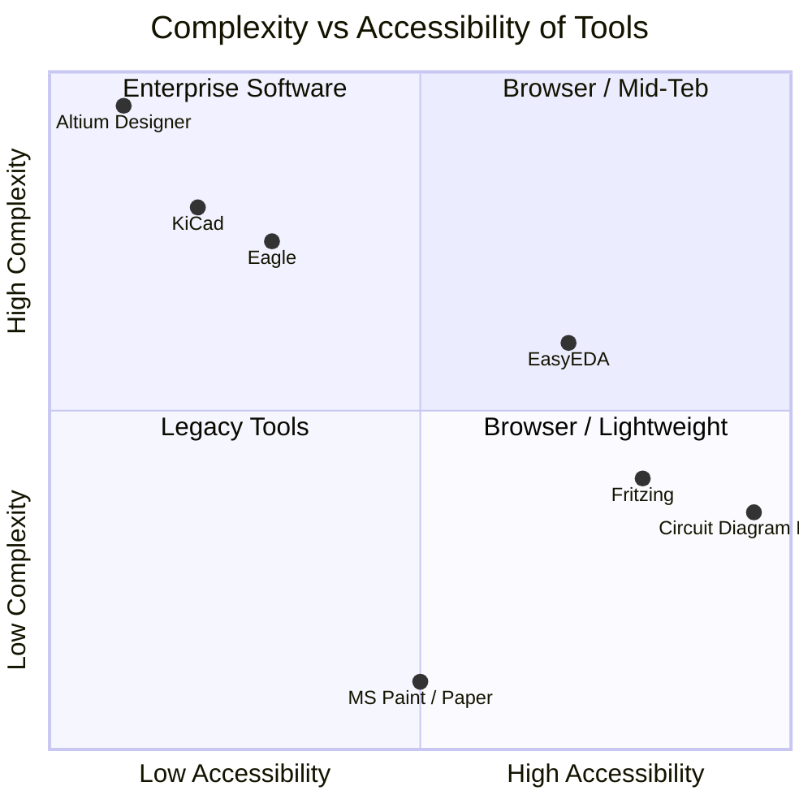
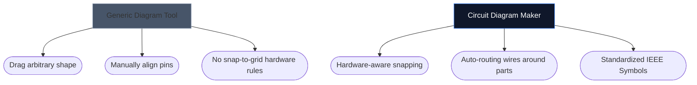

غالبًا ما يحدد اختيار الأداة المناسبة لرسم مخططات الأجهزة الإلكترونية الخاصة بك مدى السرعة التي يمكنك تكرارها في مشروع أجهزة جديد. في حين أن مصممي PCB المتقدمين يحتاجون إلى بيئات سطح مكتب ثقيلة الوزن، غالبًا ما يحتاج الهواة والطلاب والصانعون إلى شيء مختلف تمامًا: إمكانية الوصول والسرعة.

أدناه، نقوم بتحليل كيفية تنافس أداتنا مع البدائل الصناعية الرئيسية.

## مصفوفة تصنيف الأدوات

قبل الغوص في الأدوات الفردية، من المهم أن تفهم مستوى البرنامج الذي يتطلبه مشروعك بالفعل. يعد استخدام برنامج PCB الخاص بالمؤسسة لرسم تخطيط LED مكون من 4 مكونات أمرًا مبالغًا فيه.

## 1. صانع مخططات الدوائر الكهربائية مقابل فريتزينج

يشتهر فريتزينج بسد الفجوة بين النماذج الأولية للوحة التجارب والخطط. ومع ذلك، يتطلب برنامج Fritzing التثبيت وقد عانى من تحديثات الصيانة على مر السنين.

| ميزة | صانع مخطط الدائرة | فريتزينج |
| :--- | :--- | :--- |
| **التركيز الأساسي** | تخطيطات تخطيطية قياسية | تصورات اللوح |
| **التثبيت** | لا شيء (يعتمد على المتصفح بنسبة 100%) | مطلوب تثبيت سطح المكتب |
| **التكلفة** | مجاني 100% | مدفوعة (تبرعات) |
| **منحنى التعلم** | منخفض للغاية | معتدل |

> **الحكم:** إذا كنت بحاجة على وجه التحديد إلى تصور أسلاك فيزيائية تغوص في لوحة التجارب، فإن Fritzing هو الأفضل. إذا كنت بحاجة إلى مخططات إلكترونية قياسية وعالمية *على الفور*، فاستخدم Circuit Diagram Maker.

## 2. صانع مخططات الدوائر الكهربائية مقابل KiCad وAltium

KiCad عبارة عن مجموعة PCB أسطورية مفتوحة المصدر، وAltium Designer هو معيار صناعة المؤسسات. إنهم أقوياء للغاية.

| طبقة القدرة | صانع مخطط الدائرة | كيكاد / ألتيوم |
| :--- | :--- | :--- |
| **نوع الإخراج** | صور SVG/PNG | ملفات جربر، BOM، اختيار ومكان |
| **محاكاة** | بصري / مبسط | التكامل العميق للتوابل |
| **السرعة إلى المخطط الأول** | < 10 ثواني | 10–30 دقيقة (الإعداد/التكوين) |

> **الحكم:** استخدم KiCad أو Altium عند إرسال طبقات من النحاس إلى مصنع في Shenzhen. استخدم Circuit Diagram Maker عندما تقوم بإرفاق مخطط بمهمة فيزياء أو منشور مدونة أو سؤال في المنتدى.

## 3. صانع مخططات الدوائر الكهربائية مقابل draw.io / Lucidchart

تحظى أدوات التخطيط العامة مثل draw.io بشعبية كبيرة في المخططات الانسيابية. ومع ذلك، فإنهم يفتقرون إلى الفهم الدلالي للإلكترونيات.

عند استخدام أداة إلكترونية مخصصة، يدرك المحرر أن السلك لا يمكن أن "ينتهي" بشكل عشوائي بدون وصلة، وهو بطبيعته يعين الخصائص القياسية (مثل أوم للمقاومات).

## ما هي الأداة المناسبة لك؟

أفضل أداة هي تلك التي تبتعد عن طريقك. للتفكير السريع والمهام التعليمية والمنشورات على شبكة الإنترنت، يقدم [صانع مخططات الدوائر الكهربائية](/editor/) مزيجًا لا يهزم من السرعة والجمالية الحديثة.