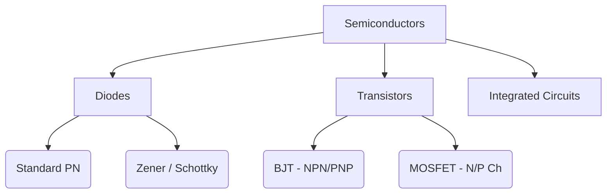

الرموز الإلكترونية هي اللغة العالمية لهندسة الأجهزة. مثلما تملي النوتات الموسيقية درجة الصوت والإيقاع، فإن رموز الدوائر تنقل الوظيفة الكهربائية، والخصائص، والاتصال عبر قطعة من الورق.

في هذا الدليل الشامل، نقوم بتحليل الشكل البصري لأهم العناصر التي ستواجهها في أي مخطط.

## الاختلافات المعيارية العالمية: IEEE مقابل IEC

قبل الغوص في رموز محددة، من المهم أن ندرك أن الرموز يمكن أن تبدو مختلفة اعتمادًا على المكان الذي تم رسم المخطط فيه. المعياران السائدان هما **IEEE/ANSI** (معظمهما في الأمريكتين) و **IEC** (أوروبا والدولية).

```mermaid
flowchart LR
    subgraph Regional Standards
    A((Schematic Origin))
    A -- US / Americas --> B[IEEE / ANSI]
    A -- Europe / Int'l --> C[IEC]
    end
    
    B -.-> D(Zigzag Resistors)
    C -.-> E(Rectangle Resistors)
    
    style B fill:#1e293b,stroke:#f59e0b
    style C fill:#1e293b,stroke:#3b82f6
```

في Circuit Diagram Maker، نستخدم بشكل أساسي معيار IEEE/ANSI، حيث يظل شائعًا للغاية في الأنظمة البيئية الرقمية وأنظمة الهواة، على الرغم من أن كلاهما صحيح من الناحية الفنية.

## المكونات السلبية

لا تتطلب المكونات السلبية مصدر طاقة خارجي للعمل ولا يمكنها تضخيم الإشارة.

| مكون | مظهر الرمز القياسي | الوصف الوظيفي |
| :--- | :--- | :--- |
| **المقاوم** | يتم تحديده بواسطة خط متعرج حاد ومتعرج. تتميز المتغيرات المتغيرة بوجود سهم يخترق الخط. | يبدد الطاقة كحرارة لتقييد تدفق التيار الكهربائي. |
| **مكثف** | خطان متوازيان تفصل بينهما فجوة. المتغيرات المستقطبة تنحني أحد الخطوط للإشارة إلى الطرف السالب. | يخزن الطاقة الكهربائية بشكل مؤقت في مجال كهربائي. |
| ** مغو ** | سلسلة من الحلقات المستديرة أو أنصاف الدوائر التي تمثل لفائف من الأسلاك. | يقاوم التغيرات في تدفق التيار عن طريق تخزين الطاقة في مجال مغناطيسي. |

## المكونات النشطة (أشباه الموصلات)

تتطلب المكونات النشطة مصدرًا للطاقة، ويمكنها التحكم في تدفق الكهرباء، وغالبًا ما تعمل على تضخيم الإشارات.

| مكون | المؤشرات البصرية | الاستخدام الأساسي |
| :--- | :--- | :--- |
| ** ديود ** | مثلث يشير نحو خط مسطح. يشير الخط إلى الكاثود (السالب). | صمام أحادي الاتجاه للكهرباء. |
| ** LED ** | رمز صمام ثنائي قياسي به سهمان صغيران يشيران إلى الخارج، مما يدل على انبعاث الضوء. | المؤشرات البصرية والالكترونيات الضوئية. |
| ** ترانزستور BJT ** | خط عمودي محاط بثلاثة اتصالات: القاعدة والمجمع والباعث مع سهم يملي NPN أو PNP. | المفاتيح ومكبرات الصوت التي يتم التحكم فيها حاليًا. |
| **موسفيت** | تتميز بخطوط حدودية منفصلة تسلط الضوء على البوابة المعزولة وثنائيات الركيزة الداخلية. | التبديل التي تسيطر عليها الجهد للطاقة العالية. |

## الأجهزة الميكانيكية والمخرجات

تتفاعل هذه الأجزاء مع العالم المادي، إما بأخذ مدخلات بشرية أو توليد مخرجات مادية.

| مكون | الاختزال التخطيطي | التطبيق |
| :--- | :--- | :--- |
| **سويتش (SPST)** | خط مكسور يمكن أن يدور للأسفل لإكمال الدائرة. | التحكم الأساسي في تشغيل/إيقاف الطاقة. |
| **تتابع** | عادة ما يتم تصويره على أنه مغو (ملف داخلي) مقترن بوصلات تبديل معزولة. | تحويل الأحمال ذات الجهد العالي عبر متحكمات الجهد المنخفض. |
| **المحرك** | دائرة تحتوي على حرف "M"، وغالبًا ما تكون ذات أطراف موجبة وسالبة محددة. | تحويل التيار الكهربائي إلى حركية دورانية. |

> **نصيحة التصميم:** عند استخدام المفاتيح أو المرحلات الميكانيكية، قم دائمًا بتضمين *الصمام الثنائي الطائر* عبر الأحمال الحثية لحماية مكونات أشباه الموصلات من طفرات الجهد!

إن فهم هذه الرموز هو الخطوة الأولى نحو طلاقة الدائرة. راجع [المحرر عبر الإنترنت](/editor/) لسحب هذه الأشكال وإسقاطها وتجربتها على الفور.