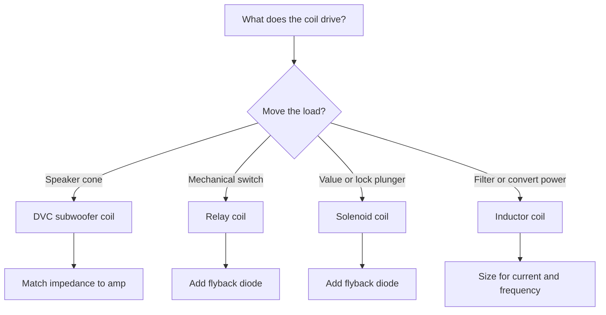
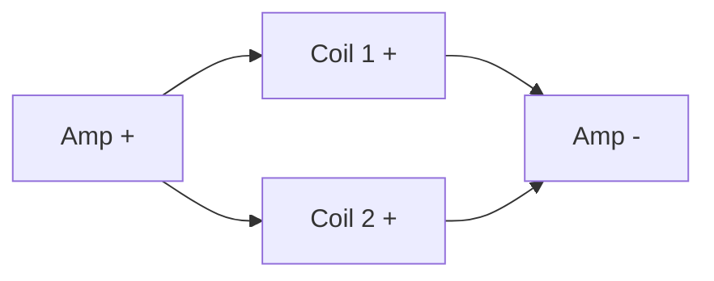
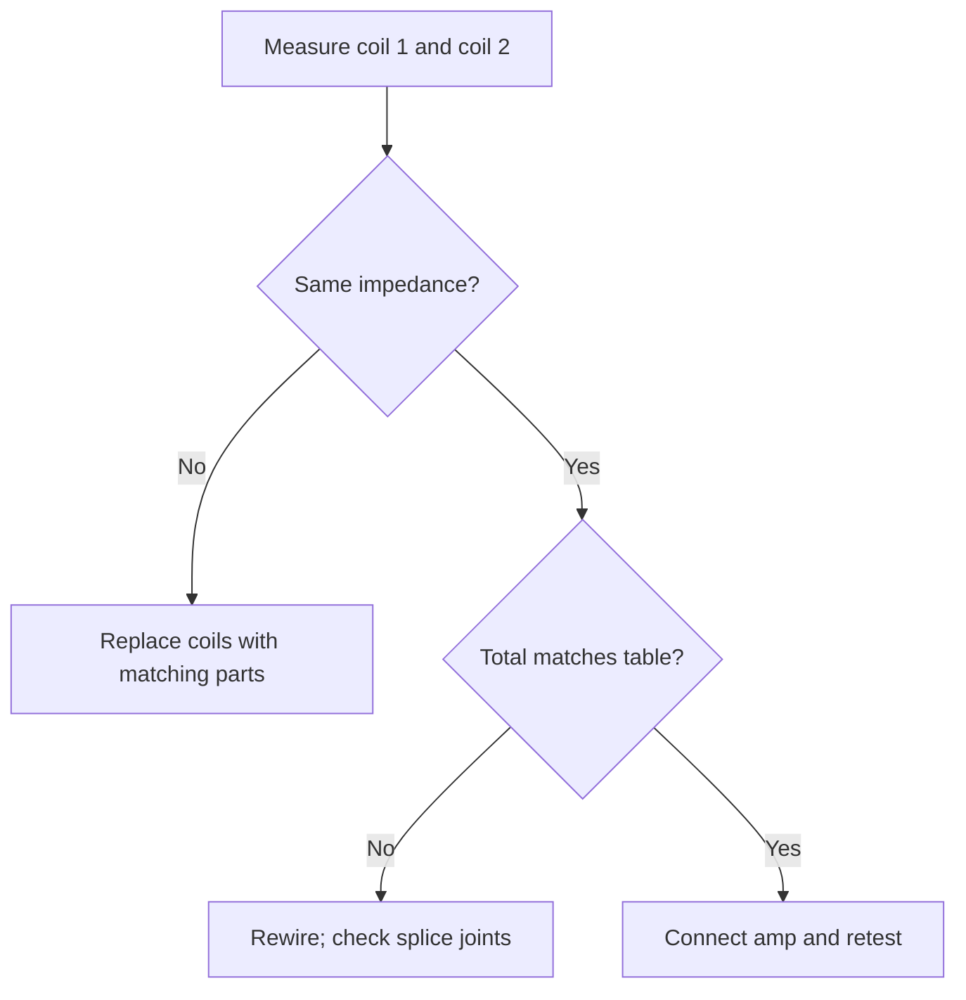

## مقدمة في توصيل ملفات الالتفاف

**<b>مخطط توصيل ملفات الالتفاف هو الرسم التوضيحي الذي يُظهر كيفية توصيل ملفات الالتفاف بالطاقة والأرض والأجزاء التي تُشغّلها، بما في ذلك ملفات مُرحّل التأثير الكهرومغناطيسي وملفات ملفات الالتفاف المزدوجة للصوت.</b> ملف الالتفاف هو طول من الأسلاك ملفوف في حلقات مُخزّن للطاقة في مجال مغناطيسي. يُعيّن المخطط كل طرف من ملف الالتفاف بدائرة التوصيل ومكونات الحماية المحيطة به.

يهم توصيل ملفات الالتفاف في مشاريع Arduino لأن مُرحّل التأثير الكهرومغناطيسي والصمامات البولوفية والمغناطيسات الكهربائية تعتمد جميعها على ملفات الالتفاف. في مشاريع Arduino، يُظهر المخطط كيف يُشغّل مخرج رقمي ملف الالتفاف عبر ترانزستور ومُردّ الارتداد بدلاً من توصيل الملف مباشرة باللوحة.

هناك 3 فوائد رئيسية لقراءة مخطط توصيل ملفات الالتفاف:

1. التنبؤ بمقاومة ملفات الصوت و_tolerance_ها قبل التوصيل
2. تشغيل ملفات مُرحّل التأثير الكهرومغناطيسي والصمام البولوفي من مُ.matrix بدون إتلاف اللحة
3. اكتشاف أعطال عدم الطاقة والطنين والملفات المحترقة من تخطيط التوصيل

يحتوي المخطط على 4 استخدامات رئيسية: توصيل سماعةลำ rolled الـ DVC (ملفات الصوت المزدوجة)، وحدات مُرحّل Arduino، تشغيل الصمامات البولوفية، ودوائر الطاقة المبنية على المغناطيسات الكهربائية. يحتوي تخطيط التوصيل على 5 أجزاء رئيسية: ملف الالتفاف، مصدر الطاقة، جهاز التبديل، حماية الارتداد، والحمل الكهربائي.

## أنواع ملفات الالتفاف وتطبيقاتها

**<b>سماعةลำ rolled الـ DVC (ملفات الصوت المزدوجة) تحتوي على ملفَيْ صوت منفصلين ملفوفين على نفس حامل السماعة.</b> لكل ملف زوج من الأطراف و谭rating مقاومته الخاصة، عادة 2 أو 4 أوم (Ω).**

توفر سماعةลำ rolled الـ DVC 3 مزايا:

1. مطابقة حمل المضخم بالتوصيل المتسلسل والمتوازي
2. توصيل سماعة واحدة بمضخم أحادي أو مضخم مُ bridged
3. الوصول إلى مقاومة منخفضة عندما لا يستطيع المضخم تشغيل الأحمال عالية الأوم عند القدرة المنخفضة

<table>
  <thead>
    <tr><th>نوع ملف الالتفاف</th><th>وظيفة ملف الالتفاف</th><th>谭rating نموذجي</th><th>الاستخدام الشائع</th></tr>
  </thead>
  <tbody>
    <tr>
      <td><strong>ملف صوت DVC</strong></td>
      <td>يحرّك مخروط السماعة؛ المقاومة تتراكم في التسلسل وتتناقص في التوازي</td>
      <td>2 Ω أو 4 Ω لكل ملف</td>
      <td>توصيل سماعات الصوت في أنظمة الصوت</td>
    </tr>
    <tr>
      <td><strong>ملف مُرحّل التأثير الكهرومغناطيسي</strong></td>
      <td>يُنشّط مغناطيساً كهربائياً يُغلق أطراف المفتاح</td>
      <td>5 V أو 12 V DC</td>
      <td>مشاريع Arduino والأتمتة المنزلية</td>
    </tr>
    <tr>
      <td><strong>ملف صمام بولوفي</strong></td>
      <td>يسحب ميزان لتحويل صمام أو قفل</td>
      <td>6–24 V DC</td>
      <td>صمامات الري وأقفال الأبواب</td>
    </tr>
    <tr>
      <td><strong>ملف مغناطيس كهربائي</strong></td>
      <td>يُخزّن الطاقة المغناطيسية ويُسطّح تدفق التيار</td>
      <td>microhenries (µH) إلى henries (H)</td>
      <td>المرشّحات ومحولات الزيادة</td>
    </tr>
  </tbody>
</table>

اختر نوع ملف الالتفاف من متطلبات التوصيل قبل تصميم الدائرة:

في أنظمة الصوت، يتم توصيل سماعةลำ rolled الـ DVC بمضخم أحادي. تقدم سماعة DVC واحدة حوالي ضعف التحكم في المخروط مقارنة بسماعة SVC (ملف صوت واحد) مكافئة عندما يُطابق المضخم المقاومة النهائية الأدنى. الصورة أدناه تُظهر 4 أنواع من ملفات الالتفاف:

## مخططات التوصيل خطوة بخطوة

تُنطبق طريقتا التوصيل على سماعةลำ rolled الـ DVC: التوصيل المتسلسل والتوصيل المتوازي.

**<b>التوصيل المتسلسل يوصّل ملف 2 بملف 1 ويُضيف المقاومات. التوصيل المتوازي يوصّل كلا الملفين بنفس أطراف المضخم ويُنصّف المقاومة.</b>**

يُظهر الجدول كلا النتيجتين لمقاومات الملفات الشائعة:

| مقاومة كل ملف | المجموع المتسلسل | المجموع المتوازي |
| :--- | :--- | :--- |
| 2 Ω | 4 Ω | 1 Ω |
| 4 Ω | 8 Ω | 2 Ω |

اختر طريقة التوصيل لمطابقة نطاق المقاومة المستقرة للمضخم. مضخم أحادي ب谭rating 4 أوم (Ω) و500 واط (W) يستقبل ملفَي DVC متسلسلين، كل منهما 2 Ω، لمجموع 4 Ω. مضخم ب谭rating 1 Ω يستقبل نفس الملفات متوازية بمجموع 1 Ω، وتُوزّع القدرة على الملفين.

استخدم هذه النصائح الخمس للتوصيل:

1. مطابقة المقاومة الإجمالية بنطاق المضخم谭rating لحمل مستقر
2. توصيل ملف 1 وملف 2 من نفس السماعة بنفس قناة المضخم
3. التحقق من أن كلا الملفين يشتركان في نفس المقاومة و谭rating القدرة
4. قياس الأطراف بأوميتر قبل توصيل المضخم
5. تسمية أطراف + و− على كلا الملفين لتجنب العكس

## استكشاف الأخطاء وإصلاحها في مشاكل التوصيل الشائعة

هناك 6 أخطاء شائعة في توصيل ملفات الالتفاف:

1. عكس القطب على ملف صوت واحد، ويتعارض المخروط مع نفسه
2. خلط ملفات 2 Ω و4 Ω في سماعة واحدة ويكون الحمل غير منتظم
3. توصيل مقاومة صافية أقل من تقييم المضخم، وي进入 المضخم وضع الحماية
4. ترك وصلة مفكوكة أو وصلة باردة في دائرة ملف التيارة العالية
5. تخطي مُردّ الارتداد في ملف مُرحّل Arduino
6. استخدام سلك ب谭rating أقل من المطلوب في دائرة ملف عالية القدرة

حل مشكلة توصيل DVC بأوميتر:

1. ضبط الأوميتر على المقاومة (Ω)
2. قياس ملف 1 عبر أطرافه؛ يتوقع 2 Ω أو 4 Ω
3. قياس ملف 2؛ يتوقع نفس القيمة
4. توصيل متسلسل أو متوازي، ثم قياس طرفي الملفين مرة أخرى مقارنة بالجدول

> "وصلت ملفَيْ 4 Ω متسلسلين للوصول إلى 8 Ω لمضخمي. أظهر المقياس 8.1 Ω وعمل المضخم بارد بدلاً من الانقطاع." — منشور في منتدى صوت السيارة الكلاسيكية

> "وحدة مُرحّل Arduino قمت ببناءها كانت تُعيد التشغيل باستمرار. مُردّ الارتداد المفقود كان هو العطل كاملاً. أصلحه 1N4007 واحد." — مستخدم في منتدى الإلكترونيات الهواة

تدابير احترازية: تأمين خط الطاقة ب谭rating التيارة الملف، لحام كل مفصلة، وتغطية الوصلات المكشوفة بالأنابيب الحرارية.

## احتياطات السلامة عند العمل مع ملفات الالتفاف

يُخزّن ملف الالتفاف طاقة مغناطيسية، وتُنتج التيارة المقطوعة في ملف الالتفاف نبضة جهد عالي. تصل تلك النبضة إلى مئات الجهد على ملف مُرحّل مُشغّل عند 12 V. يحمل توصيل ملفات الالتفاف 3 مخاطر رئيسية: الصدمة الكهربائية، وأضرار ارتداد ملف، والقصارات القصيرة من الأسلاك المفكوكة.

اتبع هذه 8 احتياطات سلامة:

1. فصل مصدر الطاقة قبل التوصيل أو إعادة توصيل أي ملف
2. تفريغ مكثفات الطاقة قبل لمس الدائرة
3. تركيب مُردّ ارتداد عبر كل ملف مُرحّل وملف صمام بولوفي
4. استخدام أدوات معزولة وقشّرات أسلاك بقالب نظيف
5. التحقق من القطب على كلا الملفين قبل توصيل المضخم
6. تأمين خط الطاقة ب谭rating أقل من أو يساوي التيارة المُقيّم للملف
7. ارتداء نظارات سلامة عندما يمكن أن يرتد ميزان الصمام البولوفي
8. التحقق من أن الملف يقرأ مقاومته المُقيّمة قبل تطبيق الطاقة

> مُردّ الارتداد (1N4007 لمعظم ملفات DC) يعمل في كل دائرة ملف يُقطعها مُتحكم دقيق أو مفتاح. ي FACE المُردّ للخلف عبر الملف ويُمتصّ نبضة الارتداد عندما ينطفئ الملف.

تحقق من العزل مرتين. تُسبب التشققات في معطف السلك بالقرب من الحالة المعدنية للملف قصارات قصيرة إلى الأرض. استخدم أنابيب الانكماش عند كل وصلة حتى لا تلمس الموصلات العارية الهيكل.

## أمثلة واقعية ودراسات حالة

**دراسة الحالة 1: مفتاح مُرحّل Arduino.** يُشغّل نظام أتمتة منزلية مضخة حديقة 12 V بملف مُرحّل. يستهلك المُرحّل 85 مللي أمبير (mA) عند 12 V، وهو أعلى بكثير من 20 mA لكل دبوس Arduino. يستخدم البناء ترانزستور 2N2222 ومقاومة أساس 1 kΩ ومُردّ ارتداد 1N4007 عبر الملف. يُشغّل دبوس Arduino الترانزستور، وينشط الملف، وتعمل المضخمة. الدروس المستفادة: بدون مُردّ الارتداد، أعادت نبضة الملف Arduino التشغيل عند كل انطفاء.

**دراسة الحالة 2: بناء سماعة سيارة.** تُشغّل سماعة DVC واحدة 2 Ω مضخماً أحادياً مستقراً عند 1 Ω. وصّل الباني ملفات بشكل متوازي لمجموع 1 Ω، واستخدم سلك سماعة 16 AWG لكلا الملفين، و保险 خط الطاقة ب谭rating المضخم؛ أظهر تجهيز القياس نظيف الإخراج عبر نطاق التردد. المحاولة الثانية بالتوصيل المتسلسل أظهرت 4 Ω بنصف التيارة المستهلكة لكن بقدرة أقل.

**دراسة الحالة 3: محول زيادة بملف مغناطيس كهربائي.** يستخدم محول زيادة 5 V إلى 12 V DIY مُغناطيس كهربائي 100 µH ومُردّ شوتكي ومحرّك PWM (تعديل عرض النبضة) من Arduino. يُخزّن المغناطيس الكهربائي الطاقة في كل دورة تبديل ويُقدّم 12 V مُسطّحة عند الإخراج. الدروس المستفادة: يجب أن يكون المغناطيس الكهربائي مُقيّماً لكامل التيارة التبديل، وإلا يشبّع اللبب وينهار جهد الإخراج.

3 استخدامات مبتكرة لتوصيل ملفات الالتفاف في الإلكترونيات DIY:

1. أقفال أبواب مغناطيسية مُشغّلة بArduino ووحدة مُرحّل
2. توصيل سماعة DVC في بناء سماعات مسرح منزلي 2.1
3. ملفات استشعار لاسلكية يدوية الصنع تُستخدم في تجارب الشحن اللاسلكي

## الخلاصة والموارد الإضافية

يربط مخطط توصيل ملفات الالتفاف ملف الالتفاف ومصدر الطاقة والمحرّك وحماية الارتداد والحمل في تخطيط واحد قابل للقراءة. يُضيف التوصيل المتسلسل المقاومة؛ التوصيل المتوازي يُنصّفها. تعتمد سماعة DVC على مطابقة المقاومة هذه، وتعتمد دوائر Arduino على مُردّ الارتداد. اتبع احتياطات السلامة قبل كل مفصلة، وقيّس بأوميتر، واستكشف الأخطاء من تخطيط التوصيل قبل تبديل الأجزاء.

تابع التعلم مع هذه الأدلة:

- [كيف تقرأ مخطط دائرة خطوة بخطوة](/blog/how-to-read-a-circuit-diagram-step-by-step-guide/)
- [رموز مخطط الدائرة مُفسّرة](/blog/circuit-diagram-symbols-explained/)
- [أفضل ممارسات صانع مخطط الدائرة](/blog/circuit-diagram-maker-best-practices/)

ارسم واحفظ تخطيط توصيل ملفات الالتفاف الخاص بك قبل اللحام. افتح محرر المتصفح المجاني وجرب: [ابدأ في محرر الدائرة](/editor/).
