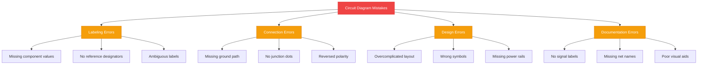
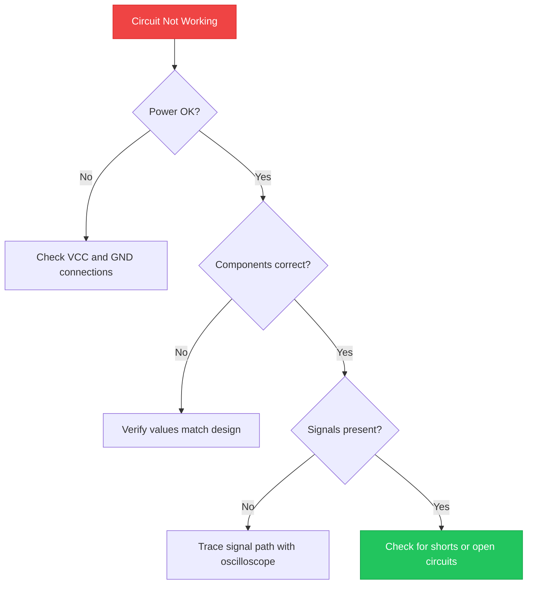

<b>أكثر 10 أخطاء شائعة في مخططات الدوائر الكهربائية هي: التسمية السيئة للمكونات، وفقدان توصيلات التأريض، وتجاهل استقطاب المكونات، وعبور الأسلاك بدون نقاط التوصيل، وتعقيد التصاميم بشكل مفرط، وحذف قيم المكونات، واستخدام رموز خاطئة، وفقدان خطوط الطاقة، وعدم وجود مراجع مرجعية، وتدفق إشارات غير واضح.</b> تُسبب هذه الأخطاء أعطالاً في وظائف الدوائر، وعيوبًا في التصنيع، وساعات طويلة من استكشاف الأخطاء وإصلاحها.



## المقدمة

مخطط الدائرة الكهربائية هو تمثيل بصري للدائرة الكهربائية. يستخدم رموزًا موحدة لإظهار كيفية توصيل المكونات مثل المقاومات، والمكثفات، و<a href="https://en.wikipedia.org/wiki/LED" rel="nofollow noopener" target="_blank">ال diodes العازلة (LEDs)</a> ببعضها البعض.

تخدم مخططات الدوائر ثلاثة أغراض:

1. **تخطيط التصميم** — رسم الدوائر قبل البناء
2. **التوثيق** — تسجيل كيفية عمل الدائرة للآخرين
3. **استكشاف الأخطاء** — تحديد المشاكل في الدوائر الموجودة

يُوفّر تجنب الأخطاء الشائعة الوقت، ويمنع تلف المكونات، ويُنتج دوائر موثوقة. الأخطاء العشرة أدناه تظهر في المخططات للمبتدئين والمتوسطين. إصلاحها يُحسّن وظائف الدائرة ويجعل المخططات أسهل في القراءة.

## فهم الأخطاء الشائعة في مخططات الدوائر الكهربائية

هناك 10 أخطاء شائعة في مخططات الدوائر الكهربائية تسبب أكبر قدر من المشاكل:

| الترتيب | الخطأ | مستوى التأثير |
|---------|-------|--------------|
| 1 | التسمية السيئة للمكونات | مرتفع |
| 2 | فقدان توصيلات التأريض | مرتفع |
| 3 | تجاهل استقطاب المكونات | مرتفع |
| 4 | عبور الأسلاك بدون نقاط التوصيل | متوسط |
| 5 | تعقيد المخططات بشكل مفرط | متوسط |
| 6 | حذف قيم المكونات | مرتفع |
| 7 | استخدام رموز خاطئة | متوسط |
| 8 | فقدان توصيلات خطوط الطاقة | مرتفع |
| 9 | عدم وجود مراجع مرجعية | متوسط |
| 10 | تدفق إشارات غير واضح | منخفض |

كل خطأ يُسبب مشاكل محددة أثناء <a href="/blog/simple-led-driver-circuit/" rel="noopener">بناء الدائرة واستكشاف الأخطاء</a>. تشرح الأقسام التالية كل خطأ وكيفية إصلاحه.

## الخطأ 1: التسمية السيئة للمكونات

تسمية المكونات بشكل صحيح هي أساس المخطط القابل للقراءة. بدون تسميات مناسبة، لا يمكن لأي شخص يقرأ المخطط تحديد المكونات أو قيمها أو وظيفتها.

### لماذا التسمية بالغة الأهمية

تُسبب التسمية السيئة ثلاث مشاكل:

1. **أخطاء التصنيع** — لا يمكن لفنيي التجميع تحديد الأجزاء الصحيحة
2. **تأخيرات التشخيص** — يُضيّع المهندسون الوقت في تتبع التوصيلات غير المسماة
3. **نقل المعرفة** — لا يمكن للموظفين الجدد فهم التصميم

### التسمية الجيدة مقابل السيئة

**مثال على تسمية سيئة:**


مشاكل هذا المخطط:

- `R` ليس له قيمة — أي مقاوم؟ 100Ω أم 100kΩ؟
- `LED` ليس له لون أو تصنيف جهد — أحمر (2V) أم أزرق (3.2V)؟
- لا توجد مراجع مرجعية — من غير الممكن إنشاء قائمة بالمواد

**مثال على تسمية جيدة:**


تتضمن التسميات الجيدة:

- **مرجع مرجعي** (R1, D1) — مُعرّف فريد لكل جزء
- **قيمة المكون** (330Ω) — مواصفات دقيقة
- **النوع أو التصنيف** (LED Red 2V) — يوضّح الوظيفة

> **القاعدة:** يحتاج كل مكون إلى مرجع مرجعي فريد وقيمتهم Critica.

## الخطأ 2: تجاهل وظيفة الدائرة

يجب أن تعكس مخطط الدائرة كيفية عمل الدائرة فعلياً. تجاهل وظيفة الدائرة يُنتج مخططات تبدو صحيحة على الورق لكنها تفشل في الواقع.

### كيف تؤثر الأخطاء على الوظيفة

تؤثر هذه الأخطاء بشكل مباشر على تشغيل الدائرة:

- **فقدان مقاومات السحب** — مدخلات وحدة التحكم micro تطفو وتُنتج قراءات عشوائية
- **عدم وجود مكثفات فصل** — تتلقى ICs طاقة ضوضائية وتتعطل
- **قواطع الجهد الخاطئة** — تتجاوز مستويات الإشارة تقييمات المدخلات
- **فقدان تقييد التيار** — تُحترق الـ LEDs والترانزستورات

### نصائح لاستكشاف الأخطاء وإصلاحها

اتبع هذه العملية عندما لا تعمل الدائرة:

1. **التحقق من توصيلات الطاقة** — تحقق من وصول VCC وGND إلى كل IC
2. **التحقق من قيم المكونات** — تأكد من تطابق المقاومات والمكثفات مع التصميم
3. **اختبار مسارات الإشارة** — استخدم جهاز الأوسيلوسكوب لتتبع الإشارات عبر كل مرحلة
4. **البحث عن الدوائر القصيرة** — اختبر الاتصالات غير المقصودة بين المسارات



## الخطأ 3: تعقيد المخططات بشكل مفرط

المخططات البسيطة أسهل في القراءة والبناء والتشخيص. تعقيد المخططات بعناصر غير ضرورية أو توصيلات فوضوية أو تفاصيل مفرطة يجعل المخططات الكهربائية صعبة المتابعة.

### أهمية البساطة

يسبب المخطط المعقد:

- **أخطاء القراءة** — تتضيع التوصيلات المهمة في الفوضى
- **أخطاء البناء** — يفهم المُجمّعون التخطيط بشكل خاطئ
- **تأخيرات الصيانة** — يستغرق استكشاف الأخطاء وقتاً أطول

### أمثلة على المخططات المبسطة

**النهج المعقد:**

رسم كل طول مسار، وشكل المكون الفعلي، وتفاصيل التثبيت في المخطط الكهربائي.

**النهج المبسط:**

استخدام الرموز المعيارية، والتوجيه النظيف، والمجموعات المنطقية. التخطيط الفعلي ينتمي إلى أداة تصميم PCB، وليس إلى المخطط الكهربائي.

> **القاعدة:** تُظهر المخططات الكهربائية الاتصالات الكهربائية، وليس الت_physical placement. أبقِها نظيفة.

## استخدام أدوات البرمجيات لتجنب الأخطاء

تلتقط برامج تصميم الدوائر الحديثة الأخطاء قبل وصولها إلى ورشة العمل. توفر هذه الأدوات فحوصات آلية تمنع أكثر الأخطاء شيوعاً.

### برامج تصميم الدوائر الشائعة

| البرنامج | النوع | الميزة الرئيسية |
|----------|-------|-----------------|
| <a href="https://circuitdiagram.org/editor/" rel="noopener">Circuit Diagram Maker</a> | عبر المتصفح | مجاني، لا يتطلب تثبيت |
| <a href="https://www.kicad.org/" rel="nofollow noopener" target="_blank">KiCad</a> | سطح المكتب | مفتوح المصدر، سير عمل PCB كامل |
| <a href="https://easyeda.com/" rel="nofollow noopener" target="_blank">EasyEDA</a> | عبر المتصفح | متكامل مع مكونات LCSC |
| <a href="https://www.autodesk.com/products/electronics/overview" rel="nofollow noopener" target="_blank">Fusion 360 Electronics</a> | سطح المكتب | تصميم على مستوى احترافي |
| <a href="https://www.diptrace.com/" rel="nofollow noopener" target="_blank">DipTrace</a> | سطح المكتب | واجهة سهلة للمبتدئين |

### كيف تمنع أدوات البرمجيات الأخطاء

تمنع برامج التصميم الأخطاء من خلال:

1. **فحص القواعد الكهربائية (ERC)** — يُشير إلى الدبابيس غير المتصلة، والطاقة المفقودة، والدوائر القصيرة
2. **مكتبات المكونات** — توفر الرموز والطباع الصحيحة
3. **تسمية الشبكة** — تتبع الاتصالات عبر الأوراق تلقائياً
4. **إنشاء قائمة المواد (BOM)** — تسرد جميع المكونات مع القيم وأرقام الأجزاء
5. **التحكم في الإصدارات** — يتبع التغييرات ويسمح بالرجع

> **القاعدة:** قم بتشغيل ERC قبل الانتهاء من أي تصميم. أصلاح جميع الأخطاء، حتى those التي تبدو بسيطة.

## الأدوات البصرية وأهميتها

توضّح الأدوات البصرية المفاهيم المعقدة التي لا يمكن للنص فقط شرحها. مخطط أو جدول أو ملاحظة بصريّة في المكان المناسب توفر مئات الكلمات.

### كيف توضّح المخططات المفاهيم

تُحسّن الأدوات البصرية جودة مخططات الدوائر من خلال:

- **مخططات الكتل** — تُظهر بنية النظام العليا قبل المخططات التفصيلية
- **أسهم تدفق الإشارة** — تُشير إلى اتجاه حركة البيانات أو الطاقة
- **الترميز بالألوان** — يُميّز بين شبكات الطاقة (أحمر)، والأرض (أسود)، والإشارة (أزرق)
- **مربعات التعليقات التوضيحية** — تُبرز ملاحظات التصميم الحرجة أو التحذيرات

### أمثلة على الأدوات البصرية الفعالة

**مخطط كتلة لمصدر طاقة:**


**تعليقات تدفق الإشارة:**

```
MCU → Level Shifter → Driver IC → Motor
     3.3V          5V          12V
```

**تسميات الشبكة بالترميز بالألوان:**

```
VCC_RED = +5V power
GND_BLACK = Ground reference
SIG_BLUE = UART transmit
```

تجعل هذه الأدوات البصرية المخططات وثائق ذاتية. أي شخص يقرأ المخطط يفهم التصميم دون الحاجة إلى تفسيرات إضافية.

## مرجع سريع للأخطاء الشائعة

استخدم هذا الجدول للتحقق من مخططاتك مقابل أكثر 10 أخطاء شيوعاً:

| الخطأ | كيفية إصلاحه |
|-------|-------------|
| تسمية سيئة | أضف مراجع مرجعية وقيم لكل مكون |
| فقدان التأريض | تأكد من وجود مسار عودة كامل إلى GND لكل دائرة |
| تجاهل الاستقطاب | علّم الأノود (+) والكاثود (−) على الثنائيات وLEDs |
| عدم وجود نقاط التوصيل | أضف نقاط حيث تتصل الأسلاك فعلياً |
| التعقيد المفرط | أزل التفاصيل غير الضرورية؛ أبقِ المخططات نظيفة |
| فقدان القيم | اسرد جميع قيم المقاومات والمكثفات والمحثات |
| رموز خاطئة | استخدم رموز IEEE أو IEC المعيارية |
| فقدان خطوط الطاقة | أظهر توصيلات VCC وGND لكل IC |
| عدم وجود مراجع مرجعية | سمّ كل مكون R1, C1, D1, D1, U1 تسلسلياً |
| تدفق إشارات غير واضح | أضف أسهم تُظهر اتجاه البيانات أو الطاقة |

## الخلاصة

يُوفّر تجنب الأخطاء الشائعة في مخططات الدوائر الكهربائية الوقت، ويمنع تلف المكونات، ويُنتج تصاميم موثوقة. الأخطاء العشرة التي تمت تغطيتها — من التسمية السيئة إلى تدفق الإشارة غير الواضح — تُشكّل معظم أخطاء المخططات الكهربائية.

طبّق مبادئ التصميم هذه على كل مخطط دائرة:

- **سمّ كل مكون** بمرجع مرجعي وقيمة
- **تحقق من وظيفة الدائرة** قبل الانتهاء من التصميم
- **أبقِ المخططات بسيطة** وخالية من التفاصيل غير الضرورية
- **استخدم أدوات البرمجيات** مع فحص القواعد الكهربائية (ERC)
- **أضف أدوات بصرية** لتوضيح الأقسام المعقدة

لمزيد من نصائح تصميم الدوائر، اقرأ دليلنا <a href="/blog/circuit-diagram-for-beginners/" rel="noopener">مخططات الدوائر للمبتدئين</a> أو استكشف <a href="/blog/circuit-diagram-maker-best-practices/" rel="noopener">أفضل ممارسات مخططات الدوائر</a>.
