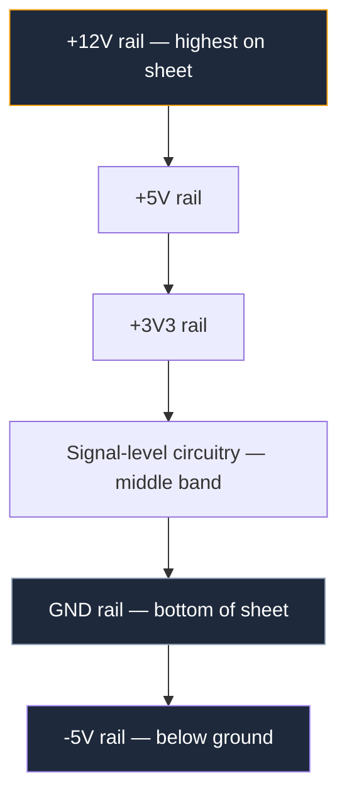
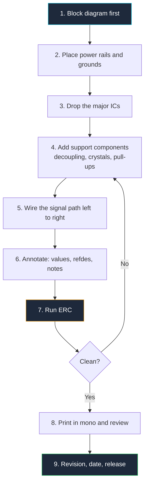

**مخطط الدائرة هو رسم يصف الاتصالات الكهربائية للدائرة باستخدام رموز موحدة بدلاً من صور القطع.** ليس خريطة لمواقع المكونات الفعلية، وليس صورة للجهاز النهائي. إنه لغة — ولكل لغة قواعد ولهجات واتفاقيات يتوقع الممرّرون المتمكنون منك أن تلتزم بها.

هذه النقطة الأخيرة هي ما يفتقده معظم الدروس. يمكنك حفظ كل رمز في المعيار ولا يزال إنتاج مخطط لا يريد أحد قراءته، لأن تصميم مخططات الدوائر يتكون من 30% رموز و70% انضباط في التخطيط. يغطي هذا الدليل كليهما. بنهاية الدليل ستعرف لماذا يتدفق الإشارة من اليسار إلى اليمين، ولماذا يكون التأريض في أسفل الصفحة، وماذا يعني كل شكل من المقاوم في المنطقة المختلفة من العالم، وكيف ترسم رسمًا يفهمه المراجع في 60 ثانية دون طرح أي سؤال.

## ما هو مخطط الدائرة بالفعل

أربعة مستندات مختلفة وصفها للعتاد نفسه، والخلط بينها هو الخطأ الأكثر شيوعًا للمبتدئين. كل واحد يجيب على سؤال مختلف.

| المستند | يجيب على السؤال | يُظهر | الاستخدام النموذجي |
| :--- | :--- | :--- | :--- |
| **المخطط الكتلي** | ما هي الوظائف الرئيسية؟ | مستطيلات مسمّاة وأسهم | مراجعات الهيكلية، أوراق المواصفات |
| **المخطط التخطيطي (مخطط الدائرة)** | كيف تتصل كهربائيًا؟ | رموز موحدة، شبكات، قيم | التصميم، تشخيص الأخطاء، المراجعة |
| **مخطط التوصيل** | أي سلك يذهب إلى أين ماديًا؟ | ألوان الأسلاك، مواقع الموصلات، حزم الأسلاك | التركيب الميداني، إصلاح السيارات |
| **تخطيط PCB** | أين يذهب النحاس؟ | بصمات، لوحات، آثار، طبقات | التصنيع |

يبحث المخطط التخطيطي عن *الوضوح المنطقي*. يبحث مخطط التوصيل عن *الدقة المادية*. يبحث تخطيط PCB عن *قابلية التصنيع والفيزياء*. عندما ترسم مخططًا، يُسمح لك صراحةً بوضع أي مكون حيث يقرأ الرسم بشكل أفضل، حتى لو كان القطعة الفعلية على الجانب الآخر من اللوحة. هذه الحرية هي كل ما يهم.

لاحظ أين يقع المخطط التخطيطي: كل ما يأتي بعده يتم إنتاجه منه. قائمة الشبكة — ملف النص الذي يخبر أداة PCB بأي أطراف تتصل بأي — يتم استخراجه مباشرة من رسمك. إذا كان المخطط خاطئًا، فاللوحة خاطئة، ولا مقدار من التوجيه الحذر سيںجدها. المخطط هو مصدر الحقيقة، ولهذا توجد الاتفاقيات أدناه.

## فلسفة الرسم التخطيطي

تم تعريف الهيئات المعيارية للرموز. لكنها لم تُعرّف الذوق الجيد. اتفاقيات التخطيط أدناه هي قواعد غير مكتوبة يتم فرضها من خلال المراجعة الأقرانية، وكل مهندس متمكن يطبقها تلقائيًا. اكسرها وسيكون رسمك صحيحًا تقنيًا لكنه غير مقروء وظيفيًا.

### القانون 1: يتدفق الإشارة من اليسار إلى اليمين

تدخل المدخلات من الحافة اليسارية. تحدث المعالجة في الوسط. تخرج المخرجات من الحافة اليمنى. هذا يعكس اتجاه القراءة للنصوص اللاتينية ويعني أن المراجع يمكنه تتبع التصميم في جولة واحدة دون التراجع.

الاستثناء الشرعي الوحيد هو مسار التغذية الراجعة. التغذية الراجعة تسير اصطلاحيًا من اليمين إلى اليسار، من المخرجات إلى المدخلات، وكل قارئ يفهم أن السلك الذي يسير بالاتجاه المعاكس فوق محدد التضخيم هو شبكة تغذية ارجاعية. نظرًا لأن هذه الاتفاقية قوية جدًا، يجب تجنب تشغيل أي إشارة *ليست تغذية ارجاعية* من اليمين إلى اليسار — سيتم قراءتها بشكل خاطئ.

### القانون 2: الطاقة في الأعلى، التأريض في الأسفل

المحور العمودي لصفحتك يمثل الجهد. الخط الأكثر إيجابية يقع في الأعلى، التأريض في الأسفل، والمصادر السالبة تحت التأريض. التيار، بㅎسب التقليد، يتدفق نحو الأسفل عبر الصفحة.

هذا يمنحك تشخيصًا مجانيًا: إذا كان سلك في رسمك يسير *صعودًا* إلى رمز التأريض، أو يشير رمز المصدر إلى الأسفل، فثمة خطأ في الرسم. تجعل هذه الاتفاقية مستويات الجهد واضحة بصريًا أيضًا. يمكن للقارئ النظرة على صفحتك أن يرى التسلسل الهرمي للمصدر دون قراءة أي تسمية.

> اجمع القانون 1 والقانون 2 وستحصل على نظام إحداثيات: يخبرك الموقع أفقيًا *أين في سلسلة الإشارة* يقع المكون، ويخبرك الموقع عموديًا *بأي جهد* يعمل. كل رمز تضعه يجب أن يحترم كلتا المحورين.

### القانون 3: صفحة واحدة، وظيفة واحدة

يجب أن تحتوي صفحة المخطط التخطيطي على كتلة وظيفية واحدة: مصدر الطاقة، أو MCU ومكوناته الداعمة، أو الواجهة الأمامية التناظرية. عندما تكبر كتلة عن صفحة، افصلها واربط الصفحات بم规避 منافذ مسمّاة بدلاً من تقليص الرموز وكبسها.

الاختبار العملي هو حجم الخط. إذا كنت تقليص النص لتتناسب مع مزيد من القطع على الصفحة، فأنت بالفعل بحاجة إلى صفحة ثانية منذ فترة. صفحة 40 مكونًا تُقرأ بوضوح تتفوق على صفحة 200 مكون تتطلب التكبير.

### القانون 4: المخطط هو مستند، وليس صورة

تحمل المخططات الاحترافية **كتلة عنوان**، تقليديًا في الزاوية اليمنى السفلية، تحتوي على:

- اسم المشروع واللوحة
- عنوان الصفحة ورقم الصفحة ("3 من 7")
- رقم المراجعة والتاريخ
- اسم المصمم
- اسم الشركة

هذا أهم مما يبدو. يتم طباعة المخططات وإرسالها بالبريد الإلكتروني والتقاطها على مختبر و.lصقها في عروض الشرائح. بدون رقم مراجعة، لا يمكنك معرفة ما إذا كان الرسم الم_NOP على النموذج الأولي يصف النموذج الأولي. المخططات غير المduckّنة وغير المversioned هي السبب الجذري لنصيب هائل من معاناة تشخيص العتاد.

### القانون 5: حسّن للقارئ، وليس للرامس

كل اختصار يوفر عليك الوقت أثناء الرسم يكلف شخصًا آخر وقتًا أثناء القراءة — غالبًا أنت، بعد ستة أشهر. تدوير رمز لتجنب انحناء السلك، ترك قيمة لأنها "واضحة"، إعادة استخدام اسم شبكة بشكل فضفاض: كلها إيداع صغير في حساب دين يتم تحصيله دائمًا.

افترض أن قارئك متعب، يعمل من طباعة بالأبيض والأسود، وغير م熟悉的 بالتصميم. ارسم لهذا الشخص.

## أساسيات الرسم التخطيطي: إعداد اللوحة

قبل وضع أي رمز واحد، احصل على اللوحة بشكل صحيح. هذه الإعدادات مملة وتحدد ما إذا كان رسمك يبدو احترافيًا.

**اعمل على شبكة، والتقط إليها.** شبكة المخطط التقليدية هي 0.1 بوصة (100 مل / 2.54 مم)، وهو يتوافق مع تقسيم أطراف ICs والفواصل عبر الثقوب. يجب أن يصل كل طرف رمز ونقطة نهاية كل سلك إلى تقاطع شبكة. الأطراف خارج الشبكة هي السبب الرئيسي لـ "أسلاك تبدو متصلة لكنها ليست كذلك" — فجوة من ألفي بوصة غير مرئية على الشاشة وقاتلة كهربائيًا.

**اختر حجم صفحة وابقِ عليه.** ANSI A (رسالة) أو ISO A4 للكتل الصغيرة، ANSI B/A3 للصفحات الأكثف. الحجم المتسق يعني مقياس طباعة متسق عبر مجموعة المستندات الكاملة.

**حافظ على الرموز بنسب واحدة.** خلط مثلث op-amp كبير مع مقاومات صغيرة يجعل الرسم يبدو عشوائيًا. معظم الأدوات تتعامل مع ذلك نيابةً عنك، لكنه ينكسر في اللحظة التي تبدأ فيها بتغيير حجم الرموز يدويًا لتتناسب الأمور.

**اترك مساحة فارغة.** استهدف ما يقرب من 40% من الصفحة فارغة. المساحة الفارغة هي ما يسمح للعين بتبع السلك. المخططات الكثيفة ليست مبهرة؛ إنها غير قابلة للمراجعة.

**استخدم أسلاك متعامدة فقط.** أفقي وعمودي بزوايا 90 درجة. الأسلاك المائلة مقبولة في رسم يدوي فقط وليس في أي مكان آخر — تجعل التوصيلات غامضة وتدمير الشبكة البصرية التي تساعد القراء على المسح.

## رموز الدوائر الإلكترونية: المجموعة الأساسية IEEE/ANSI

يحكم معياران. **IEEE 315** (منشور بشكل مشترك كـ ANSI Y32.2) هو المعيار الأمريكي وهو ما ستره في أوراق المواصفات الأمريكية والكتب التعليمية ومعظم المواد الهواة. **IEC 60617** هو المعيار الدولي، شائع في أوروبا وفي النشر الأكاديمي. كلاهما صحيح؛ خلطهما في رسم واحد ليس كذلك.

| المكون | IEEE 315 / ANSI (الأمريكي) | IEC 60617 (الدولي) |
| :--- | :--- | :--- |
| **المقاوم** | متعرج مع 3-4 قمم | مستطيل مفتوح بسيط |
| **المقاوم المتغير** | متعرج مع سهم مائل | مستطيل مع سهم مائل |
| **المحث** | سلسلة من الحلقات نصف الدائرية | سلسلة من الحلقات، أو مستطيل ممتلئ |
| **بوابات المنطق** | أشكال مميزة (D، منحني، مثلث) | مستطيلات بـ `&`، `≥1`، `=1` صفات |
| **المكثف** | لوحان متوازيان | لوحان متوازيان (متماثلان) |
| **الثنائي** | مثلث زائد شريط | مثلث زائد شريط (متماثلان) |

الاستنتاج: المكونات السلبية وبوابات المنطق تختلف بين المعيارين، بينما أشباه الموصلات موحدة إلى حد كبير. اختر المعيار الذي يقرأه جمهورك وحدد في كتلة العنوان إذا كان هناك أي شك. للمرجع البصري لكل رمز على حدة تتجاوز المجموعة الأساسية المغطاة هنا، راجع [جدول مرجع الرموز الإلكترونية](/blog/electrical-symbols/) المخصص.

### رموز المقاوم

المقاوم الأمريكي هو متعرج؛ المقاوم الدولي هو مستطيل بنسبة عرض إلى ارتفاع تبلغ تقريبًا 3:1. كلاهما مكونان بطرفين وغير محددي القطب، لذا لا تحمل ориنتلاصرية معنى كهربائيًا — لكنها تحمل معنى للقراءة. ارسم المقاومات التسلسلية أفقيًا على طول مسار الإشارة والمقاومات العلوية/السفلية عموديًا، حتى يرى القارئ الطوبولوجيا من الشكل وحده.

| النوع | تعديل الرمز | المعنى |
| :--- | :--- | :--- |
| **مقاوم ثابت** | متعرج أساسي أو مستطيل | تقييد تيار ثابت أو تحيز |
| **جهاز قياسность** | سهم يلمس الوسط | قسمة قابلة للتعديل بثلاثة أطراف |
| **مقاومة متغيرة** | سهم مائل عبر الجسم | مقاومة قابلة للتعديل بطرفين |
| **مقياس حرارة** | جسم بعلامة `θ` أو `t°` | مقاومة تعتمد على الحرارة |
| **مقاومة ضوئية (LDR)** | سهمان يشيران إلى الداخل | مقاومة تعتمد على الضوء |
| **ال fusible** | سلك يخترق أو يلتف حول الجسم | حماية من فائض التيار قابلة لل sacrificed |

### رموز المكثف

المكثف هو لوحان متوازيان بينهما فجوة تمثل العازل. التمييز الحاسم هو القطبية:

- **غير محدد القطب:** خطان مستقيمان متساويان الطول ومتعامدان. سيراميك، فيلم، معظم التوقيع. يمكن لأي طرف أن يواجه أي جهد.
- **محدد القطب (إلكتروليتيك/تانتاليوم):** خط مستقيم وخط منحني، حيث يمثل الخط المستقيم الطرف الموجب، بالإضافة إلى علامة `+` صريحة. عكس أحد هذه العلامات ينتج عنف أو دخان أو كلاهما.

ارسم دائمًا اللوحة الموجبة نحو الجهد الأعلى — للأعلى، عندما يكون المكثف بين خط وتأريض. عندما يمسح المراجع المكثفات كبيرة الحجم، يتحقق تمامًا من ذلك، وجعلها جميعًا في orienta统一 ي_seconds المراجعة لحظة.

**مكثفات التوقيع** تستحق عادة تخطيط محددة: ارسم كل واحد مجاورًا لطرف الطاقة الذي يخدمه في IC، وليس متكدسًا في زاوية الصفحة. المخطط هو أين ت communicated نية التصميم، و "هذه المكثفة 100 nF تنتمي إلى طرف 8 من U3" هي نية يحتاجها مهندس تخطيط PCB.

### رموز التأريض و VCC

رموز الطاقة هي الرموز الأكثر سوءًا استخدامًا في المخطط،mostly لأن هناك عدة رموز تأريض وهي ليست قابلة للاستبدال.

| الرمز | الاسم | المظهر | الاستخدام لـ |
| :--- | :--- | :--- | :--- |
| **التأريض المشترك** | العودة المشتركة | ثلاثة شرائح أفقية تقل عرضها | مرجع 0 فولت للدائرة |
| **التأريض الأرضي** | الأرض الحماية | سلك ينخفض إلى ثلاثة شرائح، أو ثلاثية مميزة | أرض التيار الرئيسي، موصل PE |
| **تأريض الهيكل** | اتصال الهيكل | سلك إلى شريحة مميزة/منسدلة | عودة الحاوية أو هيكل السيارة |
| **VCC / VDD** | مصدر إيجابي | شريحة للأعلى، سهم، أو لافتة مسمّاة | خط إيجابي يغذية الكتلة |
| **VEE / VSS** | مصدر سالب أو عودة | شريحة للأسفل أو لافتة مسمّاة | خط سالب أو خط مصدر FET |

`VCC` و `VDD` تاريخية، ليست عشوائية: **VCC** هو مصدر *المجمع* لأجهزة القطب الثنائي، **VDD** هو مصدر *التصريف* لأجهزة الترانزستور، و **VEE**/**VSS** هي خطوط الباعث والمصدر المقابلة. تتجاهل الرسوم الحديثة هذا التمييز غالبًا، لكن استخدامها بشكل صحيح يدل على الكفاءة لأي قارئ يلاحظ ذلك.

القواعد العملية لرموز الطاقة:

1. **لا ترسم أبدًا سلكًا طويلًا إلى رمز طاقة.** ارفقه مباشرة، للأعلى للمصادر وللأسفل للتأريض.
2. **سم خطوط التعددية صراحةً.** `+3V3`، `+5V`، `+12V`، `VBAT` — وليس `VCC` عامًا على كل رمز عندما توجد أربعة خطوط مختلفة.
3. **حافظ على فصل التأريضات.** إذا كان التصميم يحتوي على تأريضات تناظرية ومنفصلة، استخدم رموزًا مميزة أو أسماء شبكة مميزة (`AGND`، `DGND`) وارسم نقطة الربط المقصودة الواحدة حيث يلتقيان. دمجها بصمت في المخطط يضمن مشكلة ضوضاء ستمضي أسبوعًا في محاولة إصلاحها.
4. **استخدم رموز الطاقة بدلاً من رسم خطوط في كل مكان.** في صفحة كثيفة، تعبر عشرات من رموز `GND` المحلية بشكل أفضل من سلك تأريض طويل يتنقل عبر الرسم بالكامل.

### رموز أشباه الموصلات

| المكون | الرمز | قاعدة القراءة |
| :--- | :--- | :--- |
| **ثنائي** | مثلث يشير إلى شريط | يتدفق التيار التقليدي باتجاه المثلث؛ الشريب هو المهبط |
| **LED** |ثنائي بسهمين يشيران للخارج | الأسهم تشير دائمًا بعيدًا عن الجسم |
| **ثنائي Zener** | شريب بأطراف منحنية | يعمل بانحياز عكسي، لذا يشير "للخلف" عن قصد |
| **ثنائي Schottky** | شريب بطرف على شكل `S` | انخفاض أمامي منخفض، استرداد سريع |
| **ترانزستور NPN** | دائرة، شريب قاعدة، سهم باعث يشير للخارج | السهم للخارج = **N**ot **P**ointing i**N** |
| **ترانزستور PNP** | سهم باعث يشير نحو القاعدة | السهم للداخل = **P**ointing i**N** |
| **MOSFET N-channel** | شريب بوابة، شريب قناة، سهم جسم يشير للداخل | اتجاه السهم يحدد نوع القناة |
| **MOSFET P-channel** | سهم جسم يشير للخارج من القناة | يُرسم عادةً فوق الحمل، المصدر إلى الخط الإيجابي |

وجّه الترانزستورات بحيث يتدفق التيار من الأعلى إلى الأسفل: المجمع أو التصريف للأعلى، الباعث أو المصدر للأسفل. هذا يجعل طوبولوجيا محدد التضخيم أو المفتاح قابلة للتعرف عليها فورًا ويحافظ على التوافق مع القانون 2.

### رموز IC و Op-Amp

تستخدم الدوائر المتكاملة أحد التمثيلين، واختيار الصحيح هو قرار تصميم حقيقي.

**الكتلة المستطيلة.** تستخدم للمicrocontrollers والذاكرة والمنطق والمنظمات — أي شيء يتم وصف سلوكه الداخلي من خلال أطرافه بدلاً من طوبولوجبيته. قواعد كتلة IC جيدة:

- **رتب الأطراف حسب الوظيفة، وليس حسب الترتيب المادي.** المدخلات على اليسار، المخرجات على اليمين، الطاقة في الأعلى، التأريض في الأسفل. البصمة تتولى الشكل المادي للطرف؛ الرمز موجود ليكون مقروءًا. رمز DIP-8 يسرد الأطراف 1-4 على الجانب الأيسر فقط لأنها أطراف 1-4 هو فرصة ضائعة.
- **سم كل طرف بوظيفته**، وأضف رقم الطرف بخط أصغر بجانب الحدود.
- **اجمع الأطراف المتشابهة** بفجوة صغيرة بين المجموعات: جميع أطراف SPI معًا، جميع مدخلات ADC معًا.
- **حدد الأطراف المنخفضة النشط** بخط فوق، أو `n` ראשفي (`nRESET`)، أو شريحة رأسية (`/RESET`)، أو هاش تالية (`RESET#`). اختر اتفاقية واحدة لكل مشروع.
- **قسم ICs الكبيرة** إلى أجزاء رموز متعددة — MCU بن طرف 100 هو أكثر قابلية للقراءة كثلاث كتل منفصلة (نواة/طاقة، GPIO A، GPIO B) بدلاً من كتلة واحدة.

**المثلث.** يستخدم لـ op-amp والمحددات، حيث يCommunicate الشكل نفسه "محدد التضخيم". المدخل المعكوس محدد بـ `−` والمدخل غير المعكوس بـ `+`، القمة هي المخرج، وأطراف المصدر تدخل من الأعلى والأسفل. يمكنك تبديل مدخلات `+` و `−` عموديًا لجعل شبكة التغذية الراجعة أكثر وضوحًا — هذه ممارسة معيارية — لكن يجب عليك نقل التسميات معها. op-amp بشكل خاطئ هو الخطأ الرموز الأكثر تكلفة في التصميم التناظري.

تنتمي شبكات التغذية الراجعة إلى الفراغ البصري للمحدد نفسه: ارسم مقاومة التغذية الراجعة مباشرة فوق المثلث حتى يكون الحلقة واضحة. التفاصيل التخطيطية لـ op-amp ومحدد 555، بما في ذلك سؤال الكتلة الداخلية مقابل تخطيط الأطراف، مغطاة في [دليل دوائر المحدد والمذبذب](/blog/amplifier-and-oscillator-circuits/).

## محددات المرجع وقيم المكونات

رمز بدون محدد مرجعي وقيمة هو زينة. تتبع محددات المرجع ASME Y14.44 (خليفة IEEE 200)، وهي تستحق الحفظ:

| البادئة | المكون | البادئة | المكون |
| :--- | :--- | :--- | :--- |
| **R** | مقاوم | **U** | دائرة متكاملة |
| **C** | مكثف | **Q** | ترانزستور |
| **L** | محث | **D** | ثنائي، LED |
| **J** | منفذ / موصل | **P** | ستحم |
| **SW** | مفتاح | **K** | مولد |
| **Y** | بلورة، مذبذب | **T** | محول |
| **F** | fusible | **FB** | حبيبة فيرية |
| **TP** | نقطة اختبار | **JP** | جسر |

قم بترقيمها بترتيب القراءة — من اليسار إلى اليمين، من الأعلى إلى الأسفل، لكل صفحة. أنظمة الترقيم المبنية على الصفحة (سلسلة 100 في الصفحة 1، سسلسلة 200 في الصفحة 2) تجعل من الممكن العثور على أي قطعة فورًا في رسم متعدد الصفحات.

للقيم، استخدم **ترميز الحرف بدلاً من العلامة العشرية**، ممارسة رسم قديمة لا تزال صعبة لأنها متينة:

| اكتب | يعني | بدلاً من |
| :--- | :--- | :--- |
| `4k7` | 4.7 kΩ | `4.7k` |
| `R47` | 0.47 Ω | `0.47R` |
| `100n` | 100 nF | `0.1uF` |
| `1u5` | 1.5 µF | `1.5uF` |
| `2M2` | 2.2 MΩ | `2.2M` |

السبب بسيط: النقطة العشرية عرضها نقطة واحدة. تختفي في الفاكس أو النسخة أو لقطة الشاشة المضغوطة أو الطباعة منخفضة الدقة — و `4.7k` تُقرأ بشكل خاطئ كـ `47k` تؤدي إلى دائرة معطلة. حرف لا يمكن أن يختفي.

أضف المعايير التي تحدد القطعة فعليًا: تصنيف الجهد على الكبيرة، تصنيف الطاقة على أي مقاوم فوق 1/4 واط، التحمل على أي شيء في مسار التوقيت أو الدقة، العازل على السيراميك في الدوائر التناظرية (`X7R` مقابل `C0G` يغير السلوك بشكل كبير). كل شيء آخر ينتمي إلى فاتورة المواد، وليس الرسم.

## الأسلاك، التوصيلات، والشبكات

كيف تتعامل مع الاتصالات يحدد ما إذا كان رسمك جديرًا بالثقة.

**نقاط التوصيل إلزامية.** نقطة مملوءة عند تقاطع سلك تعني "متصلة كهربائيًا". لا نقطة تعني "تقاطع، غير متصل". كل أداة جدية تضع هذه تلقائيًا، لكن يجب عليك التحقق منها، لأن نقطة مفقودة هي دائرة مفتوحة غير مرئية.

**لا ترسم أبدًا توصيل أربعة طرق.** أربعة أسلاك تلتقط في نقطة مع نقطة هو قانوني وممارسة سيئة. إذا فقدت تلك النقطة — طباعة سيئة، artifact JPEG، بصمة — يتغير معنى الرسم بصمت من "الأربعة متصلة" إلى "زوجان يتقاطعان". بدلاً من ذلك، اجعل الاتصال في توصيلتين ثلاثيتين T-بخط شبكة واحد. الآن تombaie الطوبولوجيا أي تكرار، وال نقطة المفقودة واضحة بصريًا.

| الموقف | الرسم الصحيح |
| :--- | :--- |
| سلكان مconnected | T-junction بنقطة مملوءة |
| سلكان يتقاطعان، غير متصل | تقاطع بسيط، بدون نقطة، بدون قفزة |
| أربعة أسلاك عند عقدة واحدة | توصيلتين T متداخلتين، وليس نقطة واحدة |
| طرف غير مستخدم عن قصد | علامة `X` صريحة غير متصلة |
| اتصال بعيد المدى | تسمية شبكة مسماة عند كلا الطرفين |

**استخدم تسميات الشبكة للمسافات.** سلكان يحملان التسمية `SPI_CLK` متصلان كهربائيًا حتى لو كانا على صفحات مختلفة. تسميات الشبكة أفضل من الأسلاك الطويلة لأي شيء يتجاوز ثلث الصفحة تقريبًا، وتجعل الرسم موثقًا ذاتيًا. سم الشبكات حسب وظيفتها (`MOTOR_PWM`، `VBAT_SENSE`)، وليس حسب موقعها.

**استخدم الباص للمجموعات المتوازية.** ثمانية خطوط بيانات مرسومة كـ `D[0..7]` على باص واحد سميك أنظف بكثير من ثمانية أسلاك متوازية، وهي المعيار لواجهات microcontrollers والذاكرة العريضة.

**حدد غير المتصلات صراحةً.** علامة `X` على طرف غير مستخدم تخبر المراجع "لقد فكرت في هذا الطرف واخترت تركه عائمًا". طرف غير متصل عاري يخبرهم "ربما نسيت هذا الطرف". نفس النتيجة الكهربائية، نتيجة مراجعة مختلفة تمامًا — وكل فحص قواعد كهربائية (ERC) سيشير إلى الثاني.

## أفضل الممارسات للرسوم النظيفة والمقروءة

قائمة تحقق مجمعة. شغّلها قبل أن تعلن أي مخطط مكتملًا.

1. **التقط كل شيء إلى الشبكة.** كل طرف، نهاية كل سلك، بلا استثناء.
2. **إشارة من اليسار إلى اليمين، طاقة من الأعلى إلى الأسفل.** احتفظ بالتوجيه من اليمين إلى اليسار للتغذية الراجعة الحقيقية.
3. **أسلاك متعامدة فقط.** زوايا 90 درجة، لا مائلة.
4. **قلل التتقاطعات.** التقاطع هو ضريبة صغيرة على القارئ. حرّك الرموز، أو دور الكتل، أو حوّل إلى تسميات شبكة حتى تصبح التتقاطعات نادرة.
5. **لا توصيلات أربعة طرق.** اجعلها متداخلة في توصيلات T.
6. **اجمع حسب الوظيفة** وامنح كل مجموعة مساحة فارغة مرئية أو صندوق حدود مسمى.
7. **محدد وقيمة على كل قطعة.** غير قابل للتفاوض.
8. **مكثفات التوقيع بجانب أطرافها**، وليس متكدسة في زاوية.
9. **حجم واتجاه نص متسق.** جميع التسميات أفقيًا، أو بالكثير بدوران اتجاه واحد متسق. النص المقلوب غير مقبول.
10. **علّق على غير الواضح.** ملاحظة نصية تشرح *لماذا* المقاوم 4k7 توفر للمهندس التالي — غالبًا أنت — ساعة من الهندسة العكسية. تدعم المخططات النص الحر؛ استخدمه.
11. **غير متصلات صريحة** على كل طرف غير مستخدم عن قصد.
12. **أكمل كتلة العنوان** بالمراجعة والتاريخ، في كل مرة.
13. **شغّل ERC** وحل كل تحذير، أو حدد لماذا التحذير مقبول.
14. **اطبعه بالأبيض والأسود** واقرأه. إذا نجا، فهو مكتمل. إذا كان اتصالًا لا معنى له إلا بالألوان، فهو ليس كذلك.

> اختبار 60 ثانية: أعطِ مخططك لشخص لم ير التصميم قط. إذا لم يتمكن من تحديد مدخلات الطاقة، الكتلة المعالجة الرئيسية، والمخرجات في دقيقة واحدة، فقد فشل التخطيط بغض النظر عن صحته الكهربائية.

معظم عيوب المخططات تندرج في قائمة قصيرة من المخالفين المتكررين — نقاط توصيل مفقودة، قيم غامضة، أطراف عائمة، معايير رموز مختلطة. قمنا بفهرستها مع الإصلاحات في [10 أخطاء شائعة في مخططات الدوائر](/blog/common-circuit-diagram-mistakes/)، ومجموعة القواعد المختصرة موجودة في [أفضل ممارسات تصميم المخطط](/blog/circuit-diagram-maker-best-practices/) دليل.

## سير عمل قابل للتكرار، من اللوحة الفارغة إلى المخطط المراجع

الترتيب مهم. المهندسون الذين يضعون المكونات أولًا ويفكرون في الطاقة لاحقًا ينتهي بهم المطاف بخطوط طاقة متشابكة بشكل محرج عبر تخطيط مكتمل — البصمة البصرية للمخطط الم rushed. أنشئ الخطوط أولاً، ثم علّق الدائرة عليها.

الخطوة 5 تستحق التأكيد: وصّل *مسار الإشارة* أولًا، بالترتيب، قبل توصيل أي شيء آخر. إذا كنت able تتبع المدخلات إلى المخرجات في جولة واحدة واضحة من اليسار إلى اليمين، فالرسم مقروء بالفعل بنسبة 80%. كل ما يليه — شبكات التحيز، التوقيع، الحماية — ي attach إلى العمود الفقري هذا.

**[ابدأ رسم مخططك الخاص الآن.](/)** يقوم المحرر بالالتقاط على شبكة 100 مل، ويوفر مكتبة رموز IEEE/ANSI الموصوفة أعلاه، ويضع نقاط التوصيل تلقائيًا، حتى تتمكن من ممارسة هذه الاتفاقيات دون محاربة الأداة. تصفح [مكتبة رموز المكونات](/components/) الكاملة لترى ما هو متاح قبل أن تبدأ.

## ستة مجالات، ست مجموعات من اتفاقيات الرسم

القواعد أعلاه عالمية. فوقها، لكل عائلة دوائر تعابير تخطيطية خاصة — الطريقة المحددة التي يرسم بها المهندسون المتمكنون هذا النوع من الدوائر. هذه الأدلة الستة تتعمق في كل منها.

### 1. بوابات المنطق والأساسيات الرقمية

المخططات الرقمية تتعلق بشكل الرمز وانتشار الإشارة، وليس بقيم المكونات. يغطي [دليل دوائر بوابات المنطق](/blog/logic-gate-circuit-diagrams/) الأشكال الأمريكية المميزة (المستطيل المسطح لـ AND، الدرع المنحني لـ OR، والمثلث والفقاعة لـ NOT) مقارنة بمستطيلات IEC/DIN مع صفات `&` و `≥1`، ثم يربطها في دوائر حقيقية: بوابة NOT مبنية من ترانزستور واحد، بوابات XOR و NAND من ترانزستورات منفصلة، فلوب فلوب مت.cross-connected، وعدادات ثنائية متعددة المراحل بما في ذلك عداد 4017 العشري. التخطيط الرقمي لديه قاعدة إضافية واحدة تستحق المعرفة مسبقًا — مدخلات البوابات تذهب إلى اليسار ولا تتcross أبدًا، لأن مدخل بوابة متcross هو أصعب خطأ في رسم رقمي.

### 2. مصادر الطاقة والتحويل

المخططات الكهربائية هي المكان الوحيد حيث يجب أن ي传达 الرسم معلومات *مادية*: العزل، التسلل، وسعة التيار. يغطي [دليل تصميم دوائر مصدر الطاقة](/blog/power-supply-circuit-diagrams/) رسم حاجز العزل كخط عمودي مرئي يفصل بين الجانب العالي الجهد والجانب المنخفض، رموز المحول مع اتفاقيات النقطة الصحيحة، مقوّمات الجسر المرسومة كماسات بدلاً من أربعة ثنائية متناثرة، وضع مكثفات الفلتر، وكتل منظمات سلسلة 78xx. يغطي أيضًا اتفاقية الخط السميك مقابل الرفيع للمسارات عالية التيار في SMPS، محوّل الخفض، مصدر الطاقة بدون محول، والتصميمات ذات الخط المزدوج.

### 3. المحددات، المذبذبات، والمحددات

المخططات التناظرية تعيش أو تموت على وضوح التغذية الراجعة. يغطي [دليل دوائر المحدد والمذبذب](/blog/amplifier-and-oscillator-circuits/) متى ترسم محدد 555 ككتلة داخلية مقابل صندوق بسيط للأطراف، كيف تخطط مقاومات التغذية الراجعة حتى تكون الحلقة واضحة بصريًا، وكيف ترسم شبكات RC المحددة للتردد حتى تكون مكونات التوقيت قابلة للتعرف عليها بنظرة. تشمل التخطيطات النماذج محددات LM386 و TDA2030 الصوتية، مولدات الموجة الجيبية، محددات أحادية الاستقرار، ودوائر العداد والمدة الزمنية المدفوعة بـ 555.

### 4. المستشعرات، التبديل، والحماية

هذا هو الحدود بين العالم الحقيقي وmicrocontroller الخاص بك، وهو المكان الذي تفعل فيه اتفاقيات المخطط أكثر عملًا. يغطي [دليل دوائر المستشعرات والحماية](/blog/sensor-and-protection-circuit-diagrams/) رسم مقاومات السحب العلوية والسفلية حتى تكون وظيفتها واضحة من الموقع وحده، مقسمات الجهد لـ LDRs و مقاييس الحرارة، مراحل التبديل MOSFET، ودوائر الإزالة المضطربة المبنية من فلاتر RC أو محفّزات Schmitt. يغطي أيضًا طوبولوجيات الحماية — القطبية العكسية، فخاخ الفائض الجهد — حيث رسم مسار التيار بوضوح هو ما يسمح للمراجع بالتحقق من أن الدائرة تحمي أي شيء فعليًا.

### 5. القياس والاختبار

البنية التحتية للاختبار هي الجزء الأقل رسمًا في معظم المخططات. يغطي [دليل دوائر القياس والاختبار](/blog/measurement-test-circuit-diagrams/) وضع وتوسيع نقاط الاختبار `TP`، رسم مقاومات الشانت مع اتصالات الاستشعار صريحة (اتصالات Kelvin هي مشكلة رسم قبل أن تكون كهربائية)، وتمثيل مقياس تذبذبات أو مقياس متعدد كحمل في مخططك. يشمل اختبارات الاستمرارية، متابعات الجهد op-amp، مراحل أخذ العينات وretention، ومقياسات الجهد بشرائح LM3914.

### 6. Microcontrollers والأنظمة المدمجة

الرسوم الأكثر تطلبًا. يغطي [دليل تخطيط مخططات microcontroller](/blog/microcontroller-circuit-diagrams/) تقسيم أطراف MCU الكبيرة عبر أجزاء رموز متعددة، استخدام ترميز الباص لتجميع المجموعات المتوازية، تخطيط مذبذبة البلورة مع مكثفات الحمولة، التوقيع لكل طرف، وتوصيل الأجهزة الخارجية — محركات موتور H-bridge، مصفوفات المستشعرات، المولدات، والعروض. تشمل الأمثلة النماذج روبوتات متابعة الخط، مشاريع Raspberry Pi، وأنظمة إدارة البطارية.

## اختيار برنامج مخطط الدوائر المناسب

الأداة التي ترسم بها تشكل الرسم بقدر ما تشكل الاتفاقيات. محرر مخطط جيد يفرض الالتقاط بالشبكة، يضع نقاط التوصيل تلقائيًا، ويقدم مكتبات رموز IEEE/ANSI و IEC الكاملة حتى لا تضطر أبدًا إلى رسم مقاوم من الصفر. سيء يسمح لك بوضع المكونات خارج الشبكة، ونسيان التوصيلات، وتصدير صور تتلاشى عند الطباعة.

ما يجب تقييمه قبل الالتزام بأداة:

| الميزة | لماذا تهم | ما يجب البحث عنه |
| :--- | :--- | :--- |
| **التقاط الشبكة** | الأطراف خارج الشبكة تنتج دوائر مفتوحة غير مرئية | إلزامي التقاط 100 مل (2.54 مم)، لا يمكن تعطيله |
| **مكتبة الرموز** | رسم الرموز من الصفر يضيع الوقت وي introduce أخطاء | مجموعات IEEE/ANSI و IEC مضمنة، بالإضافة إلى رموز مخصصة قابلة للتعديل |
| **إدارة التوصيلات** | النقاط المفقودة هي أكثر عيوب المخططات شيوعًا | وضع تلقائي على التوصيلات T، إزالة تلقائية عند الحذف، تحقق بصري |
| **ERC (فحص القواعد الكهربائية)** | يلتقط الأخطاء الهيكلية قبل المراجعة | تعارضات الأطراف، أطراف غير متصلة، عدم تطابق خطوط الطاقة |
| **تنسيقات التصدير** | يجب أن يخرج المخطط من المحرر في النهاية | SVG، PNG، PDF على الأقل؛ تصدير قائمة الشبكة لتسليم PCB |
| **التعاون** | تحدث المراجعات في فرق | روابط مشتركة، threads تعليقات، سجل الإصدارات |
| **التكلفة** | ميزانيات محددة حقيقية | مستوى مجاني بميزات كاملة، أو شراء لمرة واحدة بدون اشتراك |

تمتلك الأدوات المبنية على المتصفح ميزة كبيرة لعمل المخططات: لا تثبيت، مشاركة فورية عبر URL، وعرض متسق عبر أنظمة التشغيل. كان الثمن تاريخيًا هو عمق الميزات، لكن المحررات الويب الحديثة تضاهي الآن أدوات سطح المكتب من حيث مكتبات الرموز، فرض الشبكة، وجودة التصدير التي تحتاجها فعليًا لعمل المخطط.

**[جرّب Circuit Diagram Maker مجانًا.](/)** لا تثبيت، لا حاجة لحساب. يوفر المحرر مكتبة رموز IEEE/ANSI الكاملة، والتقط على شبكة 100 مل، ووضع تلقائي لنقاط التوصيل، وتصدير SVG و PNG و PDF — كل ما يوصي به هذا الدليل، ومضة بواسطة الأداة نفسها.

## تنسيقات التصدير: إخراج مخططك

مخطط يعيش فقط داخل محرر واحد هو مخطط لا يمكن مراجعته أو طباعته أو تضمينه في التوثيق أو تسليمه لتخطيط PCB. يجب أن ينتهي كل جلسة رسم بتصدير، والتنسيق الذي تختاره يعتمد على الجمهور.

| التنسيق | الأفضل لـ | نقاط القوة | القيود |
| :--- | :--- | :--- | :--- |
| **SVG** | تضمين الويب، التوثيق، التكبير لأي حجم | متجه — دقة لا نهائية، حجم ملف صغير، قابل للتعديل في Illustrator/Inkscape | ليست جميع أدوات PCB تستورد SVG مباشرة |
| **PNG** | العروض، رسائل Slack/Teams، المشاركة السريعة | raster بخلفية شفافة، عرض عالمي | يعتمد على الدقة؛ ي blurry إذا تم التصدير بـ DPI منخفض |
| **PDF** | الطباعة، مرفقات البريد الإلكتروني، حزم المراجعة الرسمية | بحجم الصفحة، يحافظ على الطبقات، نص قابل للبحث | حجم ملف كبير على الصفحات المعقدة |
| **قائمة الشبكة (JSON/CSV)** | تسليم تخطيط PCB | اتصال مقروء آليًا، قابل للاستيراد بواسطة KiCad/Eagle/Altium | غير مقروء للبشر؛ يتطلب أداة PCB لعرضه |
| **LTSpice raw** | المحاكاة | قابل للمحاكاة مباشرة، يحافظ على معايير المكون | تنسيق خاص، غير عالمي |

سير العمل العملي: صدّر SVG لأي شيء سيظهر في التوثيق أو الموقع، PNG للمشاركة السريعة حيث تكفي الدقة، و PDF لحزم المراجعة الرسمية. صدّر دائمًا بدقة 2× أو 3× إذا كنت تستخدم PNG للطباعة — مخطط حاد على الشاشة لكنه blurry على الورق قد فشل في غرضه الأساسي.

قبل التصدير، شغّل ERC مرة أخيرة. مخطط تم تصديره بتحذيرات لم يتم حلها هو سجل دائم لعيوب معروفة.

## مخططات الدوائر مقابل مخططات التوصيل: معرفة الفرق

هذا التمييز يreevé المبتدئين أكثر من أي مفهوم آخر في توثيق الإلكترونيات، والخلط بينهما في مشروع حقيقي قد يكون مكلفًا.

يُظهر **مخطط الدائرة** كيف يتصل المكونات *كهربائيًا*. يجيب على السؤال: "ما هي الدائرة؟" الأسلاك هي خطوط مجردة قد لا تشبه التوجيه المادي. يتم وضع المكونات حيث يقرأ الرسم بشكل أفضل. قد يبدو مقاوم بجانب IC حتى لو كانت القطعة الفعلية على بعد سنتيمترات على اللوحة. المخطط هو مصدر الحقيقة للتصميم، تشخيص الأخطاء، والمراجعة.

يُظهر **مخطط التوصيل** كيف يتصل المكونات *ماديًا*. يجيب على السؤال: "كيف أوصّل هذا فعليًا؟" ألوان الأسلاك، تخطيط أطراف الموصلات، توجيه الحزم، ومواقع المكونات المادية هي المعلومات التي تهم. مخطط التوصيل هو ما يستخدمه الفني الميداني لتثبيت أو استكشاف الأخطاء أو إصلاح نظام.

| السمة | مخطط الدائرة | مخطط التوصيل |
| :--- | :--- | :--- |
| **الجمهور الأساسي** | المصممون، المراجعون، المู่شئون | المثبّتون، الفنيون، المهندسون الميدانيون |
| **تمثيل السلك** | خطوط مجردة، طول غير مهم | التوجيه الفعلي، الطول والألوان مهمة |
| **وضع المكون** | محسّن للقراءة | يعكس الموقع الفعلي |
| **يُظهر** | الاتصال الكهربائي، قيم المكونات، أسماء الشبكات | ألوان الأسلاك، تخطيط أطراف الموصلات، مسارات الحزم |
| **يستخدم لـ** | التصميم، المحاكاة، تخطيط PCB | التركيب، الصيانة، الإصلاح |
| **الرموز المعيارية** | رموز مخطط IEEE/ANSI/IEC | تمثيلات صورية، أكواد ألوان الأسلاك |

القاعدة الحاسمة: لا تستخدم أبدًا مخطط الدائرة حيث يلزم مخطط التوصيل، ولا تستخدم أبدًا مخطط التوصيل حيث يلزم مخطط الدائرة. مخطط يُعطى لفني ميداني هو عديم الفائدة — لا يمكنه تحديد ألوان الأسلاك أو التوجيه منه. مخطط توصيل يُعطى لمخطط PCB هو عديم الفائدة أيضًا — لا يمكنه استخراج اتصال الشبكة منه.

تحتاج معظم المشاريع إلى الاثنين. ارسم المخطط التخطيطي أولًا (هو التصميم)، ثم اشتق مخطط التوصيل منه لتوثيق التركيب والخدمة.

## الأسئلة الشائعة

**هل مخطط الدائرة نفس مخطط التخطيطي؟**
نعم. "مخطط الدائرة"، "مخطط التخطيطي"، و"المخطط" تستخدم بشكل متبادل للرسم الذي يُظهر الاتصالات الكهربائية باستخدام رموز موحدة. "مخطط التوصيل" *ليس* مرادفًا — يُظهر توجيه الأسلاك الفعلي، الألوان، ومواقع الموصلات بدلاً من الاتصالات المنطقية.

**هل يجب أن أستخدم رموز IEEE/ANSI أو IEC؟**
طابق جمهورك. استخدم IEEE 315/ANSI (مقاومة متعرجة) للقراء الأمريكيين، أوراق المواصفات الأمريكية، ومعظم المواد الهواة والتعليمية. استخدم IEC 60617 (مقاومة مستطيلة) للمستندات التقنية الأوروبية والدولية. لا تخلط بينهما أبدًا في رسم واحد.

**لماذا يجب أن يكون التأريض في أسفل المخطط؟**
لأن المحور العمودي يمثل الجهد. مع الخط الأكثر إيجابية في الأعلى والتأريض في الأسفل، يتدفق التيار التقليدي نحو الأسفل عبر الصفحة وتصبح علاقات الجهد مرئية من الهندسة وحدها. يمنحك أيضًا فحص أخطاء مجاني: أي سلك يصعد إلى رمز التأريض هو رسم خاطئ.

**كيف أعرف ما إذا كان سلكان يتقاطعان متصلين؟**
ابحث عن نقطة توصيل مملوءة. النقطة تعني متصل؛ لا نقطة تعني تقاطعًا بدون اتصال. هذا بالضبط لماذا توصيلات أربعة طرق سيئة — معنى العقدة بالكامل يعتمد على نقطة صغيرة تعيش التكرار.

**ما الفرق بين VCC و VDD؟**
`VCC` هو جهد مصدر المجمع، ورث من دوائر ترانزستور القطب الثنائي. `VDD` هو جهد مصدر التصريف، من دوائر FET و CMOS. `VEE` و `VSS` هي خطوط الباعث والمصدر المقابلة. تستخدم معظم المخططات الحديثة بشكل فضفاض، لكن في التصميمات المختلطة لا يزال التمييز يحمل معلومات مفيدة.

**هل أحتاج إلى رسم مكثفات التوقيع على المخطط؟**
نعم، دائمًا، وبجانب الطرف الذي تخدمه. التوقيع هو قرار تصميم — القيمة، الكمية، ووضع كل طاقة — والمخطط هو أين يتم تسجيل هذه النية لمهندس التخطيط. استبعادها لأن "الجميع يعرف لإضافتها" يُنتج ب.magic لوحات بدونها.

**كم مكونًا تنتمي إلى صفحة واحدة؟**
لا يوجد رقم ثابت، لكن إذا كنت تقليص الرموز أو النص لتتناسب الأمور، فقد تجاوزت الحد. حوالي 40-60 مكونًا لكل صفحة مع مساحة فارغة واسعة مريحة لمعظم القراء. افصل حسب الوظيفة واربط الصفحات بمنافذ مسمّاة.

**ما هو ERC ولماذا يهم؟**
فحص القواعد الكهربائية يمسح مخططك بحثًا عن أخطاء هيكلي: أطراف غير متصلة، مخرجات ت drove مخرجات، أطراف طاقة بلا مصدر، محددات مكررة. يلتقط نصفًا كبيرًا من العيوب الحقيقية في ثوانٍ. شغّله قبل كل مراجعة وحل أو حدد كل تحذير.

## تجميعها معًا

تصميم مخطط الدوائر يتأثر بعدد قليل من القرارات المطبقة بشكل متسق. اختر معيار رموز واحد وابقِ عليه. ضع المدخلات على اليسار والمخرجات على اليمين. ضع المصادر في الأعلى والتأريض في الأسفل. التقط بالشبكة، حافظ على الأسلاك متعامدة، ضع نقاط التوصيل، تجنب العقد الأربعة، سم كل قطعة، وأكمل كتلة العنوان. لا شيء منها صعب. كله عادة.

أسرع طريقة لبناء تلك العادة هي الرسم. خذ دائرة تفهمها بالفعل — LED ومقاوم تقييد كافي — وارسمها ثلاث مرات: واحدة بشكل متسرع، واحدة بتطبيق كل قود في هذا الدليل، وواحدة من الذاكرة بعد يوم. الفرق بين الرسم الأول والثاني هو ما يراه المراجع، والثالث يخبرك بالاتفاقيات التي التصقت فعليًا.

للممارسة العملية، يعمل [دليلنا خطوة بخطوة لقراءة مخططات الدوائر](/blog/how-to-read-a-circuit-diagram-step-by-step-guide/) بنفس الاتفاقيات بالعكس، وهي أسرع طريقة لدمجها.

**[ابدأ رسم مخططك الخاص الآن.](/)** لا تثبيت، لا حساب — لوحة مقيدة بالشبكة، مكتبة رموز IEEE/ANSI الكاملة، نقاط توصيل تلقائية، وتصدير صورة أو قائمة شبكة عندما يكون رسمك جاهزًا ليصبح لوحة.
