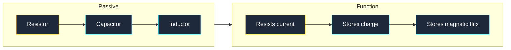
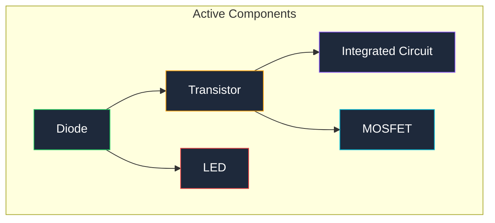
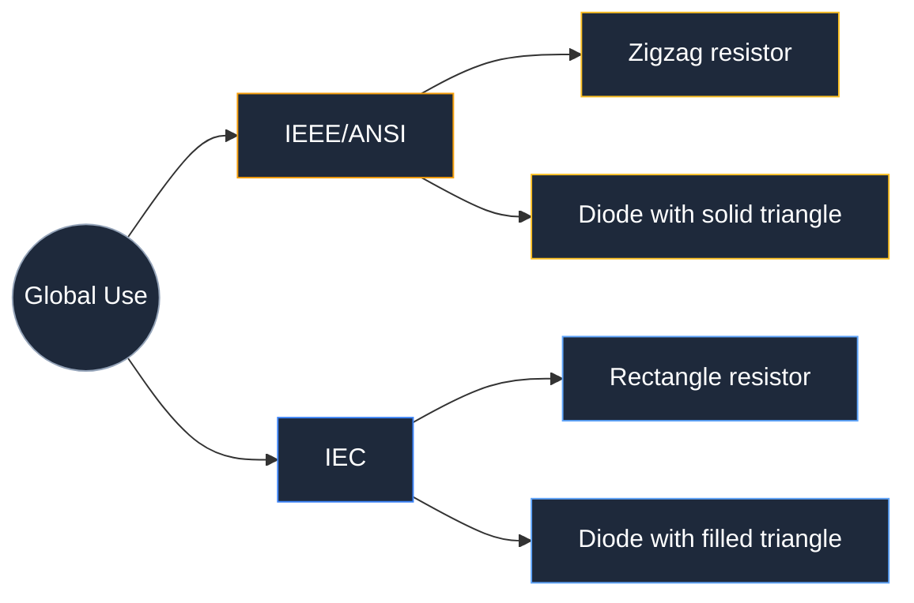

**الرموز الكهربائية هي علامات رسومية معيارية تُستخدم لتمثيل المكونات الفردية في مخططات الدوائر الكهربائية.** كل رمز كهربائي يقابل نوع مكون واحد، مما يتيح للمهندسين والفنيين والهواة حول العالم قراءة وبناء نفس الدائرة من نفس الرسم. بدون هذه الرموز، سيتطلب كل مخطط كهربائي صورة فوتوغرافية أو رسمًا مُعلَّمًا لكل مكون، مما يجعل المخططات غير مقروءة عند التوسع.

هناك ما يقارب 30 رمزًا أساسيًا تغطي 90% من تصميمات الدوائر اليومية. تظهر الرموز المتبقية في مجالات متخصصة مثل توزيع الطاقة أو التحكم الصناعي أو هندسة RF. يُصنِّف هذا الدليل كل رمز حسب فئته، ويُظهر الشكل البصري الدقيق لكل رمز، ويشرح متى يجب استخدامه.

## رموز المكونات السلبية (المقاومات والمكثفات والمحولات)

المكونات السلبية لا تُضخِّم الإشارة. إما أنها تُقاوم تدفق التيار، أو تخزن الطاقة في مجال كهربائي، أو تخزن الطاقة في مجال مغناطيسي. تبدأ كل مخططات الدوائر بهذه المجموعات الثلاث من الرموز.

### رمز المقاومة

رمز المقاومة في IEEE (المعهد الأمريكي للمعايير الوطنية) هو خط متعرج ذو 3 أو 4 قمم. رمز المقاومة في IEC (اللجنة الكهروتقنية الدولية) هو مستطيل بسيط. كلاهما صحيح؛ المنطقة تُحدِّد أيهما ستراه.

| نوع المقاومة | شكل الرمز | الوصف |
|---|---|---|
| **مقاومة ثابتة** | خط متعرج (IEEE) أو مستطيل (IEC) | مكون ذو طرفيين يُقيِّد التيار |
| **مقاومة متغيرة** | خط متعرج بسهم يخترقه | مقاومة تتغير قيمتها باستخدام زر أو برغي |
| **ب抵抗 المتغيرة** | متعرج بسهم على الوصلة المركزية | مقاومة متغيرة ذات 3 أطراف تُستخدم كمحول للجهد |
| **مقياس حرارة (Thermistor)** | متعرج بخط أفقي وذيل منحني | مقاومة تتغير مقاومتها مع درجة الحرارة |
| **مقياس ضوء (Photoresistor)** | متعرج بسهمين يشيران إلى الداخل | مقاومة تتغير مقاومتها مع مستوى الإضاءة |
| **ن FC Fuse** | خط متعرج بسلك يمر عبره مباشرة | جهاز أمان يذوب ويفتح الدائرة عند التيار الزائد |

### رمز المكثف

يُظهر رمز المكثف لوحتين متوازيتين مفصولتين بفراغ. يمثل الفراغ المادة العازلة بين اللوحتين.

| نوع المكثف | شكل الرمز | الوصف |
|---|---|---|
| **غير مُستقطب** | خطان متوازيان مستقيمان بفراغ | يُستخدم لاقتران AC والتصفيك والتوقيت |
| **مُستقطب (إلكتروليتي)** | خط مستقيم وخط منحني مع علامة + | نوع مُستقطب؛ يجب تثبيته بالقطبية الصحيحة |
| **مكثف متغير** | خطان متوازيان بسهم يخترقهما | مكثف قابل للضبط، شائع في دوائر ضبط الراديو |

### رمز الملف اللولبي (المحث)

رمز الملف اللولبي هو سلسلة من الحلقات نصف الدائرية تمثل لفافة سلك. وجود خط فوق الحلقات يُشير إلى ملف ب仁核 حديدي.

| نوع الملف اللولبي | شكل الرمز | الوصف |
|---|---|---|
| **ملف ب仁核 هوائي** | 3 إلى 5 حلقات | ملف بدون مادة مغناطيسية |
| **ملف ب仁核 حديدي** | حلقات بخط أفقي فوقها | ملف ب仁核 حديدي يزيد المُعامل الذاتي |
| **ملف ب仁核 فيريت** | حلقات بخطين متوازيين فوقها | ملف ب仁核 فيريت للاستخدام عالي التردد |

## رموز المكونات النشطة (الأشباه الموصلات)

تتطلب المكونات النشطة مصدر طاقة ويمكنها التحكم في تدفق التيار أو تضخيمه. تشكّل الأشباه الموصلات المجموعة الأكبر من رموز المكونات النشطة.

### رموز الدايود

تُسمح الـ Diode بتدفق التيار في اتجاه واحد فقط. الرمز مثلث يشير نحو خط مسطح. يشير المثلث من Anode (الإيجابية) إلى Cathode (السلبية).

| نوع الـ Diode | شكل الرمز | الوصف |
|---|---|---|
| **Diode عادي** | مثلث بخط عند الرأس | صمام باتجاه واحد للتيار الكهربائي |
| **Diode Zener** | مثلث بخط ذي أطر مائلة (منحني عند الطرفين) | Diode مصممة للتوصل العكسي عند جهد انهيار محدد |
| **Diode Schottky** | مثلث بخط على شكل S | Diode سريعة التبديل بانخفاض جهد أمامي منخفض |
| **LED** | مثلث Diode بسهمين يشيران إلى الخارج | Diode تُصدر الضوء عند التحيز الأمامي |
| **Photodiode** | مثلث Diode بسهمين يشيران إلى الداخل | Diode تُولِّد التيار عند التعرض للضوء |
| **Diode TVS** | Diode بخط منحني عند الطرفين | مكبوت جهد انتقائي يُثبّت نتوءات الجهد |

### رموز الترانزستور

يُبدِّل الترانزستور الإشارة أو يُضخِّمها. هناك عائلتان رئيسيتان: الترانزستورات ثنائية القطب (BJTs) وترانزستورات تأثير المجال أكاسيد المعادن (MOSFETs).

| نوع الترانزستور | شكل الرمز | الوصف |
|---|---|---|
| **NPN BJT** | دائرة بخط عمودي وخطين مائلين وسهم على المُصدِّر يشير إلى الخارج | مفتاح يتحكم بالتيار؛ تيار القاعدة يتحكم في تدفق المُجمِّع إلى المُصدِّر |
| **PNP BJT** | دائرة بخط عمودي وخطين مائلين وسهم على المُصدِّر يشير إلى الداخل | مثل NPN لكن باتجاه تيار عكسي |
| **N-channel MOSFET** | خط عمودي بثلاثة أطراف (Gate, Drain, Source) وسهم يشير إلى Interfaces على الـ Substrate | مفتاح يتحكم بالجهد بمعاوقة إدخال عالية جدًا |
| **P-channel MOSFET** | خط عمودي بثلاثة أطراف وسهم يشير إلى الخارج على الـ Substrate | مثل N-channel لكن بقطبية عكسية |
| **JFET (N-channel)** | خط عمودي بثلاثة أطراف وسهم يشير إلى الداخل على الـ Gate | مقاومة تتحكم بالجهد تُستخدم في الدوائر التناظرية |

### رموز IC

رمز IC هو مستطيل بملصقات أطراف على كل جانب. لا يُظهر رمز IC الدائرة الداخلية؛ يُظهر فقط وظائف الأطراف.

| نوع IC | شكل الرمز | الوصف |
|---|---|---|
| **Op-amp** | مثلث بخمسة أطراف (+in, -in, V+, V-, out) | مُضخِّم تناظري يُستخدم في تشكيل الإشارة |
| **IC رقمي** | مستطيل بأطراف مرقمة | بوابة منطقية أو مُتحكم ضئيل أو شريحة ذاكرة |
| **مُنظِّم الجهد** | مستطيل بثلاثة أطراف (in, out, ground) | شريحة تحافظ على جهد خرج ثابت |

## رموز مصادر الطاقة والأرض

تحتاج كل دائرة إلى مصدر للطاقة الكهربائية وإشارة أرض مشتركة. تظهر هذه الرموز على حواف كل مخطط.

| رمز المصدر | شكل الرمز | الوصف |
|---|---|---|
| **مصدر جهد DC (بطارية)** | خطوط متوازية بأطوال متناوبة (طويل = +، قصير = -) | مصدر تيار مستقيم (DC) مصنوع من خلية واحدة أو أكثر |
| **مصدر جهد AC** | دائرة بموجة جيبية داخلها | مصدر تيار متردد (AC) مثل الطاقة الكهربائية الرئيسية |
| **أرض (أرضي)** | ثلاثة خطوط أفقية بعرض متناقص | اتصال فيزيائي بالأرض |
| **أرض الهيكل** | ثلاثة خطوط مائلة للأسفل تشكّل مثلثًا مقلوبًا | الهيكل أو الإطار المعدني للجهاز |
| **أرض الإشارة** | مثلث ممتلئ أو مفتوح يشير إلى الأسفل | نقطة مرجعية مشتركة لقياسات الإشارة |
| **VCC / VDD** | خط أفقي قصير بعلامة فوقه | خط الإمداد الإيجابي لـ ICs |
| **VSS / GND** | خط أفقي قصير بعلامة تحته | خط الإمداد السلبي أو الأرضي |

## رموز الاتصال والتقاطع

تُظهر هذه الرموز كيفية توصيل الأسلاك والكابلات والطرفيات في المخطط. الحصول عليها بشكل صحيح يمنع الدوائر القصيرة واللوحات الخاطئة التوصيل.

| رمز الاتصال | شكل الرمز | الوصف |
|---|---|---|
| **تقاطع سلك (نقطة)** | نقطة صلبة عند تقاطع خطين | سلكان ملحومان ومتصلان عند هذه النقطة |
| **تقاطع سلك (بدون نقطة)** | خطان يتقاطعان بدون نقطة | سلكان يمرّان فوق بعضهما بدون اتصال |
| **طرفي / نقطة اختبار** | دائرة صغيرة مفتوحة عند نهاية السلك | نقطة اتصال للمستektors أو الأسلاك الخارجية |
| **موصِّل** | زوج من الخطوط المتوازية أو شكل شبه منحرف | زوج من السُّوكات يُستخدم لتوصيل الكابلات |
| **وصلة** | نقطة على سلك بفرعين أو أكثر | نقطة يتشارك فيها عدة أسلاك عقدة كهربائية واحدة |

## رموز الأجهزة الميكانيكية والأجهزة الطرفية

تُمثّل هذه الرموز المكونات التي تُحدث حركة ميكانيكية أو تُصدر صوتًا أو توفر مؤشرات بصرية.

| الجهاز | شكل الرمز | الوصف |
|---|---|---|
| **مفتاح (SPST)** | خط متقطّع بنقطة مفصلة | مفتاح قطب واحد رمي واحد تشغيل/إيقاف |
| **زر ضغط** | خط أفقي فوق لمستين بقابض عمودي | مفتاح بتلامس لحظي يُغلق عند الضغط |
| **لفائف ملف التحويل** | مستطيل بخط مائل عبره (IEC) أو حلقات (IEEE) | مفتاح كهروميكانيكي يُفعّل بلفافة |
| **محرك** | دائرة بالحرف M داخلها | جهاز يُحوّل الطاقة الكهربائية إلى حركة دورانية |
| **مكبر صوت** | شكل قمع أو مخروط | مُحوِّل يُحوّل الإشارات الكهربائية إلى صوت |
| **مصباح** | دائرة بصليب داخلها | مصباح كهربائي أو مصباح إضاءة |
| **محوّل** | لفائف ملفين بخطوط متوازية بينهما | يُنقل طاقة AC بين الدوائر بمستوى جهد مختلف |
| **ن FC Fuse** | مستطيل بسلك عبره (IEC) أو خط متعرج (IEEE) | جهاز أمان يفتح الدائرة عندما يتجاوز التيار التصنيف |

## الفروقات بين معايير IEEE وIEC: ما هو الفرق؟

المعياران السائدان هما IEEE/ANSI (المعهد الأمريكي للمعايير الوطنية) وIEC (اللجنة الكهروتقنية الدولية). رموز IEEE أكثر شيوعًا في الولايات المتحدة، بينما تُستخدم رموز IEC في أوروبا ومعظم بقية العالم.

أكبر ثلاث فروقات بصرية بين IEEE وIEC هي المقاومة والأرض والدايود.

| المكون | رمز IEEE/ANSI | رمز IEC | الفرق الرئيسي |
|---|---|---|---|
| **مقاومة** | خط متعرج | مستطيل | متعرج مقابل صندوق |
| **أرض (أرضي)** | ثلاثة خطوط أفقية | خط أفقي واحد بخط عمودي مُ Compression | أكثر تفصيلاً مقابل مُبسَّط |
| **دايود** | مثلث مفتوح يشير نحو خط | مثلث ممتلئ يشير نحو خط | مفتوح مقابل ممتلئ |
| **لفائف ملف التحويل** | حلقات (بشكل ملف) | مستطيل بخط مائل | ملف مقابل تمثيل صندوق |
| **ن FC Fuse** | خط متعرج بسلك عبره | مستطيل بسلك عبره | متعرج مقابل صندوق |

أي من المعيارين ليس "أفضل". اختر المعيار الذي يناسب جمهورك والصِق به في جميع أنحاء المخطط. خلط الرموز من المعيارين على ورقة واحدة يُربك القارئ.

## مؤشرات مراجع المكونات (R1, C1, U1, D1)

كل رمز كهربائي في المخطط له مؤشر مرجع يربط الرمز بقائمة القطع. يستخدم المؤشر حرفًا مُقدّمًا يليه رقم تسلسلي.

| الحرف المُقدّم | نوع المكون | مثال |
|---|---|---|
| **R** | مقاومة | R1, R2, R14 |
| **C** | مكثف | C1, C2, C10 |
| **L** | ملف لولبي | L1, L2 |
| **D** | دايود أو LED | D1, D2 |
| **Q** | ترانزستور | Q1, Q2 |
| **U** | IC | U1, U2 |
| **J** | موصِّل أو مأخذ | J1, J2 |
| **SW** | مفتاح | SW1, SW2 |
| **K** | ملف تحويل | K1 |
| **F** | ن FC Fuse | F1 |
| **T** | محوّل | T1 |
| **X** | مذبذب بلوري | X1 |
| **Y** | مذبذب بلوري (بديل) | Y1 |

عند قراءة مخطط، يربط مؤشر المرجع كل رمز كهربائي بال Entries المقابلة في قائمة المواد (BOM). R1 في المخطط يقابل R1 في BOM، التي تسرد رقم القطعة الدقيق والقيمة والتحمل.

## كيفية رسم الرموز الكهربائية في مخطط الدائرة

رسم الرموز الكهربائية بدقة مهم. خط متعرج مُرخِّص لا يُغلق بشكل صحيح قد يُخلط مع ن FC Fuse. نقطة مفقودة عند تقاطع قد تُحوّل عقدة متصلة إلى دائرة مفتوحة.

خمسة قواعد تُنتج مخططات واضحة ومقروءة:

1. استخدم نفس ثقل الخط لجميع الرموز على نفس الورقة
2. ارسم كل مقاومة كمتعرج بأربعة قمم (IEEE) أو مستطيل واضح (IEC) بدون فجوات
3. ضع نقاطًا عند كل تقاطع تلتقي فيه 3 أسلاك أو أكثر
4. علِّم كل مؤشر مرجع بجانب رموزه، وليس داخله
5. حافظ على تباعد منتظم بين الأسلاك المتوازية لا يقل عن 3 مم على الشاشة

يمكنك رسم كل رمز كهربائي مذكور هنا في ثوانٍ باستخدام [ Circuit Diagram Maker](https://www.circuitdiagrammaker.com/). يستخدم المحرر معيار IEEE/ANSI افتراضيًا ويتيح لك وضع كل رمز بنقرة واحدة.

## أخطاء شائعة في الرموز الكهربائية يجب تجنبها

خمسة أخطاء تظهر بشكل متكرر في مخططات الطلاب والهواة. كل منها يسبب فشلًا حقيقيًا في البناء:

1. خلط أسهم الترانزستور NPN وPNP: سهم NPN يشير إلى الخارج (ليس إلى الداخل)، سهم PNP يشير إلى الداخل
2. حذف علامة اتجاه الدايود: بدون الخط، يبدو الرمز كسلك
3. تبديل قطبية المكثف الكهربائي: اللوحة المنحني دائمًا هي القطبة السالبة
4. رسم رمز الأرض على كل طرف يتصل بالأرض بدلاً من استخدام ملصقات الشبكة: هذا يُزدحم المخطط بأسلاك مكررة
5. نسيان نقطة عند التقاطع: سلكان يتقاطعان بدون نقطة غير متصلتين، مما يسبب دوائر مفتوحة أثناء التجميع

## الأسئلة الشائعة

**ما هو الرمز الكهربائي الأكثر شيوعًا في مخطط الدائرة؟**

رمز الأرض (GND) هو الرمز الكهربائي الأكثر شيوعًا. يظهر مرة واحدة على الأقل في كل مخطط وغالبًا عدة مرات. توفر الأرض مرجع 0V الذي تُقاس ضده جميع الجهدات الأخرى. بدون رمز الأرض، لا تملك المخطط نقطة مرجعية ولا يمكن للدائرة أن تعمل كما هو مقصود.

**كم عدد الرموز الكهربائية التي أحتاج معرفتها لقراءة معظم المخططات؟**

ما يقارب 30 رمزًا أساسيًا تغطي 90% من مخططات الدوائر اليومية. أهم 10 رموز هي: المقاومة والمكثف والملف اللولبي والدايود والـ LED والترانزستور NPN وMOSFET والـ Op-amp والمفتاح والأرض. بمجرد التعرف على هذه الرموز العشرة، يمكنك تتبع مسار الإشارة عبر معظم الدوائر للمبتدئين والمتوسطين.

**ماذا يعني R1 في مخطط الدائرة؟**

R1 هو مؤشر مرجع. الحرف R يُعرِّف المكون كمقاومة، والرقم 1 يميّزه عن المقاومات الأخرى (R2, R3، وما إلى ذلك). نفس النمط ينطبق على كل نوع من المكونات: C1 هو أول مكثف، U1 هو أول IC، D1 هو أول دايود، وهكذا.

**لماذا تبدو رموز المقاومة مختلفة في المخططات الأمريكية والأوروبية؟**

تستخدم الولايات المتحدة معيار IEEE/ANSI الذي يمثل المقاومة كخط متعرج. تستخدم أوروبا معيار IEC الذي يمثل المقاومة كمستطيل بسيط. كلا الرموز يعنيان نفس المكون. المنطقة والمعيار الرسومي يُحدّدان أي شكل ستصادفه.

**كيف أعرف أي اتجاه يجب أن أضع فيه الدايود في الدائرة؟**

يشير المثلث في رمز الدايود في اتجاه تدفق التيار التقليدي. الخط المسطح عند رأس المثلث يُعلّم الكاثود (القطبة السالبة). يتدفق التيار من الأنود (قاعدة المثلث) عبر الدايود ويخرج من الكاثود (جانب الخط). في المخطط، يتصل الأنود نحو الإمداد الإيجابي ويتصل الكاثود نحو الأرض أو الحِمل.

## الخاتمة والخطوات التالية

غطى هذا الدليل كل مجموعة رئيسية من الرموز الكهربائية: المكونات السلبية (المقاومات والمكثفات والمحولات)، المكونات النشطة (الدايودات والترانزستورات والـ ICs)، مصادر الطاقة والأرض، رموز الاتصال والتقاطع، والأجهزة الميكانيكية والطرفية. تعلمت أيضًا الفروقات الرئيسية بين معايير IEEE وIEC وكما تربط مؤشرات المراجع الرموز بالقطع الفعلية.

لتطبيق هذه الرموز عمليًا، افتح [ Circuit Diagram Maker](https://www.circuitdiagrammaker.com/) وضع أهم 10 رموز شائعة على مخطط فارغ. أنشئ دائرة LED بسيطة بمقاومة ومفتاح وبطارية. تتبع مسار التيار من الخط الإيجابي عبر كل رمز إلى الأرض. هذا التمرين يُعزز كل مجموعة رموز في هذا الدليل.

للاطلاع الأعمق على قراءة المخططات الكاملة، راجع دليلنا حول [ كيفية قراءة مخطط دائرة](/blog/how-to-read-a-circuit-diagram-step-by-step-guide/). عندما تكون مستعدًا لبناء مشروعك الأول الحقيقي، ارسم المخطط في [ محرر مخططات الدائرة](/editor/) وصدّره كصورة أو قائمة أطراف للوحة التجريبية.
