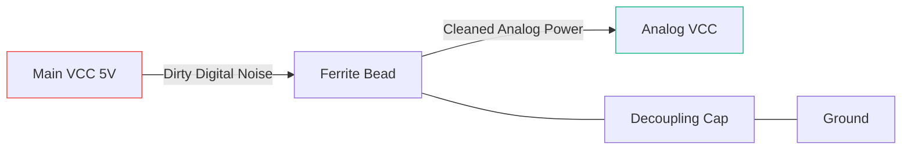

تخلق الإلكترونيات الرقمية عالية السرعة الكثير من الضوضاء الكهرومغناطيسية. بدون تخفيف، يتسرب هذا التداخل عالي التردد إلى خطوط تناظرية حساسة أو يشع إلى الخارج، مما يتسبب في فشل جهازك بشكل مذهل في اختبار انبعاثات لجنة الاتصالات الفيدرالية (FCC).

السلاح الأساسي ضد هذا التدخل هو **حبة الفريت**. إن فهم رمزها التخطيطي وموضعها يحدد ما إذا كانت دائرتك تعمل بشكل نظيف أو تغرق في الضوضاء الخاصة بها.

## 1. تصور رمز حبة الفريت

تعمل حبة الفريت بطبيعتها مثل مغوٍ شديد الضياع. ولهذا السبب، يرتبط رمزه التخطيطي ارتباطًا وثيقًا برمز المحث القياسي، ولكنه مصمم للتأكيد على دوره المحدد.

```mermaid
graph LR
    A[Inductor Basis] --> B(Standard Inductor Symbol)
    A --> C(Rectangle Over Wire)
    B -.-> D(Addition of a dashed line or solid bar)
    D --> E[IEEE Ferrite Symbol]
    C --> F[IEC Ferrite Symbol]
    
    style E fill:#0f172a,stroke:#3b82f6
    style F fill:#0f172a,stroke:#10b981
```

| السمة | معيار IEEE/ANSI | معيار اللجنة الكهروتقنية الدولية | ملاحظات |
| :--- | :--- | :--- | :--- |
| **الشكل** | سلسلة من أنصاف الدوائر مع شريط/صندوق | كتلة مستطيلة صلبة | متطابقة وظيفيا في النتيجة |
| **بادئة التسمية** | `الفيس بوك` | `FB` أو `L` | يوصى بشدة باستخدام `FB` لمنع الخلط بينه وبين محاثات الطاقة |
| **وحدة القياس** | أوم (Ω) عند ميغاهيرتز محدد | أوم (Ω) عند ميغاهيرتز محدد | على عكس المحاثات المقاسة بالهنري (H) |

> **التمييز الحاسم:** لا تقم أبدًا بتقييم حبة الفريت بواسطة الحث. يتم تحديد حبات الفريت من خلال **مقاومتها (بالأوم) عند تردد محدد** (عادةً 100 ميجاهرتز).

## 2. آليات التشغيل الأساسية

لماذا نستخدم حبة الفريت بدلا من مغو قياسي؟

* **محث** يخزن الطاقة ويعيدها إلى الدائرة. إنه شديد التفاعل ويحافظ على الطاقة.
* تم تصميم **حبة الفريت** بشكل فعال لتكون *فاقدة*. عند الترددات العالية، يتصرف مثل المقاوم، حيث يحول الضوضاء عالية التردد غير المرغوب فيها مباشرة إلى حرارة.

| نطاق التردد | سلوك حبة الفريت | النتيجة على الدائرة |
| :--- | :--- | :--- |
| **التردد المنخفض/التيار المستمر** | تحت 1 ميغاهيرتز | يعمل كسلك بسيط (~0 Ω). تمر طاقة التيار المستمر بحرية. |
| **تردد الرنين** | شديدة التفاعل | يخزن الطاقة لفترة وجيزة. |
| **تردد عالي** | أكثر من 50 ميجا هرتز+ | يعمل مثل المقاوم ذو القيمة العالية. يحجب ويبدد ضوضاء الترددات اللاسلكية كحرارة. |

## 3. أفضل الممارسات لوضع المخططات

يتطلب الاستخدام الصحيح لرمز FB وضعًا استراتيجيًا. يمكن أن يؤدي صفع حبات الفريت بشكل عشوائي على مخطط إلى تفاقم حالة الرنين والرنين.

### فصل مصادر الطاقة (مرشحات Pi)

الاستخدام الأكثر شيوعًا لرمز "FB" هو عزل الطاقة الرقمية القذرة عن الطاقة التناظرية النظيفة.

في التكوين أعلاه (جزء من مرشح Pi)، تمنع حبة الفريت العابرين عالي التردد من دخول خط AVCC، بينما يقوم المكثف بتحويل أي تموج متبقي إلى الأرض.

### قمع خط البيانات EMI

عند توجيه كبلات بيانات USB طويلة أو آثار HDMI، غالبًا ما يتم وضع رموز "FB" في سلسلة بالقرب من الموصل. وهذا يضمن أن السلك الطويل المكشوف فعليًا لا يعمل كهوائي ويصدر ضوضاء وحدة المعالجة المركزية عبر الغرفة.

لإضافة حبة فريت إلى مخططك التالي، افتح **[محرر مخطط الدائرة الكهربائية](/editor/)**، وابحث عن "الفريت"، وحدد تصنيف المعاوقة!