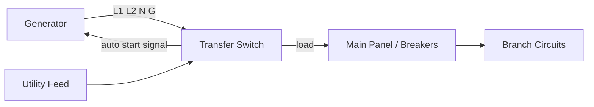
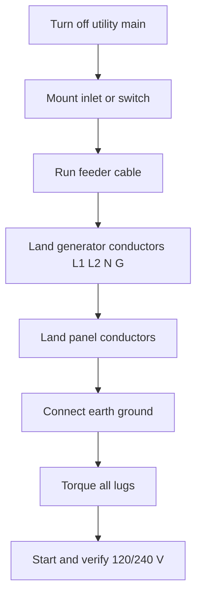
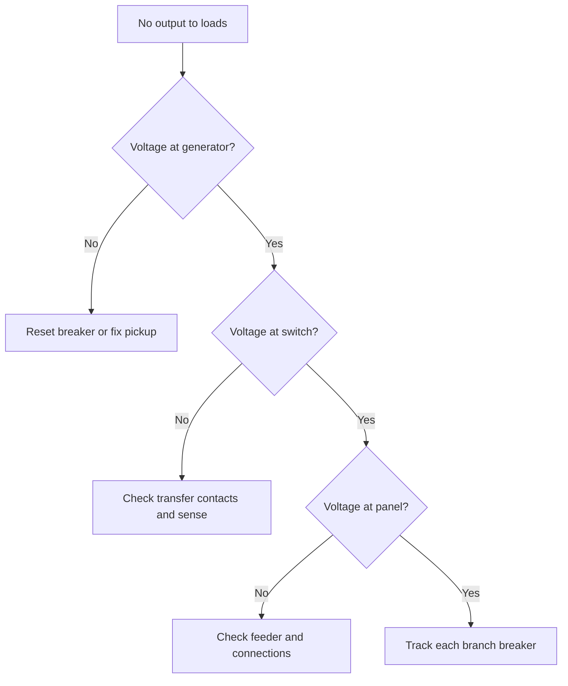

## مقدمة في مخططات توصيل المولدات

**<b>مخطط توصيل المولد هو المخطط الكهربائي الذي يوضح كيفية توصيل المولد بمفتاح النقل ولوحة القواطع والحمل الذي يغذّيه المولد.</b> يرسم المخطط كل موصل وموصلات ومفتاح وقاطع في مسار الطاقة من خرج المولد إلى الدوائر التي يغذّيها.

توجّه مخططات التوصيل ثلاث مهام: تركيب المولد، والصيانة الدورية، وتشخيص الأعطال. يُظهر المخطط الدقيق نقطة الاتصال الصحيحة لكل سلك حتى لا يخمن الشخص الذي يقوم بتوصيل الوحدة.

هناك ثلاث فوائد رئيسية لاستخدام المخططات الدقيقة:

1. التأكد من صحة التوصيل لكل موصل قبل تشغيل الطاقة
2. منع التغذية العكسية، والتي تشغّل خطوط الكهرباء أثناء الانقطاع
3. تقليل وقت استكشاف الأخطاء عندما لا تعمل دارة ما

تُستخدم المخططات لأربع أغراض رئيسية: تركيب مولدات الاحتياط، وتوصيل المولدات المحمولة، وتوصيل مفتاح النقل، وتوزيع الطاقة على الدوائر الفرعية. المكونات الأساسية هي مفتاح النقل التلقائي (ATS)، وقواطع الدوائر، ومجموعة القفل، ومدخل المولد، وتوصيل التأريض والمحايد.

## المكونات الأساسية لتوصيل المولدات

**<b>خمسة مكونات أساسية تشكل مسار الطاقة في نظام مولد المنزل: مفتاح النقل، والقاطع الرئيسي،مجموعة القفل، ومدخل المولد، وتوصيل التأريض والمحايد.</b>**

<table>
  <thead>
    <tr><th>المكون</th><th>الوظيفة في عملية التوصيل</th></tr>
  </thead>
  <tbody>
    <tr>
      <td><strong>مفتاح النقل التلقائي (ATS)</strong></td>
      <td>يكتشف فقدان طاقة الكهرباء، ويشغل المولد، وينقل الحمل إلى تغذية المولد.</td>
    </tr>
    <tr>
      <td><strong>القاطع الرئيسي للدارة</strong></td>
      <td>يقفل اللوحة للصيانة وحماية الدوائر الفرعية من الحمل الزائد.</td>
    </tr>
    <tr>
      <td><strong>مجموعة القفل</strong></td>
      <td>غطاء ميكانيكي يمنع القاطع الرئيسي للكهرباء والقاطع الرئيسي للمولد من الإغلاق في نفس الوقت.</td>
    </tr>
    <tr>
      <td><strong>مدخل المولد</strong></td>
      <td>موصل مقاوم للعوامل الجوية على الجدار الخارجي حيث يتصل كابل المولد.</td>
    </tr>
    <tr>
      <td><strong>توصيل التأريض والمحايد</strong></td>
      <td>قضيب تأريض وربط يحافظان على استقرار النظام ويحملان تيار العطل بأمان إلى الأرض.</td>
    </tr>
  </tbody>
</table>

تتغير المكونات حسب نوع المولد. يدعم المولد المحمول لوحة صغيرة من خلال مدخل 30 أمبير (A) ومجموعة القفل. المولد الثابت الدائم يتزامن مع ATS بقدرة 200 A وقواطع نقل خاصة به. يُظهر مخطط التوصيل تقييم كل وحدة حتى يختار المُركِّب حجم القاطع المناسب وقطر الموصل.

## تعليمات التوصيل خطوة بخطوة

للتوصيل بالمولد، اجمع 8 أدوات وعناصر سلامة: مقياس متعدد، و مفككات معزولة، و قواطع أسلاك، و قواطع كابلات، ومفتاح عزم، وسلالم، ونظارات سامة، و قفازات عمل. اقرأ المخطط الكامل قبل لمس اللوحة.

اتبع دليل التوصيل التالي للتوصيل بمفتاح النقل:

1. أغلق القاطع الرئيسي للكهرباء وتأكد من عدم وجود جهد في اللوحة باستخدام مقياس متعدد
2. ثبت مدخل المولد أو مفتاح النقل على الجدار في الموقع المحدد
3. اسحب كابل التغذية بين مدخل المولد واللوحة
4. وصّل موصلات المولد على المدخل: L1 و L2 والمحايد (N) والتأريض (G)
5. وصّل موصلات الحمل على مفتاح النقل أو القاطع المقفل
6. وصّل قضيب التأريض الأرضي على قضيب التأريض
7. اربط كل لولب بالعزم المحدد من الشركة المصنعة
8. شغّل المولد وتأكد من وجود 120/240 V بين الطور الصحيحة بفحص مباشر

تجنب هذه الأخطاء الخمسة الشائعة في التركيب:

1. التخلص من مجموعة القفل، فيتدفق طاقة المولد إلى شبكة الكهرباء
2. عكس L1 و L2، فيتلقى معدات 240 V الطور الخاطئ
3. ترك المحايد معلقًا، فيتصرف أجهزة حماية التأريض بشكل غير صحيح
4. استخدام كابل أقل من الحجم المطلوب، فيسخن الدارة عند الحمل الكامل
5. استخدام كابل بطرفين مذكرين، فيتعرض مينا الكابل في أحد الطرفين

اختر طريقة التوصيل المناسبة حسب نوع المولد. المولد المحمول يتزامن مع مدخل مقفل؛ المولد الثابت يتطلب ATS. اطابق تقييم مجموعة القفل أو ATS مع قاطع تغذية المولد.

## استكشاف الأخطاء وإصلاحها في مشكلات التوصيل الشائعة

هناك 6 مشكلات شائعة في توصيل المولدات بأعراض قابلة للتحديد:

| المشكلة | العرض | الفحص الأولي |
| :--- | :--- | :--- |
| قاطع المولد المفرغ | المولد يعمل، لا يوجد خرج | أعد ضبط القاطع، قلل الحمل |
| فتح توصيل المحايد | الأضواء خافتة وصوت طنين | قياس 120 V من L1 إلى N ومن L2 إلى N |
| عكس الطور | معدات جديدة تتعطل عند 240 V | تأكد من ترتيب L1 و L2 في اللوحة |
| تأريض فضفاض | صعوم عند لمس المعدات | فحص التوصيل من الهيكل إلى قضيب التأريض |
| تغذية أقل من الحجم | الكابل ساخن وانخفاض الجهد عند الحمل | مقارنة القطر بتقييم القاطع |
| ATS لا يعمل | لا يوجد نقل أثناء الانقطاع | التحقق من دارة الاستشعار ومصدر البطارية/الشحن

استعمل عملية القياس لكل عطل:

1. قِس الجهد على خرج المولد أولاً؛ توقع 120/240 V عند لا حمل
2. قِس على جانب الحمل في مفتاح النقل
3. فحص التوصيل على كل موصل تأريض ومحايد
4. عزل كل دارة فرعية بفتح القواطع حتى يختفي العطل، إذا كان يُشتبه بحمل زائد على دارة فرعية

اتصل بلكهربائي المرخص عندما تكون اللوحة ساخنة، أو عندما يستمر العطل بعد هذه الفحوصات، أو عندما يجب فتح مدخل الخدمة. عمل الجانب السلكي على عداد الكهرباء وموصلات التغذية يتطلب متخصص.

## احتياطات السلامة عند توصيل المولدات

يحمل توصيل المولدات أربعة مخاطر: تسمم أكسيد الكربون (CO)، والصعوم الكهربائي، والتغذية العكسية إلى شبكة الكهرباء، والحرائق من الدوائر المحملة زائدًا.

اتبع هذه الإجراءات العشرة للسلامة:

1. شغّل المولد في الخارج على بعد 6 أمتار (20 قدمًا) من النوافذ والأبواب والفتحات
2. ثبّت جهاز إنذار أكسيد الكربون داخل المبنى قبل استخدام أي مولد
3. أغلق القاطع الرئيسي للكهرباء وتأكد من عدم وجود جهد قبل لمس اللوحة
4. استخدم مجموعة القفل أو مفتاح النقل حتى لا تغذّي طاقة المولد الشبكة
5. ارتدي قفازات جافة ونظارات سامة وحذاء غير موصل للكهرباء
6. كن جافًا وأبقِ المولد واللوحة جافين في الطقس الممطر
7. استخدم امتدادات مقاومة لتيار المولد الكامل
8. أرض المولد وفقًا لتعليمات الشركة المصنعة
9. أوقف المولد قبل إعادة التزود بالوقود ودع المحرك يبرد
10. احتفظ بمطفأة حريق مناسبة بالقرب من تركيب المولد

**<b>لا تشغّل المولد أبدًا في منطقة مغلقة ولا توصّل المولد أبدًا بمقابس الجدار.</b> كلا الممارستين يسببان تراكم أكسيد الكربون والتغذية العكسية، وكلتاهما قد تكونا قاتلتين.

إجراءات الطوارئ: أوقف المولد وافصله إذا شعرت برائحة كابل كهربائي محترق، أو رأيت دخانًا، أو شعرت بوخز من أي جزء معدني. افتح القاطع الرئيسي إذا حدث عطل في موصل، واتصل بلكهربائي المرخص. في حالة التعرض لأكسيد الكربون، اترك المبنى وانتقل إلى الهواء النقي واتصل بخدمات الطوارئ.

## مساعدة بصرية ومخططات

يُظهر مخطط التوصيل في أعلى هذا الدليل مسار المراحل الأربعة من خرج المولد إلى الحمل الفرعي. تُحدد ورقة المكونات فوق قائمة الخطوات كل جزء في سلسلة توزيع الطاقة.

اقرأ مخطط المولد عن طريق تتبع هذه الإشارات الأربع:

1. تتبع موصلات خرج المولد (L1 و L2 و N و G) إلى المفتاح أولاً
2. ابحث عن عودة المحايد ومسار التأريض المنفصل
3. لاحظ كل تقييم قاطع مطبوع على المخطط
4. فحص تبديلات مفتاح النقل لمواقع الكهرباء والمولد

| السلك | اللون التقليدي | الوظيفة |
| :--- | :--- | :--- |
| L1 | أسود | الطور A، 120 V إلى المحايد |
| L2 | أحمر | الطور B، 120 V إلى المحايد |
| N | أبيض | عودة المحايد |
| G | أخضر أو عارٍ | تأريض المعدات |

استخدم أوراق المرجع هذه أثناء العمل بجانب اللوحة. ارسم نسخة شخصية من مخطط التوصيل في محرر المتصفح قبل قطع الكابل: [افتح محرر الدوائر](/editor/).

## أسئلة شائعة حول توصيل المولدات

**هل يمكنني توصيل المولد بمقابس الجدار؟**

لا. توصيل المولد بمقابس الجدار يسبب التغذية العكسية إلى خط الكهرباء، ويعمل اللوحة من الجانب الخاطئ، ويعرض عمال الكهرباء لخطر الصعوم.

**هل أحتاج إلى مفتاح نقل تلقائي (ATS)؟**

فقط مولد الاحتياط يحتاج إلى ATS للتشغيل بدون إشراف. المولد المحمول مع قاطع مقفل يوفر نقلًا يدويًا بأمان وتكلفة أقل.

**ما حجم المولد الذي أحتاجه؟**

اجمع قوة الواط للدوائر التي تريد تغذيةها واحتفظ بنحو 20% هامش فرقي فوق المجموع. وحدة 3,000 واط (W) تغطي الأضواء والثلاجة وشاحن الهاتف؛ وحدة 7,500 W تغطي هذه بالإضافة إلى مضخات البئر ونافخة المدفأة.

**هل يمكنني تشغيل المولد باستخدام امتدادات الكابلات؟**

نعم، للحملات المحمولة الصغيرة. استخدم كابلات مقاومة لتيار المولد الكامل وأبقِ المولد جافًا في الخارج. امتدادات الكابلات لا تحمي الدوائر الثابتة أثناء انقطاع الكهرباء.

**هل يجب أن أأرض المولد المحمول؟**

أرض المولد وفقًا لكتيب المولد. ترتيب ربط المحايد-التأريض على الوحدة يؤثر على كيفية توصيلها بمفتاح النقل واللوحة.

**هل أحتاج إلى ترخيص أو فحص؟**

تتطلب المناطق الكثيرة ترخيصًا وفحصًا لتوصيل المولد الدائم. تحقق من كود الكهرباء المحلي، وتأكد من ربط المحايد-التأريض وفقًا للكتيب، وأرسل أسئلة التوصيل إلى كهربائيك.

أضف الأسئلة في التعليقات، ويعمل الفريق على إجابة مواضيع توصيل المولدات الجديدة في الدليل التالي.