إن بناء عاكس للطاقة - تحويل بطارية سيارة 12 فولت إلى تيار متردد 220 فولت قادر على تشغيل الأجهزة المنزلية - هو طقوس العبور لمهندسي الإلكترونيات.

قبل رفع مكواة اللحام، يجب عليك تحقيق فهم لا تشوبه شائبة للتخطيط الأساسي. دوائر الجهد العالي لا ترحم، والمخطط المرسوم بشكل سيء يضمن حرق الدوائر المتكاملة منخفضة المقاومة (MOSFET) أو حدوث صدمة كهربائية شديدة. يشرح هذا الدليل بنية عاكس الموجة المربعة الأساسي.

> **تحذير للسلامة:** تعتبر طاقة التيار المتردد بقوة 220 فولت قاتلة. هذه المقالة عبارة عن استكشاف للمنطق التخطيطي والتصميم النظري، وليست مخططًا للتصنيع. لا تقم أبدًا ببناء دوائر عالية الجهد دون تدريب كهربائي متقدم.

## عمارة الركائز الثلاث

بغض النظر عن مدى تعقيد العاكس الحديث، يمكن دائمًا تقسيم المخطط بصريًا ومنطقيًا إلى ثلاث كتل وظيفية متميزة.

```mermaid
flowchart LR
    DC_SRC[(12V DC Battery)] --> OSC[1. Oscillator Block]
    OSC -- Low Power Square Wave --> AMP[2. Power Switch Block]
    AMP -- High Current 12V Wave --> TX[3. Step-Up Transformer]
    TX -- Magnetic Induction --> AC_OUT((220V AC Output))
    
    style OSC fill:#0f172a,stroke:#3b82f6
    style AMP fill:#0f172a,stroke:#f59e0b
    style TX fill:#0f172a,stroke:#ef4444
```

### المرحلة الأولى: المذبذب (العقول)

يتدفق التيار المباشر (DC) من البطارية في خط مستقيم. لا تستطيع المحولات تصعيد خط مستقيم؛ أنها تتطلب مجالات مغناطيسية متقلبة. لذلك، يجب علينا تحويل التيار المستمر إلى موجة تيار متردد صناعية (عادة 50 هرتز أو 60 هرتز حسب المنطقة الجغرافية).

| المكون المستخدم | الدور التخطيطي | لماذا تم اختياره |
| :--- | :--- | :--- |
| **CD4047 IC / 555 مؤقت** | هزاز متعدد غير مستقر | يُخرج موجة مربعة مستقرة بشكل ملحوظ من خلال حساب ثابت وقت RC. |
| **شبكة المقاومات والمكثفات** | توقيت المعايرات | القيم (على سبيل المثال، `R=100kΩ`، `C=0.1μF`) تملي بشكل فريد التردد الدقيق البالغ 50 هرتز. |

### المرحلة الثانية: مفاتيح الطاقة (العضلة)

تنتج الشريحة المنطقية موجة نقية تبلغ 50 هرتز، ولكن عند حدود تيار منخفضة بشكل استثنائي (غالبًا أقل من 20 مللي أمبير). إذا قمت بتغذية ذلك في محول، فإنه لن يولد تدفقًا مغناطيسيًا كافيًا لتشغيل مصباح كهربائي.

نضع ترانزستورات عالية الطاقة بين المذبذب وملفات المحولات.

1. تضرب إشارة المذبذب الضعيفة **البوابة** الخاصة بـ N-Channel MOSFET (مثل IRF3205).
2. يعمل MOSFET كمرحل إلكتروني للخدمة الشاقة.
3. يقوم بتحويل التيار الهائل من بطارية 12V بشكل مباشر من خلال ملفات المحولات 50 مرة في الثانية.

### المرحلة الثالثة: المحول التصاعدي

في هذه المرحلة من المخطط، لدينا كميات هائلة من تيار 12 فولت ينبض ذهابًا وإيابًا. تتطلب المرحلة النهائية توجيه هذا من خلال الملفات الأولية للمحول.

| ميزة | تفاصيل تخطيطية | التضمين في العالم الحقيقي |
| :--- | :--- | :--- |
| **الملف الأساسي (يسار)** | تكوين مركزي (`12 فولت - 0 - 12 فولت`) | يسمح بالتبديل بالدفع والسحب ذهابًا وإيابًا من اثنين من وحدات MOSFET المتناوبة. |
| **الخطوط الأساسية** | خطان متصلان مرسومان عموديًا | يمثل قلب الحديد/الفريت اللازم للحث المغناطيسي عالي الكفاءة. |
| **الملف الثانوي (يمين)** | زيادة كبيرة في نسبة اللف | تعمل الفيزياء على تحويل التدفق المغناطيسي النابض بقوة 12 فولت إلى موجة قاتلة ومتقلبة بقوة 220 فولت. |

## اعتبارات الرسم

عند استخدام **[محرر مخطط الدائرة](/editor/)** لصياغة هذا التصميم، تذكر أفضل ممارسات التخطيط:

* ارسم الخطوط الثقيلة التي تحمل تيار البطارية 12 فولت أكثر سمكًا من خطوط المذبذب منخفضة الطاقة.
* قم بتأريض دبابيس مصدر MOSFET بشكل صريح وفريد؛ لا تقم بتوجيهها مرة أخرى بالقرب من أرض المذبذب الحساسة لمنع اقتران الضوضاء.
* تحديد مخرجات 220 فولت بيانياً! ضع ملصقات التحذير ومنافذ الإخراج (مثل رمز المقبس) بدلاً من ترك الأسلاك العارية تنتهي في الفراغ.