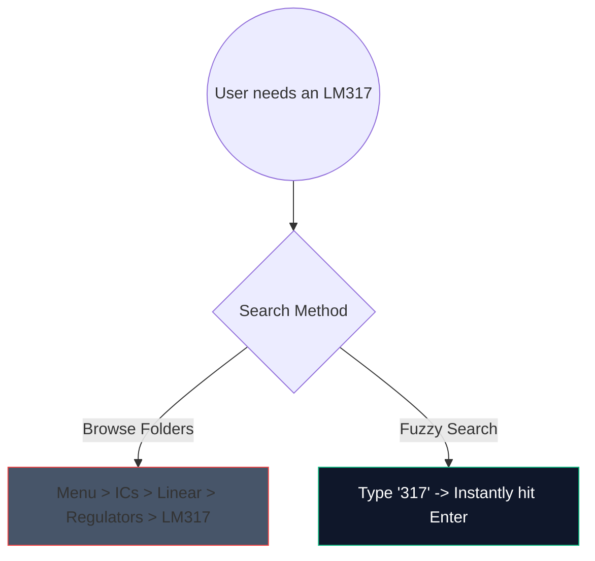

لقد ولت أيام تنزيل برامج سطح المكتب الثقيلة بسعة 2 جيجابايت فقط لرسم دائرة مضخم صوت بسيطة. التصميم بمساعدة الكمبيوتر (CAD) القائم على المستعرض موجود هنا، وهو سريع للغاية.

إليك بالضبط كيفية استخدام أدوات الويب الحديثة لإنشاء مخططات بجودة الإنتاج في أقل من 5 دقائق.

## لماذا تصميم الدوائر المعتمدة على المتصفح؟

إذا كنت معلمًا أو طالبًا أو هاويًا في كتابة الوثائق، فإن السرعة وسهولة الوصول تتفوق على الميزات الأولية.

```mermaid
flowchart LR
    subgraph Traditional Workflow
    DL[Download/Install] --> CONF[Configure Libraries] --> DRAW1[Draw]
    end
    
    subgraph Web Workflow
    URL[Go to URL] --> DRAW2[Draw immediately]
    end
    
    style URL fill:#0f172a,stroke:#3b82f6
    style DRAW2 fill:#1e293b,stroke:#10b981
```

| متري | تطبيق سطح المكتب | صانع مخطط الدائرة |
| :--- | :--- | :--- |
| **مساحة التخزين** | 1 جيجا - 5 جيجا+ | 0 ميجابايت (معتمد على السحابة) |
| **توافق نظام التشغيل** | في كثير من الأحيان منافذ Windows فقط أو عربات التي تجرها الدواب | متوافق عالميًا مع الويب |
| **وقت بدء التشغيل** | 15-30 ثانية | < 1 ثانية |
| **قابلية النقل** | يقتصر على جهاز واحد | يمكن الوصول إليها في كل مكان |

## الاختراقات الأساسية لسير العمل من أجل السرعة

عند استخدام محرر الويب، يؤدي استخدام اختصارات لوحة المفاتيح إلى تحويل التجربة من "النقر" إلى حالة التدفق المتواصل.

فيما يلي الاختصارات ذات أعلى عائد على الاستثمار التي يجب حفظها في محررنا:

| العمل | أمر مفتاح التشغيل السريع | فائدة سير العمل |
| :--- | :--- | :--- |
| ** توجيه الأسلاك ** | `ث` | يحول المؤشر على الفور إلى وضع الاتصال، مما يسمح بتوجيه الشبكة بسرعة دون الانتقال إلى شريط الأدوات. |
| ** دوران المكون ** | `R` (أثناء الإمساك بالجزء) | إن توجيه المقاومات أو الترانزستورات قبل وضعها يوفر قدرًا هائلاً من وقت التنظيف لاحقًا. |
| **تحديد مكرر** | `Ctrl + D` أو `Alt-Drag` | لا تسحب 8 مصابيح LED من القائمة؛ ضع واحدًا وقم بتكوينه وتكراره 7 مرات على الفور. |
| ** قماش عموم ** | `مسافة + سحب` | يحافظ على ثبات مستوى التكبير/التصغير أثناء التنقل في المخططات الضخمة والمعقدة. |

## الاستفادة من البحث عن المكونات

يعد البحث بصريًا من خلال القوائم المنسدلة الضخمة أمرًا مملاً. لقد قمنا بدمج آلية بحث غامضة قوية.

ما عليك سوى الضغط على شريط البحث واكتب "NPN" بدلاً من النقر فوق "أشباه الموصلات -> الترانزستورات -> BJT". تقوم الأداة على الفور برعاية أعلى تطابق احتمالي.

## التصدير للاستخدام المهني

إن إنشاء المخطط هو نصف المعركة فقط؛ إن إدخالها في أطروحتك أو مدونتك التقنية هو النصف الآخر.

قم دائمًا بتصدير أنماط دائرتك بتنسيق **SVG (Scalable Vector Graphics)** كلما أمكن ذلك، بدلاً من PNG أو JPG. يقوم ملف SVG بتخزين الخطوط المحددة رياضيًا بدلاً من وحدات البكسل، مما يعني أنه يمكنك توسيع نطاق مخططك ليصل إلى حجم لوحة الإعلانات وسيظل دائمًا واضحًا بدون ضبابية التنقيط.

على استعداد لاختبار سرعتك؟ **[قم بتشغيل التطبيق](/editor/)** وحاول إنشاء دائرة LED وامضة ذات 555 مؤقتًا!