يبدو فتح مخطط معقد لأول مرة وكأنه يحدق في لغة غريبة. العشرات من الخطوط المتقاطعة، والاختصارات المبهمة، والرموز الخشنة تندمج في جدار من الضوضاء البصرية.

ومع ذلك، فإن المهندسين ذوي الخبرة لا يقرأون المخططات من خلال التحديق في الصفحة بأكملها. إنهم يعزلون ويتتبعون ويقهرون. فيما يلي المنهجية خطوة بخطوة لفك أي مخطط دائرة.

## الخطوة 1: عزل البنية التحتية الأساسية للطاقة

قبل أن تفهم ما تفعله الدائرة، يجب أن تفهم كيف تتنفس.

يحتوي كل مخطط على نقاط دخول للطاقة الكهربائية. مهمتك الأولى هي تحديد موقع جميع قضبان الجهد الرئيسية والمراجع الأرضية.

```mermaid
flowchart TD
    A[Start: Scan Edges] --> B{Look for Power Symbols}
    B -- Found Battery/Jack --> C[Trace the initial VCC and GND lines]
    B -- Found Net Labels --> D[Locate generic +5V, +3.3V pads]
    C --> E[Are there Voltage Regulators?]
    D --> E
    E -- Yes --> F[Mentally divide circuit into Voltage Zones]
    E -- No --> G[Circuit runs on single voltage]
    
    style A fill:#0f172a,stroke:#3b82f6
    style F fill:#1e293b,stroke:#f59e0b
```



| الرمز/النص | معنى | متطلبات العمل |
| :--- | :--- | :--- |
| `VCC' / `VDD` | جهد إمداد إيجابي للدوائر المرحلية. | تتبع هذا للتأكد من أن كل دائرة متكاملة تتلقى الطاقة. |
| `GND` / `VSS` | المرجعية الأرضية المشتركة. | افترض أن كل هذه الرموز متصلة ببعضها البعض فعليًا. |
| `LDO` / `باك` | شريحة تنظم الجهد لأسفل. | لاحظ ما هي المكونات التي يتم تشغيلها في اتجاه الأسفل باستخدام الجهد المنخفض الجديد. |

## الخطوة الثانية: إزالة الغموض عن "العقول" (ICs)

بمجرد أن تعرف أين تتدفق الطاقة، ابحث عن أكبر المستطيلات في الصفحة. تملي الدوائر المتكاملة (ICs) الوظيفة الأساسية للتخطيطي.

إذا واجهت IC المسمى `U1` برقم جزء غامض مثل `NE555` أو `ATmega328P`، فتوقف عن قراءة المخطط على الفور. افتح علامة تبويب جديدة واسحب **ورقة البيانات**.

لا تحتاج إلى فهم فيزياء أشباه الموصلات الداخلية؛ ما عليك سوى إلقاء نظرة على "مخطط Pinout" الخاص بورقة البيانات. إذا كان الطرف 4 هو "RESET" والطرف 8 هو "VCC"، فقم فورًا بتعيين هذا المنطق مرة أخرى إلى الرسم.

## الخطوة 3: تتبع المدخلات والمخرجات

الدوائر هي آلات وظيفية. إنهم يتلقون المدخلات البيئية ويعالجونها ويخرجون النتيجة.

```mermaid
quadrantChart
    title Input/Output Hardware Identification
    x-axis Analog/Physical --> Digital/Data
    y-axis Input Devices --> Output Devices
    quadrant-1 Digital Receivers (e.g. WiFi)
    quadrant-2 Digital Displays (e.g. OLEDs)
    quadrant-3 Physical Actuators (e.g. Motors)
    quadrant-4 Physical Sensors (e.g. Thermistors)
    "Push Button": [0.1, 0.4]
    "Photoresistor": [0.2, 0.2]
    "UART RX": [0.8, 0.4]
    "UART TX": [0.8, 0.6]
    "Speaker": [0.3, 0.8]
    "LED": [0.4, 0.7]
```

تتبع الأسلاك إلى الخارج من الدوائر المتكاملة المركزية. إذا كان طرف IC متصلاً بمصباح LED، فهذا يعد مخرجًا مرئيًا. إذا كان الدبوس يتصل بمفتاح SPST متجهًا إلى الأرض، فهذا يعد مدخلاً بشريًا.

## الخطوة 4: التحقق من صحة التقاطعات والمعابر

خطأ القراءة الأكثر شيوعًا للمبتدئين هو سوء فهم الأسلاك التي تتقاطع مع بعضها البعض.

* **النقطة تنتج عقدة:** إذا كان هناك خطان متقاطعان يتميزان بنقطة صلبة عند تقاطعهما، فهذا يعني أنهما ملحومان/متصلان معًا فعليًا. يمكن أن يتدفق التيار بينهما.
* **لا توجد نقطة تؤدي إلى جسر:** إذا كان الخطان يشكلان علامة متقاطعة بسيطة (+)، فإنهما *لا* يتلامسان. إنهما يشبهان طريقين سريعين يمران فوق بعضهما البعض على جسر علوي.

## الخطوة 5: التعرف على الدوائر الفرعية (السلاح السري)

نادراً ما يقوم المهندسون بتصميم الدوائر بالكامل من الصفر. إنهم يلصقون الدوائر الفرعية المعيارية معًا. بمجرد أن تتعلم كيفية التعرف على هذه "الكلمات" المرئية، فإنك تتوقف عن قراءة "الحروف" الفردية.

| النمط المرئي | الدائرة الفرعية القياسية | وظيفة |
| :--- | :--- | :--- |
| عبور المكثف من "VCC" إلى "GND" بجوار IC مباشرة. | **مكثف الفصل** | يمتص الضوضاء. تجاهلها عند تحليل التدفق المنطقي. |
| مقاوم من طرف رقمي مغلف حتى `+5V`. | **مقاومة السحب** | يمنع الدبابيس العائمة. يضمن حالة افتراضية عالية مستقرة. |
| مقاومتان موصلتان على التوالي بين الجهد والأرضي، ومثبتان في المنتصف. | **مقسم الجهد** | يسقط الجهد بشكل متناسب ليتم قراءته بأمان بواسطة دبوس المستشعر. |

ضع هذه النظرية موضع التنفيذ. افتح **[محرر مخططات الدائرة](/editor/)**، وقم بتحميل قالب، وحدد الطاقة والعقل والمدخلات والمخرجات بنفسك!