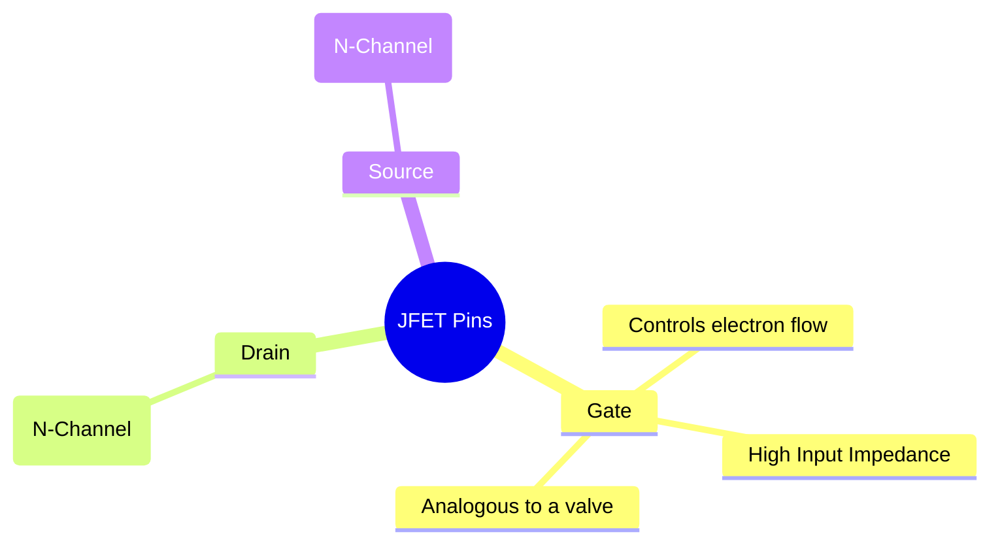

قبل الانتشار الهائل لوحدات MOSFET، كان **JFET** (ترانزستور تأثير المجال الوصلي) هو ملك تضخيم مقاومة المدخلات العالية. على الرغم من عدم استخدامها بشكل متكرر في المنطق الرقمي الحديث، إلا أنها تظل قطعًا أثرية لا غنى عنها في مكبرات الصوت الأولية عالية الدقة، والأجهزة الحساسة، ودوائر التردد اللاسلكي.

يعد فهم الرمز التخطيطي JFET أمرًا ضروريًا لأي شخص يتعمق في تصميم الدوائر التناظرية المنفصلة.

## 1. تشريح رمز JFET

على عكس الترانزستورات ثنائية القطب (BJTs) التي هي أجهزة يتم التحكم فيها حاليًا، فإن JFET عبارة عن جهاز **يتم التحكم فيه بالجهد**. يحاول الرمز التخطيطي تمثيل البناء المادي لقناة أشباه الموصلات الداخلية بشكل مرئي.

يتكون الرمز من خط عمودي مستقيم يمثل القناة، مع خطين أفقيين متصلين بها (الصرف والمصدر). ويشكل الخط العمودي الثالث البوابة، مكتملة بسهم يحدد قطبية أشباه الموصلات.

### قناة N مقابل قناة P JFETs

تمامًا مثل BJTs التي تحتوي على NPN وPNP، تأتي JFETs بنكهتين متميزتين.

| مميزة | N-قناة JFET | ف قناة JFET |
| :--- | :--- | :--- |
| **سهم الرمز** | نقاط **IN** باتجاه خط القناة | نقاط **OUT** بعيدة عن القناة |
| ** شركات النقل الكبرى ** | الإلكترونات | الثقوب |
| **Vgs للإيقاف** | الجهد السلبي (على سبيل المثال، -5V) | الجهد الإيجابي (على سبيل المثال، +5V) |
| ** عملية نموذجية **| في الوضع الطبيعي -> قم بتطبيق مجموعة الجهد السالب لإيقاف التشغيل | في الوضع الطبيعي -> قم بتطبيق مجموعة الجهد الموجب لإيقاف التشغيل |

> **خدعة الذاكرة:** "التأشير إلى الداخل" يعني قناة **N**. انظر إلى السهم الموجود على البوابة. إذا كان يشير إلى الداخل نحو الخط، فأنت تتعامل مع N-Channel JFET (مثل 2N5457 الشهير).

## 2. العملية: وضع الاستنفاد

إحدى الخصائص الأكثر تحديدًا لـ JFET هي أنه جهاز **وضع الاستنفاد**. يؤثر هذا بشكل كبير على كيفية تصميم المخططات من حولهم.

* **وحدات MOSFET (وضع التحسين):** تكون في وضع إيقاف التشغيل عادةً. يجب عليك تطبيق الجهد على البوابة لتشغيلها.
* **JFETs (وضع الاستنفاد):** تكون في وضع التشغيل عادةً. مع وجود 0 فولت عند البوابة، يتدفق الحد الأقصى للتيار من المصرف إلى المصدر. يجب عليك تطبيق جهد *انحياز عكسي* (سالب لقناة N) لتوسيع منطقة النضوب و"إيقاف" تدفق الإلكترونات حرفيًا، مما يؤدي إلى إيقاف تشغيل الجهاز.

```mermaid
flowchart LR
    VGS[V_GS = 0V] --> I1[Maximum Drain Current flows]
    VGS2[V_GS = -2V] --> I2[Current is restricted]
    VGS3[V_GS = -5V] --> I3[Pinch-Off reached. Circuit is OFF]
    
    style VGS fill:#1e293b,stroke:#f59e0b
    style VGS3 fill:#1e293b,stroke:#ef4444
```

## 3. التطبيقات التخطيطية النموذجية

نظرًا لأن بوابة JFET تكون منحازة عكسيًا أثناء التشغيل، فإن التيار يتدفق إليها بشكل أساسي. وينتج عن ذلك مقاومة دخل عالية بشكل فلكي (غالبًا ما يتم قياسها بمئات الميجا أوم).

| تطبيق الدائرة | لماذا يتم اختيار JFETs | القرائن التخطيطية |
| :--- | :--- | :--- |
| **مضخمات الصوت** | ضوضاء منخفضة للغاية ومقاومة إدخال هائلة تمنع تحميل التقاطات الجيتار الكهربائية الحساسة. | غالبًا ما يُنظر إليها على أنها مرحلة مخزن مؤقت للتابع المصدر. |
| **المفاتيح التناظرية** | نظرًا لأنها يتم التحكم فيها بالجهد تمامًا بدون تيار البوابة، فإنها تحقن صفر تحويلات عابرة في مسار الإشارة. | يتم وضعها على التوالي مع إشارة تناظرية تمر عبر قناة مصدر التصريف. |
| **مصادر التيار الثابت** | يتصرف JFET أصلاً كمصرف تيار ثابت عندما تكون البوابة مرتبطة مباشرة بالمصدر. | محطة البوابة متصلة مباشرة بمحطة المصدر. |

عند رسم مخططات هذه الدوائر التناظرية المتخصصة، تعد الدقة أمرًا أساسيًا. تأكد من صحة اتجاه سهم البوابة لمنع فشل التصنيع. استخدم مكتبة أشباه الموصلات المنفصلة المنسقة في **[Circuit Diagram Maker](/editor/)** لوضع رموز N-Channel وP-Channel JFET القياسية بدقة على اللوحة القماشية التالية.