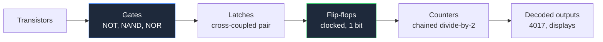
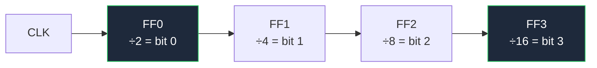

**تصف مخططات دوائر البوابات المنطقية السلوك، وليس قيم المكونات.** هذا الفرق البسيط يغير الطريقة التي ترسم بها هذه المخططات. المخطط التناظري ينجح أو يفشل بناءً على ما إذا كان القارئ قادرًا على العثور على المقاوم 4k7؛ أما المخطط الرقمي فينجح أو يفشل بناءً على ما إذا كان القارئ قادرًا على تتبع انتشار الإشارة عبر سلسلة من البوابات دون أن يفقد مكانه. لا توجد تقريبًا قيم للتعليق عليها — لذا كل وضوح يجب أن يأتي من اختيار الرموز والتخطيط.

يغطي هذا الدليل كلا التشكيلتين الرمزيتين، ثم يصعد عبر التسلسل الهرمي: البوابات المبنية من الترانزستورات العارية، والبوابات المجمعة في قابلات الزناد، وقابلات الزناد المتسلسلة في عدّادات، وأخيرًا عدّاد IC حقيقي. وهو واحد من ستة أدلّة مجالية موجودة ضمن [الدليل الشامل لمخططات الدوائر](/blog/complete-guide-to-circuit-diagrams/)، الذي يغطي اتفاقيات التخطيط универсالية التي تبني عليها هذه القواعد.

## تشكيلتان رمزيتان: أشكال ANSI مقابل مستطيلات IEC

المنطق الرقمي هو المجال الوحيد الذي تختلف فيه المعايير الأمريكية والدولية بشكل كبير. في كل مكان آخر — المقاومات، المكثفات، الثنائيات — الأشكال متشابهة أو متطابقة. أما في المنطق فهي مختلفة تمامًا.

**أشكال ANSI/IEEE 91-1984 المميزة** تمنح كل بوابة هيكلاً فريداً. يمكنك التعرف على الوظيفة من المخطط فقط، عند أي مستوى تكبير، في الرؤية المحيطة.

**IEC 60617-12** (غالبًا ما يُسمى بشكل غير رسمي نمط DIN، نسبة إلى المعيار الألماني الأقدم DIN 40700) يستخدم مستطيلًا واحدًا لكل بوابة، مع رمز توضيحي بداخله يحدد الوظيفة.

| البوابة | شكل ANSI المميزة | مستطيل IEC / DIN | Booli |
| :--- | :--- | :--- | :--- |
| **AND** | ظهر مسطح، أنف نصف دائري — شكل "D" | مستطيل مع `&` | `Y = A · B` |
| **OR** | ظهر منحنٍ، أنف مدبّب — درع | مستطيل مع `≥1` | `Y = A + B` |
| **NOT** | مثلث مع فقاعة على المخرج | مستطيل مع `1` وفقاعة | `Y = Ā` |
| **NAND** | شكل AND مع فقاعة على المخرج | `&` مع فقاعة على المخرج | `Y = A · B` معكوس |
| **NOR** | شكل OR مع فقاعة على المخرج | `≥1` مع فقاعة على المخرج | `Y = A + B` معكوس |
| **XOR** | شكل OR مع خط ظهر منحنٍ ثانٍ | مستطيل مع `=1` | `Y = A ⊕ B` |
| **XNOR** | شكل XOR مع فقاعة على المخرج | `=1` مع فقاعة على المخرج | `Y = A ⊕ B` معكوس |
| **Buffer** | مثلث عادي، بدون فقاعة | مستطيل مع `1` | `Y = A` |

المؤهلات IEC أكثر منطقية مما تبدو في البداية. `&` تعني حرفيًا "و". `≥1` تعني "المخرج يكون صحيحًا عندما يكون *أحد على الأقل* من المدخلات صحيحًا" — وهذا بالضبط ما يعنيه OR. `=1` تعني "المخرج يكون صحيحًا عندما يكون *أحد فقط* من المدخلات صحيحًا" — وهذا بالضبط ما يعنيه XOR. بمجرد أن تقرأها بهذه الطريقة لن تنساها أبدًا.

**أيّهما يجب أن تستخدم؟** أشكال ANSI لأي شيء يقرأه إنسان، مستطيلات IEC عندما يفرضها تنظيمك أو عندما ترسم بوابات معقدة حيث لا يوجد شكل مميز. ميزة ANSI حقيقية: صفحة من الأشكال المميزة يمكن مسحها بسرعة، بينما صفحة من المستطيلات المتشابهة تجبر القارئ على فحص كل مؤهل. whichever تختار، لا تخلط بينهما في ورقة واحدة.

### الفقاعة هي القصة بأكملها

دائرة صغيرة على رمز معناها عكس الإشارة. هذه هي الاتفاقية الأكثر أهمية في الرسم الرقمي:

- فقاعة على **المخرج** — الوظيفة معكوسة. NAND تصبح NAND.
- فقاعة على **مدخل** — يتم عكس هذا المدخل قبل أن تعمل البوابة عليه.
- فقاعة على **مدخل الساعة** — يُفعّل قابل الزناد عند الحافة الهابطة بدلاً من الصاعدة.
- فقاعة على رمز IC، مع اسم مثل `nCS` أو `RESET#` — الإشارة **نشطة عند المنخفض**: تقوم بعملها عندما تُدفع إلى 0 فولت.

بما أن الفقاعات صغيرة، أبقِها نظيفة. لا تدع سلكًا يلمس أو ي-overlap فقاعة أبدًا، ولا تضع بوابتين قريبتين جدًا بحيث تتداخل فقاعة المخرج بصريًا مع خط المدخل للبوابة التالية.

## قواعد الرسم الخاصة بالمخططات الرقمية

اتفاقية التخطيط universale لا تزال سارية — المدخلات على اليمين، المخرجات على اليسار، الطاقة في الأعلى، الأرض في الأسفل، والrichtung على الشبكة. العمل الرقمي يضيف أربع قواعده الخاصة:

**1. مدخلات البوابة لا تتقاطع أبدًا.** إذا تتقاطع سلكان يغذّيان بوابة أثناء وصولهما، بدّل ترتيب المدخلات بدلاً من ذلك. بالنسبة لـ AND، OR، NAND، NOR و XOR المدخلات قابلة للتبديل، لذا لا عذر ل Crossing. مدخل بوابة متقاطع هو أصعب خطأ في مخطط رقمي لأنه يبدو طبيعيًا تمامًا.

**2. الانتشار من اليسار إلى اليمين، دائمًا.** الدوائر الرقمية غالبًا ما تكون في حلقات، والحلقات لها معنى — Latch هو حلقة. أبقِ كل مسار أمامي من اليسار إلى اليمين بدقة حتى تبرز الحلقات ك唯一 الأسلاك الراجعة في المخطط.

**3. اجمع المجموعات المتوازية في ناقل.** ثمانية خطوط بيانات مرسومة منفصلة تعني ثمانية فرص لخطأ القراءة. `D[0..7]` على خط واحد سميك تعني فرصة واحدة.

**4. حدد نطاق الساعة.** أي مخطط يحتوي على أكثر من ساعة واحدة يجب أن يسمّيها (`CLK_16M`, `CLK_SLOW`) ويحتفظ بنطاق كل مرئيًا مجمّعًا. خطوط الساعة تُرسم عادةً مستقيمة وغير منقطعة — ساعة تمر عبر ست زوايا تبدو كخط بيانات.



كل خطوة في هذا السلسل تُرسم بنفس الرموز على مستوى تجريد أعلى. فهم الدرجة السفلية يجعل الباقي واضحًا، لذا ابدأ من هناك.

## بناء البوابات من الترانزستورات

كل رمز بوابة يخفي ترتيب ترانزستورات. رسم هذه الترتيبات تمرين مفيد حقًا، لأنه يشرح لماذا NAND و NOR البوابات الرخيصة والطبيعية، بينما AND و OR البوابات الباهظة.

### دائرة بوابة NOT

البوابة الأبسط هي مُخلّف NPN مشترك الإصدار:

- المدخل عبر مقاومة القاعدة (بضعة kΩ) إلى قاعدة ترانزستور NPN.
- مقاومة المجمع (1 kΩ–10 kΩ) من المجمع إلى أعلى VCC.
- الإصدار مباشرة إلى الأرض.
- المخرج يُؤخذ من المجمع.

ادفع المدخل مرتفعًا ويشبع الترانزستور، مما يسحب المجمع — وبالتالي المخرج — إلى حوالي 0.2 فولت. ادفع الم InputDecoration منخفضًا ويتوقف الترانزستور عن العمل، لذا ترفع مقاومة المجمع المخرج إلى VCC. المدخل المرتفع يعطي مخرج منخفض: عكس.

ارسمه بالضبط كما يصفه الدليل الرئيسي وسيكون الوظيفة واضحة: VCC في الأعلى، مقاومة المجمع عمودية، الترانزستور أسفلها مع سهم الإصدار يشير إلى الأسفل نحو شريط الأرض، المدخل يدخل من اليسار، المخرج يخرج من اليمين عند عقدة المجمع. تُقرأ البوابة بأكملها بنظرة واحدة.

### بوابة NAND باستخدام الترانزستورات

الآن ضع ترانزستورين متسلسلين بين عقدة المخرج والأرض: إصدار الترانزستور العلوي يتصل بمجمع الترانزستور السفلي، وإصدار السفلي يذهب إلى الأرض. كل قاعدة تحصل على مدخلها الخاص عبر مقاومة قاعدة. مقاومة مجمع واحدة إلى VCC تخدم كلاهما.

يُسحب المخرج منخفضًا **فقط عندما يوصّل كلا الترانزستورين**، مما يتطلب أن يكون كلا المدخلين مرتفعين. أي تركيبة مدخلات أخرى تترك الترانزستور واحدًا على الأقل مغلقًا، لذا تنتصر مقاومة الرفع ويبقى المخرج مرتفعًا.

| A | B | Q1 | Q2 | المخرج |
| :--- | :--- | :--- | :--- | :--- |
| 0 | 0 | off | off | **1** |
| 0 | 1 | off | on | **1** |
| 1 | 0 | on | off | **1** |
| 1 | 1 | on | on | **0** |

هذه هي جدول حقيقة NAND. الترانزستورات المتسلسلة تعطيك NAND مجانًا — وهذا بالضبط لماذا NAND هو البناء الشامل لعائلات المنطق الحقيقية، وليس AND.

**ضع نفس الترانزستورين بالتوازي** — كلا المجمعين على عقدة المخرج، كلا الإصدارين على الأرض — ويُسحب المخرج منخفضًا عندما يوصّل *أحدهما فقط*. هذا NOR. المتسلسل يساوي NAND، المتوازي يساوي NOR. ترتيبان، كلاهما بوابة، بدون أجزاء إضافية.

للحصول على AND حقيقي تحتاج NAND يتبعها مُخلّف: ثلاثة ترانزستورات بدلاً من اثنين. AND و OR حرفياً أكثر تكلفة من أبناء عمهما المعكوسين، ولهذا تتضمن كتيّبات البيانات حزم NAND و NOR.

### بوابة XOR باستخدام الترانزستورات

XOR هو المكان الذي يتوقف فيه البناء المنفصل عن الأناقة. هوية Booli هي:

```
Y = (A · B̄) + (Ā · B)
```

المخرج يكون مرتفعًا عندما تختلف المدخلات. في الشكل المنفصل هذا يعني مُخلّفين لإنتاج `Ā` و `B̄`، ثم زوجين متسلسلين من السحب إلى الأسفل — واحد لـ `A · B̄`، وواحد لـ `Ā · B` — مع مشاركة كل الزوجين مقاومة مجمع واحدة لتبديل نتائجهما. ستة ترانزستورات وخمس مقاومات لبوابة واحدة.

ارسمه كنصفين منفصلين بوضوح، واحد لكل مصطلح إنتاجي، مكدّسين عموديًا ويلتقيان عند عقدة المخرج المشتركة. إذا حاولت رسم جميع الترانزستورات الستة في صف واحد فسيصبح غير مقروء فورًا. هذا هو أيضًا الملاحظ أنه في أي تصميم حقيقي ستستخدم سبعة سبعات من 74HC86 بدلاً منه — النسخة المنفصلة موجودة لتعليم الهوية، وليس للبناء.

## دوائر قابلات الزناد

قابل الزناد هو ما يحدث عندما تُغذّي مخرج بوابة إلى مدخلها الخاص. تلك الحلقة تعطي الدائرة ذاكرة — بت واحدة منها.

### قابض SR

اقترن بترانزستورين NOR: مخرج بوابة 1 يغذّي مدخل بوابة 2، ومخرج بوابة 2 يغذّي مدخل بوابة 1. المدخلات الحرة المتبقية تصبح **S** (set) و **R** (reset)، والمخرجان هما **Q** و **Q̄**.

- اضغط S مرتفعًا: يرتفع Q ويبقى مرتفعًا بعد عودة S إلى الأسفل.
- اضغط R مرتفعًا: ينخفض Q ويبقى منخفضًا.
- كلاهما منخفض: يحتفظ القابض بحالته السابقة — هذه هي الذاكرة.
- كلاهما مرتفع: محظور، لأن كلا المخرجين يُدفعان إلى الأسفل وينتهك عقد "Q̄ عكس Q".

بدّل بوابات NOR ببوابات NAND وتحصل على النسخة النشطة عند المنخفض، حيث المدخلات هي `S̄` و `R̄` والخمول كلاهما مرتفع.

> قابض SR هو المكان الوحيد حيث تُكسر قاعدة عدم التقاطع عمدًا. الرسم التقليدي يضع البوابتين إحداهما فوق الأخرى مع أسلاك الاستجابة تتقاطع بينهما بشكل مرئي، لأن شكل X *هو* التوقيع المميز للقابض. ارسمه بأي طريقة أخرى ولن يتعرف عليه القراء.

### قابلات زناد D و JK

أضف ساعة ويتغير القابض إلى قاب زناد لا يتغير حالته إلا في لحظة محددة.

| النوع | المدخلات | السلوك | ملاحظات الرسم |
| :--- | :--- | :--- | :--- |
| **D** | D, CLK | يأخذ Q قيمة D عند حافة الساعة | الأكثر شيوعًا؛ مدخل بيانات واحد، بدون حالة محظورة |
| **JK** | J, K, CLK | J يضبط، K يعيد ضبط، كلاهما مرتفع يُحوّل | وضع التحويل هو ما يجعل العدّادات ممكنة |
| **T** | T, CLK | يتحول عندما يكون T مرتفعًا | JK مع J و K مربوطان معًا |

على مستوى المخطط ترسمها دائمًا كمستطيلات، وليس كبوابات أساسية. اتفاقيات الكتلة: مدخلات D أو J/K على اليسار، الساعة على اليسار مع فقاعة إذا كانت نشطة عند الحافة الهابطة، Q في أعلى اليمين، Q̄ في أسفل اليمين، وإعادة الضبط غير المتزامنة في الحواف العلوية والسفلوية. اتباع هذا التخطيط يعني أن أي قارئ يتعرف على الكتلة فورًا دون قراءة رقم القطعة.

## دوائر العدّادات الثنائية

قاب زناد JK مع كلا المدخلين مربوطين بالمرتفع يتحول عند كل حافة ساعة. مخرجاته هي بالضبط نصف تردد المدخل — مرحلة قسمة على 2. سلسلها وتقسم كل مرحلة مرة أخرى:



اقرأ أربعة مخرجات Q معًا وتحصل على رقم ثنائي من 4 بتات يتزايد مرة واحدة لكل ساعة مدخل: عدّاد ثنائي يعد من 0 إلى 15. لأن كل مرحلة تُ الساعة للمرحلة التالية، هذا عدّاد **غير متزامن** أو **ripple** — المراحل تتحدث بالتسلسل بدلاً من في نفس الوقت، لذا هناك فترة تسوية موجزة بعد كل ساعة حيث يكون المخرج غير صالح.

قواعد الرسم للعدّادات:

- **من اليسار إلى اليمين حسب ترتيب البتات.** بت 0 على اليسار، البت الأكثر أهمية على اليمين. لا تعكس هذا أبدًا؛ يفترض القارئ ذلك بشكل مطلق.
- **سمّ كل مخرج بوزنه في البتات**، `Q0`/`Q1`/`Q2`/`Q3` أو `÷2`/`÷4`/`÷8`/`÷16`.
- **اسحب الساعة على خط أفقي مستقيم** أسفل السلسلة أو فوقها وأنزل فروعًا إلى كل مرحلة. لا تمرّر الساعة بشكل مائل بين قابلات الزناد.
- **اربط المدخلات غير المستخدمة بشكل واضح** بشريطها غير النشط وأظهر ذلك. رمز إعادة ضبط عائم على عدّاد هو فشل مضمون في الموقع.

للعدّاد **المتزامن**، كل قاب زناد يشارك ساعة واحدة والمنطق المركّب يقرر أي بتات تتغير. يتغير شكل الرسم تمامًا: خط ساعة واحد نظيف لكل مرحلة، زائد كتلة مثلثة من بوابات AND تتفرع عبر المخطط. هناك أجزاء أكثر ورسم أكثر، وهو يحل مشكلة تسوية الـ ripple.

## عدّاد العشري IC 4017

في الواقع نادرًا ما ترسم عدّادًا من قابات الزناد — أنت تستخدم عدّاد IC. CD4017 هو الكلاسيكي: عدّاد Johnson من 5 مراحل مع مخرجات مُحلّكة، يعطي **عشر مخرجات ترتفع واحدة في كل مرة، بالتسلسل، واحدة لكل نبضة ساعة**. وهو القلب của كل متابع LED ومسلسل وعدّاد خطوات تم بناؤه على الإطلاق.

转入ته هي أيضًا أفضل حجة واحدة لقاعدة الدليل الرئيسي بشأن ترتيب أ pins IC حسب الوظيفة بدلاً من الترتيب الفيزيائي:

| Pin | الوظيفة | Pin | الوظيفة |
| :--- | :--- | :--- | :--- |
| 1 | Q5 | 9 | Q8 |
| 2 | Q1 | 10 | Q4 |
| 3 | Q0 | 11 | Q9 |
| 4 | Q2 | 12 | Carry out |
| 5 | Q6 | 13 | Clock inhibit |
| 6 | Q7 | 14 | Clock |
| 7 | Q3 | 15 | Reset |
| 8 | VSS (GND) | 16 | VDD |

المخرجات العشرة موزعة على جانبَي الحزمة بترتيب غير مفيد. إذا رسمت الرمز بترتيب pins الفيزيائي، سينتقل `Q0` عبر `Q9` بشكل متعرج حول الكتلة وكل سلك ترفقه يتقاطع مع آخر. ارسمه وظيفيًا بدلاً من ذلك — الساعة، المنع وإعادة الضبط مكدّسة على اليسار، `Q0` عبر `Q9` بترتيب عددي على الجانب الأيمن، VDD في الأعلى، VSS في الأسفل، مع أرقام pins بخط صغير بجانب كل واحدة — ويصبح متابع LED المكون من عشر أضواء عبارة عن عشرة أسلاك أفقية متوازية بدون أي تقاطعات.

الأ pins الثلاثة التحكم مهمة عندما ترسم واحدًا:

- **الساعة (14)** تدفع التسلسل عند الحافة الصاعدة.
- **منع الساعة (13)** يجمّد العدّاد عندما يكون مرتفعًا. اربطه بالأرض إذا غير مستخدم — لا تتركه عائمًا.
- **إعادة الضبط (15)** تعيد العدّاد إلى `Q0` عندما يكون مرتفعًا. اربطه بالأرض إذا غير مستخدم، أو أ drive من المخرج الذي تريد أن يكون الخطوة الأخيرة في تسلسل مختصر. تغذية `Q4` إلى إعادة الضبط، على سبيل المثال، تحوّل 4017 إلى مسلسل من 4 خطوات، وسلك الاستجابة هذا هو واحد من الأسلاك القليلة من اليمين إلى اليسار التي تنتمي إلى مخطط رقمي.

- **Carry out (12)** ينبض مرة واحدة لكل عشر ساعات، لذا يغذّي ساعة 4017 ثانية لتسلسل يتجاوز عشر خطوات.

متابع LED نموذجي يُقرأ إذن: 555 غير مستقر على اليسار يولد الساعة، 4017 في الوسط، عشرة أضواء LED مع مقاومات تقييد التيار تتفرع إلى اليمين، ورمزي الطاقة كلاهما عمودي. توليد الساعة لهذا النوع بالذات من الدوائر مغطى في [دليل دوائر المضخم والمذبذب](/blog/amplifier-and-oscillator-circuits/)، وإذا كان 4017 ي drive أي شيء أكبر من LED، فإن مراحل التبديل في [دليل دوائر الحماية والمستشعر](/blog/sensor-and-protection-circuit-diagrams/) هي ما ينتمي بينهما.

## قائمة التحقق للمخططات الرقمية

شغّل هذه قبل أن تستدعي مخطط المنطق مكتملاً:

1. معيار رموز واحد فقط — أشكال ANSI أو مستطيلات IEC، لا تخلط بينهما أبدًا.
2. لا مدخلات بوابة متقاطعة في أي مكان.
3. كل فقاعة منفصلة بوضوح عن الأسلاك المحيطة.
4. الإشارات النشطة عند المنخفض مسمّاة باستمرار (`nRESET`، `/RESET` أو `RESET#` — اختار واحدة).
5. كل مدخل غير مستخدم مربوط بمستوى محدد، مرسوم بوضوح.
6. كل مخرج غير مستخدم معلّم بعلامة عدم وصل `X`.
7. بتات العدّاد والسجل بترتيب تصاعدي من اليسار إلى اليمين.
8. خطوط الساعة مستقيمة، مسمّاة، ومجمّعة حسب النطاق.
9. مكثف فصل مرسوم عند طاقة كل IC الخاصة به — منطق CMOS يسحب نبضات تيار عند كل انتقال وهذا هو المكان الذي تسجل فيه هذا النية.
10. قيم السحب إلى أعلى والأسفل معلّمة على الرغم من أن الدائرة "رقمية".

**[ابدأ في رسم مخططك الخاص الآن.](/editor/)** مكتبة البوابات تتضمن أشكال ANSI المميزة ومستطيلات IEC، بالإضافة إلى قابلات الزناد وعدّادات و 4017، لذا يمكنك تخطيط متابع أو سلسلة قسمة في بضع دقائق. إذا كنت تريد العمل من جدول حقيقة بدلاً من وضع البوابات يدويًا،則 [محوّل جدول الحقيقة إلى دائرة منطقية](/truth-table-logic-circuit/) يولّد شبكة البوابات لك، و [مبسّط تعبيرات Booli](/boolean-expression-simplifier/) يُبسّط التعبير أولًا لترسم أصغر دائرة بدلاً من الأكثر وضوحًا.
