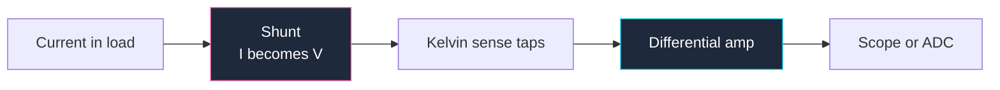

**بنية الاختبار هي الجزء الأقل رسمًا في معظم المخططات.** يقضي المصممون أسبوعًا في تصميم مسار الإشارة ثم يختبرون اللوحة بطرف مسبار متمايل على طرف مقاومة، لأن لا أحد في المخطط قال "سنحتاج إلى قياس هذا." نقاط الاختبار لا تكلّف شيئًا تقريبًا أثناء التصميم ويصعب إضافتها بعد التصنيع.

يغطي هذا الدليل كيفية رسم جانب القياس في الدائرة: نقاط الاختبار، المقيّمات، حمل الأجهزة، والدوائر التناظرية الصغيرة التي تجعل القياس ممكنًا. يستند إلى الاتفاقيات الشاملة في [الدليل الشامل لمخططات الدوائر](/blog/complete-guide-to-circuit-diagrams/).

## نقاط الاختبار مكونات

لكل نقطة اختبار اسم إشارة — `TP` — وهي جزء من المخطط مثل أي مكون آخر. ارسمها كدائرة صغيرة أو علم مُوصَل إلى الشبكة، مع اسم الإشارة بجانبها.

ما الذي يجب توثيقه لكل نقطة:

- **القيمة المتوقعة.** `TP3 — 3.30 V ±2%` أو `TP7 — 5 V مربّع، 1 kHz، 50% duty`. هذا يحول مخططك إلى إجراء اختبار. شخص يحمل جهاز قياس ومخططك يمكنه التحقق من اللوحة دون أن يسألك شيئًا.
- **الغرض منها.** `TP4 — عقدة تغذية راجعة للمنتج` يخبر المُحلل المستقبلي لماذا وُجدت.

قواعد التخطيط أهم مما يبدو:

**ضع نقطة اختبار أرضية بجانب كل نقطة اختبار إشارة.** قياس الأوسيلوسكوب يتطلب اتصالين. لوحة بها اثنتا عشرة نقطة اختبار إشارة ونقطة أرضية واحدة في الزاوية البعيدة هي لوحة ستقيسها بشكل سيء، لأن سلك أرضي طويل يضيف محاثة ويحوّل الحواف النظيفة إلى رنين. اجمعها في أزواج وسيوصل المخطط ذلك للتصميم.

**اختبر الشبكات التي لا يمكنك الوصول إليها بطريقة أخرى.** أي شبكة موجودة فقط بين كرتين BGA، أو تحت درع، أو داخل كتلة هرمية، فإنها غير مرئية على اللوحة المكتملة. تلك هي الشبكات التي تحتاج نقاط اختبار، وليس تلك المعروضة بالفعل على رأس التوصيل.

**اختبر كلا الجانبين لأي شيء يمكن أن ينقطع.** الفيوزات، المقيّمات التسلسلية، حبّات الفيريت، والموصلات. نقطة اختبار على كل جانب حوّلت "اللوحة ميتة" إلى قياس يستمر خمس ثوانٍ.

**حدد نقاط الاختبار بدون حمل.** إذا كانت نقطة اختبار على عقدة عالية المعاوقة حيث ستُزعج سعة المسبار الدائرة، وثّقها: `TP9 — استخدم 10:1 probe فقط`.

## رسم الأجهزة كحمل

الجهاز ليس مراقبًا سحريًا. إنه حمل، وعلى العقد عالية المعاوقة يغيّر الدائرة التي تحاول قياسها. عندما يوثق مخططك إعداد اختبار، ارسم الجهاز كما هو.

| الجهاز | يُرسم كـ | القيم النموذجية |
| :--- | :--- | :--- |
| **Scope، إدخال مباشر** | مقاومة على التوالي مع مكثف للأرضية | 1 MΩ ∥ 15–25 pF |
| **Scope، 10:1 passive probe** | نفس الشيء، R أعلى، C أقل | 10 MΩ ∥ 10–15 pF |
| **جهاز قياس رقمي، فولت DC** | مقاومة للأرضية | ~10 MΩ |
| **Active/differential probe** | كتلة buffer مع معاوقة الإدخال | R عالية، ~1–2 pF |

ارسم الجهاز داخل **مستطيل متقطع** مُسمّى باسم الجهاز ومقاوقته الإدخالية. الخط المتقطع هو الطريقة القياسية للقول "هذا ليس جزءًا من المنتج" — نفس الاتفاقيات المستخدمة للتجميعات الاختيارية والعناصر الميكانيكية. ثم يمكن للقارئ أن يرى فورًا أن 20 pF المعلقة على العقدة هي artifact قياس وليس مكوّن تصميم.

تلك الـ 20 pF مهمة. على عقدة 1 MΩ تُشكّل فلتر منخفض التردد مع زاوية حوالي 8 kHz، لذا سيُظهر لك مسبار الأوسيلوسكوب على مقسم عالية المعاوقة إشارة غير موجودة بدون المسبار. على مذبذب بلورة، يمكن أن تتوقف سعة المسبار المذبذب تمامًا. رسم المسبار كحمل هو الطريقة للتنبؤ بذلك قبل أن تُربك.

**أرضية الأوسيلوسكوب مرجعية للأرض.** هذا هو أهم توثيق في أي مخطط اختبار. مسبار الأوسيلوسكوب العامل بالتيار الم alternatif يتصل بطرف الأرض في سلك الطاقة. قم بتوصيله بعقدة ليست عند الجهد على الأرض وستُنشئ دائرة قصيرة عبر موصل الأرض في المبنى — مُدمّر المسبار أو الدائرة أو كليهما. على دائرة مرجعية للتيار المalternatif مثل مصدر بدون محول أو SMPS غير معزول، هذا خطر حقيقي وليس مجرد إزعاج.

الإجابات الصحيحة هي مسبار differential، أو أوسيلوسكوب معزول الإدخال، أو محول عزل على *الجهاز المُختبر*. الإجابة الخاطئة هي تجاوز pin الأرض في الأوسيلوسكوب، مما يُطفئ الهيكل الكامل للجهاز — بما في ذلك كل الأسطح المعدنية التي ستلمسها — إلى أي منشأة يُوصَل بها مسبار الأرض. إذا كان مخططك يوثق قياسًا على دائرة غير معزولة، ضع ذلك التحذير في ملاحظة مُحاطة بالورقة.

## قياس التيار بالأوسيلوسكوب

الأسيلوسكوب يقيس الجهد. لرؤية التيار يجب تحويله، والتحويل يكون على المخطط.

### مقيّمات الشانت

الشانت هو مقاومة صغيرة ودقيقة موضوعة في مسار التيار، لذا `V = I × R`. اتفاقيات الرسم:

- **ارسم الشانت في مسار التيار بخطوط سميكة**، ووصلات الاستشعار بخطوط رفيعة. الفرق في السماكة يحكي كل شيء: الأمبيرات تمر عبر الشانت، والميكروأمبيرات تذهب إلى المضخّم.
- **وثّق القيمة بدقة ميلي أوم** في الحروف: `R010` لـ 10 mΩ، `0R05` لـ 50 mΩ.
- **وثّق انخفاض النطاق الكامل والاستهلاك.** شانت 10 mΩ عند 5 A ينخفض بـ 50 mV ويستهلك 250 mW. كلا الرقمين قيود تصميم — الانخفاض يضبط ربح المضخّم، والاستهلاك يضبط الحزمة.
- **حدد التحمل ومعامل حراري.** شانت بـ 5% يجعل قياس تيار 5%. اكتب `1%, 50 ppm/°C` على المخطط.

**الجانب السفلي مقابل الجانب العلوي** هو قرار طوبوجي يجب أن يجعله المخطط واضحًا. شانت الجانب السفلي يجلس بين عودة الحمل والأرضية: بسيط، مرجعي للأرض، قابل للقياس بمضخّم عادي — لكنه يرفع مرجعية الأرض للحمل بانخفاض الشانت، ولا يمكنه رؤية خطأ يتجاوز مسار العودة. شانت الجانب العلوي يجلس بين الطاقة والحمل: يترك الأرضية سليمة ويصطاد كل الخطأ، لكن جهد الاستشعار يركب على الكامل، لذا يحتاج إلى مضخّم استشعار تيار مخصص بنطاق مشترك مناسب. وثّق الجهد المشترك بجانب المضخّم — إنه الرقم الذي يختار القطعة.

### استشعار كلفن (أربعة أسلاك)

عند قيم ميلي أوم، مقاومة أسلاكك الخاصة خطأ كبير. الحل هو اتصال كلفن: فصل مسار **القوة** الذي يحمل التيار عن مسار **الاستشعار** الذي يقيس الجهد، واستخدم وصلات الاستشعار من *الحواف الداخلية* لعنصر الشانت نفسه.

هذه مشكلة رسم قبل أن تكون كهربائية. في المخطط، ارسم أربعة اتصالات مميزة لرمز الشانت — اتصالين قويين في الأطراف الخارجية، ووصلتين استشعار رفيعة من الداخل — وأضف الملاحظة `KELVIN — sense at inner pads`. شانت بأربعة أطراف يُرسم بأسلاكين يبدو مطابقًا لشانت بطرفين، ومهندس التخطيط سيوصّله كقطعة بطرفين ما لم تقل خلاف ذلك.

### مسبارات التيار

مسبار التيار من نوع Clamp يقيس المجال المغناطيسي حول موصل ولا يتطلب أي اتصال كهربائي على الإطلاق. ارسمه ككتلة مُسمّاة مقترنة بالسلك برمز الاقتران — خطين متوازيين بجانب الموصل، مثل نواة محول — ووثّق النطاق الترددي ومدى التيار. الميزة الرئيسية التي يجب توثيقها على المخطط: لا مرجعية أرضية، لذا لا خطر أرضي.

## دوائر صغيرة تجعل القياس ممكنًا

### دائرة مختبر الاستمرارية

أبسط جهاز اختبار مفيد: بطارية، مقاومة تسلسلية، مؤشر، ومسباران. يتدفق التيار ويضاء LED عندما يتم توصيل المسبارين.

النسخة البسيطة بها عيب حقيقي يستحق التوثيق: LED ومقاومة ستصلي عبر مئات الأوم، لذا يُبلّغ المختبر "استمرارية" عبر مقاومة. إذا كنت تحتاج إلى التمييز بين لحام 0.5 Ω ومسار تسرّب 200 Ω، تحتاج الدائرة إلى مُقارن: تيار مسبار عبر مقاومة استشعار صغيرة، مقارنة مع مرجعية، وتشغيل الـ buzzer فقط تحت العتبة.

في كلتا الحالتين، **وثّق العتبة**: `indicates below 10 Ω`. مختبر بعتبة غير موثوقة يُعطيك إجابات لا يمكنك تفسيرها. وثّق أيضًا جهد المسبار في الدائرة المفتوحة، لأن مختبر يضع 3 V عبر الدائرة المختبرة يمكن أن يسبب انحياز في طبقات أشباه الموصلات ويُبلّغ استمرارية عبر ترانزيستور.

### متابع الجهد

مضخّم مع مخرج موصول مباشرة بمدخله العكسي له ربح واحد تمامًا — يبدو عديم الفائدة حتى تلاحظ أنه يحول المعاوقة. معاوقة عالية للداخل، منخفضة للخارج.

هذا يجعله الحل القياسي لحمل القياس. ضع متابعًا بين مقسم عالية المعاوقة وADC أو جهاز القياس الخاص بك، ويرى المسم المعاوقة الإدخالية للمضخّم بدلاً من المعاوقة الإدخالية للجهاز.

ملاحظات الرسم:

- **مسار التغذية الراجعة سلك عارٍ** من المخرج إلى المدخل العكسي، يُرسم فوق المثلث كالعادة. لا توجد مكونات في الحلقة. ذلك المستطيل الفارغ فوق المضخّم هو التوقيع المميز للمتابع.
- **استخدم مضخّم مع مدخل FET للمصادر عالية المعاوقة حقًا** ووثّق السبب: `FET input — Ib < 10 pA required`. تيار التحيز الإدخالي لمضخّم ثنائي القطب يتدفق عبر مصدر 10 MΩ ويُنتج خطأ قابل للقياس.
- **وثّق معاوقة الإدخال** التي تعتمد عليها، وأبقِ أي آثار حماية أو خطوط حماية الإدخال مرسومة بجانب طرف الإدخال.

### دائرة العينات والاقطاب

دائرة العينات والاقطاب تلتقط جهدًا في لحظة معينة وتحافظ عليه ثابتًا بينما شيء آخر — عادة ADC — يقرأه. ثلاثة مكونات: مفتاح تناظري، مكثف احتواء، وعلمة حماية.

يجب أن ينقل المخطط ثلاث مواصفات لا تقدمها المكونات بمفردها:

- **معدل الانحلال.** يتناقص الجهد المحتوى مع تفريغ المكثف بسبب التسرب: `dV/dt = I_leak / C`. وثّق الانحلال المقبول خلال زمن الاحتواء. هذا ما يختار قيمة المكثف وتيار التحيز الإدخالي لعلمة الحماية.
- **عازل المكثف.** اكتبه على الرسم. بولي بروبيلين أو PTFE لمكثف الاحتواء؛ المكثف السيراميكي Y5V له امتصاص عازلي سي "يتذكر" الجهود السابقة ويُفسد عينتك. هذه إحدى الحالات النادرة حيث يكون العازل أهم من السعة.
- **زمن الاقتناء.** المدة التي يجب أن يظل فيها المفتاح مغلقًا حتى يصل المكثف إلى قيمته النهائية، يُحددها معاوقة المصدر و`C`. وثّق عرض نبضة العينات الأدنى بجانب مدخل التحكم.

ارسم المفتاح كرمز مفتاح تناظري مع مدخل التحكم مُسمّى بوضوح `SAMPLE`، ومكثف الاحتواء العمودي للأرضية مباشرة بعده، وعلمة الحماية على اليمين. من اليسار إلى اليمين: عينات، احتواء، قراءة.

### مقياس LM3914 و الرسم الشريطي

يحول LM3914 جهدًا تناظريًا إلى عرض عشرة LED: سلّم خطي من المقارنات مقابل مقسم مرجعي داخلي.

الأطراف التي تحدد التصميم:

- **مدخل الإشارة (الطرف 5)** — الجهد المُقاس.
- **منخفض ومرتفع المقسم (الأطراف 4 و 6)** — هما يحدّنان نافذة العرض. توصيلهما بمرجع وأرضية يعطيك 0 V إلى النطاق الكامل؛ توصيلهما بجهدين آخرين يعطيك مقياسًا ممتد النطاق يعرض فقط، على سبيل المثال، 10.5 V إلى 14.5 V لبطارية سيارة. وثّق النافذة على الرسم، لأن هذين الطرفين *هو* المواصفة.
- **خروج المرجع وضبط المرجع (الأطراف 7 و 8)** — مرجع 1.25 V عبر مقاومة يضبط تيار المرجع، ويتبعه تيار LED بقيمة تقارب عشر أضعافها. وثّق قيمة مقاومة المرجع وتيار LED الناتج.
- **الوضع (الطرف 9)** — يتصل بالطاقة الإيجابية لوضع الشرائط، ويُترك مفتوحًا لنقاط. هذه قرار طرف واحد يغيّر مظهر العرض بالكامل، لذا علّمه صراحة: `pin 9 → V+ : BAR MODE`.

التفاصيل التي تخطئها معظم المخططات: **مخرجات LM3914 هي بوصّات تيار ثابتة، لذا لا تحتاج LEDs إلى مقاومات تسلسلية.** ارسم عشرة LEDs موصولة مباشرة من الطاقة إلى المخرج العشرة، وأضف ملاحظة تقول `LED current set by pin 7/8 reference — no series resistors`. وإلا سيُراجع المراجع التالي "يرسم" مخططك بإضافة عشر مقاومات لا تفعل شيئًا سوى إهدار هامش الجهد.

اجمع جهازين لعرض عشرين خطوة، وارسم سلسلة المرجع بينهما صراحةً بدلاً من التخمين.

## تصميم طاولة الاختبار: ترتيب عملي

عند رسم جهاز اختبار بدلاً من منتج، يتغير تخطيط الورقة قليلاً. ترتيب مفيد، من اليسار إلى اليمين:

1. **مدخل الطاقة وطاقة الأجهزة**، منفصل بوضوح عن طاقة الجهاز المُختبر.
2. **الجهاز المُختبر**، يُرسم ككتلة متقطعة تحتوي فقط على الأطراف التي يلمسها الجهاز.
3. **تنسيق الإشارة** — مقاسم، متابعات، مقيّمات ومضخّمات بين DUT والأجهزة.
4. **الأجهزة**، في صناديق متقطعة مع معاوقات موثقة.
5. **مخطط التأريض**، يُرسم صراحةً. أظهر النقطة الواحدة التي يلتقي فيها تأريض الجهاز بتأريض DUT، لأن دورات التأريض هي السبب الأول للقياسات السيئة والمخطط هو المكان الذي تمنعها فيه.

> إذا لم يُظهر مخطط جهاز الاختبار الخاص بك أين تتصل الأرضيات، فأنت لم تصمم الجهاز — بل رسمت تمنّيًا. كل مشكلة قياس تبدو كضوضاء هي قرار تأريض لم يُسجَّل أحد.

## قائمة مراجعة مخطط القياس

1. كل شبكة يصعب الوصول إليها لها `TP` مع قيمة متوقعة موثقة.
2. نقاط اختبار الأرضية مقترنة بنقاط اختبار الإشارة.
3. نقاط اختبار على جانبي كل فيوز، عنصر تسلسل وموصل.
4. أجهزة مرسومة في صناديق متقطعة مع معاوقة إدخال موثقة.
5. سعة المسبار مأخوذة بالاعتبار وموثقة على العقد عالية المعاوقة.
6. خطر التأريض المرجعي للأرض مُعلَّم على أي قياس غير معزول.
7. مقيّمات مرسومة بقوس قوة سميك وقوس استشعار رفيع.
8. قيمة المقيّم، التحمل، المعامل الحراري، انخفاض النطاق الكامل والاستهلاك موثقان.
9. اتصالات كلفن مرسومة كأربعة اتصالات منفصلة مع ملاحظة صريحة.
10. مضخّمات استشعار الجانب العلوي موثقة بنطاق مشترك.
11. عازل مكثف الاحتواء محدد؛ معدل الانحلال وزمن الاقتناء موثقان.
12. نافذة LM3914، طرف الوضع ومقاومة المرجع موثقان؛ لا توجد مقاومات LED تسلسلية.
13. مخطط تأريض الجهاز مرسوم، مع إظهار نقطة التوصيل الواحدة.

**[ابدأ رسم مخططك الخاص الآن.](/editor/)** نقاط الاختبار، المقيّمات، علامات حماية مضخّمات العمليات، المفاتيح التناظرية وعروض LED الشريطية جميعها في المكتبة، ويمكنك تعيين أوزان الخطوط لفصل مسارات القوة عن مسارات الاستشعار كما يصف هذا الدليل تمامًا. عندما تكون الدائرة التي تختبرها مذبذبًا أو مضخّمًا، يغطي [دليل دوائر المضخّمات والمذبذبات](/blog/amplifier-and-oscillator-circuits/) كيفية رسمها، و[دليل تصميم دوائر الطاقة](/blog/power-supply-circuit-diagrams/) يغطي أسئلة العزل التي تحدد ما إذا كنت قادرًا على وضع مسبار عليها بأمان.