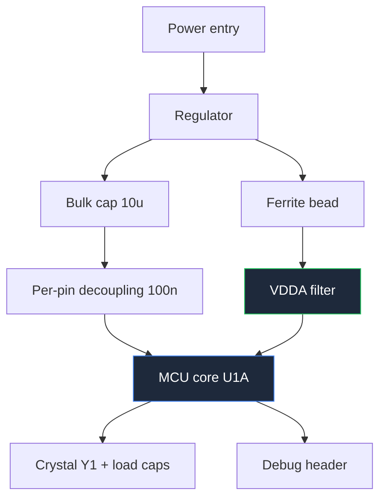

**مخطط الدائرة المصغرة هو أصعب أنواع مخططات الدوائر في الرسم، لأن المكون في وسطه يحتوي على أطراف أكثر من بقية اللوحة مجتمعة.** عند رسم MCU بـ 100 طرف كمستطيل واحد، النتيجة ورقة حيث تقاطع كل سلك أربعة أسلاك أخرى ولا يستطيع أحد إيجاد أي شيء. تقنيات هذا الدليل موجودة لمنع هذا بالضبط.

هذا هو الدليل الأكثر تطلبًا من الأدلة الستة ضمن [الدليل الشامل لمخططات الدوائر](/blog/complete-guide-to-circuit-diagrams/)، والذي تحقق فيه عروض البدء الأفضل.

## تقسيم MCU إلى أجزاء رمزية وظيفية

القرار ذو أعلى عائد في مخطط الدائرة المصغرة: لا ترسم MCU كرمز واحد. قم بتقسيمه إلى أجزاء متعددة من نفس المكون المادي — `U1A` و`U1B` و`U1C` — كل منها يُرسم كمستطيل منفصل، ومُجمّع حسب الوظيفة.

تقسيم نموذجي:

| الجزء | يحتوي على | يوضع مع |
| :--- | :--- | :--- |
| **U1A — النواة** | جميع أطراف VDD/VSS، VDDA، VREF، طرف إعادة التشغيل، أطراف البلورة، أطراف التنقيح | شجرة الطاقة والبلورة، ورقة منفصلة أو زاوية |
| **U1B — المنفذ A/B** | GPIO المستخدمة للمستشعرات والمدخلات | دوائر تكييف المستشعرات |
| **U1C — المنفذ C/D** | GPIO المستخدمة للمخرجات والمحركات | محركات المحركات وال relay والـ LED |
| **U1D — الاتصالات** | UART وSPI وI²C وأطراف USB | الموصلات ومحولات المستوى |

الفائدة تتراكم. بمجرد عزل أطراف الطاقة والبلورة في رمزها الخاص، يمكن وضع شبكة التخفيق بجانبها بدون منافسة على المساحة مع أربعين سلك GPIO. وبمجرد أن GPIO المستخدمة للتحكم بالمحرك تعيش في رمزها الخاص، يمكنك وضعها بجوار محرك المحرك مباشرة فيصبح التوصيل أربعة أسلاك قصيرة متوازية بدلاً من أربعة أسلاك تتقاطع عبر الورقة بالكامل.

قواعد التقسيم:

- **كل طرف يظهر مرة واحدة فقط** عبر جميع الأجزاء. تكرار طرف يُنشئ خطأ في قائمة الشبكة سيكتشفه ERC، وحذف طرف يُنشئ طرفًا لم يتصل به أحد.
- **استخدم نفس مُعرّف المرجع بلاحقة حرفية.** `U1A` و`U1B` و`U1C` هي رقاقة فيزيائية واحدة؛ `U1` و`U2` و`U3` هي ثلاث رقاقات.
- **أضف ملاحظة على كل جزء** تُحدد نطاق أطراف الحزمة التي يغطيها.
- **أبقِ الطاقة في جزء واحد.** تشتت أطراف VDD عبر ثلاثة رموز يُبطل الغرض.

داخل كل مستطيل، رتّب الأطراف **حسب الوظيفة وليس حسب الترتيب الفيزيائي.** المدخلات على اليسار، المخرجات على اليمين، الطاقة في الأعلى، الأرض في الأسفل، والأطراف المترابطة مُجمّعة بفجوة بصرية صغيرة بين المجموعات. اكتب رقم الطرف بخط صغير عند الحدود واسم الطرف بخط عادي من الداخل. القالب يتعامل مع الهندسة الفيزيائية؛ الرمز موجود ليُقرأ.

## ترميز الأ靔اكة

عندما تتبع ثمانية إشارات مرتبطة أو أكثر معًا، اضغطها في باص. يُرسم البص كخط واحد أسمك بمدى مُعلّم: `D[0..7]` و`ADDR[0..15]` و`LCD[4..7]`.

الروابط:

- **علّم البص عند كلا الطرفين** بنفس المدى. هذه التسمية هي التي تُنشئ الاتصال؛ الخط مجرد مساعدة بصرية.
- **ارسم شرطة مائلة عبر البص بعرض البت بجانبها** — العلامة القياسية "هذا حزمة، وهنا العدد".
- **افصل الإشارات الفردية بفروع قصيرة مائلة**، كل منها مُعلّم باسم العضوية. الزاوية هي التي تُميّز فرع البص عن التوصيل العادي.
- **لا تخلط إشارات غير مرتبطة في باص واحد.** البص هو مجموعة إشارات بهدف مشترك، وليس حزمة أسلاك مريحة. وضع `RESET` داخل باص بيانات خطأ حقيقي، وليس مجرد عدم نظام.

الأ靔اكة هي التي تجعل واجهة العرض المتوازي أو الذاكرة قابلة للرسم. شاشة HD44780 بحجم 16×2 في وضع 4 بت تحتاج `D4` إلى `D7` بالإضافة إلى `RS` و`E`. عند رسمها كستة أسلاك فردية تزحم الورقة؛ عند رسمها كـ `LCD[4..7]` مع خطين تحكم مسمّيين تستغرق سطرًا واحدًا وتُقرأ فورًا.

## مذبذبات البلورة

دائرة البلورة صغيرة، وهي المكان الذي تفشل فيه التصاميم بشكل غامض. أربعة عناصر، جميعها تتبع على الرسم:

**البلورة** بين طرفي المذبذب، `XIN` و`XOUT` (أو `OSC_IN`/`OSC_OUT`). علّم التردد، مواصفات سعة الحمل، والتباين بال_ppm. سعة الحمل ليست معلومة اختيارية — إنها تُحدد المكون التالي.

**مكثفان للحمل**، واحد من كل طرف بلورة إلى الأرض. قيمتهما مشتقة من سعة الحمل المحددة للبلورة وسعة الانتشار للوحة:

```
C1 = C2 = 2 × (C_load − C_stray)
```

مع بلورة 10 pF وسعة انتشار تقريبية 3 pF، النتيجة حوالي 14 pF لكل منهما. اكتب كلاً من `C_load` للبلورة وقيمة الانتشار المفترضة على الرسم، لأن الشخص الذي سيُغيّر البلورة لاحقًا يحتاج إلى معرفة كيف وصلت إلى 14 pF.

**مقاومة تسلسلية** على جانب `XOUT`، إذا طلب وصف MCU ذلك. إنها تُقيّد مستوى الدفع وتمنع الإفراط في دفع البلورة. بعض العائلات تحتاجها وبعضها لا — تحقق، وإذا أهملتها، اكتب أنك تحققت.

**ملاحظة التخطيط.** يجب أن يكون حلقة المذبذب فيزيائيًا صغيرة ومحمية بالأرض. المخطط لا يمكنه فرض ذلك، لذا اكتب: `KEEP CRYSTAL LOOP < 10 mm, GUARD WITH GROUND`. هذا أوضح مثال في كل تصميم التضمين لمخطط تعليق موجود فقط للتحكم في التخطيط.

ارسم البلورة ومكثفيها كمجموعة متماثلة ضيقة بجوار أطراف مذبذب MCU مباشرة. التماثل ذا معنى — مكثفات الحمل غير المتماثلة تُنتج دفعًا غير متماثل — لذا إذا بدا رسمك مائلًا، أصلح الرسم.

## التخفيق وشجرة الطاقة

MCU بستة أطراف VDD يحتاج ستة مكثفات تخفيق، والمخطط هو المكان الذي يُحدد ذلك.

- **مكثف سيراميك 100 nF لكل زوج VDD/VSS**، يُرسم مجاورًا للطرف الذي يخدمه مباشرة. وليس مُجمّعًا في زاوية. الغرض من التعليق هو تحديد أي مكثف ينتمي إلى أي طرف، لأن مهندس التخطيط سيضعها وفقًا لذلك.
- **مكثف واحد جماعي من 4.7 µF إلى 10 µF لكل جهاز**، يُرسم مرة واحدة بالقرب من مدخل الطاقة إلى MCU.
- **المورد المعملي بشكل منفصل.** `VDDA` تحصل على لحمة فيرنايت من الخط الرقمي بالإضافة إلى مكثفيها 1 µF و100 nF. ارسم اللحمة بوضوح، وعلّمها `FB1`، وعَلِّم مقاومتها عند التردد الذي تهمك. ارسم وصلة الأرض المعملي كنقطة توصيل واحدة مقصودة للأرض الرقمي، وعلّمها — مخطط يدمج `AGND` و`DGND` بشكل غير مرئي يضمن ضوضاء ADC.
- **الجهد المرجعي** يحصل على مرشحه الخاص، يُرسم كمجموعة صغيرة منفصلة، مع تعليق مصدر المرجع.

نمط مفيد هو رسم شبكة التخفيق بالكامل ككتلة مُعلّمة على نفس الورقة مع جزء النواة الرمزي، مع ملاحظة: `C4–C9: واحدة لكل طرف VDD، ضعها ضمن 3 mm`. عشرة مكثفات متتالية مع ملاحظة واحدة واضحة أكثر قابلية للقراءة وقابلية للتنفيذ من عشرة مكثفات متناثرة حول مستطيل MCU.

**شبكة إعادة التشغيل:** سحب 10 kΩ إلى VDD مع مكثف 100 nF إلى الأرض على طرف إعادة التشغيل، مع زر إعادة التشغيل وخط إعادة التشغيل من رأس التنقيح المنضم لنفس العقدة. العديد من MCUs لها سحب داخلي — إذا كنت تعتمد عليه، اكتب ذلك على الرسم حتى لا يُعلّم شخص بmissing part.

**رأس التنقيح:** ليس اختياريًا أبدًا. رأس SWD بخمسة أطراف (`SWDIO` و`SWCLK` و`nRST` و`VDD` و`GND`) أو رأس ISP بستة أطراف تكلف تقريبًا لا شيء وهي الفارق بين لوحة قابلة للتنقيح وورقة ثقيلة. ارسمه مع طرف واحد مُعلّم بوضوح.



## دوائر محركات المحركات وجسر H

جسر H يعكس الجهد عبر المحرك باستخدام أربعة مفاتيح. ارسمه كحرف **H** حقيقي — مفتاحان في الأعلى متصلاان بال source، ومفتاحان في الأسفل متصلاان بالأرض، والمحرك عبر الوسط. الشكل هو الشرح، وأي ترتيب آخر يُضيّعه.

تعليقات يجب أن تظهر:

- **أي زوج مائل يعمل لكل اتجاه.** جدول قصير على الورقة — `Q1+Q4 = أمامي، Q2+Q3 = عكسي` — يحوّل الرسم إلى توثيق.
- **وقت الموت.** إذا توصّل كلا المفتاحين في ساق واحد في نفس الوقت يُقصيران المصدر. اكتب `DEAD TIME ≥ 500 ns` بجوار القيادة البوابة. لا رمز يُعبّر عن هذا القيد، لذا يجب النص.
- **ديوتات الارتداد أو الربط** عبر كل مفتاح، ما لم تمتلك الأجهزة ديوتات جسم كافية وتصف ذلك بوضوح.
- **مصدران منفصلان للمحرك والمنطق.** ارسم `VMOTOR` و`VLOGIC` كخطين منفصلين بتسميات منفصلة، وأظهر النقطة الواحدة حيث تلتقي أرضهما. التيار العائد من المحرك عبر الأرض الرقمي هو السبب الأكثر شيوعًا لإعادة تشغيل الدائرة المصغرة كلما بدأ المحرك.

للمحرك المُغلّف، ارسم IC ككتلة وظيفية بدلاً من الجسر الداخلي. **L293D** هو الكلاسيكي: جسران كاملان في حزمة 16 طرفًا، مع مصدر المنطق على الطرف 16، مصدر المحرك على الطرف 8، أطراف التمكين 1 و9، أربعة مدخلات وأربعة مخرجات، وأربعة أطراف أرض في منتصف الحزمة تعمل كمسار للتبديد الحراري. تفاصيلان تستحقان التعليق: اللاحقة `D` تعني أن ديوتات الربط الداخلية موجودة — L293 العادي ليس لديه، لذا إذا استبدلتها يجب إضافة ثماني ديوتات خارجية. وأطراف الأرض في الوسط هي المسار الحراري، لذا علّم `PINS 4,5,12,13 — GROUND AND HEATSINK, CONNECT TO COPPER POUR`.

**L298N** يحتاج ديوتات خارجية ويُبرز أطراف حس التيار، التي يجب رسمها بخطوط رقيقة إلى مقاومات الربط، تمامًا كما وُصف في [دليل دوائر القياس والاختبار](/blog/measurement-test-circuit-diagrams/).

عندما يصبح المحرك **PCB** بدلاً من وحدة، التعليقات التي تنتقل هي تلك المتعلقة بالتيار: علّم مسار المحرك بسمك، وعَلِّم التيار الذروي، وضع مكثف جماعي على أطراف مصدر المحرك وعلّم `place within 10 mm of VS`، وحدد نقطة وصل الأرض.

## مصفوفات المستشعرات: ارسم واحدًا، وعلّم الباقي

روبوت متتبع الخط يستخدم ثلاثة إلى خمسة مستشعرات حمراء عاكسة في صف. كل قناة متطابقة: LED تحت أحمر بمقاومة تقييد التيار، و photo transistor بسحب، ومُقارن أو وصلة مباشرة إلى مدخل ADC.

لا ترسم خمس نسخ متطابقة. ارسم **قناة واحدة بالتفصيل**، وضعها في صندوق، وعلّم الصندوق `SENSOR CHANNEL — 5 PLACES, S1..S5`. ثم ارسم الأربعة المتبقية ككتلة متكررة مُدمجة أو جدول مُعرّفات. هذه الممارسة القياسية للدوائر المتكررة وهي أكثر وضوحًا بشكل كبير من خمس نسخ، لأن القارئ لا يحتاج إلى التحقق من الطبوغرافيا إلا مرة واحدة.

ما يُعلّم:

- **المسافة بين المستشعرات** كملاحظة ميكانيكية، لأنها تُحدد سلوك الروبوت وغير مرئية في المخطط.
- **تيار LED** وما إذا كانت LEDs مُبدّلة أو مضاءة دائمًا.
- **ما إذا كان المخرج analogي أم معتمدًا.** مصفوفة تغذّي ADC ومصفوفة تغذّي مُقارنين تصميمان مختلفان؛ الورقة يجب أن تُحدد أيهما.
- **رفض الضوء المحيط**، إذا كان التصميم يُعدّل LEDs.

نفس قاعدة "ارسم واحدًا، وعلّم الباقي" تنطبق على مصفوفات LED ومجموعات relay والمُضخمات متعددة القنوات.

## Raspberry Pi والتصاميم المُستندة إلى الوحدات

عندما يكون Raspberry Pi هو المعالج، يتغير طابع المخطط: أنت لا تصمم الحاسوب، بل تصمم ما يتصل به. لذا ارسم Pi ككتلة **رأس 40 طرفًا** وأظهر فقط الأطراف التي تستخدمها فعلًا.

قواعد التصاميم المُستندة إلى الوحدات:

- **سمّ كل طرف ترسهم باسم رأسه ورقم GPIO**، `PIN 12 / GPIO18`، لأن كليهما يظهر في البرمجية والتوثيق.
- **علّم مستوى المنطق: 3.3 V، وأطراف GPIO ليست متوافقة مع 5 V.** هذا الخطأ الأكثر دمارًا في مشاريع Pi. أي وحدة 5 V تحتاج مُحوّل مستوى، يُرسم بوضوح.
- **علّم حدود التيار** — لكل طرف والإجمالي — بجوار كتلة الرأس.
- **أظهر مصدر طاقة Pi بشكل منفصل.** مصدر Pi الخاص ليس خطًا تُنشئه دوائرك بسهولة — علّم متطلبات التيار.
- **ارسم أطراف الرأس غير المستخدمة كملاحظة**، وليس كأربعين فرعًا لا تؤدي إلى أي شيء.

**جهاز إلكتروني للتصويت** مبني على Pi، على مستوى المخطط، هو مجموعة أزرار مُنظمة بسحب، وشاشة، وربما طابعة أو واجهة تخزين. الهندسة المثيرة هي في واجهة الأزرار والشاشة، لذا أعطِها التفاصيل وارسم Pi ككتلة. منع اهتزاز الأزرار مُغطّى في [دليل دوائر المستشعرات والحماية](/blog/sensor-and-protection-circuit-diagrams/).

**لوحة إعلان IoT مُتحكّم بها عبر الويب** مشابهة في البساطة في العتاد: Pi، واجهة شاشة، مصدر طاقة مُensiّ للاثنين، وتحويل مستوى حيث يلزم. قيمة المخطط هي أنه يُوثّق وضع واجهة الشاشة، والأطراف المستخدمة، والميزانية الطارية. ارسم الشاشة ككتلة بواجهة مُسمّاة — `SPI, 4-wire` أو `I²C, addr 0x3C` — لأن وضع الواجهة يُحدد عدد الأطراف ولا يمكن استنتاجه من رقم الموديل.

## دوائر نظام إدارة البطارية (BMS)

مخطط BMS هو المكان الذي يُظهر فيه تقسيم الجهد العمودي أفضل ما لديه، لأن الدائرة هي بحد ذاتها سلّم جهد.

**ارسم تسلسل الخلايا عموديًا**، الخلية الأكثر إيجابية في الأعلى، وإيجابية الحزمة في الأسفل. طرف كل خلية إيجابي هو عقدة بترتيب تصاعدي، ووصلات الحس تأخذ تلك العقدة بنفس الترتيب التصاعدي. عند الرسم هكذا، السلّم يحقق ذاتيًا: سلك حس متصل بالخلية الخاطئة واضح بصريًا لأنه يكسر التسلسل الأحادي.

عناصر تتبع على الرسم:

- **نقاط سحب لكل خلية**، مرسومة بخطوط رقيقة بمقاومة تسلسلية صغيرة ومكثف تصفية عند كل نقطة. علّم قيمة مقاومة السحب — إنها تُقيّد تيار العطل إلى IC المراقب.
- **التوازن**، سواء سلبي (مقاومة ومفتاح عبر كل خلية) أو نشط. ارسم قناة توازن واحدة بالتفصيل وعلّم التكرار، كما مع مصفوفات المستشعرات. علّم تيار التوازن.
- **محميات MOSFET.** حزم Li-ion تستخدم بشكل تقليدي MOSFETs N-channel اثنين إلى الوراء في المسار السلبي — واحد للشحن وواحد للتفريغ — حتى تمنع ديوتات جسم كل جهاز اتجاهًا واحدًا. ارسم كليهما بوضوح مع ديوتات جسمهما ظاهرة وسمّهما `CHG` و`DSG`، لأن الترتيب إلى الوراء يبدو خطأ لمن لم يره من قبل، وخطأ في الاتجاه يُنتج حزمة لا يمكن إيقافها.
- **مقاومة ربط حس التيار** في المسار السلبي نفسه، مع وصلات كلفن للحس مرسومة بخطوط رقيقة.
- **الإحساس بالحرارة**، مُقاومة حرارية NTC واحدة أو أكثر مرسومة كمقسمات مع ملاحظة للوضع الفيزيائي — `mounted on cell 3 tab`. الوضع هو كل قياس، والملاحظة المخططية هي التي تُسجّله.
- **موصل الحزمة ومسار التعبئة المُسبق**، إذا وُجد.

أضف ملاحظة في صندوق بكيميائية الحزمة، عدد الخلايا، الجهد الاسمي والأقصى، والتيار الأقصى للشحن والتفريغ. مخطط BMS بدون تلك الأرقام لا يمكن مراجعته، لأن كل عتبة في التصميم مستمدة منها.

## قائمة التحقق لمخطط الدائرة المصغرة

1. MCU كبير مقسم إلى أجزاء رمزية وظيفية بمُعرّف متسق ولاحقات حرفية.
2. كل طرف حزمة يظهر مرة واحدة فقط عبر جميع الأجزاء.
3. الأطراف مرتّبة حسب الوظيفة داخل كل رمز، مع أرقام الأطراف عند الحدود.
4. مكثف 100 nF لكل طرف VDD، مُرسم بجانب ذلك الطرف، بالإضافة إلى سعة جماعية.
5. `VDDA` مُصفّاة بلحمة فيرنايت ومكثفيها الخاصين؛ أرض analog ورقمية متصلة عند نقطة مُرسومة واحدة.
6. بلورة بمحملين، قيم مشتقة ومُوضحة، بالإضافة إلى ملاحظة التخطيط.
7. شبكة إعادة التشغيل مُرسومة، بما في ذلك الاعتماد على السحب الداخلي كملاحظة نصية.
8. رأس التنقيح أو البرمجة موجود مع طرف واحد مُعلّم.
9. الأ靔اكة مُعلّمة بشكل متسق عند كلا الطرفين، مع شرطة العرض وفروع مائلة.
10. محركات المحركات مُرسومة بشكل H، مع جدول الاتجاه وملاحظة وقت الموت ومصادر منفصلة.
11. الدوائر المتكررة مُرسومة مرة واحدة ومُعلّمة بعدد تكراراتها.
12. مستويات المنطق للوحدة وحدود التيار مُعلّمة؛ مُحوّلات المستوى مُرسومة حيث تُلزم.
13. الأطراف غير المستخدمة مُوثّقة أو مُعلّمة كغير متصلة.
14. كل طرف موصل مُرقّم وشريكة المُطابقة مُحددة.

> اختبار مخطط الدائرة المصغرة هو ما إذا كان بإمكان شخص ما إيجاد دوائر الدعم لطرف محدد في أقل من عشر ثوانٍ. إذا كان التخفيق لـ `VDD3` على بعد مئتي ملليمتر من `VDD3`، فالرسم فشل، مهما كانت قائمة الشبكة صحيحة.

**[ابدأ في رسم مخططك الآن.](/editor/)** رموز IC متعددة الأجزاء، وأ靔اكة، وبلورات، وجسور H، وموصلات، وكتلات عرض موجودة جميعها في المكتبة، والشبكة تحتفظ بمجموعات التخفيق مُحاذية بجانب الأطراف التي تخدمها. إذا بدأت مشروعك بـ Arduino بدلاً من MCU عارٍ، فـ [Arduino circuit maker](/arduino-circuit-maker/) لديه أطراف اللوحة مُرسومة مُسبقًا، و[مُحوّل المخطط إلى breadboard](/schematic-to-breadboard/) يحوّل الرسم المكتمل إلى دليل بناء.