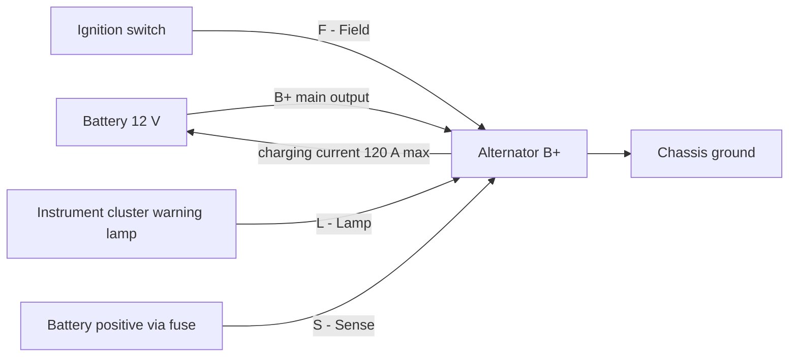
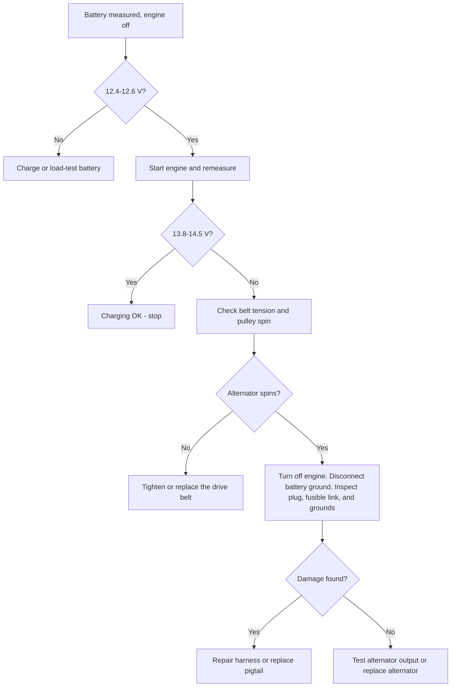
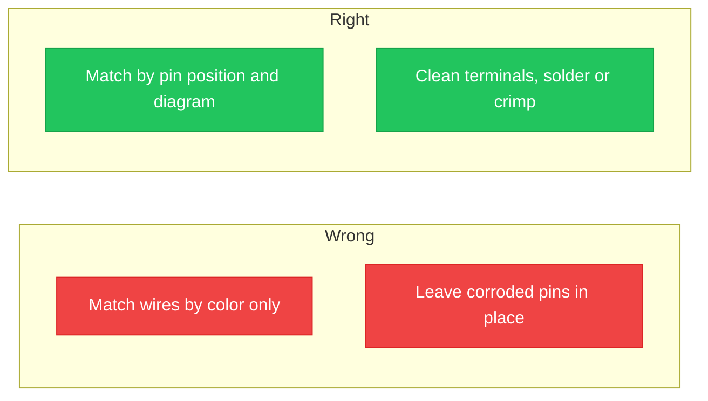

**<b>مخطط توصيل دينمو شاحن كيا سيدونا 2005 هو الرسم التخطيطي الذي يوضح كيفية توصيل الدينمو والبطارية وRegulator الجهد وحزمة الأسلاك داخل دائرة الشحن.</b> يعمل نظام الشحن على شحن البطارية وتزويد النظام الكهربائي بالطاقة عند عمل المحرك.

يُعد مخطط التوصيل رسمًا توضيحيًا لدائرة كهربائية. يُظهر الرسم كل موصل وسلك ولون ونقطة توصيل في كيا سيدونا 2005. يُقرأ تخطيط الأسلاك من وصلة الإخراج الرئيسية B+ إلى البطارية، ومن الموصل الصغير المكون من أربعة أطراف (الرمز المصنع **E-70**) إلى لوحة العدادات ودائرة الإشعال وخط إحساس Regulator الجهد.

هناك 3 فوائد رئيسية لقراءة مخطط توصيل دينمو شاحن:

1. تشخيص عطل الشحن قبل استبدال القطع
2. إعادة توصيل دينمو شاحن جديد أو pigtail بشكل صحيح
3. تجنب تلف Regulator الجهد بسبب التوصيل الخاطئ

يحتوي المخطط على 4 استخدامات رئيسية: استبدال الدينمو، واستكشاف أخطاء نظام الشحن، وإصلاح حزمة الأسلاك والموصلات، وقياس الجهد مقارنةً بالإخراج المدرج. يتكون تخطيط الأسلاك من 5 أجزاء رئيسية: الدينمو، البطارية، Regulator الجهد الداخلي، دائرة مصباح الشحن، وحزمة الأسلاك التي تربطها ببعضها.

يُقدر نظام الشحن في سيدونا V6 2005 بنحو 120 أمبير (A) عند 12 فولت (V). يعمل النظام السليم بجهد شحن يتراوح بين 13.8–14.5 V عند قياسه عبر البطارية أثناء عمل المحرك.

## فهم مخطط توصيل دينمو شاحن

يحوّل الدينمو الطاقة الميكانيكية الدوارة للمحرك، التي ينقلها حزام السير، إلى طاقة كهربائية. يدور الدوار داخل الستاتور ويولّد تيارًا مترددًا (AC). يُحوّل مقوّم الدايود التيار المتردد إلى تيار مستمر (DC). يحافظ Regulator الجهد على الإخراج في نطاق 13.8–14.5 V.

يضع تخطيط مخطط التوصيل الدينمو في المركز مع نقطتي توصيل: وصلة B+ وموصل متعدد الأطراف. تمثل الخطوط في المخطط الأسلاك. يحمل كل سلك علامة لونية تطابق حزمة الأسلاك المصنعية. اقرأ السلك الرئيسي للشحن من البطارية إلى وصلة B+ أولاً، ثم تتبع دوائر الموصل الصغير إلى وجهاتها.

| الموصلات | الاسم | الوظيفة في سيدونا 2005 |
| :--- | :--- | :--- |
| **B+** | الإخراج الرئيسي | سلك مقاس كبير إلى البطارية الإيجابية عبر Fusible Link. يعمل طالما البطارية متصلة. |
| **S** | إحساس | ينقل جهد البطارية إلى Regulator الداخلي. |
| **L** | مصباح | يُشغّل مصباح تحذير الشحن ويُحرّك Field عند التشغيل. |
| **F** | Field / إشعال | يمكّن الشحن عند تدوير مفتاح الإشعال إلى وضع ON. |
| **GND** | عودة التأريض | عودة البطارية السالبة عبر الهيكل المعدني. |

> تستخدم سيدونا 2005 Regulator جهدًا داخليًا. لا تقم أبدًا بتوصيل Regulator خارجي ولا تتجاوز موصل السلك لتشغيل سلك Field مباشرة.

## ترميز الألوان ووظائف الأسلاك

تُعرّف مخططات توصيل كيا كل سلك بمخطط لوني مكون من حرفين. يأتي اللون الأساسي أولاً ثم اللون الشريطي ثانياً. يستخدم دليل سيدونا 2005 المصنعية هذه الأكواد:

| الكود | اللون | الكود | اللون |
| :--- | :--- | :--- | :--- |
| **B** | أسود | **O** | برتقالي |
| **W** | أبيض | **P** | وردي |
| **R** | أحمر | **Br** | بني |
| **G** | أخضر | **Gr** | رمادي |
| **L** | أزرق | **Y** | أصفر |
| **Lg** | أخضر فاتح | **Pp** | بنفسجي |

يُقرأ الكود مثل W/B كسلك أبيض بخط أسود، ويُقرأ B/W كسلك أسود بخط أبيض. يتبع ترميز الألوان أثناء الإصلاحات يمنع التوصيلات المعكوسة التي تتلف Regulator.

على موصل الدينمو، تحمل دوائر الكتلة الصغيرة هذه الوظائف:

- دائرة **L** — تغذية مصباح الشحن؛ عادة ما يكون سلك أحمر أو أسود على الموصل
- دائرة **S** — إحساس؛ عادة ما يكون أبيض
- دائرة **F** — field؛ عادة ما يكون أزرق
- **GND** — عودة تأريض البطارية؛ عادة ما يكون أسود

> تأتي أسلاك pigtail البديلة بألوان مختلفة عن حزمة الأسلاك المصنعية.طابق وظيفة السلك حسب موقع pin في الموصل وليس حسب اللون. اقرأ أرقام pin على وجه الموصل قبل الربط.

يعمل سلك الإخراج B+ بقُطر 6 AWG (13.3 mm²) ويبقى يعمل طالما البطارية متصلة، حتى مع إيقاف الإشعال.

## مشاكل شائعة ونصائح لاستكشاف الأخطاء

هناك 6 أعراض شائعة لأخطاء توصيل الدينمو في سيدونا 2005:

1. يبقى مصباح تحذير الشحن مضيئًا أثناء القيادة
2. تضعف أضواء الأمام عند الخامل وتصبح أوضح مع زيادة سرعة المحرك
3. تنفد البطارية بين الليل والصباح
4. تومض الملحقات الكهربائية
5. رائحة حرق من موصل الدينمو
6. توقف المحرك أو عدم إعادة التشغيل

تظهر المشاكل الشائعة في 5 نقاط في دائرة الشحن: موصل الدينمو، ووصلات البطارية، وFusible Link، وحزام السير، وحزمة التأريض.

**قيم مرجعية لنظام الشحن:**

| الفحص | القراءة السليمة |
| :--- | :--- |
| جهد البطارية، المحرك متوقف | 12.4–12.6 V |
| جهد البطارية، المحرك يعمل | 13.8–14.5 V |
| الإخراج المدرج للدينمو | 120 A |

اتبع دليل استكشاف الأخطاء خطوة بخطوة بالترتيب:

1. قِس البطارية مع المحرك متوقفًا. تدل القراءة الأقل من 12.4 V على أن البطارية مشحونة أو فاشلة. اشحن البطارية أو اخضعها لاختبار الحمل أولاً.
2. شغّل المحرك وأعد القياس عند البطارية. يقرأ نظام الشحن السليم 13.8–14.5 V.
3. إذا ظل الجهد قريبًا من القيمة الساكنة، تحقق من شد حزام السير وتأكد من دوران بكرة الدينمو مع المحرك.
4. أوقف المحرك، وافصل طرف البطارية السالب، وافحص الموصل وحزمة الأسلاك بحثًا عن بلاستيك ذائب أو تآكل أو pins محترقة.
5. تحقق من Fusible Link بين وصلة B+ والبطارية بحثًا عن Fusible Link منفجرًا.
6. اختبر مقاومة حزمة التأريض بين المحرك والهيكل عند وصلات البطارية.
7. أعد توصيل كل شيء، وشغّل المحرك، وتأكد من إطفاء مصباح الشحن.

> إذا لم يشحن الدينمو البديل بعد ذلك، فإن العطل موجود في حزمة الأسلاك أو في التأريض وليس في الدينمو الجديد. اختبر دوائر الموصل قبل استبدال القطع مرة أخرى.

## مساعدة بصرية ومخططات

يُظهر تخطيط الأسلاك في أعلى هذا الدليل مسار B+ عبر Fusible Link ودوائر موصل E-70. الصورة أدناه تربط كل موصل في الدينمو بوظيفته واللون الشائع للسلك:

يُظهر المخطط 5 موصلات: B+ و L و S و F و GND. يسرد كل بطاقة حرف الموصل واسم الدائرة والوظيفة الفعلية للسلك في تخطيط الأسلاك. استخدم الصورة أثناء الإصلاح للتأكد من وظيفة كل سلك قبل إعادة التوصيل.

تظهر أخطاء التوصيل الشائعة إما كعادة خاطئة أو عادة صحيحة. قارن بين العمودين:

هناك 4 أخطاء توصيل شائعة يجب تجنبها:

1. مطابقة دوائر الموصل الصغير حسب اللون بدلاً من موقع pin
2. إعادة استخدام pigtail ذائب أو متآكل
3. ترك وصلة B+ فضاضة أو مشدودةًا أكثر من اللازم
4. تجاهل فصل البطارية السالب وعمل قوس كهربائي من وصلة B+ إلى الهيكل

## احتياطات السلامة

افصل طرف البطارية السالب قبل لمس أي توصيلات الدينمو. تحمل وصلة B+ جهد البطارية الكامل في جميع الأوقات، ويحدث قوس كهربائي عنيف عند لمس وشاح الوصلة والهيكل.

اتبع هذه ال8 احتياطات للسلامة:

1. افصل طرف البطارية السالب أولاً وأعد توصيله أخيراً
2. استخدم أدوات معزولة حول وصلة B+
3. أزِل المجوهرات المعدنية قبل العمل
4. ارتدِ نظارات أمان
5. العمل على محرك بارد؛ يسخن الهيكل الداخلي
6. أبعد الشرر عن البطارية؛ غاز الهيدروجين قابل للاشتعال
7. شد وصلة B+ حسب المواصفات
8. تحقق من قطبية البطارية قبل إعادة التوصيل

> كبل البطارية السالب يُأرضي الهيكل بالكامل. إزالته يعزل دائرة الشحن وهي الخطوة الأهم قبل أي إصلاح كهربائي.

## الخاتمة

فهم مخطط توصيل دينمو شاحن سيدونا يحافظ على موثوقية نظام الشحن ويجعل الإصلاحات الذاتية آمنة. يُظهر تخطيط الأسلاك الأجزاء الرئيسية الخمسة، ويُبرز إخراج B+ إلى البطارية، ويتتبع دوائر الموصل الصغير إلى مصباح الشحن وإحساس وfield.

اقرأ ترميز الألوان قبل لمس أي سلك. يتبع خطوات استكشاف الأخطاء المشاكل الشائعة في موصل الدينمو وFusible Link ووصلات البطارية وحزام السير والتأريض. طبّق احتياطات السلامة قبل أي عمل على النظام الكهربائي.

إذا استمر عطل الشحن بعد فحص التوصيلات، اطلب مساعدة متخصص. Regulator الجهد الموصول بشكل خاطئ يُتلف الدينمو، وفني حاصل على بيانات حزمة الأسلاك المصنعية يعزل العطل بشكل أسرع.

للتدرّب، ارسم واحفظ مخطط نظام الشحن الخاص بك في محرر المتصفح المجاني: [افتح محرر الدوائر](/editor/).