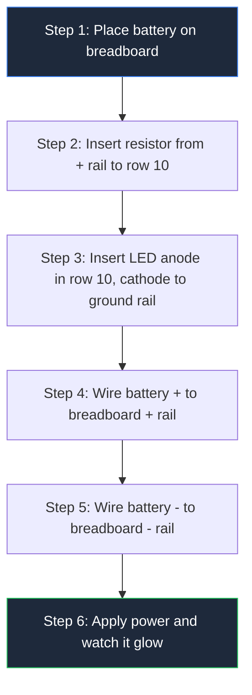
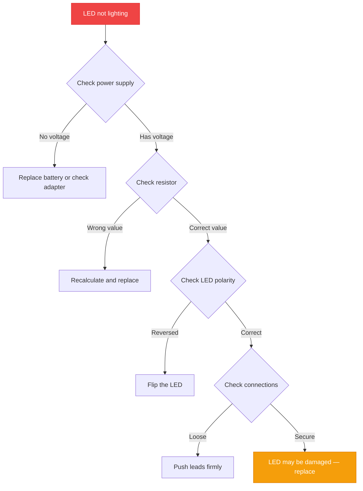

**بناء دارة محرك LED بسيطة يتطلب 3 مكونات و5 دقائق وصفر خبرة سابقة.** يرشدك هذا الدليل عبر كل خطوة — من اختيار الأجزاء إلى اختبار الدارة المنتهية — بحيث يمكنك إضاءة أول LED دون حرقه. إذا كنت جديدًا في الإلكترونيات، ابدأ بدليلنا [مخططات الدوائر للمبتدئين](/blog/circuit-diagram-for-beginners/) لتعلم الأساسيات قبل بناء هذا المشروع.


## لماذا تحرق LEDs بدون محرك

LED هو **جهاز شهق للتيار**. على عكس المصباح، ليس له مقاومة داخلية لإبطاء تدفق الكهرباء. قم بتوصيل بطارية 9V مباشرة بـ LED، سيستهلك LED تيارًا غير محدود — ثم يموت في ثوانٍ.

تحل دارة محرك LED هذه المشكلة. تقع بين مصدر الطاقة والـ LED، وتحكم بدقة مقدار التيار المتدفق عبرها. أبسط إصدار يستخدم **مقاومًا واحدًا**.

> **القاعدة:** كل LED يحتاج مقاوم تحديد تيار. لا استثناءات.

## ما تحتاجه (قائمة المكونات)

| المكون | المواصفات | الغرض |
|-----------|--------------|---------|
| **مصدر الطاقة** | بطارية 9V أو محول USB 5V | يوفر الجهد |
| **LED** | 5mm أحمر (أي لون) | يبث الضوء |
| **مقاومة** | 330Ω (1/4 واط) | تحدد التيار |
| **لوحة تجربة** | أي حجم | منصة بروتوتايب |
| **أسلاك وصلة** | 4× ذكر إلى ذكر | التوصيلات |

**التكلفة الإجمالية:** أقل من 2 دولار في معظم متاجر الإلكترونيات.

## فهم مواصفات LEDs (الرقمان الوحيدان jednocze)

كل LED له مواصفتان حcritان مطبوعتان على ورقة بياناته:

**الجهد الأمامي (Vf)** — انخفاض الجهد عبر LED عند تشغيله. الألوان المختلفة لها قيم مختلفة:

| لون LED | الجهد الأمامي |
|-----------|----------------|
| أحمر | 1.8V – 2.2V |
| أصفر | 2.0V – 2.2V |
| أخضر | 2.0V – 3.0V |
| أزرق | 3.0V – 3.5V |
| أبيض | 3.0V – 3.5V |

**التيار الأمامي (If)** — التيار الذي يحتاجه LED لإنتاج الضوء. معظم LEDs القياسية تعمل بـ **20 مللي أمبير (0.02A)**.

> **نصيحة سريعة:** حزمة LED نفسها تخبرك بالقطبية. **السلك الأطول** هو الأند (+). **الحافة المسطحة** على الجسم تحدد袷ود (−).

## حساب المقاوم (صيغة واحدة)

يتبع قيمة المقاوم <a href="https://en.wikipedia.org/wiki/Ohm%27s_law" rel="nofollow noopener" target="_blank">قانون أوم</a>:

$$R = \frac{V_{supply} - V_{LED}}{I_{LED}}$$

**مثال: LED أحمر مع بطارية 9V**

```
V_supply = 9V
V_LED    = 2V
I_LED    = 0.02A

R = (9V - 2V) / 0.02A = 350Ω
```

استخدم أقرب قيمة قياسية: **330Ω أو 360Ω**.

**مثال: LED أزرق مع USB 5V**

```
R = (5V - 3.2V) / 0.02A = 90Ω → استخدم 100Ω
```

**مثال: LED أبيض مع مصدر 12V**

```
R = (12V - 3.3V) / 0.02A = 435Ω → استخدم 470Ω
```

### فحص تصنيف القدرة

يجب أن يتولى المقاوم أيضًا الحرارة التي يوليدها:

```
P = V × I = 7V × 0.02A = 0.14W
```

مقاوم **قياسي 1/4 واط (0.25 واط)** يتعامل مع هذا مع مساحة زائدة.

## قم بالبناء: خطوة بخطوة



### الخطوة 1: ضع البطارية

قم بتثبيت بطارية 9V على موصلها. وصل **السلك الأحمر** (الموجب) بـ **الشريط الأحمر (+)** للوحة التجربة. وصل **السلك الأسود** (السالب) بـ **الشريط الأزرق (−)**.

### الخطوة 2: أدخل المقاوم

ادفع سلكًا واحدًا من مقاومة 330Ω إلى **الشريط +**. ادفع السلك الآخر إلى **الصف 10** (أي فتحة في ذلك الصف).

### الخطوة 3: وصل LED

حدد أسلاك LED. **السلك الأطول** هو الأند (+). أدخل الأند إلى **الصف 10** (نفس صف المقاوم). أدخل الجانود (السلك الأقصر) إلى **الشريط −**.

### الخطوة 4: الاختبار

يجب أن يضاء LED بإضاءة ثابتة. إذا لم يفعل:

- **تحقق من القطبية** — اقلب LED
- **تحقق من التوصيلات** — ادفع الأسلاك بقوة إلى اللوحة
- **تحقق من قيمة المقاوم** — تأكد أنها 330Ω وليست 33Ω أو 3.3kΩ

## الأخطاء الشائعة (وكيفية تجنبها)

| الخطأ | ماذا يحدث | كيفية إصلاحه |
|---------|--------------|---------------|
| لا مقاوم | يحترق LED فورًا | أضف دائمًا مقاوم تحديد التيار |
| خطأ القطبية | LED لا يضيء | اقلب LED — الأند إلى +، الجانود إلى − |
| مقاوم صغير جدًا | LED ساطع جدًا ثم يموت | استخدم قيمة مقاومة أعلى |
| مقاوم كبير جدًا | LED خافت | استخدم قيمة مقاومة أقل |
| توصيلات مرتخية | LED يتلألأ | ادفع جميع الأسلاك بقوة إلى اللوحة |

## عدة LEDs متسلسلة

هل تريد إضاءة اثنين أو أكثر من LEDs من مصدر واحد؟ وصلهم بشكل متسلسل (سلسلة أند إلى جانود):

```
Total V_LED = Vf₁ + Vf₂ + Vf₃ + ...

R = (V_supply - Total V_LED) / I_LED
```

**مثال: ثلاثة LEDs حمراء (2V لكل واحد) مع مصدر 12V**

```
Total V_LED = 2V + 2V + 2V = 6V
R = (12V - 6V) / 0.02A = 300Ω → استخدم 330Ω
```

## متى تحتاج أكثر من مقاوم

تعمل المقاوم للدوائر البسيطة ذات LED الواحد. للتطبيقات الأكثر تقدمًا، تحتاج محركات مخصصة:

| نوع المحرك | حالة الاستخدام | مثال |
|-------------|----------|---------|
| **مقاومة** | LED واحد، مصدر ثابت | أضواء المؤشرات |
| **محرك ترانزستور** | تشغيل LEDs عالية التيار | إضاءة السيارات |
| **محرك IC** | تيار ثابت، خفت | شرائط LEDs، العروض |
| **محكم PWM** | التحكم في السطوع | إضاءة المنزل الذكي |

## قائمة السلامة

- **استخدم دائمًا مقاومًا** — حتى للدوائر منخفضة الجهد
- **افصل الطاقة** قبل تعديل الدارة
- **تحقق من القطبية** قبل تطبيق الطاقة
- **استخدم تصنيفات قدرة مناسبة** — مقاوم 1/8 واط في دارة 1 واط ستحترق
- **التخلص من LEDs الميتة** مع النفايات الإلكترونية، وليس القمامة العادية

## مخطط استكشاف الأخطاء وإصلاحها



## مشاريع واقعية

بمجرد إتقان دارة محرك LED الأساسية، يمكنك بناء:

- **مؤشرات حالة Arduino** — إشارات حالات البرنامج بألوان LEDs
- **أضواء لوحة السيارة** — إضاءة مخصصة لمجموعة العدادات
- **أضواء ليلية** — دوائر LED منخفضة الطاقة مع مستشعرات الضوء
- **تركيبات فنية LEDs** — عروض المصفوفات وأجهزة POV
- **مؤشرات الطوارئ** — أضواء تحذير مدعومة بالبطارية

لمزيد من نصائح تصميم الدوائر، راجح دليلنا على [أفضل ممارسات مخطط الدوائر](/blog/circuit-diagram-maker-best-practices/).

## ما الخطوة التالية

تدرب على بناء الدارة بألوان LEDs مختلفة وقيم مقاومات مختلفة. كل لون له جهد أمامي مختلف، لذلك يتغير حساب المقاوم. بمجرد أن تعتاد على دوائر LED الواحد، استكشف محركات الترانزستور لتشغيل LEDs تشغيلًا وإطفاءً بمتحكم مثل <a href="https://www.arduino.cc/en/Guide" rel="nofollow noopener" target="_blank">Arduino</a>.

تعلم [كيفية قراءة مخطط الدائرة](/blog/how-to-read-a-circuit-diagram-step-by-step-guide/) لفهم المخططات الأكثر تعقيدًا. عندما تكون مستعدًا لتصميم دوائرك الخاصة، استخدم [مخطط الدائرة عبر الإنترنت](/blog/how-to-make-circuit-diagram-online/) لإنشاء مخططات احترافية.
