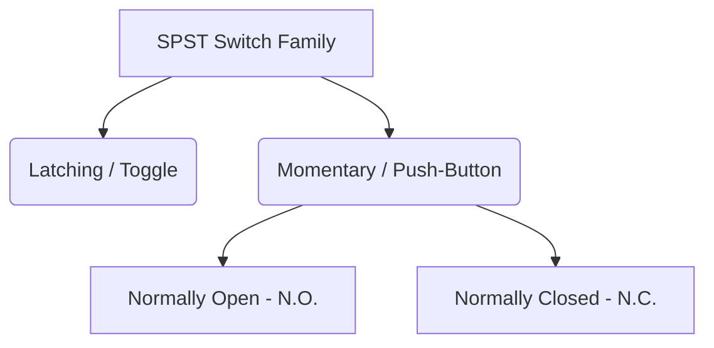

في قلب كل واجهة يستخدمها البشر للتحكم في الكهرباء يوجد المفتاح الميكانيكي. إن التجسيد الأبسط والأكثر انتشارًا لهذا المكون هو **SPST**، أو مفتاح الرمي الفردي ذو القطب الواحد.

سواء كنت تصمم قاطع التيار الكهربائي عالي الجهد أو ببساطة ترسم زر ضغط على لوحة تجارب Arduino، فإن رمز SPST هو نقطة البداية المنطقية لك.

## 1. ماذا تعني كلمة SPST فعليًا

يصنف المهندسون المفاتيح باستخدام متغيرين: **الأعمدة** و **الرميات**.

* **القطب (P):** عدد الدوائر الكهربائية المستقلة التي يمكن للمفتاح التحكم بها في وقت واحد. 
* **الرمي (T):** عدد الحالات المغلقة (ON Positions) لكل قطب.

ولذلك، فإن SPST عبارة عن *قطب واحد* (يتحكم في دائرة واحدة) و *رمية مفردة* (له موضع موصل مغلق واحد فقط).

```mermaid
flowchart LR
    A[Human Input] --> B((SPST Mechanism))
    B -- Open / Default --> C[Infinite Resistance / OFF]
    B -- Closed / Actuated --> D[Zero Resistance / ON]
    
    style B fill:#0f172a,stroke:#f59e0b
```

## 2. قراءة الرمز التخطيطي SPST

يعد رمز IEEE القياسي لمحول SPST بديهيًا للغاية - فهو يشبه حرفيًا ما يفعله.

| العنصر البصري | المعنى في العالم الحقيقي |
| :--- | :--- |
| **دائرتان مفتوحتان** | منصات الاتصال الكهربائية الثابتة حيث تنتهي الأسلاك. |
| **خط قطري متقطع** | الذراع الموصل الميكانيكي، منفصل فعليًا عن اللوحة الثانية للإشارة إلى الحالة الافتراضية "المفتوحة". |
| ** المُحدد (`S` أو `SW`)** | العلامات المرجعية القياسية. على سبيل المثال، `SW1`. |

> **افتراض الحالة الطبيعية:** ما لم ينص على خلاف ذلك، يتم سحب المفاتيح الميكانيكية في **حالة السكون غير المشغلة**. بالنسبة لمفتاح الإضاءة SPST القياسي، فهذا يعني أن المخطط يصوره على أنه متوقف عن التشغيل.

## 3. الاختلافات في SPST: أزرار الضغط

يظل مفتاح التبديل في مكانه (الإغلاق). يتم تشغيل زر الضغط فقط أثناء وجود إصبعك عليه (لحظة). وينطبق تعيين SPST على كليهما، ولكن تتغير الرموز قليلاً لتمييز أوضاع التفاعل البشري.

| نوع التبديل | التغيير التخطيطي | مثال من العالم الحقيقي |
| :--- | :--- | :--- |
| ** زر الضغط (NO) ** | بدلاً من الذراع المائلة، يوجد جسر مسطح يحوم *فوق* وسادتي الاتصال. الضغط للأسفل يسد الفجوة. | مفاتيح لوحة المفاتيح، وأزرار الطاقة للكمبيوتر، وأزرار جرس الباب. |
| ** زر الضغط (NC) ** | يقع الجسر المسطح *تحته* أو يلامس الوسادات، مما يحافظ على تشغيل الدائرة بشكل افتراضي. يؤدي الضغط لأسفل إلى قطع الاتصالات. | أزرار التوقف في حالات الطوارئ (E-Stop) على الآلات الثقيلة. |

## 4. تحذيرات بشأن تنفيذ الأجهزة

عند دمج مفتاح SPST في دائرة منطقية رقمية (مثل دبوس Raspberry Pi GPIO)، سيؤدي التصميم التخطيطي الساذج إلى سلوك برمجي لا يمكن التنبؤ به بشكل كارثي.

### مشكلة "الدبوس العائم".

إذا قمت بتوصيل جانب واحد من مفتاح SPST إلى 5V والجانب الآخر مباشرة إلى طرف متحكم دقيق، فماذا يحدث عندما يكون المفتاح مفتوحًا؟ لا يقرأ الدبوس 0V، فهو منفصل و"عائم"، ويعمل كهوائي يلتقط الكهرومغناطيسية المحيطة.

**الإصلاح: المقاومات المنسدلة**

قم دائمًا بتضمين مقاوم (عادةً 10 كيلو أوم) متصل بين الطرف الرقمي والأرضي.

1. **إيقاف التشغيل:** يقرأ الدبوس 0V بشكل آمن من خلال المقاوم.
2. ** تشغيل: ** يفوق مصدر 5 فولت قوة المقاوم، مما يؤدي إلى حالة عالية آمنة.

قم بدمج أشكال SPST في تصميماتك بشكل آمن عبر **[محرر مخططات الدائرة](/editor/)**. قم بتوسيع مكتبة "Switches" اليسرى للعثور على N.O. وتطبيقات NC!