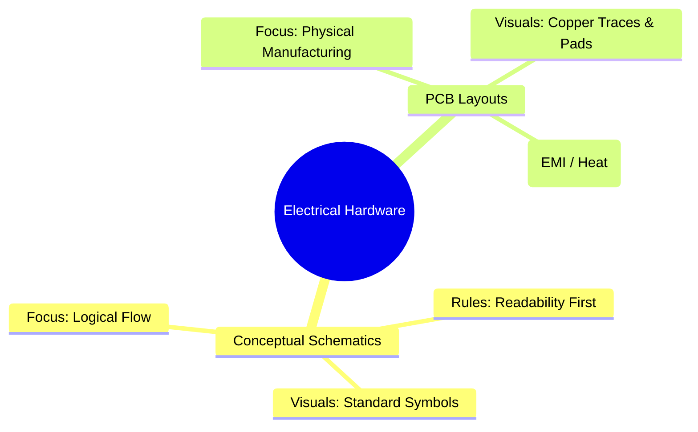
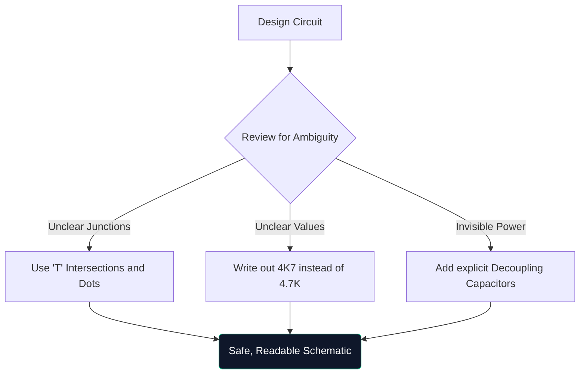

مرحبًا بك في الدورة التدريبية النهائية حول مخططات الدوائر الكهربائية. سواء كنت تقوم باختراق نماذج Arduino الأولية في عطلة نهاية الأسبوع أو تدرس الهندسة الكهربائية، فإن فهم الهندسة المعمارية التخطيطية أمر غير قابل للتفاوض.

يتجاوز هذا الدليل الأساسيات، ويقيم كيفية إنشاء المخططات الحديثة والتحقق منها وتصنيعها.

## الخطط النظرية مقابل تخطيطات ثنائي الفينيل متعدد الكلور

هناك نقطة ارتباك شائعة جدًا وهي الفرق بين الرسم التخطيطي وتخطيط لوحة الدوائر المطبوعة (PCB). إنها تمثيلات مختلفة تمامًا لنفس الحقيقة الكهربائية.

| السمة | رسم تخطيطي | تخطيط ثنائي الفينيل متعدد الكلور |
| :--- | :--- | :--- |
| **الغرض** | لفهم *كيفية* عمل الدائرة بشكل منطقي | لإملاء *أين* يذهب النحاس فعليًا |
| **تمثيل المكون** | رموز مجردة (المثلثات والمتعرجات) | منصات البصمة المادية 1:1 (على سبيل المثال، SOIC-8، 0805) |
| ** اتصالات ** | خطوط هندسية مثالية | آثار نحاس بزاوية 45 درجة |
| **البيئة** | ورق خلفية أبيض نظيف | مساحة ثلاثية الأبعاد حرفية متعددة الطبقات |

## تشريح مخطط متقدم

عندما تنمو الدوائر لتتجاوز 100 مكون، تتغير النماذج البصرية. لا يمكنك ببساطة توصيل كل شيء بالأسلاك المسحوبة.

1. **كتل العناوين**: تتميز المخططات الاحترافية دائمًا بكتلة في الزاوية اليمنى السفلية تشير إلى اسم الشركة، ومهندس السجل، ورقم المراجعة، والتاريخ.
2. **ملصقات ومنافذ الشبكة**: لا تقوم الأسلاك بتوصيل الأنظمة الفرعية؛ التسميات المسماة تفعل ذلك. إذا تم تسمية سلكين بـ CLK_OUT، فإنهما متصلان كهربائيًا، حتى لو كانا على صفحات مختلفة.
3. **الكتل الهرمية**: تستخدم التصميمات الضخمة (مثل اللوحة الأم للكمبيوتر) التسلسل الهرمي. تحتوي كتلة واحدة مستطيلة تسمى "واجهة الذاكرة" على صفحة تخطيطية منفصلة تمامًا بداخلها.

## قاعدة "الرسم الدفاعي"

على غرار القيادة الدفاعية، يعني الرسم الدفاعي افتراض أن الشخص الذي يقرأ مخططك سوف يسيء فهمه ما لم تقم بتوجيهه بشكل صريح.

> **لماذا أكتب `4K7`؟** في المخططات المطبوعة أو المنسوخة، تختفي العلامة العشرية الصغيرة (`.`) بسهولة بسبب الشوائب. إن كتابة "4.7K" تخاطر بأن يقرأها شخص ما على أنها "47K"، مما قد يؤدي إلى احتراق أحد المكونات. إن كتابة `4K7` تجعل المضاعف بمثابة العلامة العشرية، مما يزيل عمليًا القراءة الخاطئة.

## الانتقال إلى أدوات CAD الرقمية

يعد الرسم على ورق الرسم البياني أمرًا ممتازًا للعصف الذهني، ولكنه غير مفيد عمليًا للإنتاج. عندما تقوم بترحيل تصميماتك إلى أداة مثل [Circuit Diagram Maker](/editor/)، فإنك تكتسب العديد من القوى الخارقة:

* **Netlists**: أدوات رقمية تثبت الاتصالات الرياضية.
* **قابلية إعادة الاستخدام**: يؤدي نسخ ولصق مصادر الطاقة المعقدة المنظمة من المشاريع السابقة إلى توفير ساعات.
* **جودة المتجهات**: يضمن التصدير بتنسيق SVG خطوطًا واضحة تمامًا بغض النظر عن مقدار التكبير.

إن القفزة من النظرية إلى الواقع تبدأ بخط مرسوم جيدًا. ابدأ رحلتك اليوم!