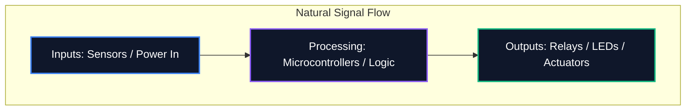

Независимо дали споделяте диаграма във форум или я изпращате за професионално производство на печатни платки, четливостта на вашата схема е също толкова важна, колкото и нейната логическа коректност. Обърканата схема води до грешки при маршрутизиране, неразбрани компоненти и загуба на време.

Това ръководство очертава основните най-добри практики, използвани от професионалните инженери по електроника за създаване на чисти, лесни за поддръжка и лесно четими електрически схеми.

## 1. Поток на схемата: отляво надясно, отгоре надолу

Схемата е технически документ и като всеки документ трябва да се чете естествено. В дизайна на електрониката стандартната конвенция диктува входовете да протичат отляво, а изходите да излизат отдясно.

По същия начин по-високите напрежения трябва изрично да бъдат поставени в горната част на схемата, а по-ниските напрежения или земята в долната част.



## 2. Символи за захранване и заземяване

Никога не изтегляйте дълги, намотаващи се проводници, свързващи всеки отделен заземяващ щифт. Създава паяжина, която е невъзможна за четене. Вместо това използвайте местни символи за захранване и заземяване на компонента.

| Лоша практика | Най-добра практика | Защо има значение |
| :--- | :--- | :--- |
| Свързване на всички земи с един непрекъснат проводник | Използване на местни символи `GND` при всеки компонент | Намалява визуалното безпорядък; изрично дефинира пътища за връщане без сложно проследяване |
| Поставяне на VCC линии, пресичащи сигнални следи | Използване на локални `VCC` / `+5V` символи, сочещи нагоре | Предотвратява визуалното объркване на сигналните линии с подаването на енергия |
| Етикетиране на различни основания с един и същи символ | Разграничаване на аналогово заземяване (AGND) и цифрово заземяване (DGND) | От решаващо значение за избягване на заземителни контури и разпространение на шум в проекти със смесен сигнал |

## 3. Разклонителни точки срещу кръстовища

Една от най-опасните грешки в схематичното проектиране е двусмислието на местата, където жиците се пресичат.

```mermaid
graph TD
    A[Is it a connection?]
    A --> B{Is there a junction dot?}
    B -- Yes --> C[Wires are electrically connected (Node)]
    B -- No --> D[Wires are crossing without connecting]
    
    style A fill:#1e293b,stroke:#f59e0b
    style C fill:#1e293b,stroke:#10b981
    style D fill:#1e293b,stroke:#ef4444
```

> **Професионален съвет:** Никога не използвайте "4-посочни" кръстовища (кръст във формата на "+"). Ако трябва да се срещнат четири проводника, изместете ги в две 3-посочни „T“ кръстовища. Това напълно премахва двусмислието; ако съединителната точка изчезне при отпечатване или мащабиране, формата „T“ все още недвусмислено предполага връзка, докато голият кръст не го прави.

## 4. Групиране на логически компоненти

Когато работите с големи схеми, съдържащи микроконтролери с 64+ извода, опитът да изтеглите всеки проводник физически към компонента е безсмислено упражнение. Вместо това професионалните инструменти използват **Мрежови етикети**.

Групирайте функционални блокове на вашата верига във визуални зони. Например, поставете захранването в единия ъгъл, MCU в центъра и двигателните драйвери в друг. Свържете ги само с помощта на описателни мрежови етикети (напр. `SPI_MOSI`, `UART_TX`, `MOTOR_PWM`).

## 5. Референтни обозначения и стойности

Голият символ на резистор не казва нищо на зрителя. Всеки компонент трябва да има уникален референтен обозначение и изрична стойност.

| Категория на компонента | Стандартен префикс | Пример |
| :--- | :--- | :--- |
| **Резистори** | `R` | „R1 (10kΩ)“ |
| **Кондензатори** | `C` | „C4 (100nF)“ |
| **Интегрални схеми** | „U“ или „IC“ | „U2 (LM358)“ |
| **Диоди / светодиоди** | `D` | „D1 (1N4148)“ |
| **Транзистори / MOSFETs** | „Q“ | „Q1 (2N2222)“ |
| **Индуктори** | `L` | „L1 (4,7 μH)“ |
| **Конектори/Заглавки** | „J“ или „P“ | „J1 (захранващ жак)“ |

Спазването на тези конвенции гарантира, че вашата схема ще бъде незабавно разбрана от всеки инженер, навсякъде по света. Започнете да прилагате тези правила още днес в [Редактора на електрически схеми](/editor/).