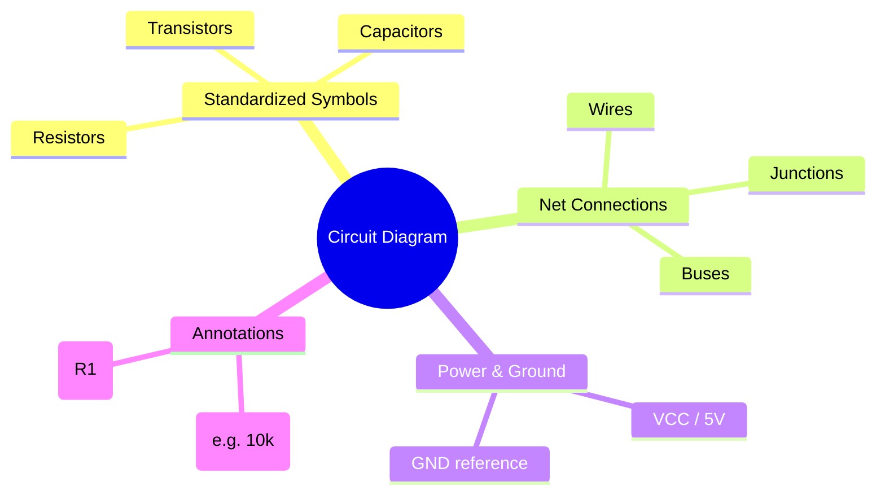
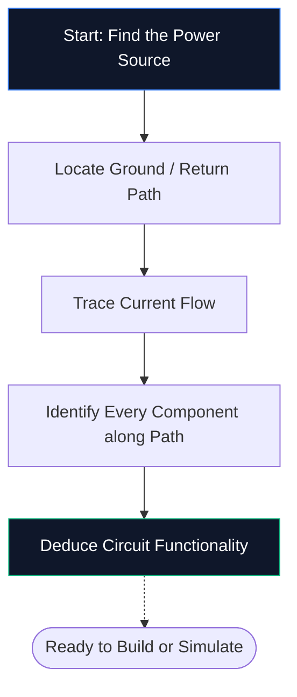

Ако никога преди не сте отваряли редактор на схеми, това е единственото ръководство, от което се нуждаете. Ще разгледаме основите — какво е електрическа схема, как да декодирате символите и как да начертаете първата си схема в **Circuit Diagram Maker** — всичко това без да инсталирате нито един софтуер.

## Какво точно е електрическа схема?

Схемата на веригата е карта за електричество. Точно както картата на метрото показва как станциите се свързват, без да изобразява тунелите в мащаб, електрическата диаграма показва как електронните компоненти се свързват, без да се притеснявате за физическия размер или разположението на платката.

Вместо реалистични чертежи, схемите използват **стандартизирани символи**. Резисторът изглежда като зигзагообразна линия, кондензаторът като две успоредни плочи, а диодът като триъгълник, пресичащ лента. Тази универсална стенограма поддържа диаграмите чисти, отпечатани и четими във всяка държава и език.

> **Защо абстракциите имат значение:** Физическият резистор е малък цилиндър с цветни ленти, но върху 50-компонентна схема този детайл би създал визуален хаос. Символите компресират картината, така че мозъкът ви да може да се съсредоточи върху *как нещата се свързват*, а не върху *как изглеждат*.

## 10-те символа, които трябва да знаете за всеки начинаещ

Преди да можете да прочетете — или да нарисувате — една схема, трябва да разпознаете основните градивни елементи. Запомнете таблицата по-долу и ще можете да декодирате повечето вериги за любители на място.

| Форма на символ | Компонент | Основна функция | Обозначение |
| :--- | :--- | :--- | :--- |
| **Зигзагообразна линия** | Резистор | Ограничава текущия поток | `R` |
| **Две успоредни линии** | Кондензатор | Запазва заряда, филтрира шума | `C` |
| **Поредица от цикли** | Индуктор | Съхранява енергия в магнитно поле | `L` |
| **Триъгълник + лента** | Диод | Позволява ток в една посока | `D` |
| **Триъгълник + лента + стрелки** | LED | Излъчва светлина, когато е насочен напред | `D` / `LED` |
| **Дълги / къси успоредни линии** | Батерия | Осигурява постоянно напрежение | `BT` |
| **Три подредени реда** | Земя | Референтна точка при 0 V | `GND` |
| **Триъгълна форма** | Операционен усилвател | Усилва разликата в напрежението | `U` / `IC` |
| **Правоъгълник с карфици** | Интегрална схема | Изпълнява сложни функции | `U` / `IC` |
| **Прави линии** | Проводници | Пренасяне на ток между компонентите | *(Няма)* |

## Как да прочетете схема в пет стъпки

Четенето на електрическа схема следва един и същ умствен процес всеки път. Практикувайте тези пет стъпки върху всяка схема и моделът ще стане втора природа.

1. **Намерете източника на захранване** — Потърсете символ на батерия или етикети като VCC, 5 V или 3,3 V. Това е мястото, където електрическата енергия влиза във веригата.
2. **Намерете заземяване** — Намерете триредовия символ за заземяване или GND етикет. Всяка верига трябва да има обратен път.
3. **Проследяване на текущия поток** — Следвайте проводниците от положителния извод, през всеки компонент и обратно към земята. Конвенционалният ток протича от положителен към отрицателен.
4. **Идентифицирайте всеки компонент** — Свържете всеки символ с таблицата по-горе, след което прочетете етикета до него за точните стойности (например 10 kΩ означава 10 000 ома).
5. **Разберете целта** — Запитайте се какво прави веригата. Светодиод плюс резистор е обикновен светлинен индикатор. Операционен усилвател с резистори за обратна връзка е усилвател на сигнала.

## Вашата първа схема: LED веригата

Всеки начинаещ в областта на електрониката започва тук — светодиод, захранван от токоограничаващ резистор. Отворете [редактора на Circuit Diagram Maker](/editor/) и следвайте.

**Тръбопровод на архитектурата на веригата:**

```mermaid
graph LR
    PWR(Battery 9V) -- Positive Wire --> R1(Resistor 330Ω)
    R1 -- Controlled Current --> D1((Red LED))
    D1 -- Return Path --> GND(Ground)
    
    style PWR fill:#1e293b,stroke:#f59e0b
    style R1 fill:#1e293b,stroke:#3b82f6
    style D1 fill:#1e293b,stroke:#ef4444
    style GND fill:#1e293b,stroke:#64748b
```

**Инструкции стъпка по стъпка:**

1. Плъзнете символ **Батерия** от страничната лента върху платното.
2. Поставете **Резистор** отдясно на батерията.
3. Поставете **LED** вдясно от резистора.
4. Натиснете **W**, за да активирате кабелен режим.
5. Щракнете върху положителния извод на батерията, след това щракнете върху левия щифт на резистора, за да начертаете проводник.
6. Свържете десния щифт на резистора към LED анода.
7. Свържете LED катода обратно към отрицателния извод на батерията.
8. Щракнете двукратно върху резистора и въведете **330 Ω**.
9. Щракнете върху **Експортиране → SVG**, за да запишете файл с качество на публикация.

## Пет често срещани грешки (и как да ги избегнем)

| Грешка | Какво се обърква | Бързо коригиране |
| :--- | :--- | :--- |
| **Липсващ земен път** | Веригата изглежда отворена; ток не може да тече | Винаги свързвайте обратен път към земята |
| **Пресичане на жици без точки** | Два проводника, които се пресичат, изглеждат свързани, когато не са | Добавете съединителна точка само там, където проводниците действително се свързват |
| **Няма стойности на компоненти** | Рецензентите не могат да проверят вашия дизайн | Етикетирайте всеки резистор, кондензатор и IC |
| **Объркано окабеляване** | Диагоналните или припокриващите се проводници намаляват четливостта | Използвайте маршрутизиране на Манхатън (само хоризонтално и вертикално) |
| **Без референтни обозначения** | Списъкът с части става невъзможен за създаване | Етикетирайте всяка част R1, C1, U1, D1 и т.н. |

## Накъде да отида след това

След като се научите да рисувате основни схеми, проучете тези ресурси, за да преминете на ниво:

* **[Обяснение на символите на електрическата схема](/blog/circuit-diagram-symbols-explained/)** — потопете се дълбоко във всяка категория символи
* **[Как да си направим електрическа схема онлайн](/blog/how-to-make-circuit-diagram-online/)** — усъвършенствани техники и съвети за работен процес
* **[Библиотека с компоненти](/components/)** — прегледайте всичките 40+ символа, налични в Circuit Diagram Maker