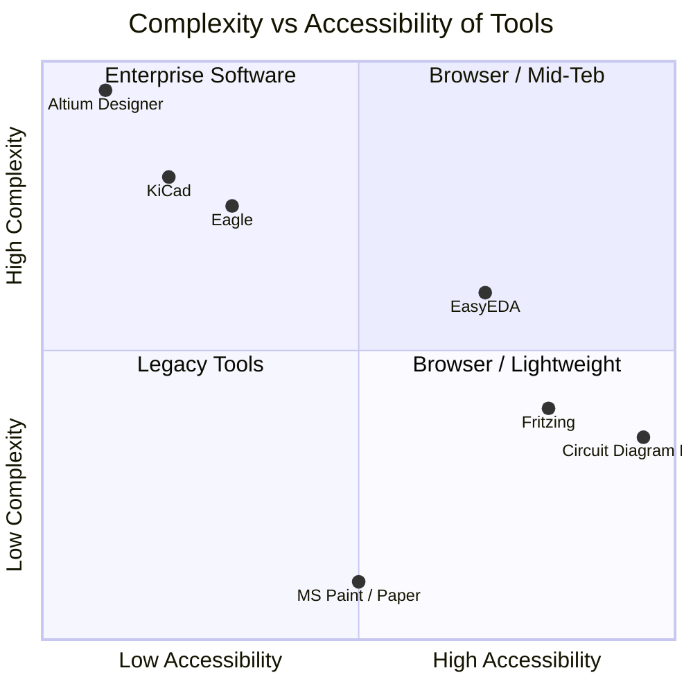
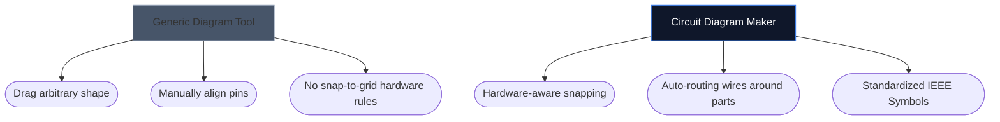

Изборът на правилния инструмент за начертаване на схемите на вашата електроника често може да диктува колко бързо можете да повторите нов хардуерен проект. Докато напредналите дизайнери на печатни платки изискват тежка настолна среда, любителите, студентите и производителите често се нуждаят от нещо съвсем различно: достъпност и скорост.

По-долу анализираме как нашият инструмент се сравнява с основните алтернативи в индустрията.

## Матрица за категоризиране на инструменти

Преди да се потопите в отделните инструменти, е изключително важно да разберете какво ниво на софтуер всъщност изисква вашият проект. Използването на корпоративния софтуер за печатни платки за скициране на 4-компонентно LED оформление е прекалено.

## 1. Създател на електрическа схема срещу Fritzing

Fritzing е известен с това, че преодолява пропастта между прототипирането на макета и схемите. Fritzing обаче изисква инсталация и се бори с актуализации за поддръжка през годините.

| Характеристика | Създател на електрическа схема | Фрицинг |
| :--- | :--- | :--- |
| **Основен фокус** | Стандартни схематични оформления | Визуализации на макет |
| **Инсталация** | Няма (100% базирано на браузър) | Изисква се инсталация на работния плот |
| **Цена** | 100% безплатно | Платено (Donationware) |
| **Крива на обучение** | Изключително ниско | Умерен |

> **Присъдата:** Ако конкретно трябва да визуализирате физически проводници, потопени в макет, Fritzing е по-добър. Ако имате нужда от стандартни, универсални електронни схеми *незабавно*, използвайте Circuit Diagram Maker.

## 2. Създател на електрически схеми срещу KiCad & Altium

KiCad е легендарен пакет за печатни платки с отворен код, а Altium Designer е корпоративният индустриален стандарт. Те са изключително силни.

| Слой на възможностите | Създател на електрическа схема | KiCad / Altium |
| :--- | :--- | :--- |
| **Тип изход** | SVG/PNG изображения | Gerber файлове, BOM, Pick&Place |
| **Симулация** | Визуално / опростено | Дълбока SPICE интеграция |
| **Скорост до първата схема** | < 10 секунди | 10–30 минути (Настройка/Конфигурация) |

> **Присъдата:** Използвайте KiCad или Altium, когато изпращате пластове мед във фабрика в Шенжен. Използвайте Circuit Diagram Maker, когато прикачвате схема към задача по физика, публикация в блог или въпрос във форум.

## 3. Създател на електрически схеми срещу draw.io / Lucidchart

Генеричните инструменти за диаграми като draw.io са невероятно популярни за блок-схеми. Въпреки това им липсва семантично разбиране на електрониката.

Когато използвате специален инструмент за електроника, редакторът разбира, че един проводник не може просто да „прекъсне“ произволно без кръстовище и той по своята същност картографира стандартни свойства (като омове към резистори).

## Кой инструмент е подходящ за вас?

Най-добрият инструмент е този, който се измъква от пътя ви. За бързи идеи, образователни задачи и уеб публикации [Circuit Diagram Maker](/editor/) предлага ненадмината комбинация от скорост и модерна естетика.