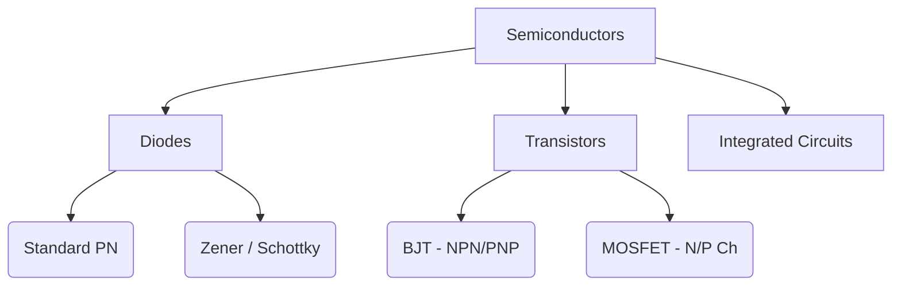

Електронните символи са универсалният език на хардуерното инженерство. Точно както музикалните ноти диктуват височината и ритъма, символите на веригата предават електрическа функция, свойства и свързаност върху лист хартия.

В това изчерпателно ръководство ние анализираме визуалната морфология на най-важните елементи, които ще срещнете във всяка схема.

## Глобални стандартни разлики: IEEE срещу IEC

Преди да се потопите в конкретни символи, е изключително важно да разберете, че символите могат да изглеждат различно в зависимост от това къде е начертана схемата. Двата доминиращи стандарта са **IEEE/ANSI** (предимно Америка) и **IEC** (Европа и международни).

```mermaid
flowchart LR
    subgraph Regional Standards
    A((Schematic Origin))
    A -- US / Americas --> B[IEEE / ANSI]
    A -- Europe / Int'l --> C[IEC]
    end
    
    B -.-> D(Zigzag Resistors)
    C -.-> E(Rectangle Resistors)
    
    style B fill:#1e293b,stroke:#f59e0b
    style C fill:#1e293b,stroke:#3b82f6
```

В Circuit Diagram Maker ние използваме предимно стандарта IEEE/ANSI, тъй като той остава много популярен в цифровите и любителските екосистеми, въпреки че и двата са технически правилни.

## Пасивни компоненти

Пасивните компоненти не изискват външен източник на захранване, за да работят и не могат да усилят сигнал.

| Компонент | Стандартен външен вид на символа | Функционално описание |
| :--- | :--- | :--- |
| **Резистор** | Дефиниран от остра, назъбена зигзагообразна линия. Променливите варианти включват стрелка, пробиваща линията. | Разсейва мощността като топлина, за да ограничи потока на електрически ток. |
| **Кондензатор** | Две успоредни линии, разделени с празнина. Поляризираните варианти извиват една от линиите, за да обозначат отрицателния извод. | Съхранява електрическа енергия временно в електрическо поле. |
| **Индуктор** | Поредица от заоблени бримки или полукръгове, представляващи намотки от тел. | Противопоставя се на промените в текущия поток чрез съхраняване на енергия в магнитно поле. |

## Активни компоненти (полупроводници)

Активните компоненти изискват източник на захранване и могат да контролират потока на електричество, като често усилват сигналите.

| Компонент | Визуални индикатори | Основно използване |
| :--- | :--- | :--- |
| **Диод** | Триъгълник, насочен към равна линия. Линията показва катода (отрицателен). | Еднопосочен вентил за електричество. |
| **LED** | Стандартен диоден символ с две малки стрелки, сочещи навън, което означава излъчване на светлина. | Визуални индикатори и оптоелектроника. |
| **BJT транзистор** | Вертикална линия, оградена от три връзки: основа, колектор и емитер със стрелка, диктуваща NPN или PNP. | Ключове и усилватели с управление на тока. |
| **MOSFET** | Разполага с разделени гранични линии, подчертаващи изолирания порт и вътрешни диоди на субстрата. | Превключване с контролирано напрежение за висока мощност. |

## Механични и изходни устройства

Тези части взаимодействат с физическия свят, като приемат човешка информация или генерират физически резултат.

| Компонент | Схематична стенография | Приложение |
| :--- | :--- | :--- |
| **Превключване (SPST)** | Прекъсната линия, която може да се завърти надолу, за да завърши веригата. | Основен ON/OFF контрол на мощността. |
| **Щафета** | Обикновено се изобразява като индуктор (вътрешната намотка), свързан с изолирани контакти на превключвателя. | Превключване на товари с високо напрежение чрез микроконтролери за ниско напрежение. |
| **Мотор** | Кръг, съдържащ „М“, често с обозначени положителни и отрицателни клеми. | Преобразуване на електрически ток в ротационна кинетика. |

> **Съвет за дизайна:** Когато използвате механични превключватели или релета, винаги включвайте *flyback диод* при индуктивни товари, за да защитите вашите полупроводникови компоненти от пикове на напрежението!

Разбирането на тези символи е първата стъпка към плавното владеене на веригата. Вижте нашия [онлайн редактор](/editor/), за да плъзгате, пускате и експериментирате незабавно с тези форми.