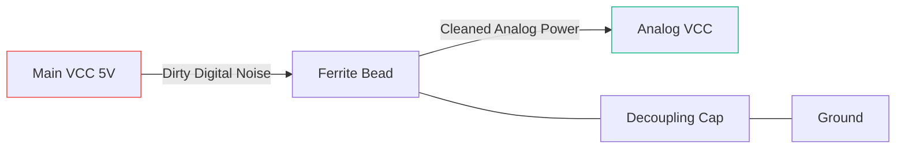

Високоскоростната цифрова електроника създава много електромагнитен шум. Без смекчаване, тази високочестотна интерференция прониква в чувствителните аналогови линии или се излъчва навън, което кара вашето устройство да се провали впечатляващо при теста за емисии на FCC.

Основното оръжие срещу тази намеса е **феритното зърно**. Разбирането на неговия схематичен символ и разположение диктува дали вашата верига работи чисто или се удавя в собствения си шум.

## 1. Визуализиране на символа на феритно перло

Феритното зърно по своята същност работи като индуктор със силни загуби. Поради това неговият схематичен символ е тясно свързан със стандартния символ на индуктор, но е пригоден да подчертае специфичната му роля.

```mermaid
graph LR
    A[Inductor Basis] --> B(Standard Inductor Symbol)
    A --> C(Rectangle Over Wire)
    B -.-> D(Addition of a dashed line or solid bar)
    D --> E[IEEE Ferrite Symbol]
    C --> F[IEC Ferrite Symbol]
    
    style E fill:#0f172a,stroke:#3b82f6
    style F fill:#0f172a,stroke:#10b981
```

| Черта | IEEE/ANSI стандарт | IEC стандарт | Бележки |
| :--- | :--- | :--- | :--- |
| **Форма** | Серия от полукръгове с лента/кутия | Плътен правоъгълен блок | Функционално идентичен по резултат |
| **Префикс за обозначаване** | `FB` | `FB` или `L` | Използването на `FB` е силно препоръчително, за да се предотврати объркване с мощностни индуктори |
| **Мерна единица** | Оми (Ω) при определени MHz | Оми (Ω) при определени MHz | За разлика от индукторите, измерени в Henries (H) |

> **Решаващо разграничение:** Никога не оценявайте феритно зърно по индуктивност. Феритните перли се определят от техния **импеданс (в ома) при определена честота** (обикновено 100 MHz).

## 2. Основна оперативна механика

Защо да използвате феритно зърно вместо стандартен индуктор?

* Един **индуктор** съхранява енергия и я връща към веригата. Той е силно реактивен и запазва енергия.
* **Феритното зърно** е активно проектирано да бъде *загубено*. При високи честоти той се държи като резистор, преобразувайки нежелания високочестотен шум директно в топлина.

| Честотен диапазон | Поведение на феритни перли | Резултат на Circuit |
| :--- | :--- | :--- |
| **Ниска честота / DC** | Под 1 MHz | Действа като обикновен проводник (~0 Ω). DC захранването преминава свободно. |
| **Резонансна честота** | Силно реактивен | Съхранява енергия за кратко. |
| **Висока честота** | Над 50 MHz+ | Действа като резистор с висока стойност. Блокира и разсейва радиочестотния шум като топлина. |

## 3. Най-добри практики за схематично разположение

Правилното използване на FB символа изисква стратегическо разположение. Пляскането на произволни феритни перли върху схема може действително да влоши звъненето и резонанса.

### Отделящи захранвания (Pi-филтри)

Абсолютно най-честата употреба на символа „FB“ е изолирането на мръсна цифрова мощност от чиста аналогова мощност.

В конфигурацията по-горе (част от Pi-филтър), феритното зърно блокира високочестотните преходни процеси от навлизане в AVCC линията, докато кондензаторът отвежда всички останали пулсации към земята.

### Потискане на електромагнитни смущения в линията за данни

Когато прокарвате дълги USB кабели за данни или HDMI трасета, символите „FB“ често се поставят последователно близо до конектора. Това гарантира, че дългият, физически открит проводник не действа като антена и не излъчва шум от процесора в стаята.

За да добавите феритно зърно към следващата си схема, отворете **[Circuit Diagram Editor](/editor/)**, потърсете „Ferrite“ и посочете вашия импеданс!