Изграждането на захранващ инвертор - преобразуването на 12V автомобилна батерия в 220V променлив ток, способен да задвижва домакински уреди - е обред за инженерите по електроника.

Преди да вдигнете поялник, трябва да постигнете безупречно разбиране на основната схема. Веригите с високо напрежение са непримирими, а зле начертаната диаграма гарантира изгорени MOSFET транзистори или тежък токов удар. Това ръководство разгражда архитектурата на основен инвертор с правоъгълна вълна.

> **Предупреждение за безопасност: ** 220V AC захранване е смъртоносно. Тази статия е изследване на схематичната логика и теоретичен дизайн, а не план за производство. Никога не изграждайте вериги с високо напрежение без напреднало електрическо обучение.

## Архитектурата на трите стълба

Без значение колко сложен е един модерен инвертор, схемата винаги може да бъде визуално и логически разделена на три отделни функционални блока.

```mermaid
flowchart LR
    DC_SRC[(12V DC Battery)] --> OSC[1. Oscillator Block]
    OSC -- Low Power Square Wave --> AMP[2. Power Switch Block]
    AMP -- High Current 12V Wave --> TX[3. Step-Up Transformer]
    TX -- Magnetic Induction --> AC_OUT((220V AC Output))
    
    style OSC fill:#0f172a,stroke:#3b82f6
    style AMP fill:#0f172a,stroke:#f59e0b
    style TX fill:#0f172a,stroke:#ef4444
```

### Етап 1: Осцилаторът (мозъците)

Правият ток (DC) от батерията тече по права линия. Трансформаторите не могат да увеличат права линия; те изискват променливи магнитни полета. Следователно трябва да преобразуваме DC в изкуствена AC вълна (обикновено 50Hz или 60Hz в зависимост от географския регион).

| Използван компонент | Схематична роля | Защо е избран |
| :--- | :--- | :--- |
| **CD4047 IC / 555 таймер** | Нестабилен мултивибратор | Извежда забележително стабилна правоъгълна вълна чрез изчисляване на RC времеконстанта. |
| **Резисторна и кондензаторна мрежа** | Калибратори за времето | Стойности (напр. `R=100kΩ`, `C=0.1μF`) уникално диктуват точната честота от 50Hz. |

### Етап 2: Превключвателите на захранването (мускулът)

Логическият чип произвежда чиста вълна от 50 Hz, но при изключително ниски граници на тока (често под 20 mA). Ако захраните това в трансформатор, той няма да генерира достатъчно магнитен поток, за да задвижи електрическа крушка.

Поставяме мощни транзистори между осцилатора и намотките на трансформатора.

1. Слабият сигнал на осцилатора удря **Gate** на масивен N-канален MOSFET (като IRF3205).
2. MOSFET действа като електронно реле за тежък режим.
3. Яростно превключва огромния ампераж от 12V батерия директно през намотките на трансформатора 50 пъти в секунда.

### Етап 3: Повишаващият трансформатор

В този момент от схемата имаме огромно количество 12V ток, пулсиращ напред-назад. Последният етап изисква маршрутизирането му през първичните намотки на трансформатора.

| Характеристика | Подробности за схемата | Импликация в реалния свят |
| :--- | :--- | :--- |
| **Първична бобина (вляво)** | Конфигурация с централно нахлуване (`12V - 0 - 12V`) | Позволява превключване напред-назад от два редуващи се MOSFET-а. |
| **Основни линии** | Две плътни линии, начертани вертикално | Представлява желязно/феритно ядро, необходимо за високоефективна магнитна индукция. |
| **Вторична бобина (вдясно)** | Значително увеличен коефициент на намотка | Физиката преобразува пулсиращия 12V магнитен поток в смъртоносна, непостоянна 220V вълна. |

## Съображения за рисуване

Когато използвате **[Circuit Diagram Editor](/editor/)** за изготвяне на този дизайн, запомнете най-добрите практики за оформление:

* Начертайте тежките линии, пренасящи тока на 12V батерия, по-дебели от линиите на осцилатора с ниска мощност.
* Заземете щифтовете източник на MOSFET изрично и уникално; не ги насочвайте обратно близо до чувствителната маса на осцилатора, за да предотвратите свързването на шума.
* Очертайте графично изходите 220V! Поставете предупредителни етикети и изходни портове (като символ на гнездо), вместо да оставяте оголени проводници, завършващи в празнотата.