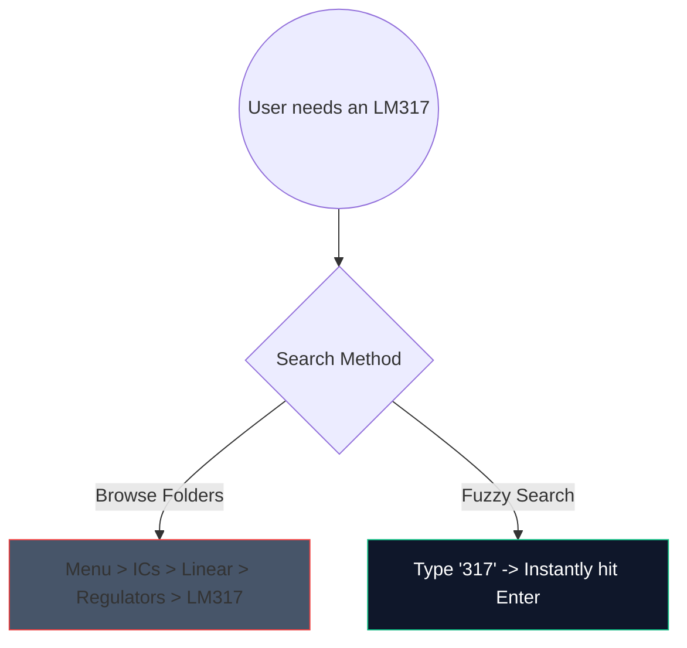

Дните на изтегляне на тежък, 2-гигабайтов десктоп софтуер само за скициране на проста усилвателна верига са приключили. Базиран на браузър CAD (компютърно подпомаган дизайн) е тук и е феноменално бърз.

Ето как точно можете да използвате модерни уеб инструменти за генериране на схеми с производствено качество за по-малко от 5 минути.

## Защо проектиране на вериги, базирано на браузър?

Ако сте преподавател, студент или любител, който пише документация, скоростта и достъпността надделяват над суровите функции.

```mermaid
flowchart LR
    subgraph Traditional Workflow
    DL[Download/Install] --> CONF[Configure Libraries] --> DRAW1[Draw]
    end
    
    subgraph Web Workflow
    URL[Go to URL] --> DRAW2[Draw immediately]
    end
    
    style URL fill:#0f172a,stroke:#3b82f6
    style DRAW2 fill:#1e293b,stroke:#10b981
```

| Метрика | Настолно приложение | Създател на електрическа схема |
| :--- | :--- | :--- |
| **Пространство за съхранение** | 1GB - 5GB+ | 0 MB (базирани в облак) |
| **Съвместимост с ОС** | Често портове само за Windows или портове с грешки | Универсално уеб-съвместим |
| **Време на стартиране** | 15–30 секунди | < 1 секунда |
| **Преносимост** | Ограничен до една машина | Достъпен навсякъде |

## Хакове за основен работен процес за скорост

Когато използвате уеб редактор, използването на клавишни комбинации трансформира изживяването от „щракване наоколо“ в състояние на непрекъснат поток.

Ето преките пътища с най-висока ROI, които да запомните в нашия редактор:

| Действие | Команда с бърз клавиш | Полза от работния процес |
| :--- | :--- | :--- |
| **Маршрутизиране на проводници** | `W` | Незабавно превключва курсора ви в режим на свързване, позволявайки бързо насочване на мрежата, без да се придвижвате до лента с инструменти. |
| **Въртене на компоненти** | `R` (докато държите част) | Ориентирането на резистори или транзистори преди поставянето им спестява огромно количество време за почистване по-късно. |
| **Дублирана селекция** | `Ctrl + D` или `Alt-Drag` | Не дърпайте 8 светодиода от менюто; поставете такъв, конфигурирайте го и го дублирайте незабавно 7 пъти. |
| **Pan Canvas** | `Интервал + плъзгане` | Поддържа нивото ви на мащабиране постоянно, докато навигирате в масивни, сложни оформления. |

## Използване на търсенето на компоненти

Търсенето визуално през масивни падащи менюта е досадно. Интегрирахме стабилен механизъм за размито търсене.

Просто натиснете лентата за търсене и въведете „NPN“, вместо да щракате през „Полупроводници -> Транзистори -> BJT“. Инструментът незабавно подбира най-вероятното съвпадение.

## Експортиране за професионална употреба

Създаването на диаграмата е само половината от битката; инжектирането му във вашата теза или технически блог е другата половина.

Винаги, когато е възможно, експортирайте моделите на вашите схеми като **SVG (мащабируема векторна графика)**, вместо PNG или JPG. SVG съхранява математически дефинирани линии, а не пиксели, което означава, че можете да мащабирате схемата си до размер на билборд и тя завинаги ще остане остра без размазване на растеризацията.

Готови ли сте да тествате скоростта си? **[Стартирайте приложението](/editor/)** и опитайте да създадете 555-таймерна мигаща светодиодна верига!