Отварянето на сложна схема за първи път се чувства като взиране в чужд език. Десетки пресичащи се линии, загадъчни съкращения и назъбени символи се сливат в стена от визуален шум.

Опитните инженери обаче не четат схемите, като се взират в цялата страница. Те изолират, проследяват и завладяват. Ето методологията стъпка по стъпка за дешифриране на всяка електрическа схема.

## Стъпка 1: Изолирайте основната енергийна инфраструктура

Преди да разберете какво *прави* една верига, трябва да разберете *как диша*.

Всяка схема има входни точки за електрическа енергия. Първата ви задача е да намерите всички основни напреженови релси и земни референции.

```mermaid
flowchart TD
    A[Start: Scan Edges] --> B{Look for Power Symbols}
    B -- Found Battery/Jack --> C[Trace the initial VCC and GND lines]
    B -- Found Net Labels --> D[Locate generic +5V, +3.3V pads]
    C --> E[Are there Voltage Regulators?]
    D --> E
    E -- Yes --> F[Mentally divide circuit into Voltage Zones]
    E -- No --> G[Circuit runs on single voltage]
    
    style A fill:#0f172a,stroke:#3b82f6
    style F fill:#1e293b,stroke:#f59e0b
```



| Символ/Текст | Значение | Изискване за действие |
| :--- | :--- | :--- |
| `VCC` / `VDD` | Положително захранващо напрежение за интегрални схеми. | Проследете това, за да сте сигурни, че всяка IC получава захранване. |
| `GND` / `VSS` | Общата основа. | Да приемем, че всички тези символи са физически свързани заедно. |
| `LDO` / `buck` | Чип, регулиращ напрежението надолу. | Обърнете внимание кои компоненти са надолу по веригата, използвайки новото по-ниско напрежение. |

## Стъпка 2: Демистифицирайте „мозъците“ (IC)

След като разберете къде тече енергия, потърсете най-големите правоъгълници на страницата. Интегралните схеми (IC) диктуват основната функция на схемата.

Ако срещнете IC, обозначен като „U1“ със загадъчен номер на част като „NE555“ или „ATmega328P“, незабавно спрете да четете схемата. Отворете нов раздел и издърпайте **листа с данни**.

Не е необходимо да разбирате вътрешната физика на полупроводниците; просто погледнете "Диаграмата на Pinout" в листа с данни. Ако пин 4 е `RESET`, а пин 8 е `VCC`, незабавно съпоставете тази логика обратно към чертежа.

## Стъпка 3: Проследяване на входовете и изходите

Веригите са функционални машини. Те получават информация от околната среда, обработват я и извеждат резултат.

```mermaid
quadrantChart
    title Input/Output Hardware Identification
    x-axis Analog/Physical --> Digital/Data
    y-axis Input Devices --> Output Devices
    quadrant-1 Digital Receivers (e.g. WiFi)
    quadrant-2 Digital Displays (e.g. OLEDs)
    quadrant-3 Physical Actuators (e.g. Motors)
    quadrant-4 Physical Sensors (e.g. Thermistors)
    "Push Button": [0.1, 0.4]
    "Photoresistor": [0.2, 0.2]
    "UART RX": [0.8, 0.4]
    "UART TX": [0.8, 0.6]
    "Speaker": [0.3, 0.8]
    "LED": [0.4, 0.7]
```

Проследете проводниците навън от централните интегрални схеми. Ако щифт на IC се свърже към светодиод, това е визуален изход. Ако щифт се свързва към SPST превключвател, който отива към земята, това е човешко въвеждане.

## Стъпка 4: Валидирайте кръстовища и пресичания

Най-честата грешка при четене за начинаещи включва неразбиране на проводници, които се пресичат.

* **Точка дава възел:** Ако две пресичащи се линии имат плътна точка при пресичането им, те са физически запоени/свързани заедно. Между тях може да тече ток.
* **Няма точка води до мост:** Ако две линии образуват обикновен кръст (+), те *не* се докосват. Те са подобни на две магистрали, минаващи една над друга по надлез.

## Стъпка 5: Разпознаване на под-вериги (Тайното оръжие)

Инженерите рядко проектират схеми изцяло от нулата. Те слепват заедно стандартни модулни подсхеми. След като се научите да разпознавате тези визуални „думи“, спирате да четете отделни „букви“.

| Визуален модел | Стандартна подсхема | Функция |
| :--- | :--- | :--- |
| Пресичане на кондензатор от "VCC" към "GND" точно до IC. | **Разединителен кондензатор** | Абсорбира шума. Игнорирайте го, когато анализирате логическия поток. |
| Резистор от цифров щифт обвиващ до `+5V`. | **Издърпващ резистор** | Предотвратява плаващите щифтове; осигурява стабилно ВИСОКО състояние по подразбиране. |
| Два резистора, поставени последователно между напрежението и земята, щракнати в средата. | **Делител на напрежението** | Намалява напрежението пропорционално, за да бъде безопасно разчетено от щифта на сензора. |

Приложете тази теория на практика. Отворете **[Circuit Diagram Editor](/editor/)**, заредете шаблон и очертайте мощността, мозъка, входовете и изходите за себе си!