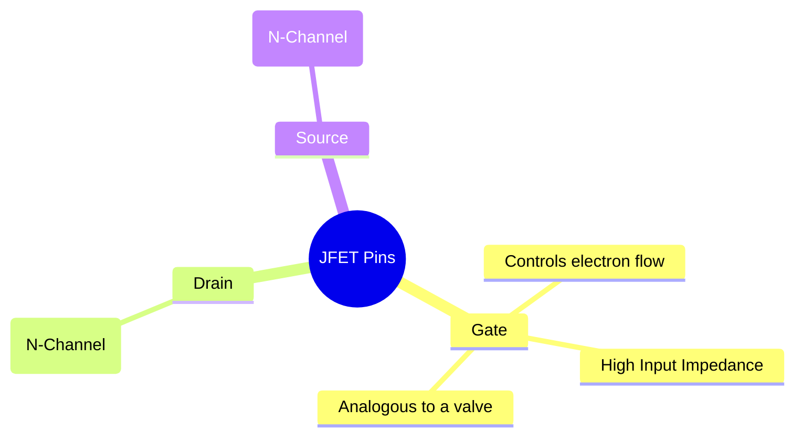

Преди масовото разпространение на MOSFET, **JFET** (Junction Field-Effect Transistor) беше кралят на усилването с висок входен импеданс. Въпреки че не се използват толкова често в съвременната цифрова логика, те остават незаменими артефакти в аудио предусилвателите с висока прецизност, чувствителната апаратура и RF схемите.

Разбирането на схематичния символ на JFET е от съществено значение за всеки, който се задълбочава в дизайна на дискретни аналогови вериги.

## 1. Анатомия на символа JFET

За разлика от биполярните съединителни транзистори (BJT), които са управлявани от ток устройства, JFET е устройство с **контрол на напрежението**. Схематичният символ се опитва да представи визуално физическата конструкция на неговия вътрешен полупроводников канал.

Символът се състои от права вертикална линия, представляваща канала, с две хоризонтални линии, закачащи се в него (източника и източника). Трета перпендикулярна линия образува вратата, пълна със стрелка, която диктува полярността на полупроводника.

### JFET с N-канал срещу P-канал

Точно както BJT имат NPN и PNP, JFET се предлагат в два различни варианта.

| Характеристика | N-канален JFET | P-канал JFET |
| :--- | :--- | :--- |
| **Символ стрелка** | Сочи **IN** към линията на канала | Точки **OUT** далеч от канала |
| **Мажоритарни превозвачи** | Електрони | Дупки |
| **Vgs за отщипване** | Отрицателно напрежение (напр. -5V) | Положително напрежение (напр. +5V) |
| **Типична операция**| Обикновено ВКЛЮЧЕНО -> Приложете масив с отрицателно напрежение, за да ИЗКЛЮЧИТЕ | Обикновено ВКЛЮЧЕНО -> Приложете масив с положително напрежение, за да ИЗКЛЮЧИТЕ |

> **Трик с паметта:** „Посочване IN“ означава **N**-канал. Погледнете стрелката на портата. Ако сочи навътре към линията, имате работа с N-канален JFET (като популярния 2N5457).

## 2. Операция: Режим на изчерпване

Една от най-определящите характеристики на JFET е, че той е **Depletion Mode** устройство. Това значително влияе върху начина, по който проектирате схемите около тях.

* **MOSFETs (режим на подобрение):** обикновено са ИЗКЛЮЧЕНИ. Трябва да подадете напрежение към портата, за да ги включите.
* **JFETs (режим на изчерпване):** обикновено са ВКЛЮЧЕНИ. При 0 волта на портата, максималният ток протича от дренажа към източника. Трябва да приложите *обратно отклонение* напрежение (отрицателно за N-канал), за да разширите зоната на изчерпване и буквално да „отщипете“ потока от електрони, като изключите устройството.

```mermaid
flowchart LR
    VGS[V_GS = 0V] --> I1[Maximum Drain Current flows]
    VGS2[V_GS = -2V] --> I2[Current is restricted]
    VGS3[V_GS = -5V] --> I3[Pinch-Off reached. Circuit is OFF]
    
    style VGS fill:#1e293b,stroke:#f59e0b
    style VGS3 fill:#1e293b,stroke:#ef4444
```

## 3. Типични схематични приложения

Тъй като портата на JFET е обратно предубедена по време на работа, по същество в нея протича нулев ток. Това дава астрономически висок входен импеданс (често измерван в стотици мегаома).

| Приложение на верига | Защо са избрани JFET | Схематични улики |
| :--- | :--- | :--- |
| **Аудио предусилватели** | Изключително нисък шум и огромен входен импеданс предотвратява натоварването на чувствителни пикапи за електрическа китара. | Често се разглежда като действащ като буферен етап на последовател на източника. |
| **Аналогови превключватели** | Тъй като те са изцяло контролирани от напрежението без ток на затвора, те инжектират нулеви преходни процеси на превключване в пътя на сигнала. | Поставен последователно с аналогов сигнал, преминаващ през канала дрейн-източник. |
| **Източници на постоянен ток** | JFET се държи естествено като приемник на постоянен ток, когато портата е свързана директно към източника. | Гейт терминал, свързан директно към терминала източник. |

При диаграмирането на тези специализирани аналогови схеми прецизността е ключова. Уверете се, че ориентацията на стрелката на портата е правилна, за да предотвратите производствени грешки. Използвайте избраната библиотека с дискретни полупроводници в **[Circuit Diagram Maker](/editor/)**, за да поставите стандартни N-Channel и P-Channel JFET символи точно върху следващото си платно.