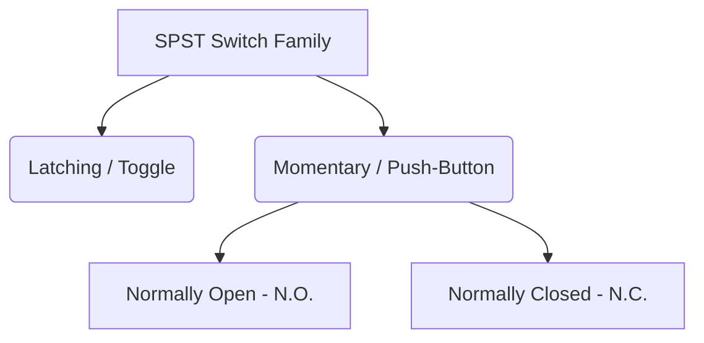

В сърцето на всеки интерфейс, който хората използват за управление на електричеството, лежи механичният превключвател. Най-простото и най-разпространено въплъщение на този компонент е **SPST** или еднополюсен превключвател с едно хвърляне.

Независимо дали проектирате прекъсвач за захранване с високо напрежение или просто начертавате бутон върху дъска за разпределение на Arduino, символът SPST е вашата логична отправна точка.

## 1. Какво всъщност означава SPST

Инженерите класифицират превключвателите, като използват две променливи: **Poles** и **Throws**.

* **Полюс (P):** Броят на независимите електрически вериги, които превключвателят може да управлява едновременно. 
* **Изхвърляне (T):** Броят затворени състояния (ON позиции), които има всеки полюс.

Следователно SPST е *Еднополюсен* (контролира една верига) и *Еднопосочен* (има само една затворена, проводяща позиция).

```mermaid
flowchart LR
    A[Human Input] --> B((SPST Mechanism))
    B -- Open / Default --> C[Infinite Resistance / OFF]
    B -- Closed / Actuated --> D[Zero Resistance / ON]
    
    style B fill:#0f172a,stroke:#f59e0b
```

## 2. Четене на SPST схематичния символ

Стандартният IEEE символ за SPST превключвател е изключително интуитивен - буквално изглежда като това, което прави.

| Визуален елемент | Значение в реалния свят |
| :--- | :--- |
| **Два отворени кръга** | Стационарните електрически контактни площадки, където завършват проводниците. |
| **Диагонална прекъсната линия** | Механичното проводящо рамо, физически отделено от втората подложка, за да покаже състояние по подразбиране „Отворено“. |
| **Обозначение (`S` или `SW`)** | Стандартни референтни тагове. напр. „SW1“. |

> **Приемане на нормално състояние:** Освен ако не е посочено друго, механичните превключватели се изчертават в тяхното **незадействано състояние на покой**. За стандартен превключвател за осветление SPST това означава, че схемата го изобразява като ИЗКЛ.

## 3. Вариации на SPST: Бутони

Превключвателят остава там, където сте го поставили (фиксиращ). Бутонът се задейства само докато пръстът ви е върху него (моментно). Обозначението SPST важи и за двете, но символите се променят леко, за да се разграничат режимите на човешко взаимодействие.

| Тип превключвател | Схематична промяна | Пример от реалния свят |
| :--- | :--- | :--- |
| **Бутон (N.O.)** | Вместо ъглово рамо, плосък мост се носи *над* двете контактни подложки. Натискането надолу преодолява празнината. | Клавиши на клавиатурата, бутони за захранване на компютъра, бутони за звънец. |
| **Бутон (N.C.)** | Плоският мост лежи *отдолу* или докосва подложките, поддържайки веригата ВКЛЮЧЕНА по подразбиране. Натискането надолу прекъсва връзките. | Бутони за аварийно спиране (E-Stop) на тежки машини. |

## 4. Предупреждения за внедряване на хардуер

При включване на SPST превключвател в цифрова логическа верига (като Raspberry Pi GPIO щифт), наивният схематичен дизайн ще доведе до катастрофално непредсказуемо поведение на софтуера.

### Проблемът с "плаващия щифт".

Ако свържете едната страна на превключвател SPST към 5V, а другата страна направо към щифт на микроконтролер, какво се случва, когато превключвателят е отворен? Пинът не отчита 0 V — той е изключен и „плаващ“, действайки като антена, улавяща околния електромагнетизъм.

**Поправката: Изтеглящи се резистори**

Винаги включвайте резистор (обикновено 10 kΩ), свързан между цифровия щифт и земята.

1. **Изключете:** Пинът отчита 0V сигурно през резистора.
2. **Включете:** Захранването от 5V надвишава резистора, задействайки сигурно ВИСОКО състояние.

Включете SPST варианти във вашите дизайни по сигурен начин чрез **[Circuit Diagram Editor](/editor/)**. Разгънете лявата библиотека „Превключватели“, за да намерите N.O. и N.C. изпълнения!