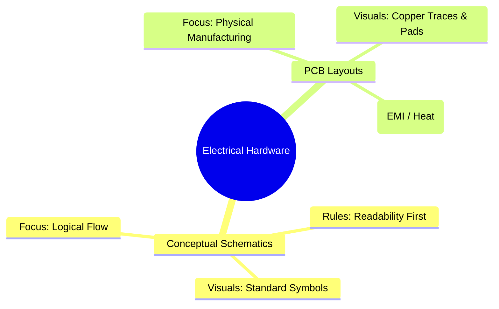
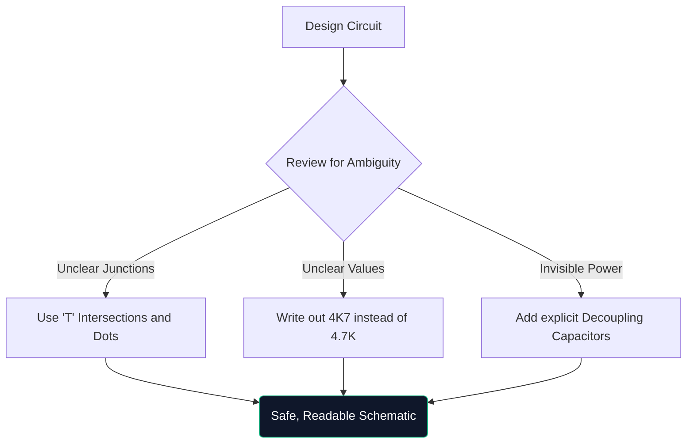

Добре дошли в окончателния майсторски клас по електрически схеми. Независимо дали хаквате заедно прототипи на Arduino през уикенда или изучавате електроинженерство, разбирането на схематичната архитектура не подлежи на обсъждане.

Това ръководство отива отвъд основите, като оценява как се конструират, проверяват и произвеждат съвременни диаграми.

## Теоретични схеми срещу PCB оформления

Много често срещана точка на объркване е разликата между схематична диаграма и оформление на печатна платка (PCB). Те са напълно различни представяния на една и съща електрическа истина.

| Черта | Схематична диаграма | Оформление на печатни платки |
| :--- | :--- | :--- |
| **Цел** | За да разберете *как* веригата работи логично | Да диктува *къде* отива медта физически |
| **Представяне на компоненти** | Абстрактни символи (триъгълници, зигзаг) | Физически 1:1 подложки за отпечатъци (напр. SOIC-8, 0805) |
| **Връзки** | Перфектни геометрични линии | Медни следи под ъгъл 45 градуса |
| **Околна среда** | Чист, бял фон хартия | Многопластово буквално 3D пространство |

## Анатомия на разширена схема

Когато веригите надхвърлят 100 компонента, визуалните парадигми се променят. Не можете просто да свържете всичко с изтеглени проводници.

1. **Заглавни блокове**: Професионалните схеми винаги включват блок в долния десен ъгъл, обозначаващ име на фирма, инженер на записа, номер на ревизия и дата.
2. **Мрежови етикети и портове**: Кабелите не свързват подсистеми; наименуваните етикети правят. Ако два проводника са означени с `CLK_OUT`, те са електрически свързани, дори ако са на различни страници.
3. **Йерархични блокове**: Масивните дизайни (като компютърна дънна платка) използват йерархия. Единичен правоъгълен блок с етикет "Интерфейс на паметта" съдържа напълно отделна схематична страница вътре в него.

## Правилото за "Отбранителна рисунка"

Подобно на отбранителното шофиране, отбранителното чертане предполага, че човекът, който чете вашата схема, ще го разбере погрешно, освен ако изрично не го насочите.

> **Защо да пишем `4K7`?** В отпечатани или фотокопирани схеми малка десетична точка (`.`) лесно изчезва поради артефакти. Писането на „4.7K“ рискува някой да го прочете като „47K“, което може да изпържи компонент. Писането на „4K7“ кара множителя да действа като десетична запетая, като на практика елиминира неправилното четене.

## Преминаване към цифрови CAD инструменти

Рисуването върху милиметрова хартия е отлично за мозъчна атака, но практически безполезно за производство. Когато мигрирате вашите проекти към инструмент като [Circuit Diagram Maker](/editor/), вие печелите няколко суперсили:

* **Списъци на мрежи**: Цифрови инструменти математически доказват връзки.
* **Повторна употреба**: Копирането и поставянето на сложни регулирани захранвания от предишни проекти спестява часове.
* **Векторно качество**: Експортирането като SVG гарантира идеално ясни линии, независимо от това колко увеличавате.

Скокът от теорията към реалността започва с добре начертана линия. Започнете вашето пътуване днес!