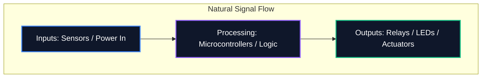

আপনি ফোরামে একটি ডায়াগ্রাম শেয়ার করছেন বা পেশাদার PCB তৈরির জন্য জমা দিচ্ছেন না কেন, আপনার স্কিম্যাটিকটির পঠনযোগ্যতা তার যৌক্তিক সঠিকতার মতোই গুরুত্বপূর্ণ। একটি অগোছালো পরিকল্পিত রাউটিং ত্রুটি, ভুল বোঝার উপাদান এবং সময় নষ্ট করে।

এই নির্দেশিকাটি পেশাদার ইলেকট্রনিক্স ইঞ্জিনিয়ারদের দ্বারা পরিষ্কার, রক্ষণাবেক্ষণযোগ্য, এবং অত্যন্ত পঠনযোগ্য সার্কিট ডায়াগ্রাম তৈরি করতে ব্যবহৃত মূল সেরা অনুশীলনগুলির রূপরেখা দেয়।

## 1. স্কিম্যাটিক প্রবাহ: বাম থেকে ডান, উপরে থেকে নীচে

একটি পরিকল্পিত একটি প্রযুক্তিগত নথি, এবং যেকোনো নথির মতো, এটি স্বাভাবিকভাবে পড়া উচিত। ইলেকট্রনিক্স ডিজাইনে, স্ট্যান্ডার্ড কনভেনশন নির্দেশ করে যে ইনপুটগুলি বাম থেকে প্রবাহিত হয় এবং আউটপুটগুলি ডানদিকে প্রস্থান করে।

একইভাবে, উচ্চতর ভোল্টেজগুলি স্পষ্টভাবে পরিকল্পিতের শীর্ষে স্থাপন করা উচিত, এবং নিম্ন ভোল্টেজগুলি বা নীচের অংশে স্থল।



## 2. শক্তি এবং স্থল প্রতীক

প্রতিটি একক গ্রাউন্ড পিনকে একসাথে সংযুক্ত করে দীর্ঘ, ঘুরার তারগুলি কখনই আঁকবেন না। এটি একটি মাকড়সার জাল তৈরি করে যা পড়া অসম্ভব। পরিবর্তে, উপাদানটিতে স্থানীয় শক্তি এবং স্থল প্রতীক ব্যবহার করুন।

| খারাপ অভ্যাস | সর্বোত্তম অনুশীলন | কেন এটা গুরুত্বপূর্ণ |
| :--- | :--- | :--- |
| একটি অবিচ্ছিন্ন তারের সাথে সমস্ত স্থল বেঁধে দেওয়া | প্রতিটি উপাদানে স্থানীয় `GND` চিহ্ন ব্যবহার করা | চাক্ষুষ বিশৃঙ্খলা হ্রাস; জটিল ট্রেসিং ছাড়াই সুস্পষ্টভাবে রিটার্ন পাথ সংজ্ঞায়িত করে |
| সিগন্যাল ট্রেসের উপর দিয়ে ভিসিসি লাইন স্থাপন করা | স্থানীয় `VCC` / `+5V` চিহ্নগুলি উপরের দিকে নির্দেশ করে | পাওয়ার ডেলিভারির সাথে দৃশ্যত বিভ্রান্ত হওয়া থেকে সিগন্যাল লাইনকে বাধা দেয় |
| একই চিহ্ন দিয়ে বিভিন্ন ভিত্তি লেবেল করা | এনালগ গ্রাউন্ড (AGND) এবং ডিজিটাল গ্রাউন্ড (DGND) পার্থক্য করা | মিশ্র-সংকেত ডিজাইনে গ্রাউন্ড লুপ এবং শব্দ প্রচার এড়ানোর জন্য গুরুত্বপূর্ণ |

## 3. জংশন ডটস বনাম ক্রসিং

পরিকল্পিত নকশার সবচেয়ে বিপজ্জনক ভুলগুলির মধ্যে একটি হল অস্পষ্টতা যেখানে তারগুলি অতিক্রম করে।

```mermaid
graph TD
    A[Is it a connection?]
    A --> B{Is there a junction dot?}
    B -- Yes --> C[Wires are electrically connected (Node)]
    B -- No --> D[Wires are crossing without connecting]
    
    style A fill:#1e293b,stroke:#f59e0b
    style C fill:#1e293b,stroke:#10b981
    style D fill:#1e293b,stroke:#ef4444
```

> **প্রো টিপ:** কখনই "4-ওয়ে" জংশন ব্যবহার করবেন না (একটি '+' এর মতো একটি ক্রস আকৃতির)। চারটি তারের মিলিত হওয়ার প্রয়োজন হলে, তাদের দুটি 3-উপায় 'T' জংশনে অফসেট করুন। এটি সম্পূর্ণরূপে অস্পষ্টতা দূর করে; যদি মুদ্রণ বা স্কেলিং করার সময় জংশন ডট অদৃশ্য হয়ে যায়, তবে 'T' আকৃতিটি এখনও দ্ব্যর্থহীনভাবে একটি সংযোগ বোঝায়, যেখানে একটি খালি ক্রস তা নয়।

## 4. লজিক্যাল কম্পোনেন্ট গ্রুপিং

64+ পিন সহ মাইক্রোকন্ট্রোলার ধারণকারী বড় স্কিম্যাটিকগুলির সাথে ডিল করার সময়, প্রতিটি তারকে শারীরিকভাবে উপাদানের সাথে আঁকার চেষ্টা করা অসারতার একটি অনুশীলন। পরিবর্তে, পেশাদার টুল **নেট লেবেল** ব্যবহার করে।

আপনার সার্কিটের কার্যকরী ব্লকগুলিকে ভিজ্যুয়াল জোনে ভাগ করুন। উদাহরণস্বরূপ, এক কোণে পাওয়ার সাপ্লাই, কেন্দ্রে MCU এবং অন্য কোনে মোটর ড্রাইভার রাখুন। বর্ণনামূলক নেট লেবেল (যেমন, `SPI_MOSI`, `UART_TX`, `MOTOR_PWM`) ব্যবহার করে বিশুদ্ধভাবে সেগুলিকে সংযুক্ত করুন।

## 5. রেফারেন্স ডিজাইনার এবং মান

একটি বেয়ার প্রতিরোধক প্রতীক দর্শককে কিছুই বলে না। প্রতিটি উপাদানের একটি অনন্য রেফারেন্স ডিজাইনার এবং একটি সুস্পষ্ট মান থাকতে হবে।

| উপাদান বিভাগ | স্ট্যান্ডার্ড উপসর্গ | উদাহরণ |
| :--- | :--- | :--- |
| **প্রতিরোধক** | `আর` | `R1 (10kΩ)` |
| **ক্যাপাসিটার** | `C` | `C4 (100nF)` |
| **ইন্টিগ্রেটেড সার্কিট** | `U` বা `IC` | `U2 (LM358)` |
| **ডায়োড/এলইডি** | `D` | `D1 (1N4148)` |
| **ট্রান্সিস্টর / MOSFETs** | `Q` | `Q1 (2N2222)` |
| **প্রবর্তক** | `L` | `L1 (4.7μH)` |
| **সংযোগকারী/হেডার** | `J` বা `P` | `J1 (পাওয়ার জ্যাক)` |

এই কনভেনশনগুলি মেনে চলার নিশ্চয়তা দেয় যে আপনার পরিকল্পিত তাৎক্ষণিকভাবে বিশ্বের যেকোন জায়গায় যেকোন প্রকৌশলী বুঝতে পারবেন। [সার্কিট ডায়াগ্রাম এডিটর](/সম্পাদক/) এ আজই এই নিয়মগুলি প্রয়োগ করা শুরু করুন।