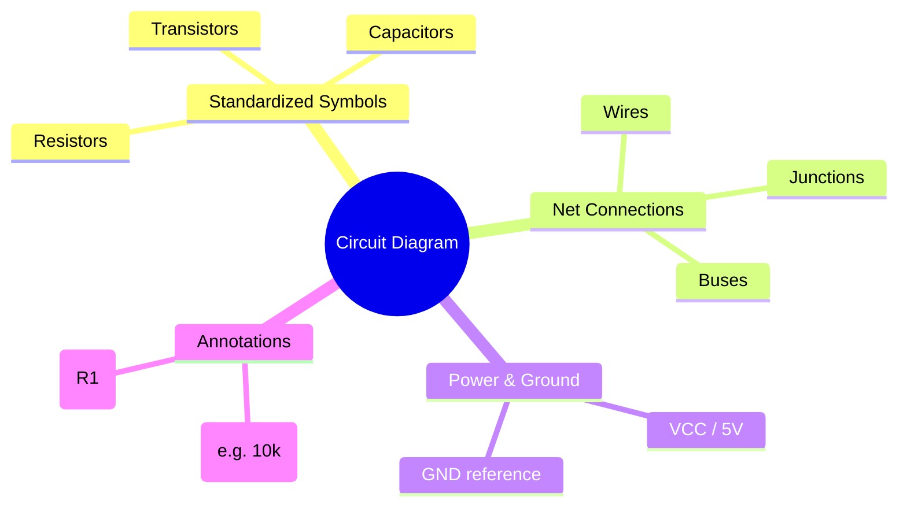
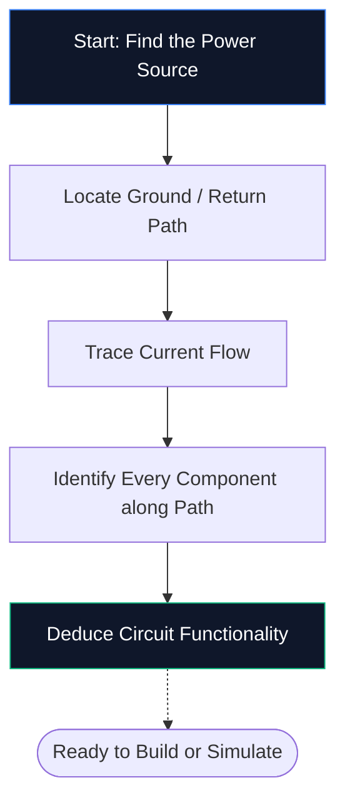

আপনি যদি আগে কখনও একটি স্কিম্যাটিক এডিটর না খুলে থাকেন তবে এটিই আপনার প্রয়োজন একমাত্র গাইড। আমরা মৌলিক বিষয়গুলির মধ্য দিয়ে হেঁটে যাব — সার্কিট ডায়াগ্রাম কী, প্রতীকগুলি কীভাবে ডিকোড করা যায় এবং কীভাবে আপনার প্রথম পরিকল্পিত **সার্কিট ডায়াগ্রাম মেকার**-এর ভিতরে আঁকতে হয় — সবই একক সফ্টওয়্যার ইনস্টল না করে।

## একটি সার্কিট ডায়াগ্রাম ঠিক কি?

একটি সার্কিট ডায়াগ্রাম বিদ্যুতের জন্য একটি মানচিত্র। যেমন একটি পাতাল রেল মানচিত্র দেখায় যে কীভাবে স্টেশনগুলি টানেলগুলিকে স্কেলে চিত্রিত না করেই সংযোগ স্থাপন করে, তেমনি একটি সার্কিট চিত্র দেখায় যে কীভাবে বৈদ্যুতিন উপাদানগুলি শারীরিক আকার বা বোর্ড স্থাপনের বিষয়ে চিন্তা না করে সংযোগ করে।

বাস্তবসম্মত অঙ্কনের পরিবর্তে, স্কিম্যাটিক্স **প্রমিত প্রতীক** ব্যবহার করে। একটি প্রতিরোধক একটি জিগজ্যাগ লাইন হিসাবে, একটি ক্যাপাসিটর দুটি সমান্তরাল প্লেট হিসাবে এবং একটি ডায়োড একটি বারের সাথে মিলিত ত্রিভুজ হিসাবে উপস্থিত হয়। এই সর্বজনীন শর্টহ্যান্ড ডায়াগ্রামগুলিকে প্রতিটি দেশ এবং ভাষা জুড়ে পরিষ্কার, মুদ্রণযোগ্য এবং পাঠযোগ্য রাখে।

> **কেন বিমূর্ততা গুরুত্বপূর্ণ:** একটি ভৌত ​​প্রতিরোধক হল রঙিন ব্যান্ড সহ একটি ক্ষুদ্র সিলিন্ডার, তবুও একটি 50-কম্পোনেন্টের পরিকল্পিত বিবরণ ভিজ্যুয়াল বিশৃঙ্খলা তৈরি করবে। প্রতীকগুলি ছবিকে সংকুচিত করে যাতে আপনার মস্তিষ্ক *কীভাবে জিনিসগুলিকে সংযুক্ত করে* এর উপর ফোকাস করতে পারে *তারা দেখতে কেমন* না।

## প্রতিটি শিক্ষানবিশের জন্য 10টি অবশ্যই-জানা প্রতীক

আপনি একটি একক পরিকল্পিত পড়তে — বা আঁকতে পারার আগে, আপনাকে মূল বিল্ডিং ব্লকগুলি চিনতে হবে। নীচের সারণীটি মুখস্থ করুন এবং আপনি দৃষ্টিতে বেশিরভাগ শখের সার্কিটগুলিকে ডিকোড করতে সক্ষম হবেন৷

| প্রতীক আকৃতি | উপাদান | প্রাথমিক ফাংশন | পদবী |
| :--- | :--- | :--- | :--- |
| **জিগজ্যাগ লাইন** | প্রতিরোধক | বর্তমান প্রবাহ সীমিত করে | `আর` |
| **দুটি সমান্তরাল রেখা** | ক্যাপাসিটর | দোকানের চার্জ, ফিল্টার শব্দ | `C` |
| **সিরিস অফ লুপ** | প্রবর্তক | একটি চৌম্বক ক্ষেত্রে শক্তি সঞ্চয় করে | `L` |
| **ত্রিভুজ + বার** | ডায়োড | এক দিকে কারেন্টের অনুমতি দেয় | `D` |
| **ত্রিভুজ + বার + তীর** | LED | সামনের দিকে পক্ষপাতিত্ব হলে আলো নির্গত করে | `D` / `LED` |
| **দীর্ঘ/ছোট সমান্তরাল রেখা** | ব্যাটারি | ডিসি ভোল্টেজ প্রদান করে | `BT` |
| **তিনটি স্ট্যাক করা লাইন** | মাটি | 0 V এ রেফারেন্স পয়েন্ট | `GND` |
| **ত্রিভুজ আকৃতি** | অপ-অ্যাম্প | ভোল্টেজের পার্থক্য বাড়ায় | `U` / `IC` |
| **পিন সহ আয়তক্ষেত্র** | ইন্টিগ্রেটেড সার্কিট | জটিল কার্য সম্পাদন করে | `U` / `IC` |
| **সরল লাইন** | তারের | উপাদানের মধ্যে বর্তমান বহন | *(কোনটিই নয়)* |

## কিভাবে পাঁচটি ধাপে একটি স্কিম্যাটিক পড়তে হয়

একটি সার্কিট ডায়াগ্রাম পড়া প্রতিবার একই মানসিক প্রক্রিয়া অনুসরণ করে। যেকোন পরিকল্পিত উপর এই পাঁচটি ধাপ অনুশীলন করুন এবং প্যাটার্নটি দ্বিতীয় প্রকৃতিতে পরিণত হবে।

1. **বিদ্যুতের উৎস খুঁজুন** — VCC, 5 V, বা 3.3 V-এর মতো একটি ব্যাটারি প্রতীক বা লেবেল খুঁজুন। এখানেই বৈদ্যুতিক শক্তি সার্কিটে প্রবেশ করে।
2. **স্থল সনাক্ত করুন** — তিন-লাইন স্থল প্রতীক বা একটি GND লেবেল খুঁজুন। প্রতিটি সার্কিটের একটি ফিরতি পথ থাকতে হবে।
3. **ট্রেস কারেন্ট ফ্লো** — পজিটিভ টার্মিনাল থেকে প্রতিটি কম্পোনেন্টের মধ্য দিয়ে এবং মাটিতে ফিরে তারগুলি অনুসরণ করুন। প্রচলিত কারেন্ট ইতিবাচক থেকে নেতিবাচক প্রবাহিত হয়।
4. **প্রতিটি উপাদান শনাক্ত করুন** — উপরের টেবিলের সাথে প্রতিটি চিহ্ন মিলিয়ে নিন, তারপর সঠিক মানগুলির জন্য এটির পাশের লেবেলটি পড়ুন (উদাহরণস্বরূপ 10 kΩ মানে 10,000 ohms)।
5. **উদ্দেশ্যটি বুঝুন** — নিজেকে জিজ্ঞাসা করুন সার্কিটটি কী করে। একটি LED প্লাস একটি প্রতিরোধক একটি সাধারণ সূচক আলো। ফিডব্যাক প্রতিরোধক সহ একটি অপ-অ্যাম্প হল একটি সংকেত পরিবর্ধক।

## আপনার প্রথম পরিকল্পিত: LED সার্কিট

প্রতিটি ইলেকট্রনিক্স শিক্ষানবিস এখানে শুরু হয় — একটি LED একটি বর্তমান-সীমাবদ্ধ প্রতিরোধকের মাধ্যমে চালিত হয়। [সার্কিট ডায়াগ্রাম মেকার এডিটর](/সম্পাদক/) খুলুন এবং অনুসরণ করুন।

**সার্কিট আর্কিটেকচার পাইপলাইন:**

```mermaid
graph LR
    PWR(Battery 9V) -- Positive Wire --> R1(Resistor 330Ω)
    R1 -- Controlled Current --> D1((Red LED))
    D1 -- Return Path --> GND(Ground)
    
    style PWR fill:#1e293b,stroke:#f59e0b
    style R1 fill:#1e293b,stroke:#3b82f6
    style D1 fill:#1e293b,stroke:#ef4444
    style GND fill:#1e293b,stroke:#64748b
```

**ধাপে ধাপে নির্দেশাবলী:**

1. সাইডবার থেকে ক্যানভাসে একটি **ব্যাটারি** চিহ্ন টেনে আনুন।
2. ব্যাটারির ডানদিকে একটি **প্রতিরোধক** রাখুন।
3. প্রতিরোধকের ডানদিকে একটি **LED** রাখুন।
4. ওয়্যার মোড সক্রিয় করতে **W** টিপুন।
5. ব্যাটারির ইতিবাচক টার্মিনালে ক্লিক করুন, তারপর একটি তার আঁকতে প্রতিরোধকের বাম পিনে ক্লিক করুন।
6. LED অ্যানোডের সাথে প্রতিরোধকের ডান পিনটি সংযুক্ত করুন।
7. LED ক্যাথোডকে ব্যাটারির নেতিবাচক টার্মিনালে ফিরিয়ে দিন।
8. রোধে ডাবল ক্লিক করুন এবং টাইপ করুন **330 Ω**।
9. একটি প্রকাশনা-মানের ফাইল সংরক্ষণ করতে **এক্সপোর্ট → SVG** এ ক্লিক করুন।

## পাঁচটি সাধারণ ভুল (এবং কীভাবে এড়ানো যায়)

| ভুল | কি ভুল যায় | দ্রুত ফিক্স |
| :--- | :--- | :--- |
| **অনুপস্থিত স্থল পথ** | সার্কিট খোলা প্রদর্শিত হবে; কারেন্ট প্রবাহিত হতে পারে না | সর্বদা মাটিতে ফেরার পথের তারের |
| **বিন্দু ছাড়া তারের ক্রসিং** | দুটি তারের যেগুলি ক্রস করে সংযুক্ত দেখায় যখন তারা না থাকে | একটি জংশন ডট যোগ করুন যেখানে তারগুলি আসলে যোগ হয় |
| **কোন উপাদান মান** | পর্যালোচকরা আপনার নকশা যাচাই করতে পারবেন না | প্রতিটি প্রতিরোধক, ক্যাপাসিটর এবং IC লেবেল করুন |
| **অগোছালো তারের** | তির্যক বা ওভারল্যাপিং তারগুলি পাঠযোগ্যতা হ্রাস করে | ম্যানহাটন রাউটিং ব্যবহার করুন (কেবল অনুভূমিক এবং উল্লম্ব) |
| **কোন রেফারেন্স মনোনীতকারী** | যন্ত্রাংশ তালিকা তৈরি করা অসম্ভব হয়ে ওঠে | লেবেল প্রতিটি অংশ R1, C1, U1, D1, এবং তাই |

## পরবর্তী কোথায় যেতে হবে

একবার আপনি মৌলিক স্কিম্যাটিক্স অঙ্কন করতে স্বাচ্ছন্দ্য বোধ করলে, লেভেল আপ করতে এই সংস্থানগুলি অন্বেষণ করুন:

* **[সার্কিট ডায়াগ্রাম প্রতীক ব্যাখ্যা করা হয়েছে](/blog/circuit-diagram-symbols-explained/)** — প্রতিটি প্রতীক বিভাগে গভীরভাবে ডুব দিন
* **[কিভাবে একটি সার্কিট ডায়াগ্রাম অনলাইনে তৈরি করবেন](/blog/how-to-make-circuit-diagram-online/)** — উন্নত কৌশল এবং ওয়ার্কফ্লো টিপস
* **[কম্পোনেন্ট লাইব্রেরি](/কম্পোনেন্টস/)** — সার্কিট ডায়াগ্রাম মেকারে উপলব্ধ সমস্ত 40+ চিহ্ন ব্রাউজ করুন