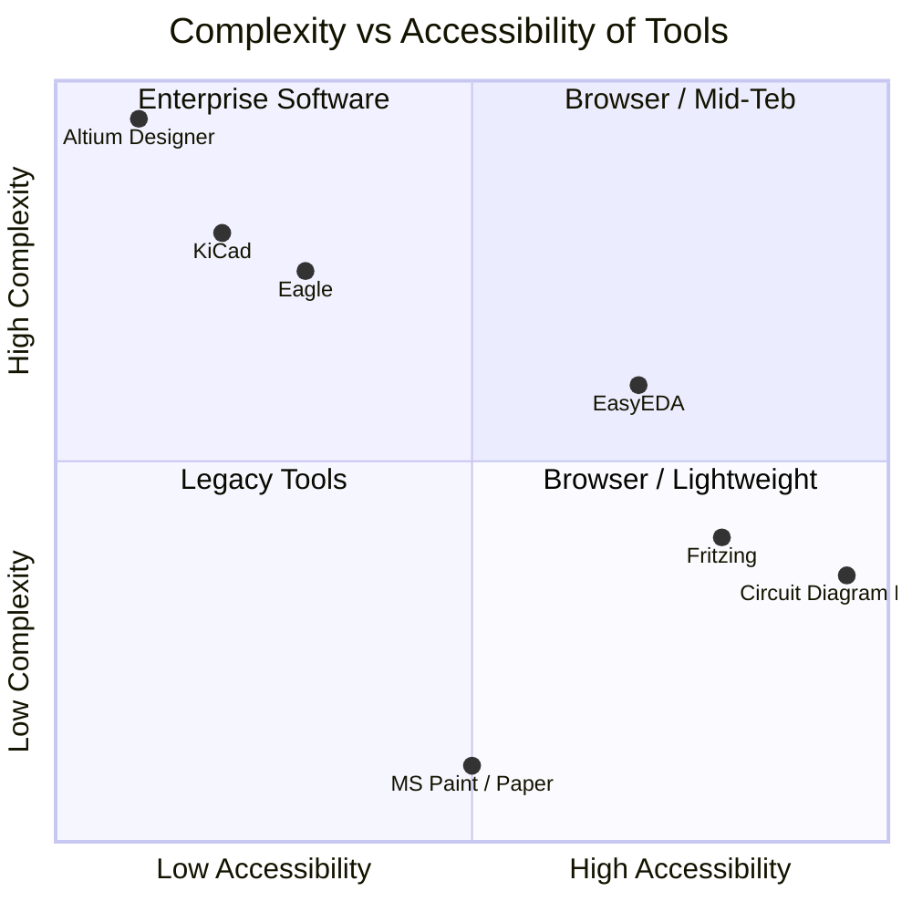
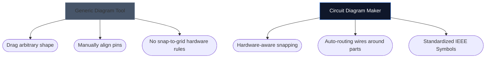

আপনার ইলেকট্রনিক্স স্কিম্যাটিক্স আঁকতে সঠিক টুল নির্বাচন করা প্রায়শই নির্দেশ করতে পারে যে আপনি একটি নতুন হার্ডওয়্যার প্রকল্পে কত দ্রুত পুনরাবৃত্তি করতে পারেন। যদিও উন্নত PCB ডিজাইনারদের হেভিওয়েট ডেস্কটপ পরিবেশের প্রয়োজন হয়, শখ, ছাত্র এবং নির্মাতাদের প্রায়শই সম্পূর্ণ ভিন্ন কিছুর প্রয়োজন হয়: অ্যাক্সেসযোগ্যতা এবং গতি।

নীচে, আমরা বিশ্লেষণ করি যে কীভাবে আমাদের টুল প্রধান শিল্প বিকল্পগুলির বিরুদ্ধে দাঁড়ায়।

## টুল শ্রেণীকরণ ম্যাট্রিক্স

স্বতন্ত্র সরঞ্জামগুলিতে ডুব দেওয়ার আগে, আপনার প্রকল্পটি আসলে কী ধরণের সফ্টওয়্যার দাবি করে তা বোঝা গুরুত্বপূর্ণ। এন্টারপ্রাইজ PCB সফ্টওয়্যার ব্যবহার করে একটি 4-কম্পোনেন্ট LED লেআউট স্কেচ করা ওভারকিল।

## 1. সার্কিট ডায়াগ্রাম মেকার বনাম ফ্রিজিং

ফ্রিটজিং ব্রেডবোর্ড প্রোটোটাইপিং এবং স্কিম্যাটিক্সের মধ্যে ব্যবধান পূরণের জন্য বিখ্যাত। যাইহোক, Fritzing এর ইনস্টলেশন প্রয়োজন এবং বছরের পর বছর ধরে রক্ষণাবেক্ষণ আপডেটের সাথে সংগ্রাম করেছে।

| বৈশিষ্ট্য | সার্কিট ডায়াগ্রাম মেকার | ফ্রিজিং |
| :--- | :--- | :--- |
| **প্রাথমিক ফোকাস** | স্ট্যান্ডার্ড পরিকল্পিত বিন্যাস | ব্রেডবোর্ড ভিজ্যুয়ালাইজেশন |
| **ইনস্টলেশন** | কোনটিই নয় (100% ব্রাউজার-ভিত্তিক) | ডেস্কটপ ইনস্টলেশন আবশ্যক |
| **খরচ** | 100% বিনামূল্যে | প্রদত্ত (দান সামগ্রী) |
| **লার্নিং কার্ভ** | অত্যন্ত নিম্ন | মধ্যপন্থী |

> **দ্যা রায়:** আপনি যদি বিশেষভাবে একটি ব্রেডবোর্ডে নিমজ্জিত পদার্থবিজ্ঞানের তারগুলিকে কল্পনা করতে চান তবে ফ্রিটজিং উচ্চতর। আপনার যদি স্ট্যান্ডার্ড, সার্বজনীন ইলেকট্রনিক স্কিমেটিক্স *তাত্ক্ষণিকভাবে* প্রয়োজন হয়, সার্কিট ডায়াগ্রাম মেকার ব্যবহার করুন।

## 2. সার্কিট ডায়াগ্রাম মেকার বনাম কিক্যাড এবং অল্টিয়াম

KiCad হল একটি কিংবদন্তি ওপেন সোর্স PCB স্যুট, এবং Altium ডিজাইনার হল এন্টারপ্রাইজ ইন্ডাস্ট্রি স্ট্যান্ডার্ড। তারা অপরিসীম শক্তিশালী।

| সক্ষমতা স্তর | সার্কিট ডায়াগ্রাম মেকার | কিক্যাড/আল্টিয়াম |
| :--- | :--- | :--- |
| **আউটপুট প্রকার** | SVG/PNG ছবি | গারবার ফাইল, বিওএম, পিক অ্যান্ড প্লেস |
| **সিমুলেশন** | ভিজ্যুয়াল / সরলীকৃত | গভীর SPICE ইন্টিগ্রেশন |
| **প্রথম স্কিমার গতি** | < 10 সেকেন্ড | 10-30 মিনিট (সেটআপ/কনফিগ) |

> **দ্যা রায়:** আপনি যখন শেনজেনের একটি কারখানায় তামার স্তর পাঠাচ্ছেন তখন KiCad বা Altium ব্যবহার করুন। যখন আপনি একটি পদার্থবিদ্যা অ্যাসাইনমেন্ট, ব্লগ পোস্ট, বা ফোরাম প্রশ্নে একটি পরিকল্পিত সংযুক্ত করছেন তখন সার্কিট ডায়াগ্রাম মেকার ব্যবহার করুন।

## 3. সার্কিট ডায়াগ্রাম মেকার বনাম draw.io / লুসিডচার্ট

সাধারণ ডায়াগ্রামিং টুলস যেমন draw.io ফ্লোচার্টের জন্য অবিশ্বাস্যভাবে জনপ্রিয়। যাইহোক, তাদের ইলেকট্রনিক্সের শব্দার্থগত বোঝার অভাব রয়েছে।

আপনি যখন একটি ডেডিকেটেড ইলেকট্রনিক্স টুল ব্যবহার করেন, তখন সম্পাদক বোঝেন যে একটি তার একটি জংশন ছাড়া এলোমেলোভাবে "সমাপ্ত" করতে পারে না এবং এটি সহজাতভাবে স্ট্যান্ডার্ড বৈশিষ্ট্যগুলি (যেমন ওহম থেকে প্রতিরোধকের) ম্যাপ করে।

## কোন টুল আপনার জন্য সঠিক?

সর্বোত্তম হাতিয়ার হল এক যা আপনার পথের বাইরে চলে যায়। দ্রুত ধারনা, শিক্ষামূলক কাজ, এবং ওয়েব প্রকাশনার জন্য, [সার্কিট ডায়াগ্রাম মেকার](/সম্পাদক/) গতি এবং আধুনিক নান্দনিকতার একটি অপরাজেয় সমন্বয় অফার করে।