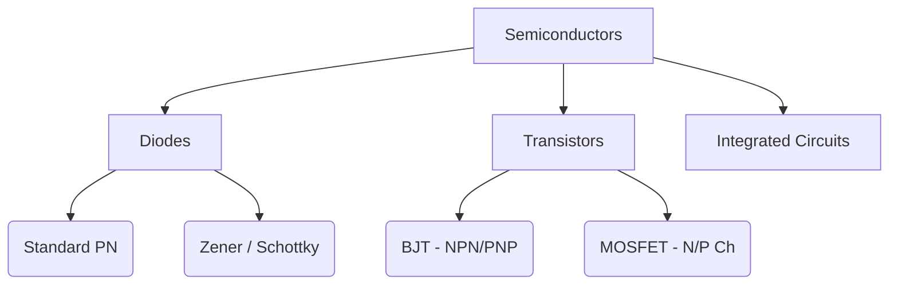

বৈদ্যুতিন প্রতীকগুলি হার্ডওয়্যার প্রকৌশলের সর্বজনীন ভাষা। ঠিক যেমন মিউজিক নোট পিচ এবং ছন্দ নির্দেশ করে, সার্কিট চিহ্নগুলি কাগজের টুকরোতে বৈদ্যুতিক ফাংশন, সম্পত্তি এবং সংযোগ প্রকাশ করে।

এই বিস্তৃত নির্দেশিকায়, আমরা যে কোনো পরিকল্পিত ক্ষেত্রে আপনি যে সবচেয়ে গুরুত্বপূর্ণ উপাদানগুলির মুখোমুখি হবেন তার ভিজ্যুয়াল রূপবিদ্যাকে বিচ্ছিন্ন করি।

## গ্লোবাল স্ট্যান্ডার্ড পার্থক্য: IEEE বনাম IEC

নির্দিষ্ট চিহ্নগুলির মধ্যে ডুব দেওয়ার আগে, এটি চিহ্নিত করা অত্যন্ত গুরুত্বপূর্ণ যে স্কিম্যাটিকটি কোথায় আঁকা হয়েছিল তার উপর নির্ভর করে প্রতীকগুলি আলাদা দেখতে পারে। দুটি প্রভাবশালী মান হল **IEEE/ANSI** (বেশিরভাগ আমেরিকা) এবং **IEC** (ইউরোপ এবং আন্তর্জাতিক)।

```mermaid
flowchart LR
    subgraph Regional Standards
    A((Schematic Origin))
    A -- US / Americas --> B[IEEE / ANSI]
    A -- Europe / Int'l --> C[IEC]
    end
    
    B -.-> D(Zigzag Resistors)
    C -.-> E(Rectangle Resistors)
    
    style B fill:#1e293b,stroke:#f59e0b
    style C fill:#1e293b,stroke:#3b82f6
```

সার্কিট ডায়াগ্রাম মেকারে, আমরা প্রাথমিকভাবে IEEE/ANSI মান ব্যবহার করি, কারণ এটি ডিজিটাল এবং শখের ইকোসিস্টেমে অত্যন্ত জনপ্রিয়, যদিও উভয়ই প্রযুক্তিগতভাবে সঠিক।

## প্যাসিভ কম্পোনেন্ট

প্যাসিভ উপাদানগুলি পরিচালনা করার জন্য একটি বাহ্যিক শক্তি উত্স প্রয়োজন হয় না এবং একটি সংকেত প্রসারিত করতে পারে না।

| উপাদান | স্ট্যান্ডার্ড প্রতীক উপস্থিতি | কার্যকরী বর্ণনা |
| :--- | :--- | :--- |
| **প্রতিরোধক** | একটি তীক্ষ্ণ, জ্যাগড জিগজ্যাগ লাইন দ্বারা সংজ্ঞায়িত। পরিবর্তনশীল বৈকল্পিক বৈশিষ্ট্য একটি তীর লাইন ভেদন. | বৈদ্যুতিক প্রবাহকে সীমিত করার জন্য তাপ হিসাবে শক্তিকে নষ্ট করে। |
| **ক্যাপাসিটর** | দুটি সমান্তরাল রেখা একটি ফাঁক দিয়ে বিভক্ত। মেরুকৃত রূপগুলি নেতিবাচক টার্মিনাল নির্দেশ করতে লাইনগুলির একটিকে বক্র করে। | বৈদ্যুতিক ক্ষেত্রে সাময়িকভাবে বৈদ্যুতিক শক্তি সঞ্চয় করে। |
| **প্রবর্তক** | বৃত্তাকার লুপ বা আধা-বৃত্তের একটি সিরিজ যা তারের কয়েলের প্রতিনিধিত্ব করে। | চৌম্বক ক্ষেত্রে শক্তি সঞ্চয় করে বর্তমান প্রবাহের পরিবর্তনের বিরোধিতা করে। |

## সক্রিয় উপাদান (সেমিকন্ডাক্টর)

সক্রিয় উপাদানগুলির জন্য একটি শক্তির উত্স প্রয়োজন এবং বিদ্যুতের প্রবাহ নিয়ন্ত্রণ করতে পারে, প্রায়শই সংকেতকে প্রশস্ত করে।

| উপাদান | ভিজ্যুয়াল সূচক | মূল ব্যবহার |
| :--- | :--- | :--- |
| **ডায়োড** | একটি ত্রিভুজ একটি সমতল রেখার দিকে নির্দেশ করছে। লাইনটি ক্যাথোড নির্দেশ করে (নেতিবাচক)। | বিদ্যুতের জন্য একটি একমুখী ভালভ। |
| **LED** | দুটি ছোট তীর সহ একটি আদর্শ ডায়োড চিহ্ন যা বাইরের দিকে নির্দেশ করে, আলো নির্গমনকে নির্দেশ করে। | ভিজ্যুয়াল সূচক এবং অপটোইলেক্ট্রনিক্স। |
| **BJT ট্রানজিস্টর** | একটি উল্লম্ব রেখা তিনটি সংযোগ দ্বারা সংলগ্ন: বেস, সংগ্রাহক এবং একটি বিকিরণকারী একটি তীর দ্বারা নির্দেশ করে NPN বা PNP। | বর্তমান-নিয়ন্ত্রিত সুইচ এবং পরিবর্ধক। |
| **MOSFET** | বিচ্ছিন্ন গেট এবং অভ্যন্তরীণ সাবস্ট্রেট ডায়োডগুলিকে হাইলাইট করে বিচ্ছিন্ন সীমানা রেখাগুলির বৈশিষ্ট্য। | উচ্চ শক্তির জন্য ভোল্টেজ-নিয়ন্ত্রিত সুইচিং। |

## যান্ত্রিক এবং আউটপুট ডিভাইস

এই অংশগুলি ভৌত ​​জগতের সাথে যোগাযোগ করে, হয় মানুষের ইনপুট গ্রহণ করে বা শারীরিক আউটপুট তৈরি করে।

| উপাদান | স্কিম্যাটিক শর্টহ্যান্ড | আবেদন |
| :--- | :--- | :--- |
| **সুইচ (SPST)** | একটি ভাঙা লাইন যা সার্কিট সম্পূর্ণ করতে নিচে পিভট করতে পারে। | বেসিক অন/অফ পাওয়ার কন্ট্রোল। |
| **রিলে** | সাধারণত বিচ্ছিন্ন সুইচ পরিচিতিগুলির সাথে মিলিত একটি সূচনাকারী (অভ্যন্তরীণ কুণ্ডলী) হিসাবে চিত্রিত হয়। | লো-ভোল্টেজ মাইক্রোকন্ট্রোলারের মাধ্যমে উচ্চ-ভোল্টেজ লোড পরিবর্তন করা। |
| **মোটর** | একটি 'M' ধারণকারী একটি বৃত্ত, প্রায়ই মনোনীত ইতিবাচক এবং নেতিবাচক টার্মিনাল সহ। | তড়িৎ প্রবাহকে ঘূর্ণন গতিবিদ্যায় রূপান্তর করা। |

> **ডিজাইন টিপ:** যখনই যান্ত্রিক সুইচ বা রিলে ব্যবহার করবেন, আপনার সেমিকন্ডাক্টর উপাদানগুলিকে ভোল্টেজ স্পাইক থেকে রক্ষা করার জন্য সর্বদা একটি *ফ্লাইব্যাক ডায়োড* অন্তর্ভুক্ত করুন!

এই চিহ্নগুলি বোঝা সার্কিট সাবলীলতার দিকে প্রথম পদক্ষেপ। আমাদের [অনলাইন এডিটর](/সম্পাদক/) টেনে আনুন, ড্রপ করুন এবং এই আকারগুলি নিয়ে তাৎক্ষণিকভাবে পরীক্ষা করুন।