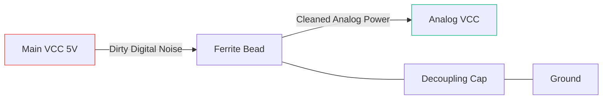

উচ্চ-গতির ডিজিটাল ইলেকট্রনিক্স প্রচুর ইলেক্ট্রোম্যাগনেটিক শব্দ তৈরি করে। প্রশমন ছাড়াই, এই উচ্চ-ফ্রিকোয়েন্সি হস্তক্ষেপ সংবেদনশীল অ্যানালগ লাইনে রক্তপাত করে বা বাইরের দিকে বিকিরণ করে, যার ফলে আপনার ডিভাইসটি FCC নির্গমন পরীক্ষা দর্শনীয়ভাবে ব্যর্থ হয়।

এই হস্তক্ষেপের বিরুদ্ধে প্রাথমিক অস্ত্র হল **ফেরাইট পুঁতি**। এর পরিকল্পিত চিহ্ন এবং স্থান নির্ধারণ বোঝার মাধ্যমে আপনার সার্কিট পরিষ্কারভাবে কাজ করে নাকি তার নিজস্ব শব্দে ডুবে যায়।

## 1. ফেরাইট বিড সিম্বলটি ভিজ্যুয়ালাইজ করা

একটি ferrite গুটিকা একটি ভারী ক্ষতিকারক প্রবর্তক মত সহজাতভাবে কাজ করে. এই কারণে, এর পরিকল্পিত প্রতীকটি আদর্শ প্রবর্তক চিহ্নের সাথে ঘনিষ্ঠভাবে সম্পর্কিত, তবে এটির নির্দিষ্ট ভূমিকার উপর জোর দেওয়ার জন্য তৈরি করা হয়েছে।

```mermaid
graph LR
    A[Inductor Basis] --> B(Standard Inductor Symbol)
    A --> C(Rectangle Over Wire)
    B -.-> D(Addition of a dashed line or solid bar)
    D --> E[IEEE Ferrite Symbol]
    C --> F[IEC Ferrite Symbol]
    
    style E fill:#0f172a,stroke:#3b82f6
    style F fill:#0f172a,stroke:#10b981
```

| বৈশিষ্ট্য | IEEE/ANSI স্ট্যান্ডার্ড | আইইসি স্ট্যান্ডার্ড | নোট |
| :--- | :--- | :--- | :--- |
| **আকৃতি** | একটি বার/বাক্স সহ আধা-বৃত্তের সিরিজ | একটি কঠিন আয়তক্ষেত্রাকার ব্লক | ফলাফলে কার্যত অভিন্ন |
| **ডিজিনেটর উপসর্গ** | `FB` | `FB` বা `L` | পাওয়ার ইন্ডাক্টরগুলির সাথে বিভ্রান্তি রোধ করতে `FB` ব্যবহার করা অত্যন্ত বাঞ্ছনীয়
| **পরিমাপ ইউনিট** | নির্দিষ্ট MHz এ Ohms (Ω) | নির্দিষ্ট MHz এ Ohms (Ω) | হেনরিস (এইচ) এ পরিমাপ করা ইন্ডাক্টরের বিপরীতে |

> **গুরুত্বপূর্ণ পার্থক্য:** কখনই একটি ফেরাইট পুঁতিকে আবেশ দ্বারা রেট করবেন না। ফেরাইট পুঁতিগুলি একটি নির্দিষ্ট ফ্রিকোয়েন্সিতে তাদের **প্রতিবন্ধকতা (ওহমস-এ) দ্বারা নির্দিষ্ট করা হয়** (সাধারণত 100 মেগাহার্টজ)।

## 2. কোর অপারেশনাল মেকানিক্স

স্ট্যান্ডার্ড ইন্ডাক্টরের পরিবর্তে কেন ফেরাইট পুঁতি ব্যবহার করবেন?

* একটি **ইন্ডাকটর** শক্তি সঞ্চয় করে এবং সার্কিটে ফেরত দেয়। এটি অত্যন্ত প্রতিক্রিয়াশীল এবং শক্তি সংরক্ষণ করে।
* একটি **ফেরাইট পুঁতি** সক্রিয়ভাবে *ক্ষতিকর* হওয়ার জন্য ডিজাইন করা হয়েছে। উচ্চ ফ্রিকোয়েন্সিতে, এটি একটি প্রতিরোধকের মতো আচরণ করে, অবাঞ্ছিত উচ্চ-ফ্রিকোয়েন্সি শব্দকে সরাসরি তাপে রূপান্তর করে।

| ফ্রিকোয়েন্সি রেঞ্জ | Ferrite গুটিকা আচরণ | সার্কিট ফলাফল |
| :--- | :--- | :--- |
| **কম ফ্রিকোয়েন্সি / DC** | 1 MHz এর অধীনে | একটি সাধারণ তারের মতো কাজ করে (~0 Ω)। ডিসি শক্তি অবাধে মাধ্যমে পাস. |
| **অনুরণিত ফ্রিকোয়েন্সি** | অত্যন্ত প্রতিক্রিয়াশীল | সংক্ষিপ্তভাবে শক্তি সঞ্চয় করে। |
| **উচ্চ ফ্রিকোয়েন্সি** | 50 MHz+ এর বেশি | একটি উচ্চ-মানের প্রতিরোধকের মত কাজ করে। তাপ হিসাবে আরএফ শব্দকে অবরুদ্ধ করে এবং ছড়িয়ে দেয়। |

## 3. স্কিম্যাটিক প্লেসমেন্টের জন্য সর্বোত্তম অনুশীলন

FB প্রতীক সঠিকভাবে ব্যবহার করার জন্য কৌশলগত অবস্থান প্রয়োজন। একটি পরিকল্পিত উপর এলোমেলোভাবে ferrite জপমালা slapping আসলে রিং এবং অনুরণন খারাপ হতে পারে.

### ডিকপলিং পাওয়ার সাপ্লাই (পাই-ফিল্টার)

একটি `FB` প্রতীকের নিখুঁত সবচেয়ে সাধারণ ব্যবহার হল পরিষ্কার এনালগ শক্তি থেকে নোংরা ডিজিটাল শক্তিকে আলাদা করা।

উপরের কনফিগারেশনে (একটি পাই-ফিল্টারের অংশ), ফেরাইট পুঁতি উচ্চ-ফ্রিকোয়েন্সি ট্রানজিয়েন্টকে AVCC লাইনে প্রবেশ করতে বাধা দেয়, যখন ক্যাপাসিটর অবশিষ্ট কোনো লহরকে মাটিতে নামিয়ে দেয়।

### ডেটা লাইন ইএমআই দমন

দীর্ঘ USB ডেটা কেবল বা HDMI ট্রেস রাউটিং করার সময়, 'FB' চিহ্নগুলি প্রায়শই সংযোগকারীর কাছাকাছি সিরিজে স্থাপন করা হয়। এটি নিশ্চিত করে যে দীর্ঘ, শারীরিকভাবে উন্মুক্ত তারটি একটি অ্যান্টেনা হিসাবে কাজ করে না এবং রুম জুড়ে CPU শব্দ বিকিরণ করে না।

আপনার পরবর্তী পরিকল্পনায় একটি ফেরাইট পুঁতি যোগ করতে, **[সার্কিট ডায়াগ্রাম এডিটর](/সম্পাদক/)** খুলুন, "ফেরাইট" অনুসন্ধান করুন এবং আপনার প্রতিবন্ধকতা রেটিং নির্দিষ্ট করুন!