একটি পাওয়ার ইনভার্টার তৈরি করা—একটি 12V গাড়ির ব্যাটারিকে 220V বিকল্প কারেন্টে রূপান্তর করা যা গৃহস্থালীর যন্ত্রপাতি চালানোর ক্ষমতা রাখে—ইলেকট্রনিক্স ইঞ্জিনিয়ারদের জন্য একটি অনুচ্ছেদ।

একটি সোল্ডারিং লোহা উত্তোলনের আগে, আপনাকে অবশ্যই অন্তর্নিহিত পরিকল্পনার একটি ত্রুটিহীন বোঝার অর্জন করতে হবে। উচ্চ-ভোল্টেজ সার্কিটরি ক্ষমাহীন, এবং একটি খারাপভাবে আঁকা ডায়াগ্রাম পোড়া MOSFET বা গুরুতর বৈদ্যুতিক শক গ্যারান্টি দেয়। এই নির্দেশিকাটি একটি মৌলিক বর্গ-তরঙ্গ বৈদ্যুতিন সংকেতের মেরু বদল করার স্থাপত্যকে ভেঙে দেয়।

> **নিরাপত্তা সতর্কতা:** 220V AC পাওয়ার প্রাণঘাতী। এই নিবন্ধটি পরিকল্পিত যুক্তি এবং তাত্ত্বিক নকশার একটি অন্বেষণ, একটি উত্পাদন নীল-প্রিন্ট নয়। উন্নত বৈদ্যুতিক প্রশিক্ষণ ছাড়া উচ্চ-ভোল্টেজ সার্কিট তৈরি করবেন না।

## থ্রি পিলার আর্কিটেকচার

একটি আধুনিক বৈদ্যুতিন সংকেতের মেরু বদল যত জটিলই হোক না কেন, পরিকল্পিতকে সর্বদা দৃশ্যত এবং যৌক্তিকভাবে তিনটি স্বতন্ত্র কার্যকরী ব্লকে ভাগ করা যায়।

```mermaid
flowchart LR
    DC_SRC[(12V DC Battery)] --> OSC[1. Oscillator Block]
    OSC -- Low Power Square Wave --> AMP[2. Power Switch Block]
    AMP -- High Current 12V Wave --> TX[3. Step-Up Transformer]
    TX -- Magnetic Induction --> AC_OUT((220V AC Output))
    
    style OSC fill:#0f172a,stroke:#3b82f6
    style AMP fill:#0f172a,stroke:#f59e0b
    style TX fill:#0f172a,stroke:#ef4444
```

### পর্যায় 1: অসিলেটর (মগজ)

একটি ব্যাটারি থেকে সরাসরি কারেন্ট (DC) একটি সরল রেখায় প্রবাহিত হয়। ট্রান্সফরমার একটি সরল রেখাকে ধাপে ধাপে তুলতে পারে না; তারা ওঠানামা চৌম্বক ক্ষেত্র প্রয়োজন. অতএব, আমাদের অবশ্যই ডিসিকে একটি কৃত্রিম এসি তরঙ্গে রূপান্তর করতে হবে (সাধারণত ভৌগলিক অঞ্চলের উপর নির্ভর করে 50Hz বা 60Hz)।

| ব্যবহৃত উপাদান | পরিকল্পিত ভূমিকা | কেন এটি বেছে নেওয়া হয় |
| :--- | :--- | :--- |
| **CD4047 IC / 555 টাইমার** | অস্থির মাল্টিভাইব্রেটর | একটি RC সময় ধ্রুবক গণনার মাধ্যমে একটি উল্লেখযোগ্যভাবে স্থিতিশীল বর্গ তরঙ্গ বের করে। |
| **প্রতিরোধক এবং ক্যাপাসিটর নেটওয়ার্ক** | টাইমিং ক্যালিব্রেটর | মান (যেমন, `R=100kΩ`, `C=0.1μF`) স্বতন্ত্রভাবে সুনির্দিষ্ট 50Hz ফ্রিকোয়েন্সি নির্দেশ করে। |

### পর্যায় 2: পাওয়ার সুইচ (পেশী)

লজিক চিপ একটি আদিম 50Hz তরঙ্গ তৈরি করে, কিন্তু ব্যতিক্রমীভাবে কম বর্তমান সীমাতে (প্রায়ই 20mA-এর নিচে)। আপনি যদি এটিকে একটি ট্রান্সফরমারে খাওয়ান তবে এটি একটি লাইটবাল্ব চালানোর জন্য যথেষ্ট চৌম্বকীয় প্রবাহ তৈরি করবে না।

আমরা অসিলেটর এবং ট্রান্সফরমার কয়েলের মধ্যে উচ্চ-ক্ষমতার ট্রানজিস্টর রাখি।

1. অসিলেটরের দুর্বল সংকেত একটি বিশাল এন-চ্যানেল MOSFET (IRF3205 এর মত) এর **গেটে** আঘাত করে।
2. MOSFET একটি ইলেকট্রনিক হেভি-ডিউটি ​​রিলে হিসাবে কাজ করে।
3. এটি 12V ব্যাটারি থেকে সরাসরি ট্রান্সফরমার কয়েলের মাধ্যমে সেকেন্ডে 50 বার ব্যাপক অ্যাম্পেরেজ পরিবর্তন করে।

### পর্যায় 3: স্টেপ-আপ ট্রান্সফরমার

পরিকল্পিত এই মুহুর্তে, আমাদের কাছে প্রচুর পরিমাণে 12V কারেন্ট সামনে পিছনে স্পন্দিত হচ্ছে। চূড়ান্ত পর্যায়ে এটি একটি ট্রান্সফরমারের প্রাথমিক কয়েলের মাধ্যমে রাউটিং করা প্রয়োজন।

| বৈশিষ্ট্য | পরিকল্পিত বিবরণ | বাস্তব-বিশ্বের অন্তর্নিহিততা |
| :--- | :--- | :--- |
| **প্রাথমিক কয়েল (বাম)** | কেন্দ্র-ট্যাপ করা কনফিগারেশন (`12V - 0 - 12V`) | দুটি পর্যায়ক্রমিক MOSFET থেকে পিছনে-আগে পুশ-পুল সুইচিংয়ের অনুমতি দেয়। |
| **কোর লাইন** | দুটি কঠিন রেখা উল্লম্বভাবে আঁকা | উচ্চ-দক্ষতা চৌম্বক আবেশের জন্য প্রয়োজনীয় লোহা/ফেরাইট কোর প্রতিনিধিত্ব করে। |
| **সেকেন্ডারি কয়েল (ডানদিকে)** | ব্যাপকভাবে বাড়ানো অনুপাত | পদার্থবিদ্যা স্পন্দনশীল 12V চৌম্বকীয় প্রবাহকে একটি প্রাণঘাতী, উদ্বায়ী 220V তরঙ্গে নিয়ে যায়। |

## অঙ্কন বিবেচনা

এই নকশাটি খসড়া করতে **[সার্কিট ডায়াগ্রাম এডিটর](/সম্পাদক/)** ব্যবহার করার সময়, লেআউটের সর্বোত্তম অনুশীলনগুলি মনে রাখবেন:

* 12V ব্যাটারি কারেন্ট বহনকারী ভারী রেখাগুলি কম-পাওয়ার অসিলেটর লাইনের চেয়ে পুরু আঁকুন।
* MOSFET সোর্স পিনগুলিকে স্পষ্টভাবে এবং অনন্যভাবে গ্রাউন্ড করুন; শব্দ সংযোজন রোধ করতে সংবেদনশীল অসিলেটর গ্রাউন্ডের কাছে তাদের ফিরিয়ে দেবেন না।
* 220V আউটপুটগুলি গ্রাফিকভাবে বর্ণনা করুন! সতর্কতা লেবেল এবং আউটপুট পোর্ট (সকেট চিহ্নের মতো) শূন্যতার মধ্যে খালি তারগুলি রেখে না দিয়ে রাখুন।