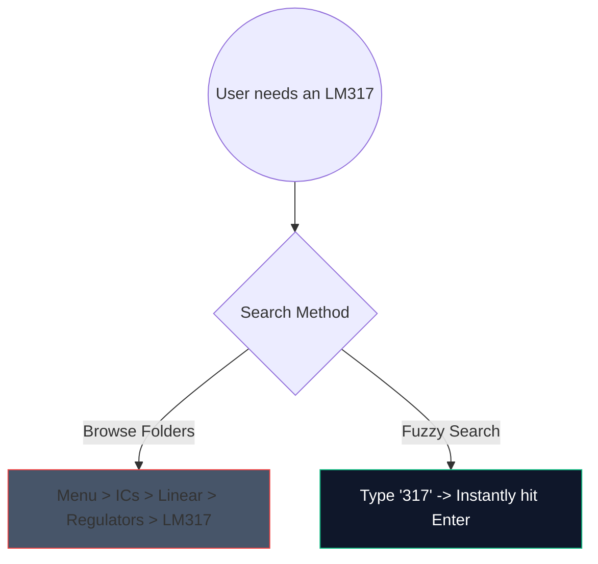

একটি সাধারণ পরিবর্ধক সার্কিট স্কেচ করার জন্য ভারী, 2-গিগাবাইট ডেস্কটপ সফ্টওয়্যার ডাউনলোড করার দিন শেষ। ব্রাউজার-ভিত্তিক CAD (কম্পিউটার-এডেড ডিজাইন) এখানে, এবং এটি অসাধারণভাবে দ্রুত।

এখানে আপনি 5 মিনিটের মধ্যে উত্পাদন-মানের স্কিম্যাটিক্স তৈরি করতে আধুনিক ওয়েব সরঞ্জামগুলি ব্যবহার করতে পারেন।

## কেন ব্রাউজার ভিত্তিক সার্কিট ডিজাইন?

আপনি যদি একজন শিক্ষাবিদ, ছাত্র, বা শখ করে লেখার ডকুমেন্টেশন, গতি এবং অ্যাক্সেসযোগ্যতা ট্রাম্পের কাঁচা বৈশিষ্ট্য।

```mermaid
flowchart LR
    subgraph Traditional Workflow
    DL[Download/Install] --> CONF[Configure Libraries] --> DRAW1[Draw]
    end
    
    subgraph Web Workflow
    URL[Go to URL] --> DRAW2[Draw immediately]
    end
    
    style URL fill:#0f172a,stroke:#3b82f6
    style DRAW2 fill:#1e293b,stroke:#10b981
```

| মেট্রিক | ডেস্কটপ অ্যাপ্লিকেশন | সার্কিট ডায়াগ্রাম মেকার |
| :--- | :--- | :--- |
| **স্টোরেজ স্পেস** | 1GB - 5GB+ | 0 MB (ক্লাউড-ভিত্তিক) |
| **OS সামঞ্জস্য** | প্রায়শই শুধুমাত্র উইন্ডোজ বা বগি পোর্ট | সার্বজনীনভাবে ওয়েব-সামঞ্জস্যপূর্ণ |
| **স্টার্টআপ সময়** | 15-30 সেকেন্ড | < 1 সেকেন্ড |
| ** বহনযোগ্যতা** | একটি মেশিনে সীমাবদ্ধ | সর্বত্র অ্যাক্সেসযোগ্য |

## গতির জন্য কোর ওয়ার্কফ্লো হ্যাক

একটি ওয়েব এডিটর ব্যবহার করার সময়, কীবোর্ড শর্টকাট ব্যবহার করা অভিজ্ঞতাকে "ক্লিক করা" থেকে একটি নিরবচ্ছিন্ন প্রবাহ অবস্থায় রূপান্তরিত করে।

আমাদের সম্পাদকে মুখস্থ করার জন্য এখানে সর্বোচ্চ-ROI শর্টকাট রয়েছে:

| কর্ম | হটকি কমান্ড | কর্মপ্রবাহের সুবিধা |
| :--- | :--- | :--- |
| **ওয়্যার রাউটিং** | `W` | তাত্ক্ষণিকভাবে আপনার কার্সারকে সংযোগ মোডে স্যুইচ করে, একটি টুলবারে না গিয়ে দ্রুত-ফায়ার নেট রাউটিংকে অনুমতি দেয়। |
| **কম্পোনেন্ট রোটেশন** | `R` (অংশ ধরে রাখার সময়) | রেজিস্টর বা ট্রানজিস্টর স্থাপন করার আগে সেগুলিকে ওরিয়েন্টিং করা পরে প্রচুর পরিমাণে পরিষ্কার করার সময় বাঁচায়। |
| **ডুপ্লিকেট নির্বাচন** | `Ctrl + D` বা `Alt-ড্র্যাগ` | মেনু থেকে 8 টি এলইডি টানবেন না; একটি স্থাপন করুন, এটি কনফিগার করুন এবং অবিলম্বে এটি 7 বার নকল করুন। |
| **প্যান ক্যানভাস** | `স্পেসবার + টেনে আনুন` | বিশাল, জটিল লেআউট নেভিগেট করার সময় আপনার জুম স্তর সামঞ্জস্যপূর্ণ রাখে। |

## উপাদান অনুসন্ধান ব্যবহার করা

বিশাল ড্রপডাউন মেনুর মাধ্যমে দৃশ্যত অনুসন্ধান করা ক্লান্তিকর। আমরা একটি শক্তিশালী অস্পষ্ট-অনুসন্ধান প্রক্রিয়া সংহত করেছি।

কেবল অনুসন্ধান বারে আঘাত করুন এবং `সেমিকন্ডাক্টর -> ট্রানজিস্টর -> বিজেটি` এর মাধ্যমে ক্লিক করার পরিবর্তে `NPN` টাইপ করুন। টুলটি তাত্ক্ষণিকভাবে সর্বোচ্চ সম্ভাব্যতা ম্যাচকে কিউরেট করে।

## পেশাদার ব্যবহারের জন্য রপ্তানি করা হচ্ছে

ডায়াগ্রাম তৈরি করা মাত্র অর্ধেক যুদ্ধ; আপনার থিসিস বা প্রযুক্তিগত ব্লগে এটি ইনজেকশন বাকি অর্ধেক.

PNG বা JPG না করে সর্বদা আপনার সার্কিট প্যাটার্নগুলিকে **SVG (স্কেলযোগ্য ভেক্টর গ্রাফিক্স)** হিসাবে রপ্তানি করুন। একটি SVG পিক্সেলের পরিবর্তে গাণিতিকভাবে সংজ্ঞায়িত লাইন সঞ্চয় করে, যার অর্থ আপনি বিলবোর্ডের আকার পর্যন্ত আপনার স্কিম্যাটিক স্কেল করতে পারেন এবং এটি রাস্টারাইজেশন ব্লার ছাড়াই চিরতরে পিন-শার্প থাকবে।

আপনার গতি পরীক্ষা করতে প্রস্তুত? **[অ্যাপটি চালু করুন](/সম্পাদক/)** এবং একটি 555-টাইমার ব্লিঙ্কিং LED সার্কিট তৈরি করার চেষ্টা করুন!