প্রথমবারের জন্য একটি জটিল পরিকল্পিত খোলা একটি ভিনদেশী ভাষার দিকে তাকিয়ে থাকার মত অনুভূত হয়। কয়েক ডজন ছেদকারী লাইন, রহস্যময় সংক্ষিপ্ত রূপ, এবং জ্যাগড চিহ্নগুলি ভিজ্যুয়াল শব্দের একটি প্রাচীরের মধ্যে একত্রিত হয়।

তবে অভিজ্ঞ প্রকৌশলীরা পুরো পৃষ্ঠার দিকে তাকিয়ে স্কিমেটিক্স পড়েন না। তারা বিচ্ছিন্ন, ট্রেস, এবং জয়. যেকোনো সার্কিট ডায়াগ্রামের পাঠোদ্ধার করার জন্য এখানে ধাপে ধাপে পদ্ধতি রয়েছে।

## ধাপ 1: মূল শক্তি পরিকাঠামো বিচ্ছিন্ন করুন

একটি সার্কিট *কী* করে তা বোঝার আগে আপনাকে অবশ্যই বুঝতে হবে *এটি কীভাবে শ্বাস নেয়*।

প্রতিটি পরিকল্পিত বৈদ্যুতিক শক্তি জন্য এন্ট্রি পয়েন্ট আছে. আপনার প্রথম কাজ হল সমস্ত প্রধান ভোল্টেজ রেল এবং স্থল রেফারেন্স সনাক্ত করা।

```mermaid
flowchart TD
    A[Start: Scan Edges] --> B{Look for Power Symbols}
    B -- Found Battery/Jack --> C[Trace the initial VCC and GND lines]
    B -- Found Net Labels --> D[Locate generic +5V, +3.3V pads]
    C --> E[Are there Voltage Regulators?]
    D --> E
    E -- Yes --> F[Mentally divide circuit into Voltage Zones]
    E -- No --> G[Circuit runs on single voltage]
    
    style A fill:#0f172a,stroke:#3b82f6
    style F fill:#1e293b,stroke:#f59e0b
```



| প্রতীক/পাঠ্য | অর্থ | কর্মের প্রয়োজনীয়তা |
| :--- | :--- | :--- |
| `VCC` / `VDD` | আইসিগুলির জন্য ইতিবাচক সরবরাহ ভোল্টেজ। | প্রতিটি IC শক্তি পাচ্ছে তা নিশ্চিত করতে এটি ট্রেস করুন। |
| `GND` / `VSS` | সাধারণ স্থল রেফারেন্স। | অনুমান করুন এই সমস্ত চিহ্নগুলি শারীরিকভাবে একসাথে সংযুক্ত। |
| `LDO` / `বক` | একটি চিপ নিয়ন্ত্রক ভোল্টেজ ডাউন. | নতুন নিম্ন ভোল্টেজ ব্যবহার করে কোন উপাদানগুলি ডাউন-স্ট্রিম করছে তা নোট করুন। |

## ধাপ 2: "মস্তিষ্ক" (ICs) ডিমিস্টিফাই করুন

একবার আপনি কোথায় শক্তি প্রবাহিত হচ্ছে তা জানলে, পৃষ্ঠায় সবচেয়ে বড় আয়তক্ষেত্রগুলি সন্ধান করুন৷ ইন্টিগ্রেটেড সার্কিট (ICs) পরিকল্পনার প্রাথমিক ফাংশন নির্দেশ করে।

আপনি যদি `NE555` বা `ATmega328P` এর মতো ক্রিপ্টিক পার্ট নম্বর সহ `U1` লেবেলযুক্ত কোনো IC-এর সম্মুখীন হন, তাহলে স্কিম্যাটিক পড়া অবিলম্বে বন্ধ করুন। একটি নতুন ট্যাব খুলুন এবং **ডেটাশিট** টানুন।

আপনার অভ্যন্তরীণ অর্ধপরিবাহী পদার্থবিদ্যা বোঝার দরকার নেই; শুধু ডেটাশীটের "পিনআউট ডায়াগ্রাম" দেখুন। যদি পিন 4 'RESET' হয় এবং পিন 8 'VCC' হয়, তাহলে অবিলম্বে সেই যুক্তিটিকে অঙ্কনে ফিরিয়ে দিন।

## ধাপ 3: ইনপুট এবং আউটপুট ট্র্যাক করুন

সার্কিটগুলি কার্যকরী মেশিন। তারা পরিবেশগত ইনপুট গ্রহণ করে, এটি প্রক্রিয়া করে এবং ফলাফল আউটপুট করে।

```mermaid
quadrantChart
    title Input/Output Hardware Identification
    x-axis Analog/Physical --> Digital/Data
    y-axis Input Devices --> Output Devices
    quadrant-1 Digital Receivers (e.g. WiFi)
    quadrant-2 Digital Displays (e.g. OLEDs)
    quadrant-3 Physical Actuators (e.g. Motors)
    quadrant-4 Physical Sensors (e.g. Thermistors)
    "Push Button": [0.1, 0.4]
    "Photoresistor": [0.2, 0.2]
    "UART RX": [0.8, 0.4]
    "UART TX": [0.8, 0.6]
    "Speaker": [0.3, 0.8]
    "LED": [0.4, 0.7]
```

কেন্দ্রীয় ICs থেকে বাইরের দিকে তারের ট্রেস করুন। যদি একটি IC পিন একটি LED এর সাথে সংযোগ করে, এটি একটি ভিজ্যুয়াল আউটপুট। যদি একটি পিন মাটিতে যাওয়া একটি SPST সুইচের সাথে সংযোগ করে তবে এটি একটি মানব ইনপুট।

## ধাপ 4: জংশন এবং ক্রসিং যাচাই করুন

নতুনদের জন্য সবচেয়ে সাধারণ পড়ার ত্রুটি হল ভুল বোঝাবুঝি তারের যা একে অপরকে অতিক্রম করে।

* **একটি বিন্দু একটি গিঁট দেয়:** যদি দুটি ছেদকারী রেখা তাদের ক্রসিংয়ে একটি কঠিন বিন্দু বৈশিষ্ট্যযুক্ত থাকে, তবে তারা শারীরিকভাবে সোল্ডার/একত্রে সংযুক্ত থাকে। তাদের মধ্যে কারেন্ট প্রবাহিত হতে পারে।
* **কোন ডট ইয়েল্ড একটি ব্রিজ:** যদি দুটি লাইন একটি প্লেইন ক্রস (+) তৈরি করে তবে তারা স্পর্শ করে না। এগুলি একটি ওভারপাসে একে অপরের উপর দিয়ে যাওয়া দুটি হাইওয়ের মতো।

## ধাপ 5: সাব-সার্কিট চিনুন (গোপন অস্ত্র)

প্রকৌশলীরা খুব কমই সম্পূর্ণ স্ক্র্যাচ থেকে সার্কিট ডিজাইন করেন। তারা স্ট্যান্ডার্ড মডুলার সাব-সার্কিট একসাথে আঠালো। একবার আপনি এই চাক্ষুষ 'শব্দগুলি' চিনতে শিখলে, আপনি পৃথক 'অক্ষর' পড়া বন্ধ করে দেন।

| ভিজ্যুয়াল প্যাটার্ন | স্ট্যান্ডার্ড সাব সার্কিট | ফাংশন |
| :--- | :--- | :--- |
| একটি IC এর ঠিক পাশে `VCC` থেকে `GND` পর্যন্ত ক্যাপাসিটর ক্রসিং। | **ডিকপলিং ক্যাপাসিটর** | শব্দ শোষণ করে। যৌক্তিক প্রবাহ বিশ্লেষণ করার সময় এটি উপেক্ষা করুন। |
| `+5V` পর্যন্ত মোড়ানো ডিজিটাল পিন থেকে প্রতিরোধক। | **পুল-আপ প্রতিরোধক** | ভাসমান পিন প্রতিরোধ করে; একটি স্থিতিশীল উচ্চ ডিফল্ট অবস্থা নিশ্চিত করে। |
| ভোল্টেজ এবং গ্রাউন্ডের মধ্যে সিরিজে দুটি প্রতিরোধক স্থাপন করা হয়েছে, মাঝখানে ট্যাপ করা হয়েছে। | **ভোল্টেজ বিভাজক** | সেন্সর পিন দ্বারা নিরাপদে পড়ার জন্য আনুপাতিকভাবে একটি ভোল্টেজ ড্রপ করে। |

এই তত্ত্বটি ব্যবহার করুন। **[সার্কিট ডায়াগ্রাম এডিটর](/সম্পাদক/)** খুলুন, একটি টেমপ্লেট লোড করুন এবং নিজের জন্য শক্তি, মস্তিষ্ক, ইনপুট এবং আউটপুটগুলি ম্যাপ করুন!