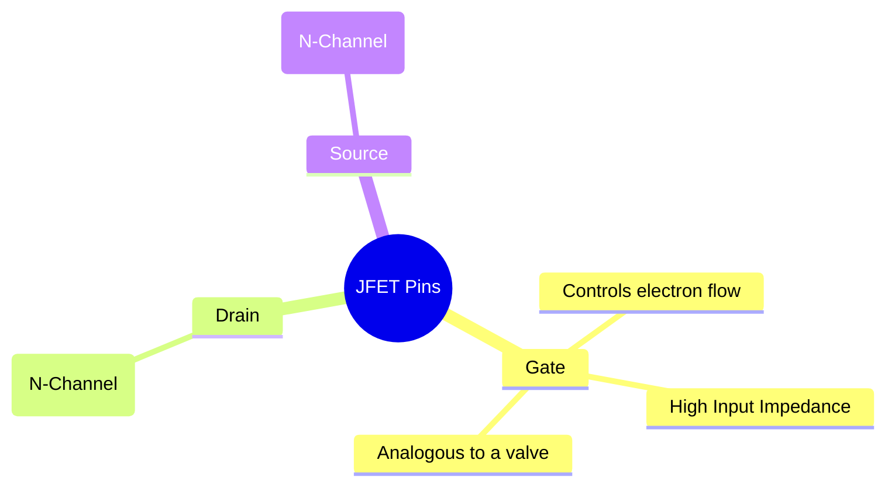

MOSFET-এর ব্যাপক বিস্তারের আগে, **JFET** (জাংশন ফিল্ড-ইফেক্ট ট্রানজিস্টর) ছিল উচ্চ ইনপুট ইম্পিডেন্স অ্যামপ্লিফিকেশনের রাজা। যদিও আধুনিক ডিজিটাল লজিকে প্রায়শই ব্যবহার করা হয় না, তারা উচ্চ-বিশ্বস্ত অডিও প্রিমপ্লিফায়ার, সংবেদনশীল যন্ত্র, এবং আরএফ সার্কিট্রিতে অপরিহার্য নিদর্শন থেকে যায়।

JFET স্কিম্যাটিক চিহ্ন বোঝা প্রত্যেকের জন্য আলাদা অ্যানালগ সার্কিট ডিজাইনের জন্য প্রয়োজনীয়।

## 1. JFET প্রতীকের শারীরস্থান

বাইপোলার জংশন ট্রানজিস্টর (BJTs) থেকে ভিন্ন যা বর্তমান-নিয়ন্ত্রিত ডিভাইস, একটি JFET হল একটি **ভোল্টেজ-নিয়ন্ত্রিত** ডিভাইস। পরিকল্পিত প্রতীকটি তার অভ্যন্তরীণ সেমিকন্ডাক্টর চ্যানেলের ভৌত নির্মাণকে দৃশ্যতভাবে উপস্থাপন করার চেষ্টা করে।

প্রতীকটি একটি সরল উল্লম্ব রেখা নিয়ে গঠিত যা চ্যানেলের প্রতিনিধিত্ব করে, যেখানে দুটি অনুভূমিক রেখা রয়েছে (ড্রেন এবং উত্স)। একটি তৃতীয় লম্ব রেখা গেট গঠন করে, একটি তীর দিয়ে সম্পূর্ণ যা সেমিকন্ডাক্টর পোলারিটি নির্দেশ করে।

### এন-চ্যানেল বনাম পি-চ্যানেল জেএফইটি

BJT-এর যেমন NPN এবং PNP আছে, তেমনি JFET দুটি আলাদা স্বাদে আসে।

| চারিত্রিক | এন-চ্যানেল JFET | পি-চ্যানেল JFET |
| :--- | :--- | :--- |
| **প্রতীক তীর** | পয়েন্ট **IN** চ্যানেল লাইনের দিকে | চ্যানেল থেকে পয়েন্ট **আউট** দূরে |
| **সংখ্যাগরিষ্ঠ বাহক** | ইলেকট্রন | গর্ত |
| **পিঞ্চ-অফের জন্য ভিজিএস** | নেতিবাচক ভোল্টেজ (যেমন, -5V) | পজিটিভ ভোল্টেজ (যেমন, +5V) |
| **টাইপিক্যাল অপারেশন**| সাধারণত চালু -> বন্ধ করতে ঋণাত্মক ভোল্টেজ অ্যারে প্রয়োগ করুন | সাধারণত চালু -> বন্ধ করতে ইতিবাচক ভোল্টেজ অ্যারে প্রয়োগ করুন |

> **মেমরি ট্রিক:** "পয়েন্টিং ইন" মানে **N**-চ্যানেল। গেটের তীর দেখুন। যদি এটি লাইনের অভ্যন্তরীণ দিকে নির্দেশ করে, আপনি একটি N-চ্যানেল JFET এর সাথে কাজ করছেন (যেমন জনপ্রিয় 2N5457)।

## 2. অপারেশন: অবক্ষয় মোড

একটি JFET-এর সবচেয়ে সংজ্ঞায়িত বৈশিষ্ট্যগুলির মধ্যে একটি হল এটি একটি **ডিপ্লেশন মোড** ডিভাইস। এটি ব্যাপকভাবে প্রভাবিত করে যে আপনি কীভাবে তাদের চারপাশে স্কিম্যাটিক্স ডিজাইন করেন।

* **MOSFETs (বর্ধিতকরণ মোড):** সাধারণত বন্ধ থাকে। সেগুলি চালু করার জন্য আপনাকে অবশ্যই গেটে একটি ভোল্টেজ প্রয়োগ করতে হবে।
* **জেএফইটি (ডিপ্লেশন মোড):** সাধারণত চালু থাকে। গেটে 0 ভোল্টের সাথে, সর্বাধিক কারেন্ট ড্রেন থেকে উৎসে প্রবাহিত হয়। আপনি অবশ্যই একটি *বিপরীত পক্ষপাত* ভোল্টেজ প্রয়োগ করতে হবে (N-চ্যানেলের জন্য নেতিবাচক) অবক্ষয় অঞ্চলকে প্রসারিত করতে এবং আক্ষরিক অর্থে ইলেকট্রনের প্রবাহকে "চিমটি বন্ধ" করে, ডিভাইসটি বন্ধ করে দেয়।

```mermaid
flowchart LR
    VGS[V_GS = 0V] --> I1[Maximum Drain Current flows]
    VGS2[V_GS = -2V] --> I2[Current is restricted]
    VGS3[V_GS = -5V] --> I3[Pinch-Off reached. Circuit is OFF]
    
    style VGS fill:#1e293b,stroke:#f59e0b
    style VGS3 fill:#1e293b,stroke:#ef4444
```

## 3. সাধারণ পরিকল্পিত অ্যাপ্লিকেশন

যেহেতু একটি JFET এর গেট অপারেশন চলাকালীন বিপরীত পক্ষপাতী, মূলত শূন্য কারেন্ট এতে প্রবাহিত হয়। এটি একটি জ্যোতির্বিদ্যাগতভাবে উচ্চ ইনপুট প্রতিবন্ধকতা দেয় (প্রায়শই শত শত মেগাওম এ পরিমাপ করা হয়)।

| সার্কিট অ্যাপ্লিকেশন | কেন JFET নির্বাচন করা হয় | পরিকল্পিত সূত্র |
| :--- | :--- | :--- |
| **অডিও প্রিমপ্লিফায়ার্স** | অত্যন্ত কম শব্দ এবং ব্যাপক ইনপুট প্রতিবন্ধকতা সংবেদনশীল বৈদ্যুতিক গিটার পিকআপ লোড হতে বাধা দেয়। | প্রায়শই সোর্স ফলোয়ার বাফার স্টেজ হিসেবে অভিনয় করতে দেখা যায়। |
| **অ্যানালগ সুইচ** | যেহেতু তারা কোন গেট কারেন্ট ছাড়াই সম্পূর্ণরূপে ভোল্টেজ নিয়ন্ত্রিত, তারা সিগন্যাল পাথে শূন্য সুইচিং ট্রানজিয়েন্ট ইনজেক্ট করে। | ড্রেন-উৎস চ্যানেলের মধ্য দিয়ে যাওয়া একটি এনালগ সংকেত সহ সিরিজে স্থাপন করা হয়েছে। |
| **ধ্রুবক বর্তমান উত্স** | একটি JFET নেটিভভাবে একটি ধ্রুবক কারেন্ট সিঙ্ক হিসাবে আচরণ করে যখন গেটটি সরাসরি উত্সের সাথে বাঁধা থাকে। | গেট টার্মিনাল সরাসরি সোর্স টার্মিনালের চারপাশে তারযুক্ত। |

এই বিশেষ অ্যানালগ সার্কিটগুলি ডায়াগ্রাম করার সময়, নির্ভুলতা মূল বিষয়। উত্পাদন ব্যর্থতা প্রতিরোধ করতে আপনার গেট তীর অভিযোজন সঠিক কিনা তা নিশ্চিত করুন। **[সার্কিট ডায়াগ্রাম মেকার](/সম্পাদক/)**-এ কিউরেটেড ডিসক্রিট সেমিকন্ডাক্টর লাইব্রেরি ব্যবহার করুন আপনার পরবর্তী ক্যানভাসে নির্ভুলভাবে স্ট্যান্ডার্ড এন-চ্যানেল এবং পি-চ্যানেল জেএফইটি চিহ্ন স্থাপন করুন।