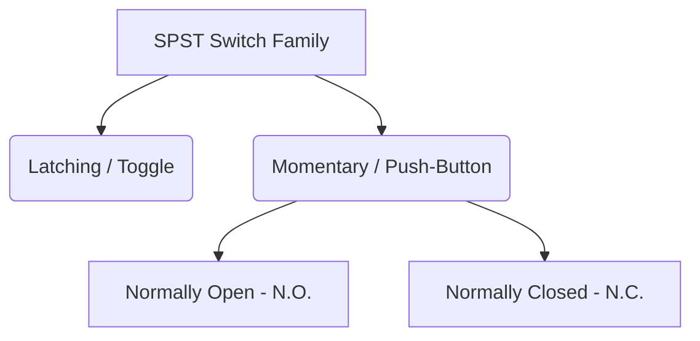

প্রতিটি ইন্টারফেসের কেন্দ্রস্থলে যান্ত্রিক সুইচটি বিদ্যুত নিয়ন্ত্রণ করতে মানুষ ব্যবহার করে। এই উপাদানটির সবচেয়ে সহজ, সর্বব্যাপী অবতার হল **SPST**, বা একক মেরু একক থ্রো সুইচ।

আপনি একটি উচ্চ-ভোল্টেজ পাওয়ার মেইন ব্রেকার ডিজাইন করছেন বা কেবল একটি Arduino ব্রেডবোর্ডে একটি পুশ-বোতাম ম্যাপিং করছেন না কেন, SPST প্রতীকটি আপনার যৌক্তিক শুরুর পয়েন্ট।

## 1. SPST আসলে কি মানে

ইঞ্জিনিয়াররা দুটি ভেরিয়েবল ব্যবহার করে সুইচকে শ্রেণীবদ্ধ করে: **পোল** এবং **থ্রো**।

* **মেরু (P):** স্বতন্ত্র বৈদ্যুতিক সার্কিটের সংখ্যা সুইচটি একই সাথে নিয়ন্ত্রণ করতে পারে। 
* **থ্রো (টি):** প্রতিটি মেরুতে বদ্ধ অবস্থার সংখ্যা (অন পজিশন)।

অতএব, একটি SPST হল একটি *একক মেরু* (একটি সার্কিট নিয়ন্ত্রণ করে) এবং *একক নিক্ষেপ* (শুধু একটি বন্ধ, পরিবাহী অবস্থান রয়েছে)।

```mermaid
flowchart LR
    A[Human Input] --> B((SPST Mechanism))
    B -- Open / Default --> C[Infinite Resistance / OFF]
    B -- Closed / Actuated --> D[Zero Resistance / ON]
    
    style B fill:#0f172a,stroke:#f59e0b
```

## 2. SPST স্কিম্যাটিক সিম্বল পড়া

একটি SPST সুইচের জন্য স্ট্যান্ডার্ড IEEE চিহ্নটি অত্যন্ত স্বজ্ঞাত-এটি আক্ষরিক অর্থে এটি যা করে তা দেখায়।

| ভিজ্যুয়াল উপাদান | বাস্তব জগতে অর্থ |
| :--- | :--- |
| **দুটি খোলা চেনাশোনা** | স্থির বৈদ্যুতিক যোগাযোগের প্যাড যেখানে তারগুলি বন্ধ হয়ে যায়। |
| **কর্ণ ভাঙ্গা রেখা** | যান্ত্রিক পরিবাহী বাহু, একটি 'ওপেন' ডিফল্ট অবস্থা নির্দেশ করতে দ্বিতীয় প্যাড থেকে শারীরিকভাবে বিচ্ছিন্ন। |
| **নির্ধারক (`S` বা `SW`)** | স্ট্যান্ডার্ড রেফারেন্স ট্যাগ. যেমন, `SW1`। |

> **স্বাভাবিক অবস্থা অনুমান:** অন্যথায় নির্দিষ্ট করা না থাকলে, যান্ত্রিক সুইচগুলি তাদের **অপ্রচলিত, বিশ্রামের অবস্থায় আঁকা হয়। একটি স্ট্যান্ডার্ড SPST লাইট সুইচের জন্য, এর অর্থ হল স্কিম্যাটিক এটিকে বন্ধ হিসাবে চিত্রিত করে।

## 3. SPST এর ভিন্নতা: পুশ-বোতাম

একটি টগল সুইচ আপনি যেখানে রাখেন সেখানেই থাকে (ল্যাচিং)। একটি পুশ-বোতাম শুধুমাত্র সক্রিয় হয় যখন আপনার আঙুল এটিতে থাকে (ক্ষণস্থায়ী)। SPST উপাধি উভয় ক্ষেত্রেই প্রযোজ্য, কিন্তু মানুষের মিথস্ক্রিয়া মোডগুলিকে আলাদা করার জন্য প্রতীকগুলি সামান্য পরিবর্তিত হয়।

| সুইচ টাইপ | পরিকল্পিত পরিবর্তন | বাস্তব-বিশ্বের উদাহরণ |
| :--- | :--- | :--- |
| **পুশ-বোতাম (N.O.)** | একটি কৌণিক বাহুর পরিবর্তে, একটি সমতল সেতু দুটি কন্টাক্ট প্যাডের *উপরে* ঘোরাফেরা করে। নিচে ঠেলে ব্যবধান কমিয়ে দেয়। | কীবোর্ড কী, কম্পিউটার পাওয়ার বোতাম, ডোরবেল বোতাম। |
| **পুশ-বোতাম (N.C.)** | ফ্ল্যাট ব্রিজটি *নীচে* বা প্যাড স্পর্শ করে, সার্কিটটি ডিফল্টরূপে চালু রাখে। নিচে ঠেলে সংযোগ বিচ্ছিন্ন. | ভারী যন্ত্রপাতিতে ইমার্জেন্সি স্টপ (ই-স্টপ) বোতাম। |

## 4. হার্ডওয়্যার বাস্তবায়ন সতর্কতা

একটি ডিজিটাল লজিক সার্কিটে (একটি রাস্পবেরি পাই জিপিআইও পিনের মতো) একটি SPST সুইচ অন্তর্ভুক্ত করার সময়, একটি সাদামাটা পরিকল্পিত নকশা বিপর্যয়করভাবে অনির্দেশ্য সফ্টওয়্যার আচরণের দিকে পরিচালিত করবে।

### "ফ্লোটিং পিন" সমস্যা

আপনি যদি একটি SPST সুইচের একপাশকে 5V এবং অন্য পাশকে সরাসরি একটি মাইক্রোকন্ট্রোলার পিনের সাথে সংযুক্ত করেন, তাহলে সুইচটি খোলা থাকলে কী হবে? পিনটি 0V পড়ছে না—এটি সংযোগ বিচ্ছিন্ন এবং "ভাসমান", একটি অ্যান্টেনার মতো কাজ করছে যা আশেপাশের ইলেক্ট্রোম্যাগনেটিজমকে তুলে নেয়৷

**ফিক্স: পুল-ডাউন প্রতিরোধক**

সর্বদা ডিজিটাল পিন এবং গ্রাউন্ডের মধ্যে সংযুক্ত একটি প্রতিরোধক (সাধারণত 10kΩ) অন্তর্ভুক্ত করুন।

1. **সুইচ অফ:** পিনটি রোধের মাধ্যমে নিরাপদে 0V রিড করে।
2. **সুইচ অন:** 5V সাপ্লাই রোধকে ওভারপাওয়ার করে, একটি নিরাপদ হাই স্টেট ট্রিগার করে।

**[সার্কিট ডায়াগ্রাম এডিটর](/সম্পাদক/)** এর মাধ্যমে নিরাপদে আপনার ডিজাইনে SPST বৈচিত্রগুলি অন্তর্ভুক্ত করুন। N.O খুঁজতে বাম 'সুইচ' লাইব্রেরি প্রসারিত করুন। এবং N.C. বাস্তবায়ন!