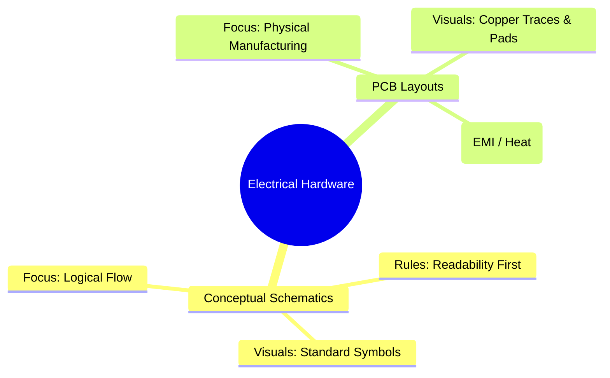
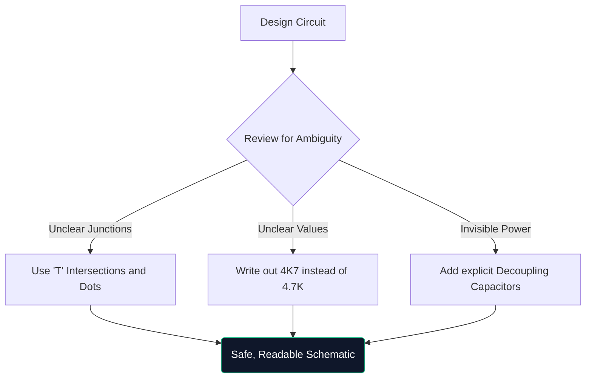

সার্কিট ডায়াগ্রামের নির্দিষ্ট মাস্টারক্লাসে স্বাগতম। আপনি সপ্তাহান্তে আরডুইনো প্রোটোটাইপ একসাথে হ্যাক করছেন বা বৈদ্যুতিক প্রকৌশল অধ্যয়ন করছেন কিনা, স্কিম্যাটিক আর্কিটেকচার বোঝা আলোচনার যোগ্য নয়।

এই নির্দেশিকাটি মৌলিক বিষয়ের বাইরে চলে যায়, আধুনিক ডায়াগ্রামগুলি কীভাবে তৈরি, যাচাই করা এবং তৈরি করা হয় তা মূল্যায়ন করে।

## তাত্ত্বিক স্কিম্যাটিক্স বনাম পিসিবি লেআউট

বিভ্রান্তির একটি খুব সাধারণ বিষয় হল একটি স্কিম্যাটিক ডায়াগ্রাম এবং একটি প্রিন্টেড সার্কিট বোর্ড (PCB) লেআউটের মধ্যে পার্থক্য। তারা একই বৈদ্যুতিক সত্যের সম্পূর্ণ ভিন্ন উপস্থাপনা।

| বৈশিষ্ট্য | পরিকল্পিত চিত্র | PCB লেআউট |
| :--- | :--- | :--- |
| **উদ্দেশ্য** | *কিভাবে* সার্কিট যৌক্তিকভাবে কাজ করে তা বোঝার জন্য | নির্দেশ করতে *কোথায়* তামা শারীরিকভাবে যায় |
| **কম্পোনেন্ট রিপ্রেজেন্টেশন** | বিমূর্ত প্রতীক (ত্রিভুজ, জিগজ্যাগ) | শারীরিক 1:1 পদচিহ্ন প্যাড (যেমন, SOIC-8, 0805) |
| **সংযোগ** | নিখুঁত জ্যামিতিক লাইন | 45-ডিগ্রী কোণ তামার ট্রেস |
| **পরিবেশ** | পরিষ্কার, সাদা পটভূমি কাগজ | বহু-স্তর বিশিষ্ট আক্ষরিক 3D স্থান |

## একটি অ্যাডভান্সড স্কিম্যাটিক এর অ্যানাটমি

যখন সার্কিট 100টি উপাদান অতিক্রম করে, তখন চাক্ষুষ দৃষ্টান্ত স্থানান্তরিত হয়। আপনি কেবল টানা তারের সাথে সবকিছু সংযুক্ত করতে পারবেন না।

1. **টাইটেল ব্লক**: প্রফেশনাল স্কিমেটিকস সবসময় নীচের ডানদিকে কোণায় কোম্পানির নাম, ইঞ্জিনিয়ার অফ রেকর্ড, রিভিশন নম্বর এবং তারিখ নির্দেশ করে একটি ব্লক দেখায়।
2. **নেট লেবেল এবং পোর্ট**: তারগুলি সাব-সিস্টেমের সাথে সংযোগ করে না; নামযুক্ত লেবেলগুলি করে। যদি দুটি তারকে `CLK_OUT` লেবেল করা হয়, তবে সেগুলি বৈদ্যুতিকভাবে সংযুক্ত থাকে, যদিও সেগুলি বিভিন্ন পৃষ্ঠায় থাকে৷
3. **হায়ারার্কিক্যাল ব্লক**: বিশাল ডিজাইনে (কম্পিউটার মাদারবোর্ডের মতো) শ্রেণীবিন্যাস ব্যবহার করা হয়। "মেমরি ইন্টারফেস" লেবেলযুক্ত একটি একক আয়তক্ষেত্রাকার ব্লকের ভিতরে একটি সম্পূর্ণ আলাদা পরিকল্পিত পৃষ্ঠা রয়েছে।

## "প্রতিরক্ষামূলক অঙ্কন" এর নিয়ম

প্রতিরক্ষামূলক ড্রাইভিং-এর মতোই, প্রতিরক্ষামূলক অঙ্কন বলতে বোঝায় যে ব্যক্তি আপনার স্কিম্যাটিক পড়ছেন তিনি এটিকে ভুল বুঝবেন যদি না আপনি তাদের স্পষ্টভাবে গাইড করেন।

> **কেন `4K7` লিখবেন?** মুদ্রিত বা ফটোকপি করা স্কিম্যাটিক্সে, একটি ক্ষুদ্র দশমিক বিন্দু (`.`) আর্টিফ্যাক্টের কারণে সহজেই অদৃশ্য হয়ে যায়। `4.7K` লিখলে কেউ এটিকে `47K` হিসেবে পড়ার ঝুঁকি নিয়ে থাকে, যা কোনো উপাদানকে ভাজতে পারে। `4K7` লেখার ফলে গুণকটিকে দশমিক বিন্দু হিসেবে কাজ করে, কার্যত ভুল পড়া দূর করে।

## ডিজিটাল CAD টুলে রূপান্তর

গ্রাফ পেপারে অঙ্কন মস্তিষ্কের জন্য চমৎকার, কিন্তু উৎপাদনের জন্য কার্যত অকেজো। আপনি যখন আপনার ডিজাইনগুলিকে [সার্কিট ডায়াগ্রাম মেকার](/সম্পাদক/) এর মতো একটি টুলে স্থানান্তরিত করেন, তখন আপনি বেশ কয়েকটি পরাশক্তি লাভ করেন:

**নেটলিস্ট**: ডিজিটাল টুল গাণিতিক প্রমাণ সংযোগ।
* **পুনঃব্যবহারযোগ্যতা**: পূর্ববর্তী প্রকল্পগুলি থেকে জটিল নিয়ন্ত্রিত পাওয়ার সাপ্লাই কপি-পেস্ট করা ঘন্টা বাঁচায়।
* **ভেক্টর কোয়ালিটি**: SVG হিসাবে রপ্তানি করলে আপনি যতই জুম করুন না কেন পুরোপুরি ক্রিস্প লাইনের গ্যারান্টি দেয়।

তত্ত্ব থেকে বাস্তবে উল্লম্ফন শুরু হয় একটি ভালোভাবে আঁকা লাইন দিয়ে। আজ আপনার যাত্রা শুরু!