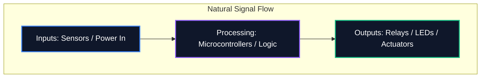

Unabhängig davon, ob Sie ein Diagramm in einem Forum teilen oder es zur professionellen Leiterplattenfertigung einreichen, ist die Lesbarkeit Ihres Schaltplans genauso wichtig wie seine logische Korrektheit. Ein unordentlicher Schaltplan führt zu Routingfehlern, missverstandenen Komponenten und Zeitverschwendung.

Dieser Leitfaden beschreibt die wichtigsten Best Practices, die professionelle Elektronikingenieure verwenden, um saubere, wartbare und gut lesbare Schaltpläne zu erstellen.

## 1. Ablauf des Schaltplans: Von links nach rechts, von oben nach unten

Ein Schaltplan ist ein technisches Dokument und sollte wie jedes Dokument natürlich gelesen werden. Im Elektronikdesign schreibt die Standardkonvention vor, dass die Eingänge von links kommen und die Ausgänge von rechts austreten.

Ebenso sollten höhere Spannungen explizit oben im Schaltplan und niedrigere Spannungen oder Masse unten platziert werden.



## 2. Strom- und Erdungssymbole

Ziehen Sie niemals lange, gewundene Drähte, um jeden einzelnen Erdungsstift miteinander zu verbinden. Es entsteht ein Spinnennetz, das nicht zu lesen ist. Verwenden Sie stattdessen lokale Strom- und Erdungssymbole an der Komponente.

| Schlechte Praxis | Best Practice | Warum es wichtig ist |
| :--- | :--- | :--- |
| Alle Erdungen mit einem einzigen durchgehenden Kabel verbinden | Verwendung lokaler „GND“-Symbole an jeder Komponente | Reduziert visuelle Unordnung; Definiert explizit Rückgabepfade ohne komplexe Ablaufverfolgung |
| Platzieren von VCC-Leitungen, die sich über Signalspuren kreuzen | Verwendung lokaler „VCC“ / „+5V“-Symbole, die nach oben zeigen | Verhindert, dass Signalleitungen optisch mit der Stromversorgung verwechselt werden |
| Kennzeichnung verschiedener Gründe mit demselben Symbol | Unterscheidung zwischen analoger Masse (AGND) und digitaler Masse (DGND) | Entscheidend für die Vermeidung von Erdschleifen und Rauschausbreitung in Mixed-Signal-Designs |

## 3. Kreuzungspunkte vs. Kreuzungen

Einer der gefährlichsten Fehler beim Schaltplanentwurf ist die Unklarheit, wo sich Drähte kreuzen.

```mermaid
graph TD
    A[Is it a connection?]
    A --> B{Is there a junction dot?}
    B -- Yes --> C[Wires are electrically connected (Node)]
    B -- No --> D[Wires are crossing without connecting]
    
    style A fill:#1e293b,stroke:#f59e0b
    style C fill:#1e293b,stroke:#10b981
    style D fill:#1e293b,stroke:#ef4444
```

> **Profi-Tipp:** Verwenden Sie niemals „4-Wege“-Kreuzungen (ein Kreuz in Form eines „+“). Wenn sich vier Drähte treffen müssen, versetzen Sie sie in zwei 3-Wege-T-Verbindungen. Dadurch werden Mehrdeutigkeiten vollständig beseitigt; Wenn der Verbindungspunkt beim Drucken oder Skalieren verschwindet, deutet die „T“-Form immer noch eindeutig auf eine Verbindung hin, während dies bei einem bloßen Kreuz nicht der Fall ist.

## 4. Logische Komponentengruppierung

Bei großen Schaltplänen mit Mikrocontrollern mit mehr als 64 Pins ist der Versuch, jeden Draht physisch mit der Komponente zu verbinden, eine sinnlose Übung. Stattdessen nutzen professionelle Tools **Net Labels**.

Gruppieren Sie Funktionsblöcke Ihrer Schaltung in visuelle Zonen. Platzieren Sie beispielsweise das Netzteil in einer Ecke, die MCU in der Mitte und die Motortreiber in einer anderen. Verbinden Sie sie ausschließlich über beschreibende Net Labels (z. B. „SPI_MOSI“, „UART_TX“, „MOTOR_PWM“).

## 5. Referenzbezeichner und -werte

Ein bloßes Widerstandssymbol sagt dem Betrachter nichts. Jede Komponente muss einen eindeutigen Referenzbezeichner und einen expliziten Wert haben.

| Komponentenkategorie | Standardpräfix | Beispiel |
| :--- | :--- | :--- |
| **Widerstände** | „R“ | „R1 (10kΩ)“ |
| **Kondensatoren** | „C“ | „C4 (100nF)“ |
| **Integrierte Schaltkreise** | „U“ oder „IC“ | „U2 (LM358)“ |
| **Dioden / LEDs** | „D“ | „D1 (1N4148)“ |
| **Transistoren / MOSFETs** | „Q“ | „Q1 (2N2222)“ |
| **Induktoren** | `L` | „L1 (4,7 μH)“ |
| **Anschlüsse/Header** | „J“ oder „P“ | „J1 (Stromanschluss)“ |

Die Einhaltung dieser Konventionen garantiert, dass Ihr Schaltplan von jedem Ingenieur überall auf der Welt sofort verstanden wird. Beginnen Sie noch heute mit der Anwendung dieser Regeln im [Schaltplan-Editor](/editor/).