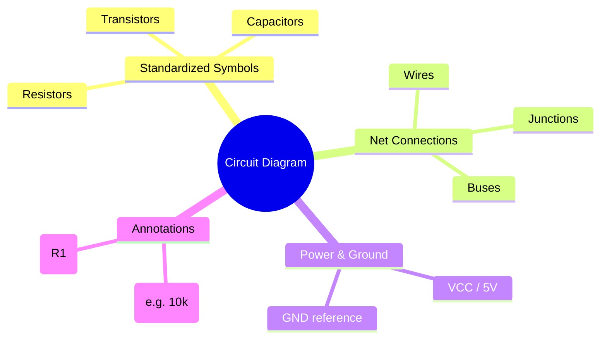
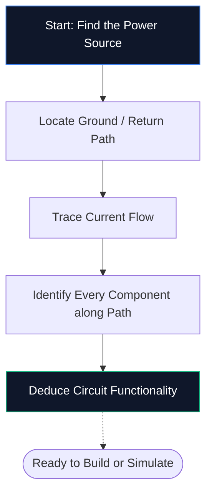

Wenn Sie noch nie einen Schaltplaneditor geöffnet haben, ist dies die einzige Anleitung, die Sie benötigen. Wir gehen durch die Grundlagen – was ein Schaltplan ist, wie man die Symbole dekodiert und wie man seinen allerersten Schaltplan in **Circuit Diagram Maker** zeichnet – und das alles ohne die Installation einer einzigen Software.

## Was genau ist ein Schaltplan?

Ein Schaltplan ist eine Karte für Elektrizität. So wie eine U-Bahn-Karte zeigt, wie Stationen verbunden werden, ohne die Tunnel maßstabsgetreu abzubilden, zeigt ein Schaltplan, wie elektronische Komponenten verbunden werden, ohne sich Gedanken über die physische Größe oder die Platinenplatzierung zu machen.

Anstelle realistischer Zeichnungen verwenden Schaltpläne **standardisierte Symbole**. Ein Widerstand erscheint als Zickzacklinie, ein Kondensator als zwei parallele Platten und eine Diode als Dreieck, das auf einen Balken trifft. Diese universelle Kurzschrift sorgt dafür, dass Diagramme in jedem Land und in jeder Sprache sauber, ausdruckbar und lesbar sind.

> **Warum Abstraktionen wichtig sind:** Ein physikalischer Widerstand ist ein winziger Zylinder mit farbigen Bändern, doch in einem Schaltplan mit 50 Komponenten würde dieses Detail zu visuellem Chaos führen. Symbole komprimieren das Bild, sodass sich Ihr Gehirn darauf konzentrieren kann, *wie die Dinge zusammenhängen* und nicht *wie sie aussehen*.

## Die 10 Symbole, die jeder Anfänger kennen muss

Bevor Sie einen einzelnen Schaltplan lesen oder zeichnen können, müssen Sie die Kernbausteine ​​kennen. Merken Sie sich die Tabelle unten und Sie werden in der Lage sein, die meisten Hobby-Schaltkreise auf Anhieb zu entschlüsseln.

| Symbolform | Komponente | Primäre Funktion | Bezeichner |
| :--- | :--- | :--- | :--- |
| **Zickzacklinie** | Widerstand | Begrenzt den Stromfluss | „R“ |
| **Zwei parallele Linien** | Kondensator | Speichert Ladung, filtert Lärm | „C“ |
| **Reihe von Schleifen** | Induktor | Speichert Energie in einem Magnetfeld | `L` |
| **Dreieck + Balken** | Diode | Ermöglicht Strom in eine Richtung | „D“ |
| **Dreieck + Balken + Pfeile** | LED | Gibt Licht ab, wenn es in Vorwärtsrichtung betrieben wird | „D“ / „LED“ |
| **Lange / kurze parallele Linien** | Batterie | Stellt Gleichspannung zur Verfügung | „BT“ |
| **Drei gestapelte Zeilen** | Boden | Referenzpunkt bei 0 V | „GND“ |
| **Dreiecksform** | Operationsverstärker | Verstärkt Spannungsdifferenz | „U“ / „IC“ |
| **Rechteck mit Stiften** | Integrierter Schaltkreis | Führt komplexe Funktionen aus | „U“ / „IC“ |
| **Gerade Linien** | Drähte | Strom zwischen Komponenten transportieren | *(Keine)* |

## So lesen Sie einen Schaltplan in fünf Schritten

Das Lesen eines Schaltplans folgt jedes Mal dem gleichen mentalen Prozess. Üben Sie diese fünf Schritte an einem beliebigen Schaltplan und das Muster wird Ihnen in Fleisch und Blut übergehen.

1. **Finden Sie die Stromquelle** – Achten Sie auf ein Batteriesymbol oder Etiketten wie VCC, 5 V oder 3,3 V. Hier gelangt elektrische Energie in den Stromkreis.
2. **Erdung suchen** – Suchen Sie das dreizeilige Erdungssymbol oder ein GND-Etikett. Jeder Stromkreis muss einen Rückweg haben.
3. **Stromfluss verfolgen** – Verfolgen Sie die Drähte vom Pluspol durch jede Komponente und zurück zur Erde. Konventioneller Strom fließt von positiv nach negativ.
4. **Identifizieren Sie jede Komponente** – Ordnen Sie jedes Symbol der Tabelle oben zu und lesen Sie dann die Beschriftung daneben für die genauen Werte (10 kΩ bedeutet beispielsweise 10.000 Ohm).
5. **Verstehen Sie den Zweck** – Fragen Sie sich, was die Schaltung bewirkt. Eine LED plus Widerstand ist eine einfache Anzeigeleuchte. Ein Operationsverstärker mit Rückkopplungswiderständen ist ein Signalverstärker.

## Ihr erster Schaltplan: Die LED-Schaltung

Jeder Elektronikanfänger beginnt hier – eine LED, die über einen strombegrenzenden Widerstand mit Strom versorgt wird. Öffnen Sie den [Circuit Diagram Maker-Editor] (/editor/) und folgen Sie den Anweisungen.

**Schaltungsarchitektur-Pipeline:**

```mermaid
graph LR
    PWR(Battery 9V) -- Positive Wire --> R1(Resistor 330Ω)
    R1 -- Controlled Current --> D1((Red LED))
    D1 -- Return Path --> GND(Ground)
    
    style PWR fill:#1e293b,stroke:#f59e0b
    style R1 fill:#1e293b,stroke:#3b82f6
    style D1 fill:#1e293b,stroke:#ef4444
    style GND fill:#1e293b,stroke:#64748b
```

**Schritt-für-Schritt-Anleitung:**

1. Ziehen Sie ein **Batterie**-Symbol aus der Seitenleiste auf die Leinwand.
2. Platzieren Sie einen **Widerstand** rechts neben der Batterie.
3. Platzieren Sie eine **LED** rechts neben dem Widerstand.
4. Drücken Sie **W**, um den Wire-Modus zu aktivieren.
5. Klicken Sie auf den Pluspol der Batterie und dann auf den linken Stift des Widerstands, um einen Draht zu zeichnen.
6. Verbinden Sie den rechten Pin des Widerstands mit der LED-Anode.
7. Verdrahten Sie die LED-Kathode wieder mit dem Minuspol der Batterie.
8. Doppelklicken Sie auf den Widerstand und geben Sie **330 Ω** ein.
9. Klicken Sie auf **Exportieren → SVG**, um eine Datei in Publikationsqualität zu speichern.

## Fünf häufige Fehler (und wie man sie vermeidet)

| Fehler | Was schief geht | Schnelllösung |
| :--- | :--- | :--- |
| **Fehlender Bodenpfad** | Der Stromkreis scheint offen zu sein; Strom kann nicht fließen | Verdrahten Sie immer einen Rückweg zur Erde |
| **Drahtkreuzungen ohne Punkte** | Zwei Drähte, die sich kreuzen, scheinen verbunden zu sein, obwohl sie nicht miteinander verbunden sind | Fügen Sie nur dort einen Verbindungspunkt hinzu, wo die Drähte tatsächlich verbunden sind |
| **Keine Komponentenwerte** | Prüfer können Ihr Design nicht überprüfen | Beschriften Sie jeden Widerstand, Kondensator und IC |
| **Chaotische Verkabelung** | Diagonale oder überlappende Drähte verringern die Lesbarkeit | Manhattan-Routing verwenden (nur horizontal und vertikal) |
| **Keine Referenzbezeichner** | Teileliste kann nicht mehr erstellt werden | Beschriften Sie jeden Teil mit R1, C1, U1, D1 usw. |

## Wohin als nächstes gehen?

Sobald Sie mit dem Zeichnen grundlegender Schaltpläne vertraut sind, erkunden Sie diese Ressourcen, um ein höheres Level zu erreichen:

* **[Erklärung der Schaltplansymbole](/blog/schaltplan-symbole-erklärt/)** – tiefer Einblick in jede Symbolkategorie
* **[So erstellen Sie online einen Schaltplan](/blog/how-to-make-Circuit-Diagram-Online/)** – fortgeschrittene Techniken und Workflow-Tipps
* **[Komponentenbibliothek](/components/)** – durchsuchen Sie alle über 40 Symbole, die im Circuit Diagram Maker verfügbar sind