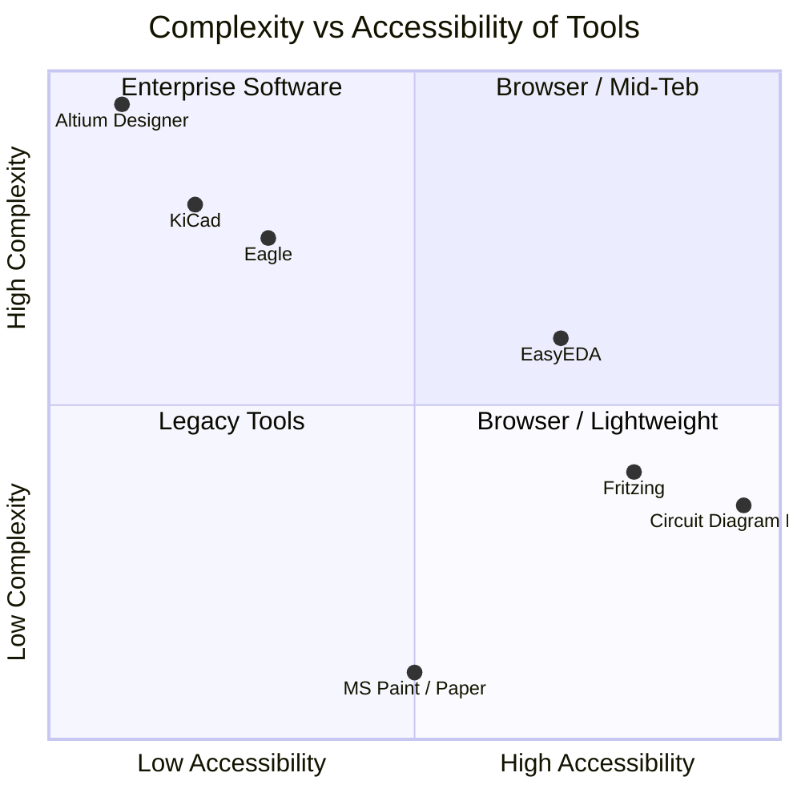
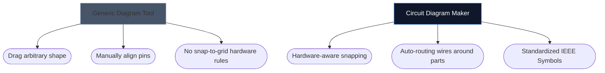

Die Wahl des richtigen Werkzeugs zum Zeichnen Ihrer Elektronikschaltpläne kann oft darüber entscheiden, wie schnell Sie ein neues Hardwareprojekt iterieren können. Während fortgeschrittene PCB-Designer schwere Desktop-Umgebungen benötigen, benötigen Bastler, Studenten und Hersteller oft etwas ganz anderes: Zugänglichkeit und Geschwindigkeit.

Im Folgenden analysieren wir, wie sich unser Tool im Vergleich zu den wichtigsten Branchenalternativen schlägt.

## Tool-Kategorisierungsmatrix

Bevor Sie sich mit einzelnen Tools befassen, ist es wichtig zu verstehen, welche Softwarestufe Ihr Projekt tatsächlich erfordert. Die Verwendung einer Enterprise-PCB-Software zum Skizzieren eines 4-Komponenten-LED-Layouts ist übertrieben.

## 1. Schaltplan-Ersteller vs. Fritzing

Fritzing ist dafür bekannt, die Lücke zwischen Breadboard-Prototyping und Schaltplänen zu schließen. Fritzing erfordert jedoch eine Installation und hatte im Laufe der Jahre Probleme mit Wartungsupdates.

| Funktion | Schaltplan-Ersteller | Fritzing |
| :--- | :--- | :--- |
| **Hauptfokus** | Standardschematische Layouts | Breadboard-Visualisierungen |
| **Installation** | Keine (100 % browserbasiert) | Desktop-Installation erforderlich |
| **Kosten** | 100 % kostenlos | Bezahlt (Donationware) |
| **Lernkurve** | Extrem niedrig | Mäßig |

> **Das Urteil:** Wenn Sie sich konkret vorstellen müssen, wie physikalische Drähte in ein Steckbrett eintauchen, ist Fritzing überlegen. Wenn Sie standardmäßige, universelle elektronische Schaltpläne *sofort* benötigen, verwenden Sie Circuit Diagram Maker.

## 2. Circuit Diagram Maker vs. KiCad & Altium

KiCad ist eine legendäre Open-Source-PCB-Suite und Altium Designer ist der Branchenstandard für Unternehmen. Sie sind immens mächtig.

| Fähigkeitsschicht | Schaltplan-Ersteller | KiCad / Altium |
| :--- | :--- | :--- |
| **Ausgabetyp** | SVG/PNG-Bilder | Gerber-Dateien, Stücklisten, Pick&Place |
| **Simulation** | Visuell / Simpel | Tiefe SPICE-Integration |
| **Geschwindigkeit zum ersten Schema** | < 10 Sekunden | 10–30 Minuten (Einrichtung/Konfiguration) |

> **Das Urteil:** Verwenden Sie KiCad oder Altium, wenn Sie Kupferschichten an eine Fabrik in Shenzhen senden. Verwenden Sie Circuit Diagram Maker, wenn Sie einen Schaltplan an eine Physikaufgabe, einen Blogbeitrag oder eine Forumsfrage anhängen.

## 3. Circuit Diagram Maker vs. draw.io / Lucidchart

Generische Diagrammtools wie draw.io sind für Flussdiagramme unglaublich beliebt. Allerdings fehlt ihnen das semantische Verständnis der Elektronik.

Wenn Sie ein spezielles Elektronikwerkzeug verwenden, versteht der Editor, dass ein Draht nicht einfach willkürlich „abgeschlossen“ werden kann, ohne dass eine Verbindung vorhanden ist, und ordnet von Natur aus Standardeigenschaften zu (z. B. Ohm zu Widerständen).

## Welches Tool ist das richtige für Sie?

Das beste Werkzeug ist das, das Ihnen aus dem Weg geht. Für schnelle Ideenfindung, Bildungsaufgaben und Webpublikationen bietet [Circuit Diagram Maker](/editor/) eine unschlagbare Kombination aus Geschwindigkeit und moderner Ästhetik.