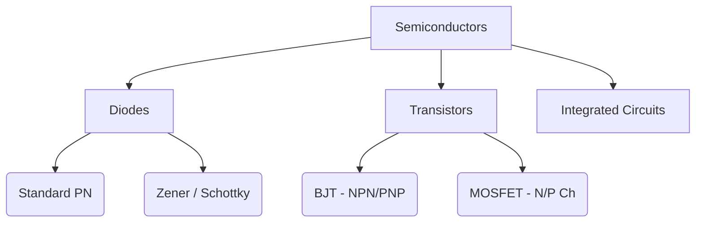

Elektronische Symbole sind die universelle Sprache der Hardwaretechnik. So wie Musiknoten Tonhöhe und Rhythmus vorgeben, vermitteln Schaltkreissymbole elektrische Funktionen, Eigenschaften und Verbindungen auf einem Blatt Papier.

In diesem umfassenden Leitfaden analysieren wir die visuelle Morphologie der wichtigsten Elemente, die Ihnen in jedem Schaltplan begegnen.

## Globale Standardunterschiede: IEEE vs. IEC

Bevor wir uns mit bestimmten Symbolen befassen, ist es wichtig zu erkennen, dass Symbole je nachdem, wo der Schaltplan gezeichnet wurde, unterschiedlich aussehen können. Die beiden vorherrschenden Standards sind **IEEE/ANSI** (hauptsächlich Amerika) und **IEC** (Europa und international).

```mermaid
flowchart LR
    subgraph Regional Standards
    A((Schematic Origin))
    A -- US / Americas --> B[IEEE / ANSI]
    A -- Europe / Int'l --> C[IEC]
    end
    
    B -.-> D(Zigzag Resistors)
    C -.-> E(Rectangle Resistors)
    
    style B fill:#1e293b,stroke:#f59e0b
    style C fill:#1e293b,stroke:#3b82f6
```

Bei Circuit Diagram Maker verwenden wir hauptsächlich den IEEE/ANSI-Standard, da er in digitalen und Hobby-Ökosystemen nach wie vor sehr beliebt ist, obwohl beide technisch korrekt sind.

## Passive Komponenten

Passive Komponenten benötigen zum Betrieb keine externe Stromquelle und können ein Signal nicht verstärken.

| Komponente | Standardsymboldarstellung | Funktionsbeschreibung |
| :--- | :--- | :--- |
| **Widerstand** | Definiert durch eine scharfe, gezackte Zickzacklinie. Variable Varianten verfügen über einen Pfeil, der die Linie durchdringt. | Leitet Energie als Wärme ab, um den Stromfluss einzuschränken. |
| **Kondensator** | Zwei parallele Linien, getrennt durch eine Lücke. Polarisierte Varianten krümmen eine der Linien, um den Minuspol anzuzeigen. | Speichert elektrische Energie vorübergehend in einem elektrischen Feld. |
| **Induktor** | Eine Reihe abgerundeter Schleifen oder Halbkreise, die Drahtspulen darstellen. | Wirkt Änderungen im Stromfluss entgegen, indem Energie in einem Magnetfeld gespeichert wird. |

## Aktive Komponenten (Halbleiter)

Aktive Komponenten benötigen eine Stromquelle und können den Stromfluss steuern und dabei häufig Signale verstärken.

| Komponente | Visuelle Indikatoren | Kernnutzung |
| :--- | :--- | :--- |
| **Diode** | Ein Dreieck, das auf eine flache Linie zeigt. Die Linie zeigt die Kathode (negativ). | Ein Einwegventil für Elektrizität. |
| **LED** | Ein Standarddiodensymbol mit zwei kleinen Pfeilen, die nach außen zeigen und Lichtemission anzeigen. | Visuelle Indikatoren und Optoelektronik. |
| **BJT-Transistor** | Eine vertikale Linie, flankiert von drei Anschlüssen: Basis, Kollektor und einem Emitter, mit einem Pfeil, der NPN oder PNP angibt. | Stromgesteuerte Schalter und Verstärker. |
| **MOSFET** | Verfügt über getrennte Grenzlinien, die das isolierte Gate und die internen Substratdioden hervorheben. | Spannungsgesteuertes Schalten für hohe Leistung. |

## Mechanische Geräte und Ausgabegeräte

Diese Teile interagieren mit der physischen Welt, indem sie entweder menschliche Eingaben entgegennehmen oder physische Ausgaben erzeugen.

| Komponente | Schematische Kurzschrift | Bewerbung |
| :--- | :--- | :--- |
| **Schalter (SPST)** | Eine gestrichelte Linie, die sich nach unten drehen lässt, um den Kreis zu vervollständigen. | Grundlegende EIN/AUS-Leistungssteuerung. |
| **Relais** | Wird normalerweise als Induktor (die interne Spule) dargestellt, der mit isolierten Schaltkontakten gekoppelt ist. | Schalten von Hochspannungslasten über Niederspannungs-Mikrocontroller. |
| **Motor** | Ein Kreis, der ein „M“ enthält, oft mit gekennzeichneten positiven und negativen Anschlüssen. | Umwandlung von elektrischem Strom in Rotationskinetik. |

> **Design-Tipp:** Wenn Sie mechanische Schalter oder Relais verwenden, schließen Sie immer eine *Flyback-Diode* über induktive Lasten ein, um Ihre Halbleiterkomponenten vor Spannungsspitzen zu schützen!

Das Verstehen dieser Symbole ist der erste Schritt zur Beherrschung der Schaltung. Schauen Sie sich unseren [Online-Editor](/editor/) an, um diese Formen sofort per Drag-and-Drop zu bearbeiten und zu experimentieren.